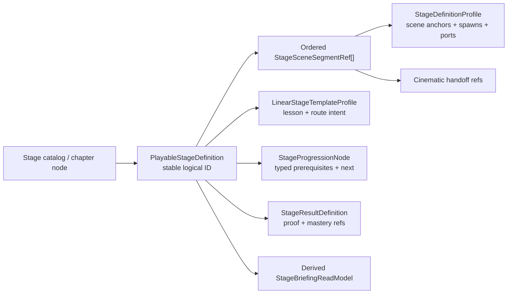

# Playable Stage Reference Spine Spec

## Status

- Drafted: 2026-07-13
- Status: provisional P1-B review contract; analysis only
- Roadmap source: `SUBCULTURE_DATASET_GAP_ROADMAP.md`, P1-B
- Presentation lifecycle companion: `STAGE_PRESENTATION_HANDOFF_LIFECYCLE_SPEC.md`, P2-B
- Course-chain companion: [Tutorial Course Lesson Chain Spec](TUTORIAL_COURSE_LESSON_CHAIN_SPEC.md), P2-B
- Encounter execution companion: [Ordered Encounter Execution Bridge Spec](ORDERED_ENCOUNTER_EXECUTION_BRIDGE_SPEC.md), P1-C
- Mastery/progress companion: [Typed Mastery and Progress Application Spec](TYPED_MASTERY_PROGRESS_APPLICATION_SPEC.md), P1-D
- Later variability companion: [Stage Rule, Modifier, and Enemy Variant Spec](STAGE_RULE_MODIFIER_ENEMY_VARIANT_SPEC.md), P2-A
- Product decision companion: [P1 Product Decision Packet](P1_PRODUCT_DECISION_PACKET.md); its four recommendations remain pending explicit approval
- Shared preflight: source wiring and the historical 11:10 probe support the physical two-scene route shape, while only the configured lobby target is source-backed. Historical full/natural evidence is STALE; actual retry/lobby execution is MISSING. Planning approval of the recommendation may occur now, but implementation freeze/asset authoring cannot close until the Station review-HUD versus additive clear-UI conflict and remaining P0 evidence are resolved
- Canonical route snapshot: `OlympusCorridorInvasionStage -> OlympusStationCombatStage -> UI_StageClear`

This document defines one thin reference spine that makes the existing stage, route, briefing, encounter-intent, progression, result, and cinematic data agree. It does not replace those systems with a new all-purpose stage database.

## Confirmed Current Drift

| Surface | Current state | Drift |
|---|---|---|
| `DB_Stage_OlympusCorridorIntroCombat` | one `StageDefinitionProfile` points to Corridor, says intro/boss/combat share the same map, and has `nextStageId = OLYMPUS-CORRIDOR-BOSS-CLEAR-01` | product flow single-loads Station and no matching next-stage asset was found |
| Corridor flow | private constants load `OlympusStationCombatStage` | Station is product-critical but is outside the stage definition and UI catalog route |
| Station scene binding | no `StageDefinitionSceneBinding` or Station-specific `StageDefinitionProfile` was found in the current Station scene/data | the second combat segment has no truthful stage-definition owner even though it owns the encounter and clear result |
| Build Settings readiness | manually adds the Station scene as `CombatContinuation` | build reachability is maintained by a second hard-coded route source |
| `DB_UIStageCatalog` | two display entries reference the same Corridor stage definition and repeat title/summary/threat/recommendation/reward copy | UI IDs can look like distinct stages while resolving the same scene and stage asset |
| Linear stage templates | five authored `LinearStageTemplateProfile` assets own lesson, target time, summon need, mastery/reward copy, segments, and pockets | no canonical reference joins a template to the current product route |
| Chapter map nodes | store code/title/subtitle/objective/reward/cost plus lock/clear booleans on scene objects | display and progress state can diverge from stage/result truth |
| Terminal route surfaces | `StageClearScreenPresenter` stores Corridor retry plus lobby scene strings, while `CombatSessionOverlayPresenter` owns pause, settings, and failure | route actions still use scene strings instead of one typed stage/progression action, but duplicate Review result ownership is retired |
| Stage-select projection | `StageSelectScreenPresenter` now resolves the selected `UIStageCatalog.StageEntry` and forwards its scene name/path/loading card, but both current rows alias the same Corridor definition and the handoff is still raw scene-route data rather than a canonical playable-stage identity | selection reaches runtime, but distinct catalog IDs do not yet prove distinct logical routes |
| Cinematic handoff | `StageDefinitionProfile.CutsceneHandoffRef`, `StageCutscenePort`, and `CinematicSequenceProfile.StageHandoffId` exist | the stage definition references the base intro profile/timeline while the actual director plays `_OlympusBombingPrelude`; a second combined profile uses the same handoff, the generic runner has no profile, and string `cinematicProfileId` does not declare whether it names an asset or `sequenceId` |

The current route can pass PlayMode while these contracts disagree because each subsystem validates only its local references.

## Decision

Add one logical-stage composition record that references existing authorities:

`PlayableStageDefinition` is a reference spine, not a data warehouse. It must not copy scene paths, anchor transforms, UI prose, enemy stats, result counters, save state, or reward inventory.

## P1-0 Candidate Freeze

These are downstream contract proposals, not production values already present in code or assets:

| Concern | Recommended value | Reason |
|---|---|---|
| logical playable stage | `OLYMPUS-INVASION-01` | chapter/product identity spans both Corridor and Station without pretending to be either scene |
| route revision | `1` | first explicit two-segment product route |
| Corridor segment ID | `corridor_intro_tutorial` | already used by the P1-A contract and describes its actual responsibility |
| Corridor definition ID | keep `OLYMPUS-CORRIDOR-INTRO-COMBAT-01` as a scene-segment definition | preserves the existing asset identity while narrowing its claimed ownership |
| Station segment ID | `station_entry_combat` | already used by the P1-A contract and covers guide plus encounter |
| Station definition ID | author `OLYMPUS-STATION-COMBAT-01` | Station currently owns encounter/result but has no truthful stage-definition owner |
| physical segment refs | existing Corridor `StageDefinitionProfile` plus a new Station `StageDefinitionProfile` with stable ID, `MapScenePath`, and scene binding | P1-0 must resolve and validate both scenes before P1-A; P1-B may enrich anchors/spawns/ports but cannot defer or change physical route identity |
| failed-run retry action | `olympus-invasion.retry`, kind `Retry`, target `OLYMPUS-INVASION-01`, allowed only for Fail | desired failure-recovery behavior; runtime parity is blocked by the enabled Station review HUD's active-scene retry |
| clear replay action | `olympus-invasion.replay`, kind `Replay`, target `OLYMPUS-INVASION-01`, allowed only for Clear | preserves current clear-screen re-entry while separating replay from failure recovery and future repeat/economy policy |
| lobby action | `olympus-invasion.to-lobby`, kind `UIRoute`, target `UIRouteId.Lobby` | matches the current implemented destination; it is navigation, not outcome proof, and no real next playable stage exists yet |
| outcome/action availability | recommended `Clear -> Replay + Lobby`, `Fail -> Retry + Lobby` | [P1 Product Decision Packet](P1_PRODUCT_DECISION_PACKET.md) defines the local rationale; explicit approval is still required and action presence never makes a button legal |
| terminal resolution policy | recommended `SameTerminalResolutionEpoch`; owner `EncounterTerminalResolutionCoordinator`; `CanonicalCombatRootAdmission`; pre-mutation `RootAdmissionSequence`; active `RootResolutionToken`; subjects `{ Player, Boss }`; exclusive queued terminal-state mutation; synchronous non-yielding work; same-root nested work stays; independent admissions follow lower sequence into later epochs; explicit per-epoch close/nonterminal cycle/terminal close/fault/cancel lifecycle; `QueueDrainedAndSubjectsFinalized`; simultaneous outcome `Clear` | core outcome, causal ordering, coverage, and closure semantics must be stable before P1-A and snapshotted rather than read from mutable latest data |

The physical route shape and configured `UIRouteId.Lobby` target are candidates to preserve, but the 11:10 full probe became stale after the 11:15:21 Station save and neither re-entry nor lobby has been executed. `OLYMPUS-INVASION-01`, revision `1`, the two segment IDs, all three action IDs, and their outcome availability still require explicit product approval; documentation agreement must not be reported as production freeze. Re-entry additionally requires one terminal owner before implementation freeze can close P1-0.

P1-0 must not stop at an approved document or create a parallel route-identity asset. After P0 passes, it creates the final `PlayableStageDefinition` in a minimal route-shell phase: logical ID/revision, two ordered `StageSceneSegmentRef` entries, the existing Corridor definition, a new Station definition with valid stable ID/`MapScenePath`/scene binding, typed actions, and explicit allowed outcomes. P1-A snapshots this one asset to validate both scenes and resolve retry. P1-B fills the same asset's optional template/result/progression/briefing/cinematic joins and may enrich non-route Station content; it may not retype or defer physical identity, segment, scene-binding, or action fields.

The unresolved `OLYMPUS-CORRIDOR-BOSS-CLEAR-01` should not survive as a fictional next stage. Either retire it when this logical route is authored or create a real, separately playable node later with its own definition and progression contract. `StageDefinitionProfile.stageId` should remain the scene-segment definition identity because that profile owns map, anchor, spawn, and port data; the new logical product ID belongs only to the playable-stage spine.

No current linear template is a truthful join. The route teaches melee, movement, ranged swap/fire, dodge, target clear, then a Station replica/summon guide and boss. The existing five templates promise Break, Backline, Tank, Heal, or a composite Break/Arrow/Tank/Heal route. P1-B should author a narrow current-route template or explicitly revise one through product review rather than bind `S1-5.BossStand` merely because it mentions a boss.

## Ownership Rules

| Concern | Canonical owner | Derived consumers |
|---|---|---|
| logical playable-stage identity and route revision | P1-0 fields on the final `PlayableStageDefinition` asset | catalog, chapter map, run identity, result, progression |
| per-scene map/anchor/spawn/port data | existing `StageDefinitionProfile` | segment resolver, encounter adapter, cinematic adapter |
| ordered segment refs and typed outcome-filtered actions | P1-0 `StageSceneSegmentRef[]` and actions on that same asset | P1-A run snapshot/terminal executor; P1-B validator and entry flow |
| lesson/segment/pocket intent | existing `LinearStageTemplateProfile` | briefing and the P1-C stage-local execution binding |
| pocket-to-concrete-spawn execution | provisional P1-C `EncounterExecutionBinding` and sequence profile on this playable-stage route | ordered execution of existing `StageDefinitionProfile.SpawnRef` records; see [Ordered Encounter Execution Bridge Spec](ORDERED_ENCOUNTER_EXECUTION_BRIDGE_SPEC.md) |
| prerequisite/next semantics | authored `StageProgressionNode` with typed states | chapter map and post-result resolution |
| result proof/mastery definitions | `StageResultDefinition` references with stable revision/content digest | P1-A fact capabilities, P1-D entry snapshot/evaluator, clear presenter |
| persistent clear/mastery | later P1-D `StageProgressState`, keyed by progression-node ID | corrected stage-select read model first; later real chapter-map state and progression resolution |
| player-facing briefing | derived `StageBriefingReadModel` | stage card, loading, briefing, result recap |
| navigation | typed route actions resolved from playable-stage/progression IDs | retry/next/lobby buttons |
| presentation execution | existing cinematic profile/runner plus a narrow handoff adapter | stage entry/exit flow |
| optional run-scoped lesson chain | later P2-B `TutorialCourseDefinitionRef` on the same playable-stage spine | P1-A entry snapshot and P2-B course coordinator; no persistent course state |

## Provisional Contracts

Names are review vocabulary, not final C# API names.

### `PlayableStageDefinition`

- `schemaVersion`
- `playableStageId`
- optional until P1-B: `chapterId`
- `routeRevision`
- optional until P1-B: `LinearStageTemplateProfile stageTemplate`
- ordered `StageSceneSegmentRef[] sceneSegments`
- optional until P1-B: `StageProgressionNodeRef progressionNode`
- optional until P1-B: `StageResultDefinitionRef resultDefinition`
- optional until P1-C: bounded `EncounterExecutionBinding[] encounterExecutions`
- optional `StageRuleSetRef ruleSet`
- optional bounded `StageModifierDefinitionRef[] stageModifiers` (zero or one in the first P2-A slice)
- optional `StageEnemyVariantBindingSetRef enemyVariantBindings`
- optional `TutorialCourseDefinitionRef tutorialCourse`
- typed nonempty `StageRouteActionRef[] terminalActions`
- typed `StageTerminalResolutionPolicy terminalResolutionPolicy`

P1-D admission requires the optional P1-B `progressionNode` and `resultDefinition` joins to be present and valid. It deep-copies their identity, revision, canonical content digest, objective semantics, required fact capabilities, and presentation metadata into the run's [Mastery Evaluation Plan Snapshot](TYPED_MASTERY_PROGRESS_APPLICATION_SPEC.md#entry-time-snapshot). It never re-reads the latest spine/result asset after entry. Objective semantics are lifetime-immutable under one persisted objective ID; changing a kind, threshold, time metric, comparator, or qualified proof meaning requires a new objective ID.

For a P1-C-capable schema, `encounterExecutions` is the sole spine reachability collection for product bindings. The first product shape contains exactly one `ProductRouteScope` required-defeat binding for its selected pocket. A later course product shape contains the exact bounded Practice/Challenge `ProductTutorialCourseScope` bindings referenced by the course snapshot; isolated fixture arms are never serialized here. Each composite host/segment/pocket key resolves at most one binding, and admission deep-copies the complete static plan/content digest before gameplay. The collection references existing stage definitions, sequences, payload mappings, and gates rather than copying their owned fields.

For a later P2-A-capable schema, the spine references the rule set, zero-or-one modifier definition, and one optional versioned enemy-variant binding set. That sole set is either the first Story-only `ProductRouteScope` shape or a separately reviewed two-member `ProductTutorialCourseScope` shape; it is never a mixture of two isolated fixture sets. P1-C remains the placement authority; each binding targets its existing `(stageDefinitionId, spawnId)` scoped key and agreeing product/course host. Logical route admission resolves the complete selected set into one scene-reference-free `StageVariabilityPlanSnapshot`; no live segment may replace it with newer authoring.

For a later P2-B course-capable schema, the optional course reference resolves exactly one active, `ProductRouteScope`, strict-linear three-entry definition through [Tutorial Course Lesson Chain Spec](TUTORIAL_COURSE_LESSON_CHAIN_SPEC.md). An isolated validation-fixture course is never spine-reachable. The course record references, but never copies, P1-E lesson proof/reset, P1-C execution, P2-A variant/configuration, P1-D objective, or P2-B presentation semantics. It contains no scene path, player progress, reward, or course-complete flag.

Rules:

- `playableStageId` is not a scene name, UI catalog ID, template ID, or `StageDefinitionProfile.stageId`.
- One logical stage may span multiple scene definitions.
- Route revision changes when a segment ID/order, stage-definition or scene reference, entry/exit condition, handoff policy, action ID/kind/target, `allowedOutcomes`, terminal window/coordinator/admission/root-order/active-boundary/subject-role/coverage/work-execution/nested-independent/lifecycle/token-state/finalization/barrier/simultaneous-outcome requirements, P1-C encounter-binding membership/host scope/execution purpose/completion-consumer arm, later P2-A binding membership/scope, active-run restart route policy, or P2-B course binding/route scope changes; display-copy and P2-A/P2-B presentation-digest edits do not change it. A referenced encounter sequence/payload mapping, rule/modifier/variant, or course semantic edit must bump its own revision/digest and changes the final canonical route digest, but does not automatically bump the base route revision unless binding, scope, or route semantics also changes. The validator rejects any in-place semantic edit without the appropriate owner revision/digest change.
- Retry and Replay target a logical playable stage and create a new run ID. Neither stores a scene string; their distinct kind/outcome policy preserves failure recovery versus clear replay.
- Exit action may resolve a next playable stage or a typed UI route such as lobby. It is navigation, not outcome proof, and must never guess from lexical ID order.
- `progressionNode` is an explicit reference and may use a different ID. It is never derived by reusing a playable-stage, battle-stage, scene, or catalog ID.
- P1-0 requires identity/revision, two segment definitions with valid stable ID/scene path/binding, route conditions/policies, typed actions, allowed outcomes, and terminal resolution policy on this final asset. It also inventories every canonical Station path that can mutate bound Player/Boss terminal state, verifies that root admission occurs before any such mutation/callback, and fails implementation freeze until exclusive coordinator coverage plus synchronous closure are feasible. P1-B fills optional content joins on the same asset; there is no second serialized route identity and no deferred physical-scene owner.
- A P1-B schema change affects only new run snapshots. It never backfills or mutates an already committed P1-A `RunResultSummary`.
- The P1-B `resultDefinition` join references the same `ResultActionPresentation` profile first consumed by the P1-A shared result view. Presentation label/role/order never enables a route action and is not copied into `StageRouteActionRef`.

### `StageSceneSegmentRef`

- `segmentId`
- `sequenceIndex`
- `StageDefinitionProfile stageDefinition`
- `entryConditionId`
- `exitConditionId`
- `handoffPolicy`: single-load, additive, or return-to-owner
- optional `StagePresentationHandoffRef entryPresentation`
- optional `StagePresentationHandoffRef exitPresentation`

Rules:

- Scene path is derived from `stageDefinition.MapScenePath`; it is not copied into the segment.
- Every combat segment has a distinct stable ID even when two segments temporarily reuse a scene.
- The first current route needs separate Corridor and Station segment definitions. The existing Corridor definition cannot truthfully claim Station-owned boss combat.
- Result UI is not a combat segment. Its additive scene is a presentation dependency of the committed result.

### `RequiredStageState`

- exact `requirement = Cleared(prerequisiteProgressionNodeId, typed no objective) | MasteryObjectiveAchieved(prerequisiteProgressionNodeId, required objectiveId)`

Course completion and account/economy gates are deferred. A single undocumented `complete` boolean must not stand for multiple meanings.

`RequiredStageState[]` and a progression node's recommended/explicit next-progression-node links are independent directed relations. Persistent state is keyed by progression-node ID, so prerequisite and next edges target that domain; UI/navigation derives the linked playable stage from the resolved target node. Validate every target and disallowed cycle, but do not require a next link to have one inverse prerequisite or force every prerequisite into the recommended path.

[Typed Mastery and Progress Application Spec](TYPED_MASTERY_PROGRESS_APPLICATION_SPEC.md) first captures the P1-D `MasteryEvaluationPlanSnapshot` at logical stage entry: the selected progression-node binding, result/objective definitions, required fact capabilities, revisions, and canonical digests. [Stage Progression and Reward Transaction Spec](STAGE_PROGRESSION_REWARD_TRANSACTION_SPEC.md) later embeds or extends that same identity in `StageSettlementAuthoringSnapshot` with prerequisite graph and reward-plan data. Neither snapshot is another authored route or a copy of player progress.

### `StageRouteActionRef`

- `actionId`
- exact `action = Retry(PlayableStageTarget(targetPlayableStageId)) | Replay(PlayableStageTarget(targetPlayableStageId)) | NextStage(PlayableStageTarget(targetPlayableStageId)) | UIRoute(UIRouteTarget(uiRouteId))`
- nonempty `allowedOutcomes`: clear and/or fail

Rules:

- Retry and Replay resolve the entry segment from the target playable stage. The initial recommendation permits Retry only for Fail and Replay only for Clear.
- Next-stage requires an existing progression node and satisfiable target.
- UI-route uses the existing typed UI route table, not a copied lobby scene path.
- `terminalActions` requires unique action IDs and is canonicalized by action ID for digesting; serialized array order is not UI display order.
- Missing or ambiguous targets disable the action and fail validation; they do not fall back silently.
- Every action arm carries exactly one target domain: Retry/Replay/NextStage forbid UI-route data, while UIRoute forbids playable-stage data. The canonical route digest covers the full arm and typed foreign-target absence.
- Missing outcome availability is a validation failure. Result presentation offers only actions whose allowed set contains the committed outcome; the pending `Clear -> Replay + Lobby`, `Fail -> Retry + Lobby` recommendation must be explicitly approved rather than defaulted from action kind.
- Pre-result active-run restart is not a `StageRouteActionRef` and does not add a pseudo-outcome. It is authored by the later P2-A `StageRuleSet.ActiveRunRestartPolicyDefinition`, resolved once as `ResolvedActiveRunRestartPolicy` inside the run's sole variability snapshot, and consumed by the P2-B lifecycle adapter.
- Revision 1's manual clear Replay is distinct from failed-run Retry. A future automatic repeat, entry cost, fast-clear, or reward-altering policy may version the clear-only Replay or replace it with a new typed action under a route revision; it must never overload Retry merely because both re-enter the stage.

### `StageTerminalResolutionPolicy`

- stable `terminalResolutionPolicyId`, positive semantic revision, and canonical `terminalResolutionPolicyDigest`
- `windowKind`: initially proposed `SameTerminalResolutionEpoch`
- `batchOwnerKind`: initially proposed `EncounterTerminalResolutionCoordinator`
- `rootAdmissionKind`: initially proposed `CanonicalCombatRootAdmission`
- `rootOrderKind`: initially proposed `RootAdmissionSequence`
- `rootIssuePoint`: initially proposed `BeforeTerminalStateMutationAndCallbacks`
- `batchBoundaryKind`: initially proposed `RootResolutionToken`
- `terminalSubjectRoles`: initially proposed `{ Player, Boss }`
- `coveragePolicy`: initially proposed `ExclusiveQueuedTerminalStateMutationForBoundSubjects`
- `workExecutionKind`: initially proposed `SynchronousNonYieldingResolution`
- `nestedRequestPolicy`: initially proposed `SameRootSameEpoch`
- `independentRequestPolicy`: initially proposed `LowerAdmissionSequenceThenNextEpoch`
- `epochStampKind`: initially proposed `EncounterTerminalEpoch`
- `coordinatorLifecycleKind`: initially proposed `IdleOpenDrainingFinalizingEpochClosedTerminalClosedFaultedCancelled`
- `subjectFinalizationKind`: initially proposed `SynchronousTwoSubjectSnapshot`
- `tokenStatePolicy`: explicit handling for `IdleCurrent`, `ActiveCurrent`, `DeferredCurrent`, `ClosedSameRun`, `WrongRun`, and `PostTerminal`
- `flushBarrier`: initially proposed `QueueDrainedAndSubjectsFinalized`
- `simultaneousOutcome`: initially proposed `Clear`
- `requiresBossCandidateAndFinalDead`
- `requiresPlayerCandidateAndFinalDown`

This policy is core outcome semantics, not presentation copy or a P2-A active-run restart rule. Its canonical digest covers the policy ID/revision and every field below, including the fixed subject-role set and required-candidate/final-state booleans; it excludes presentation metadata. P1-A deep-copies the exact ID/revision/digest and fields into `StageRunRouteSnapshot`, binds the two typed subject roles to scene-local health adapters, and consumes only that immutable policy. The coordinator assigns `RootAdmissionSequence` at canonical combat-root admission before any terminal-state mutation or callback; lower sequence is the intended causal order, and callbacks/presenters/collectors cannot admit roots. Only the active admission receives a token/epoch. Same-root nested requests remain synchronous in the active queue; independent admissions wait without mutation authority for a later epoch. Each root follows `Idle -> Open -> Draining -> Finalizing -> EpochClosed`; a nonterminal close returns to `Idle` and immediately opens the lowest pending admission when present, while a terminal close enters `TerminalClosed` before commit. Any active substate may atomically invalidate active/pending authority through `Faulted`/`Cancelled`; both subject snapshots are synchronous, including an untouched subject. Direct bound-subject mutation outside the coordinator is an invalid-evidence abort while the run is active. Wrong-run or post-terminal authority is reject/log-only and cannot abort an unrelated run or mutate an immutable summary. Revision/digest validation rejects an in-place semantic change, and `Time.frameCount`, `FixedUpdate` count, elapsed milliseconds, health-callback arrival, or subscriber order cannot substitute for admission/order/token/epoch/barrier. The initial values remain recommendations until [P1 Product Decision Packet](P1_PRODUCT_DECISION_PACKET.md) is explicitly approved.

### `StagePresentationHandoffRef`

- referenced `StageDefinitionProfile`
- `handoffId`
- direct referenced `CinematicSequenceProfile`; asset identity is canonical, while asset-name and `sequenceId` strings are validation aliases only
- expected `StageCutscenePort.portId`
- optional expected Timeline asset reference and runtime consumer binding
- `triggerConditionId`
- `completionConditionId`

Validation joins:

1. `StageDefinitionProfile.CutsceneHandoffRef.handoffId`
2. `StageDefinitionSceneBinding.StageCutscenePort.handoffId`
3. directly referenced `CinematicSequenceProfile.StageHandoffId`
4. stage anchor and runtime-state IDs referenced by those records
5. the Timeline/profile actually consumed by the scene runtime path

The first fixture is `intro-to-stage` because it is the actual current intro path and exposes the base-versus-`_OlympusBombingPrelude` mismatch. Its intended direct profile is `DB_Cinematic_IntroGatePodAwakening_OlympusBombingPrelude`, paired with the Timeline actually assigned to the intro director. The fixture must fail until the stage definition and runtime projection agree. The runtime adapter later executes existing `GameplayHandoffCue` intent and restores captured ownership; this spine does not create a second cinematic framework.

### `StageBriefingReadModel`

Derived, immutable fields for the selected stage/run revision:

- playable stage ID and title/localization key
- objective and combat lesson
- featured threat and summon need
- recommended power/loadout
- target time and optional mastery preview
- active restrictions/rules
- enemy preview references
- pre-result active-run restart policy and post-result Replay/Retry availability, kept distinct
- story entry/exit cue
- optional course entry-kind summary from the immutable P2-B snapshot, with no availability/progress claim
- reward-preview labels only after a reward plan exists

Resolution policy:

- identity and route come from the playable stage.
- lesson, target time, summon need, and route intent come from the linear template.
- concrete scene/anchor/spawn information comes from segment stage definitions.
- rule/restriction copy, modifier presentation, and enemy-variant preview come from the immutable P2-A variability snapshot when that schema is admitted.
- mastery copy comes from typed objectives.
- story entry/exit cues come from canonical cinematic handoff references; post-result Replay/Retry availability comes from typed outcome-filtered route actions.
- a course summary may project only the snapshotted entry kinds/order; entry availability, mastery, and persistence are runtime/result joins rather than briefing authoring.
- reward preview is derived from the authoritative plan/resolution; a catalog preview row never becomes a grant or eligibility owner.
- progression state is joined separately and never serialized into the briefing asset.
- UI catalog and chapter nodes keep layout/presentation references only after migration.

## Validator Matrix

| Check | Failure condition |
|---|---|
| logical ID uniqueness | duplicate or empty playable-stage ID |
| route revision | missing revision, run/result refers to another revision/digest, or scene/action semantics changed without a revision bump |
| run route snapshot | at entry, P1-A resolved segment/scene IDs, full action semantics, revision, or canonical digest differ from the selected P1-0 route shell |
| segment order | duplicate index/ID, gap, empty route, or unreachable segment |
| scene authority | missing `StageDefinitionProfile`, missing scene asset, or profile scene path disagrees with the loaded binding |
| Build Settings | any ordered segment or additive result dependency is absent/disabled; manually added scenes are not represented by the stage contract |
| entry/exit chain | a segment exit does not match the next segment entry or terminal outcome |
| current flow parity | transitional Corridor-to-Station load and retry target disagree with the authored route |
| terminal resolution policy | admission/order/coverage/work/lifecycle/token/finalization semantics are missing, an active path can mutate a bound subject before admission, a callback can mint a root, or the policy changed without revision/digest change |
| runtime projection coverage | an authored route/segment/scene reference is valid in data but absent from the runtime adapter that must consume it |
| selected-stage projection | the selected catalog row's raw scene route disagrees with its canonical playable-stage entry segment, or multiple rows alias one route without an explicit variant/alias contract |
| stage-definition truth | purpose/objective/clear description claims same-scene ownership that contradicts the multi-scene route |
| unresolved progression | prerequisite/next ID is missing, self-referential, cyclic where disallowed, inferred from ordering, or silently derived from another identity domain; valid directed links are not rejected merely because prerequisite and recommended-next edges are asymmetric |
| template join | template missing, duplicate, or its segment/pocket intent cannot map to the route |
| P1-D result/progress join | result definition or progression node is missing/duplicated, objective/fact-capability identity cannot be deep-snapshotted, semantic content changed without revision/new objective ID, or runtime re-reads latest authoring |
| P1-C encounter reachability | product binding is absent/ambiguous for an implemented encounter pocket, an isolated host arm appears on the spine, host/segment/pocket composite duplicates, required-defeat versus Practice purpose/consumer disagrees, or the complete static plan/digest cannot be snapshotted at admission |
| P2-A variability join | rule/modifier/variant identity is missing/duplicated, a variant binding copies P1-C placement authority, semantic digest disagrees with the route revision, or runtime rereads newer authoring |
| P2-A binding reachability | binding-set ref is absent/ambiguous for a route that declares variants, set/binding revision or membership disagrees, or a scoped key cannot join the P1-C mapping/prefab/configuration capability before entry |
| P2-B course join | course ref is missing/ambiguous/retired, not exactly Basic/Practice/Challenge in strict order, disagrees with route/segment scope or required P1-E/P1-C/P1-D/P2-A/P2-B capability identities, or copies scene/spawn/objective/progress fields |
| spawn/anchor join | referenced spawn, anchor, runtime state, or scene binding is missing/duplicated |
| cinematic join | handoff ref, scene port, direct cinematic profile, anchor, runtime state, and actually consumed Timeline/profile do not resolve to one chain; asset-name and `sequenceId` aliases disagree or are ambiguous |
| presentation resolution | a request serializes a second cinematic profile binding or resolves a profile/route revision different from its handoff ref |
| result route | any active result/pause surface stores or executes an unresolved target, copied scene, or action disallowed for the committed outcome; review-only result controls are not explicitly excluded or delegated |
| catalog binding | a catalog entry has no playable-stage ref, duplicate product identity, or display copy that disagrees with the derived briefing during migration |
| chapter binding | node has no playable-stage ref or serialized lock/clear flags disagree with `StageProgressState` after persistence exists |

Validation must distinguish errors from migration warnings. During the P1-0 route-shell phase, empty P1-B-only template/result/progression/briefing/cinematic joins are expected; unresolved route scenes/actions/outcome policy are hard errors. Current duplicated UI copy may warn during the first P1-B binding slice; route, scene, handoff, and navigation contradictions remain hard errors.

## Current Vertical Slice

After the shared P1-0 identity decision, its minimal `PlayableStageDefinition` route shell, and the P0 route/navigation gate:

1. Fill the P1-B-only joins on the same P1-0 `PlayableStageDefinition`; do not create another ID/revision/segment/action owner.
2. Review/enrich only the P1-B content portions of the Station `StageDefinitionProfile`, such as anchors, spawns, and cinematic ports. Its stable ID, `MapScenePath`, and scene binding are already P1-0 requirements and cannot be deferred or replaced here.
3. Validate the existing two ordered `StageSceneSegmentRef` records and complete their presentation joins without replacing them.
4. Author and bind one narrow template that truthfully describes the current tutorial/Station route; freeze the exact segment/pocket IDs that P1-C may later target, but do not enable runtime spawning yet.
5. Author one future P1-C-ready Station `Add` SpawnRef with count 1, a stable non-placeholder payload identity tied to a concrete archetype/prefab authoring target, and no cutscene ownership conflict. Its unique live anchor must agree with the static anchor group and binding-root-local expected pose plus `UsageKind.CombatSpawn`, `PositionId`, and `SpawnKind.Add`. This is authoring readiness only; tolerance/capture time, typed resolver/factory, local completion gate, and execution remain P1-C.
6. Bind the real product catalog entry to the logical stage. Collapse `story_v1_retry_route` unless product review gives it an explicit selectable-variant purpose; retry copy is not a second stage.
7. Derive one briefing read model and render it in stage select without changing the visual layout.
8. Validate that every P1-A-migrated Replay/Retry/Lobby surface still uses the same snapshot-backed typed executor, then connect it to the completed spine without a second migration owner; disable or delegate review-only result controls.
9. Use `intro-to-stage` as the first end-to-end cutscene fixture and require the stage definition, direct combined profile, actual Timeline, scene port, anchor, and runtime state to agree.
10. Run the validator against the known drift fixtures and require deterministic failures before correcting them.
11. Only after parity, let the current Corridor flow resolve the Station scene from the ordered route instead of private constants.

## Acceptance Matrix

| Scenario | Required proof |
|---|---|
| stage select | selected catalog row resolves one logical stage and derived briefing, and the start action launches that stage's entry segment rather than a hard-coded route |
| Corridor entry | route revision and entry segment match the P1-A run identity |
| Corridor-to-Station | next segment is resolved from the route; no copied Station constant is required after migration |
| Build Settings | ordered route and additive result UI exactly match enabled product scenes |
| retry | every active product terminal surface resolves the same typed action, loads Corridor, and creates a new run ID; review-only controls are absent or delegated |
| next/lobby | a typed navigation action resolves a real next stage or UI route and executes it without becoming outcome proof |
| same-scene stale description | validator fails the current contradictory Corridor asset purpose/handoff text |
| missing next stage | validator fails `OLYMPUS-CORRIDOR-BOSS-CLEAR-01` until it resolves or is replaced by the logical route |
| duplicate catalog rows | validator reports that both current rows resolve the same product stage without an explicit variant purpose |
| cutscene handoff | stage ref, scene port, direct cinematic profile, actual Timeline/runtime consumer, anchor, and runtime state form one resolvable chain; the current base-versus-combined intro mismatch fails until corrected |
| result presentation | result summary, offered actions, and sealed dispatch payload refer to the same playable-stage ID, route revision, and route snapshot digest |
| terminal policy snapshot | run snapshot and digest contain admission/order/coverage/work/lifecycle/token/finalization semantics; fixed root order is invariant to callback permutation, while a deliberately reversed root order follows the documented causal policy |
| terminal mutation inventory | every canonical bound-subject terminal-state mutation is either covered by the active synchronous queue or prevents P1-0 freeze; initialization-only operations are proven outside the bound window |
| asymmetric progression fixture | valid recommended-next and prerequisite edges resolve independently without an inverse-edge requirement |
| P1-C authoring readiness | one exact current-route segment/pocket and one Station count-1 Add SpawnRef reference a stable non-placeholder payload target; static/live anchors uniquely agree on group, binding-root-local expected pose, `CombatSpawn`, position ID, and Add kind, while no resolver/executor is enabled yet |

## Explicitly Deferred

- general graph editor or universal scene router
- runtime `EncounterGroup` spawning, cancellation, cleanup, and prototype-owner isolation, which belong to [Ordered Encounter Execution Bridge Spec](ORDERED_ENCOUNTER_EXECUTION_BRIDGE_SPEC.md)
- tutorial evaluator migration
- save schema and progression mutation
- reward eligibility, payout, receipt, inventory, and economy
- localization/content rewrite
- multiple chapters, branching campaign UI, and liveops routes
- copying scene paths or UI text into the new composition record for convenience

## Evidence Basis

DimensionBrawl:

- `_Game/Scripts/LevelDesign/StageDefinitionProfile.cs`
- `_Game/Scripts/LevelDesign/StageDefinitionSceneBinding.cs`
- `_Game/Scripts/LevelDesign/StageCutscenePort.cs`
- `_Game/Scripts/LevelDesign/LinearStageTemplateProfile.cs`
- `_Game/UI/StageSelect/UIStageCatalog.cs`
- `_Game/UI/ChapterMapPrototype/ChapterMapPrototypeStageNode.cs`
- `_Game/Editor/UIV1BuildSettingsReadinessReporter.cs`
- `_Game/Scripts/LevelDesign/OlympusCorridorCombatFlowController.cs`
- `_Game/Scripts/UI/StageClear/StageClearScreenPresenter.cs`
- `_Game/Scripts/Presentation/CinematicSequenceProfile.cs`
- `_Game/Scripts/Presentation/CinematicSequenceRunner.cs`

Cross-game structural support:

- PGR/HI3/Ash Echoes: stage metadata, prerequisites, map/script references, objectives, and results remain separable.
- Arknights: stage metadata references a separate execution level and typed prerequisite states.
- GF2: stage references an ordered encounter-group/placement hierarchy without making UI the executor.
- Wuthering Waves: briefing, guide, enemy, and story-flow concerns are reference-linked catalogs.
- Limbus Company: role-labelled pre/post-battle story references and observed battle-stage/theater-node ID mismatches require explicit cross-domain references rather than ID equality.
- Last Origin: prerequisite and recommended-next links are independently directed, while stage-to-wave/group and separate reward-preview references reinforce validation without reciprocal-edge or preview-authority assumptions.
- Princess Connect: conservative quest-to-mission joins support separate objective references only; hashed fields do not support next/reward semantics.
- Stella Sora: a complete static level-to-floor join is not enough when the community runtime definition omits the floor reference; validators must prove required fields reach their consumer, not only that authoring foreign keys resolve.
- Reverse: 1999: explicit predecessor/unlock/chain references are resolved in client config/model code instead of inferred from numeric order.

## Decision Ledger

1. Product approval still required: accept or revise `OLYMPUS-INVASION-01`, revision `1`, `corridor_intro_tutorial`, and `station_entry_combat` as new contract values.
2. Technical recommendation ready: keep `StageDefinitionProfile.stageId` as the scene-segment definition ID and put the logical product ID only on the new spine.
3. Authoring decision required: no existing linear template truthfully represents the route; choose the new narrow template ID and exact current lesson/segment coverage.
4. Product disposition required: collapse `story_v1_retry_route` by default; retain it only with an explicit selectable-variant purpose and separate identity semantics.
5. Target recommendation ready: use `UIRouteId.Lobby` as the current result-exit target because no real next playable stage exists. This is source-backed configuration, not executable parity; the lobby click remains MISSING.
6. Validation fixture chosen: use `intro-to-stage` and the combined `_OlympusBombingPrelude` profile/Timeline. The current base-reference/runtime mismatch is the expected failing fixture to correct, not evidence to ignore.
7. P0/P1-0 blocker: choose one product re-entry action owner. Both Replay and Retry restart the logical stage at Corridor through one executor; the enabled Station review HUD currently violates it.
8. P1-0 product blocker: approve or revise the decision packet's `Clear -> Replay + Lobby`, `Fail -> Retry + Lobby` recommendation. No action availability is inferred merely from the presence of the three action records.
9. Technical source decision: P1-0 creates the final `PlayableStageDefinition` route shell and P1-B fills that same asset; no separate route-identity asset is introduced.
