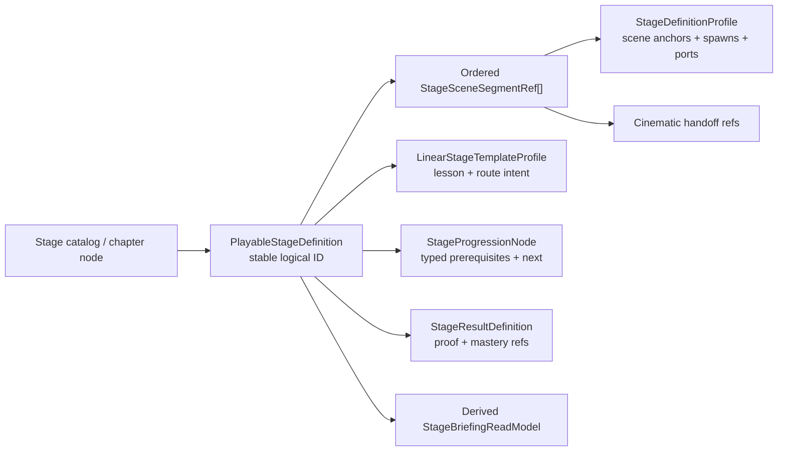

# Playable Stage Reference Spine Spec

## Current P1-B closure

- P1-B Station Add and full-exit closure (2026-07-16): `SNAP-P1B-STATION-ADD-AUTHORING-REMEDIATION3-ACCEPTED-11` binds `C:\tmp\DimensionBrawl-P1B-StationAdd-Remediation3-Bundle.md` at SHA-256 `9378bc021b09495c350b331a85755eac7b956a2372d78ecca848a94c2d570c76`; source `128/128` matches digest `4c3dbe952bea5e4f5c57632d70e6fba815d7f6900dc9e1dcbee6af69bae86c89`, artifacts `11/11` match digest `eb5699917083d9be13d571f2a64aa0f69048304552b962df3467b89f3469ce2b`, validator/inventory `8/4/1/1/0`, integrated focused `8/8`, Canonical UI `34/34`, exact Victory-and-Replay full route `1/1`, and graphics aggregate `99/99` all pass with three independent audits at blocker `0`. Revision-1 pose remains relative to `StageDefinitionSceneBinding.transform`; Station `MapRoot` is topology containment only. `ACC-P1B-STATION-ADD-AUTHORING = PASS`; the foreign-evidence row remains PASS through explicit rejection only; `SNAP-P1B-FULL-EXIT-ACCEPTED-12` closes `ACC-P1B-FULL-EXIT-AUDIT = PASS`, so P1-B is **ACCEPTED / VERIFIED-COMPLETE**. This admits no P1-C runtime owner: only the prospective authoring-ledger freeze may start, and runtime work remains gated by `ACC-OPS-AUTHORING-LEDGER-CONTRACT-FROZEN`.

## Status

- P1-B result/progression Remediation3 acceptance: `SNAP-P1B-RESULT-PROGRESSION-JOINS-REV3B-REMEDIATION3-ACCEPTED-08` binds `C:\tmp\DimensionBrawl-P1B-ResultProgression-Remediation3-Bundle.md` at SHA-256 `94fa969979bdb2a2b91dfbdf8a5395aed0a69ddd8907831bb7c99da06b139a5b`; source `116/116` matches digest `271793a22e2afc24779a3aeeace7cb9768aae77b7bbbf18a075fa15ea409efb2`, artifacts `14/14` match list digest `c3642305e13c085f710e8db62df807463aea58d8a57331cd7526460eb7a404fc`, validator/inventory `8/4/1/1/0`, focused `7/7`, Canonical UI `33/33`, exact Victory-and-Replay full route `1/1`, and graphics aggregate `98/98` all pass. Independent source, artifact/test, and semantic-contract audits find blocker `0`: route/sidecar-owned canonical catalog identity is independent of the result definition, public Corridor admission and the editor validator require exact object identity, and catalog-only plus coherent catalog/profile/localization clones reject before run creation. Frozen route/policy/join/lifetime digests remain unchanged. `ACC-P1B-RESULT-PROGRESSION-JOINS = PASS / VERIFIED PARTIAL`; Candidate-07 remains immutable historical FAIL. Station count-one Add authoring is now unheld as the next separate P1-B gate, while live PGR/HI3 disposition, P1-B full exit, and P1-C execution remain OPEN and no P1-D/P2-C owner is admitted.
- P1-B result/progression Remediation2 candidate audit: `SNAP-P1B-RESULT-PROGRESSION-JOINS-REV3B-REMEDIATION2-CANDIDATE-07` binds `C:\tmp\DimensionBrawl-P1B-ResultProgression-Remediation2-Bundle.md` at SHA-256 `a4e2e2873ec4f53ba81a6c6a3269949b4b2f19255f566d333fcb058e3eeb6de8`; its submitted source manifest matches `116/116` with digest `f4c6f0a6065a2f304acd1a56f7d126b4b2be49582f752f707757d87f37c35583`, all `14/14` artifacts match list digest `96176b861dc7ce0a9aaccd86fe035aa59433513383713132248e51f974b6228a`, validator/inventory is `8/4/1/1/0`, focused `7/7`, Canonical UI `33/33`, exact full route `1/1`, and graphics aggregate `98/98` pass. Independent source/contract/test audits verify that Candidate-06's three blocker groups, locale/graph rows, and exact durable-decision byte preservation are closed, but `ACC-P1B-RESULT-PROGRESSION-JOINS = FAIL / VERIFIED-FAILED-CANDIDATE-PARTIAL` on one remaining admission defect: the result definition self-selects its catalog, so a catalog-only clone or coherent catalog/profile/localization clone can evade the intended exact-identity gate. The post-bundle route-owned catalog-anchor WIP changes five submitted files and cannot retroactively amend this cutoff. Station Add and P1-B full exit remain held until a new sealed-source candidate passes.
- P1-B result/progression joint-freeze: `P1B-RESULT-PROGRESSION-JOINS-01` Rev3B proposal artifacts match SHA-256 `b6e63b11e3e270302dc33f95b7b69740565e4e27a13ffe017a17f2899256c88f` / `eb65cf30eb961a271f135bc38a9874cccae49e47d8a9d0af5a6dd5f0d7211199` / `933c13943e5397f5fa7a1be531ae34bd28f595e09feee14f18429daa81a8e603`. Fresh PowerShell, independent Node, and a third row reconstruction preserve the seven `15/35/15/17/8/9/38` blocks, sidecar/join snapshot digest `a2ae9df451bd6f2ff48b83098db3bfbdaf2120e23dfaf3612a31f18a022c41fa`, all predecessor digests, and the separate 11-row lifetime-contract digest `3b6cf33325a0a83db74ee2253da9799e589b5664f4fb677b2b021389b0714c0e`. Exact `(ID, revision)` edge resolution and the no-token `Stage Select A -> pre-admission mutation B -> fresh Corridor B` boundary pass. Verdict is **ACCEPT / JOINT-FROZEN / IMPLEMENTATION-ADMITTED**. This authorizes implementation only: `ACC-P1B-RESULT-PROGRESSION-JOINS`, Station Add, foreign evidence, and P1-B full exit remain **OPEN**, and no P1-C/P1-D/P2-C owner or P1-A digest change is admitted.
- P1-B result/progression Rev3B implementation candidate audit: `C:\tmp\DimensionBrawl-P1B-ResultProgression-Implementation-Bundle.md` matches SHA-256 `35b1b1a5523bc457ad1936190d1d41143dd1bc8a3489624cdb600631c3a6daa1`; submitted source manifest `116/116` matches digest `1b3dba021b40a4be9d728c6fd4f2039864abb399bbff6d2907e4af274bec24ec`, all `14/14` declared artifacts match list digest `249da60824d3ef617937e648e1257b1fde9b50dc28082a904b78513ca7c76023`, both contract verifiers pass, validator/inventory is `8/4/1/1/0`, focused `2/2`, Canonical UI `28/28`, exact Victory-and-Replay full route `1/1`, and graphics aggregate `93/93` pass. These green artifacts are verified, but `ACC-P1B-RESULT-PROGRESSION-JOINS = FAIL / SOURCE-CONTRACT-FAILED-CANDIDATE`: canonical profile/localization object identity is not enforced at admission, the `Presented -> terminal action` path omits the exact pinned join/presentation/audit authority gate and audit self-integrity, and representative deep snapshot damage can throw instead of returning a typed rejection. Direct clone/damage/dispatch, recovery/process-loss, locale, and production graph acceptance rows remain open. The Rev3B joint freeze and every accepted predecessor cutoff/digest remain unchanged; Station Add and P1-B full exit stay held pending remediation and a new sealed-source bundle.
- Drafted: 2026-07-13
- Status: P1-B is **ACCEPTED / VERIFIED-COMPLETE**. Station Add Remediation3 passes on the separate 128-source cutoff, the foreign packet is terminally rejected from promotion, and the full-exit audit is closed. Historical AMEND/FAIL cutoffs remain immutable. P1-C runtime is not admitted; the prospective authoring-ledger freeze is next.
- Roadmap source: `SUBCULTURE_DATASET_GAP_ROADMAP.md`, P1-B
- Presentation lifecycle companion: `STAGE_PRESENTATION_HANDOFF_LIFECYCLE_SPEC.md`, P2-B
- Course-chain companion: [Tutorial Course Lesson Chain Spec](TUTORIAL_COURSE_LESSON_CHAIN_SPEC.md), P2-B
- Encounter execution companion: [Ordered Encounter Execution Bridge Spec](ORDERED_ENCOUNTER_EXECUTION_BRIDGE_SPEC.md), P1-C
- Mastery/progress companion: [Typed Mastery and Progress Application Spec](TYPED_MASTERY_PROGRESS_APPLICATION_SPEC.md), P1-D
- Later variability companion: [Stage Rule, Modifier, and Enemy Variant Spec](STAGE_RULE_MODIFIER_ENEMY_VARIANT_SPEC.md), P2-A
- Product decision companion: [P1 Product Decision Packet](P1_PRODUCT_DECISION_PACKET.md); D1-D3/D4a are product-approved and D4b is separately frozen as a revision-1 technical contract
- External evidence registry: [Subculture Dataset Evidence Index](SUBCULTURE_DATASET_EVIDENCE_INDEX.json); the historical [14-axis local preflight](P1B_STAGE_SPINE_LOCAL_PREFLIGHT.json) remains 19/20 replay. The immutable 46-source [static supplement](P1B_STAGE_SPINE_STATIC_SUPPLEMENT.json) last replayed 43/46 immediately after the accepted direct-presentation slice (`linear 25/25`, `cinematic 18/21`); that is now a dated replay result, not a claim about either accepted 11-source snapshot. The first 11-source snapshot verifies the combined-profile/Timeline/port/director/existing-flow identity chain, and the second independently accepted snapshot verifies current-Timeline binding integrity and sole-port ownership. Together they supersede only the corresponding old cinematic mismatch/residue evidence. The exact [HI3 2021 target-row control](P1B_HI3_2021_STAGEDATA_10101_CONTROL.json) remains a no-payload drift control (`10 present/proven-static + 4 unresolved/unknown`), not a live admitted row. The SMB endpoint still returns sandbox authorization failure and unrestricted `PathNotFound`, but `C:/Ark/SubcultureGameData` independently reproduces the two raw sources, PGR IDs `100001`-`100004`, HI3 `10101`, five rows, seventy cells, PGR drift, and HI3 reconciliation as a non-admitted candidate. The separate [supporting-citation recovery audit](P1B_PGR_HI3_SUPPORTING_CITATION_RECOVERY_AUDIT.json) records supporting admission `0/9`: seven registered paths absent and two exact paths present but provenance-incomplete. Therefore active packet claims/crosswalk, all three live acceptances, and foreign disposition remain open.
- Shared preflight: accepted P0 baseline is PASS at 28/28. P1-0 route/Station validation passes with mutation inventory `8/4/1`, authorized core callers `1`, bypass `0`, policy revision `1` digest `f18fc51e2b65ae7e11b7e26866adc29f1f994c95be3591f2806bb846cd0bcaf2`, and route revision `1` digest `2b912058cefb5b9ad14ed9d11336e2344dd12efa9789fc2df676a7ac74e821b9`; its freeze-point aggregate passes 37/37. P1-A's historical 45/49/54/59/68/75 cutoffs remain non-additive. The final current-schema cutoff matches all 11 sources under digest `e59884ca0bcbec0506502ccb2638d9227e5f098bfb7f271e3a7adf16a2656427`, passes focused 21/23/15, aggregate 79/79, exact full route 1/1, and validator checks, and closes the four audited abort/replacement/diagnostic/snapshot-exception paths. P1-A current-schema full exit is **CLOSED**, so P1-B product work is unblocked; current `NotAdmitted` rows still prove no future admitted-owner quiescence and do not complete P1-B.
- Direct-presentation cutoff: the former post-P1-A candidate is now verified under 11/11 sources and ordered manifest digest `38ea238f58adbc49bbf6f0ac7c1ffd846bc4bc5c549fc0dbfcf542f88af72990`. The intentional missing-arm validator fails, the final validator passes with inventory `8/4/1`, authorized `1`, bypass `0`, focused identity 1/1, natural ActualPlayPath 2/2, exact full route 1/1, and graphics aggregate 80/80. Only the Corridor entry arm is present; the other three arms remain typed absent. The frozen two segment rows, three actions, route/policy digests, and P1-A consumers remain unchanged because presentation metadata is excluded from `ComputeCanonicalRouteDigest`.
- Presentation-residue cutoff: the second slice is independently verified under 11/11 sources and ordered manifest digest `bbde61085d0801886ec33c1741561c7262449ef666246727ecd63109b14b753f`. Its two intentional negatives fail as designed; the final validator reports 39 current bindings with zero null/stale rows, one owned `StageCutscenePort`, and unchanged route/policy digests. Focused 1/1, natural ActualPlayPath 2/2, exact `FullRoute-2` 1/1, and graphics aggregate 80/80 pass. `FullRoute-1` ran zero tests and is explicitly excluded. This closes port inventory and cinematic binding integrity only; it supplies authoring/runtime binding integrity and the existing natural playback/handoff acceptance, not audible or visual perceptual proof.
- Anchor/profile hygiene cutoff: the third independently audited bundle `C:\tmp\DimensionBrawl-P1-B-AnchorProfile-Hygiene-Bundle.md` matches SHA-256 `1a88295b46c43658c964589c554d8286c40ae2f132036204c5fb6fd7b1e7e8e7`; all 19 present hashes plus 4 required absences reproduce the ordered 23-row digest `7116d6430ce78b11d5e5f1553559e36c0f3e2372febdd8f96b1636ca22e7cd84`. Three intentional negatives reject the historical 10-versus-4 Corridor anchor inventory and each zero-resolve dangling profile. The final validator passes with Corridor definition/binding 4/4, Station 0/0, exact ID/group/authored pose, exact remaining `requiresStageDefinition` profile context, unchanged `8/4/1/1/0`, and frozen digests. Accepted `Focused-2` 1/1, ActualPath 2/2, exact Replay full route 1/1, and aggregate 80/80 pass; `Focused-1` is excluded because runtime Timeline pose is not immutable authoring state. This closes anchor/profile disposition only, not perceptual or P2-B lifecycle acceptance.
- Catalog-selection candidate audit: the fourth, separate unchanged-source bundle `C:\tmp\DimensionBrawl-P1-B-CatalogProjection-Bundle.md` matches SHA-256 `078208742bf4033b40543f032bf2a0012c2b2aa52063be438baacadefbf51771`; all 19 source hashes reproduce manifest `83efd18b0658a501f7472556493431be68b453bb97dc94b79e3af7f0d3616183`, and the frozen 14-row projection tuple reproduces lowercase digest `3a2d630f34c6518b8783bcffaf4ac0c21be1a97cbff8e80372b26bec3537549c`. Three intentional negatives, validator, focused 6/6, Canonical UI 19/19, exact `FullRoute-2` 1/1, and graphics aggregate 84/84 all match; stale-filter `FullRoute-1` is excluded. Promotion nevertheless fails: the submitted prefab has `rewardPreviewText` null with no authored reward row to preserve/hide, and the submitted `SelectStage(null/empty/whitespace)` returns before invalidating its prior bundle/latch. `ACC-P1B-CANONICAL-SELECTION = fail` for this candidate.
- Catalog-selection remediation audit: the fifth, separate unchanged-source Candidate-05 bundle `C:\tmp\DimensionBrawl-P1-B-CatalogProjection-Remediation-Bundle.md` matches SHA-256 `2b71350f7e16c54503e03a64c13cb9a04fff3aea3b9fe05799168db1ddabf8b6`; all 19 submitted sources reproduce manifest `05da141460d851ffaaf9a5d1a52fbab9932c2a0d2c1b252e8c4b43b0e2a01dfa`, and the frozen projection digest remains lowercase `3a2d630f34c6518b8783bcffaf4ac0c21be1a97cbff8e80372b26bec3537549c`. The exact inactive empty `CurrentChapterRewardText` row is preserved and bound, and the direct null/empty/whitespace/unknown matrix invalidates the prior projection/latch before return and proves disabled Start with zero router request, event, non-null start SFX, run, admission, and abort side effects. The final validator passes with inventory `8/4/1/1/0` and unchanged route/policy digests; focused 8/8, Canonical UI 21/21, exact VictoryAndReplay full route 1/1, and graphics aggregate 86/86 with 86 unique names and class counts `21/21/3/2/16/23` pass with zero failed, inconclusive, or skipped cases. `ACC-P1B-CANONICAL-SELECTION = pass` for this cutoff.
- Truthful-joins proposal audit: `C:\tmp\DimensionBrawl-P1-B-TruthfulJoins-Contract-Proposal.md` matches SHA-256 `e5305d04937991e7120bb5edc8cd61905c4df923c689adc923c3df65fca9fe5d` and is **AMEND / PROPOSAL ONLY**. It is not an accepted cutoff or joint freeze, authorizes no production implementation, and leaves P1-B full exit open. The exact amended candidate values and missing freeze evidence are recorded below.
- Truthful-joins rev2A freeze audit: preserve the historical 71/27/78 rev2 as **AMEND** under hashes `491d72ec...9235d`, `2f36e217...1efe9`, `760bc5d7...93673`, and `473a42e8...46e0`; it omitted the pre-result active-run-restart typed absence. The replacement rev2A artifacts match proposal `21f7cbda4fe767ec7c2b29cd7d24cf00af6432b0bee858216c8a318d3b4f678f`, generator `1c60f44ef70a6e8ff7dc1595e7f7fa50951535ca7b93dd4f01a36b4282543be9`, PowerShell verifier `d85b7d3d3d83ad98b7fbd768ce13ba522d00a5797a9bdcd7dc16a77d7b767cda`, and Node verifier `aef9bffcf077979a8d10692ecd2b2b4ea05eeddd0d3a3230e965309b638ada06`. Independent reconstruction passes template 71 rows / `3eec8a5f94c4dfd47ae9255a49ff3b5961d5130cf386f2c6ba96b0525c502e55`, reference 27 rows / `b93e1e23845983c3abdb2e13f551e66025942e40ddfde1a2b123054a65db0791`, and briefing 80 rows / `71b17e4c39364da14aa1deb0906b87eb88ed44e1242723a3b5b76064f2a89f60`. The briefing adds ordered rows `activeRunRestartPolicyDisposition=3` and an empty independent policy digest after story-exit and before action count. IDs/copy, explicit enum ordinals and typed-empty payloads, Station guide `RuntimeStateBoundary / CombatEntryGuideState.Released / revision 0 / empty digest`, boss `RouteConditionBoundary / station.encounter.terminal / revision 1 / empty digest`, cached presenter/Start tuple, and the two-segment/three-pocket topology pass. This remains the **ACCEPT / JOINT-FROZEN / IMPLEMENTATION-ADMITTED** contract cutoff.
- Truthful-joins implementation audit: the independently audited bundle `C:\tmp\DimensionBrawl-P1B-TruthfulJoins-Implementation-Bundle.md` matches SHA-256 `8ef3a8e234f53ef561dfdd5d805d0f69c8ddbb55d2a2534ca427f2da821a9d0a`; all 51 ordered source hashes match manifest digest `1d2fc6a142fa7582e76095c8a928ca1f61f4453ac7061f5d50525673d1480324`, and all 13 declared artifacts match. PowerShell and Node independently reconstruct `71/27/80`; the validator passes `8/4/1/1/0`; focused 7/7, canonical UI 26/26, exact full route 1/1, and graphics aggregate 91/91 pass with 91 unique full names and class counts `26/21/3/2/16/23`. Frozen route, policy, projection, template, reference, and briefing digests all match. `ACC-P1B-TRUTHFUL-JOINS` is **PASS / VERIFIED PARTIAL**. P1-B full exit remains **OPEN**. At its later historical cutoff, Candidate-06 fails `ACC-P1B-RESULT-PROGRESSION-JOINS` on three blocker groups. Remediation2 Candidate-07 subsequently closes those groups but still fails one independent canonical-catalog identity anchor; a new sealed-source candidate is next, then Station Add, live PGR/HI3 foreign evidence, and full exit. This adds no P1-C execution owner, result/progression/reward join or owner, or pre-result active-run restart.
- Post-cutoff boundary: each P1-B snapshot is immutable and non-interchangeable. The first three presentation cutoffs are accepted; the fourth, Candidate-04, is an independently hashed historical failure and is not retroactively repaired; the fifth, Candidate-05, is a separately hashed accepted canonical-selection cutoff. Candidate-05 cannot rewrite any prior 80/80 verdict or borrow Candidate-04's artifacts; rev2A and the accepted truthful-join implementation remain separate later cutoffs and do not close P1-B full exit.
- Evidence-history boundary: the 13:15 static supplement is an immutable pre-fix cutoff. Its last stable replay after the direct-presentation slice was 43/46: the linear subscope was 25/25, while three intentional direct-presentation changes left the cinematic subscope 18/21. The two accepted 11-source cutoffs and the later 23-entry source/absence cutoff supersede only their exact direct-join, residue/binding, and anchor/profile mismatch evidence; they do not rewrite the historical report or admit a live PGR/HI3 row.
- Current product flow: two route segments `OlympusCorridorInvasionStage -> OlympusStationCombatStage`, followed by separate additive committed-result presentation `UI_StageClear`

This document defines one thin reference spine that makes the existing stage, route, briefing, encounter-intent, progression, result, and cinematic data agree. It does not replace those systems with a new all-purpose stage database.

## Confirmed Current Drift

| Surface | Current state | Drift |
|---|---|---|
| `DB_Stage_OlympusCorridorIntroCombat` | P1-0 limits the physical definition to Corridor intro/tutorial, clears the fictional `nextStageId`, and uses route-owned succession; the verified P1-B slices store the combined Timeline and `corridor.tutorial.ready` alias, reduce scene ownership to the sole intro port, close current-Timeline binding integrity at 39/39, and enforce exact 4/4 definition-owned anchors plus remaining-profile stage context | route, direct story-entry/local presentation hygiene, canonical catalog selection, truthful reference/template/briefing, result/progression, and the separate Station count-one Add static join are resolved; P1-B is closed |
| Corridor flow | P1-A1 resolves `StageRunSingleLoadDispatch.DestinationScenePath`/`DestinationSceneName` from the frozen route snapshot and the Corridor flow loads that dispatch | runtime destination drift is resolved; P1-B must preserve this authority while completing static joins |
| Station scene binding | frozen `OLYMPUS-STATION-COMBAT-01` profile and `StageDefinitionSceneBinding` resolve and validate under the route digest | the second combat segment has one implementation-frozen physical owner; Station content enrichment remains P1-B work |
| Build Settings readiness | the P1-0 validator cross-checks Corridor -> Station -> separate `UI_StageClear` build reachability against the frozen route | validator/build-readiness aliases are fail-closed checks only and must not become a second runtime load source |
| `DB_UIStageCatalog` | accepted Candidate-05 keeps exactly one presentation ID that directly references `OLYMPUS-INVASION-01`, carries the exact projection digest, preserves the exact inactive empty reward Text row, and removes the selectable Retry alias | canonical selection is accepted without making catalog identity a run, result, progress, retry, or route owner; truthful template/briefing is now accepted by a separate cutoff, and later joins remain separate |
| Linear stage templates | five authored `LinearStageTemplateProfile` assets own lesson, target time, summon need, mastery/reward copy, segments, and pockets | no canonical reference joins a template to the current product route |
| Chapter map nodes | store code/title/subtitle/objective/reward/cost plus lock/clear booleans on scene objects | display and progress state can diverge from stage/result truth |
| Terminal route surfaces | P1-A2 gives `StageClearScreenPresenter` a schema-2 durably decided summary, exact current-schema finalization coverage, and one snapshot-backed typed executor. Post-49 adds exact profile/localization and committed clock/proof projection; post-54 adds producer/typed-Station-adapter/unload-smoke diagnostics and summary-digest rejection; 68/75 add integrity, loader, closure-fault, cancellation, subject, unload, and lifecycle rows; 79/79 closes exact duplicate/replacement/diagnostic/snapshot-exception handling | scene-string result navigation is retired; endpoints, bounded UI/I-O, current-schema integrity, destination/dispatch, loader, adapter-re-enable, and full current-schema exit pass |
| Stage-select projection | accepted Candidate-05 caches one immutable route projection for render/Start, revalidates source/generation/digest at click time, invalidates every invalid public selection before return, and notifies/SFX only after the Combat router accepts | null/empty/whitespace/unknown selection directly proves no surviving bundle/latch and zero router request/event/non-null-SFX/run/admission/abort side effects; the projection remains presentation/dispatch input rather than admission authority |
| Cinematic handoff | the route entry arm, Corridor definition, direct combined profile, combined Timeline, exact intro port, sole `PlayableDirector`, and existing flow consumer resolve by object identity; the second cutoff removes the two unowned port components while retaining payload and closes 39-current-output binding integrity; the third makes Corridor anchors exact 4/4, Station 0/0, and disposes the two zero-reference dangling profiles | the narrow `intro-to-stage` chain and all three bounded local presentation hygiene subgates are verified partial. This is not perceptual acceptance or P2-B lifecycle ownership |

The current route can pass PlayMode while these contracts disagree because each subsystem validates only its local references.

## Decision

Add one logical-stage composition record that references existing authorities:



`PlayableStageDefinition` is a reference spine, not a data warehouse. It must not copy scene paths, anchor transforms, UI prose, enemy stats, result counters, save state, or reward inventory.

## P1-0 Approved Product Values and Completed Technical Freeze

The D1/D2/D4a product values below are approved contract inputs. The D4b mechanism is a separately evidence-frozen technical contract:

| Concern | Approved/frozen value | Reason |
|---|---|---|
| logical playable stage | `OLYMPUS-INVASION-01` | chapter/product identity spans both Corridor and Station without pretending to be either scene |
| route revision | `1` | first explicit two-segment product route |
| Corridor segment ID | `corridor_intro_tutorial` | already used by the P1-A contract and describes its actual responsibility |
| Corridor definition ID | keep `OLYMPUS-CORRIDOR-INTRO-COMBAT-01` as a scene-segment definition | preserves the existing asset identity while narrowing its claimed ownership |
| Station segment ID | `station_entry_combat` | already used by the P1-A contract and covers guide plus encounter |
| Station definition ID | `OLYMPUS-STATION-COMBAT-01` | profile, map path, scene binding, and route membership are validated and frozen |
| physical segment refs | existing Corridor `StageDefinitionProfile` plus the Station `StageDefinitionProfile` with stable ID, `MapScenePath`, and scene binding | P1-0 resolves and validates both scenes; P1-B may enrich anchors/spawns/ports but cannot defer or change physical route identity |
| failed-run retry action | `olympus-invasion.retry`, kind `Retry`, target `OLYMPUS-INVASION-01`, allowed only for Fail | approved and authored failure-recovery behavior; P1-A current-schema acceptance proves the actual Fail Retry click, fresh Corridor re-entry, and full action/lifecycle exit |
| clear replay action | `olympus-invasion.replay`, kind `Replay`, target `OLYMPUS-INVASION-01`, allowed only for Clear | preserves current clear-screen re-entry while separating replay from failure recovery and future repeat/economy policy |
| lobby action | `olympus-invasion.to-lobby`, kind `UIRoute`, target `UIRouteId.Lobby` | matches the current implemented destination; it is navigation, not outcome proof, and no real next playable stage exists yet |
| outcome/action availability | approved `Clear -> Replay + Lobby`, `Fail -> Retry + Lobby` | [P1 Product Decision Packet](P1_PRODUCT_DECISION_PACKET.md) records approval; action presence still never makes a button legal without the matching outcome set |
| terminal resolution policy | approved D4a causal-order/same-epoch Clear-wins semantics plus frozen D4b revision-1 `SameTerminalResolutionEpoch` mechanism with `EncounterTerminalResolutionCoordinator`, pre-mutation admission/order, active token, exclusive synchronous `{ Player, Boss }` queue, close lifecycle, and `QueueDrainedAndSubjectsFinalized` | D4a is product meaning; D4b passed exact inventory, bypass-zero, validator, digest, and regression gates and may now join the P1-A route snapshot |

The accepted P0 evidence establishes `full PASS / natural PASS / retry PASS / lobby PASS` at 28/28. D4b independently passes scoped 14/14, canonical full route 1/1, Retry/Lobby 2/2, exact mutation inventory/bypass-zero validation, and P1-0 aggregate 37/37. `OLYMPUS-INVASION-01`, revision `1`, its two segment rows, three actions, both physical definitions, D4a semantics, and D4b technical fields remain frozen under the exact route/policy digests. P1-A consumes that immutable contract and closes the current-schema exit at 79/79; P1-B may now implement only its own content/reference joins.

### Revision-1 route-segment technical values

These values are production-frozen by the passing route asset, Station definition, semantic validators, mutation inventory, and canonical digests. D4b remains separate from product approval, but its revision-1 technical gate is closed.

| Sequence | Segment | Entry condition | Exit condition | Handoff policy |
|---:|---|---|---|---|
| 0 | `corridor_intro_tutorial` | `run.entry.admitted` | `corridor.tutorial.completed` | `SingleLoad` |
| 1 | `station_entry_combat` | `corridor.tutorial.completed` | `station.encounter.terminal` | `ReturnToOwner` |

`run.entry.admitted` uses condition kind `RunEntrySnapshotValidatedAndFirstSegmentActivated`: immutable route snapshot creation, route validation, owner registration, and first-segment activation succeeded as one atomic admission. `corridor.tutorial.completed` uses `CorridorTutorialFactsAndClosureSealedForSingleLoad`, not raw `OlympusCorridorTutorialDirector.Completed` load authority. Corridor facts and every admitted closure receipt must be sealed before `SingleLoad` may load the exact next Station segment; Station entry additionally validates the active run, route snapshot, current segment, and handoff token, so a direct Station load cannot manufacture a canonical run. `station.encounter.terminal` uses `StationTerminalQueueDrainedSubjectsFinalizedAndEvidenceMatched`: the exact current-run D4b terminal reached `TerminalClosed` after queue drain, both-subject finalization, and candidate/final-state agreement; it is not raw `Died`, public `Won/Failed`, summary commit, or result-UI visibility.

Corridor `SingleLoad` freezes `successor = NextOrderedSegment`, `destination = SuccessorStageDefinitionScene`, `transitionToken = SealedCurrentRunSegmentHandoff`, `loaderGeneration = ActiveRunRouteLoaderGeneration`, `navigationAuthority = P1AStageRunRouteOwner`, and typed `None` for both Return fields. For the final Station segment, `ReturnToOwner` freezes successor, destination scene, transition token, loader generation, and navigation authority as typed `None`, with no automatic scene load. Its sole recipient is `P1AStageRunRouteOwner`, which accepts the exact terminal record under `ExactTerminalRecordExactlyOnceToTerminalFinalizingCommittedPresented` and advances `TerminalFinalizing -> Committed -> Presented`. Station remains the host scene while that owner finalizes facts and commits the result. Only after commit may the separate additive result presentation open, and only the typed Replay/Retry/Lobby executor may later navigate or unload. It never means return to Corridor, unload Station, or load `UI_StageClear` as a segment. The three revision-1 condition IDs have immutable meanings; changing a meaning requires a new condition ID plus route revision/digest change.

`DB_PlayableStage_OlympusInvasion` and `DB_Stage_OlympusStationCombat` now carry the frozen logical ID/revision, two ordered refs, existing Corridor and Station definitions, typed actions, explicit outcomes, route digest `2b912058cefb5b9ad14ed9d11336e2344dd12efa9789fc2df676a7ac74e821b9`, and policy digest `f18fc51e2b65ae7e11b7e26866adc29f1f994c95be3591f2806bb846cd0bcaf2`. P1-A snapshots only this validated asset to validate both scenes and resolve actions. P1-B fills the same asset's optional template/result/progression/briefing/cinematic joins and may enrich non-route Station content; it may not retype or defer physical identity, segment, scene-binding, or action fields.

`OLYMPUS-CORRIDOR-BOSS-CLEAR-01` is retired from the Corridor definition rather than preserved as a fictional next stage. A future real, separately playable node requires its own definition and progression contract. `StageDefinitionProfile.stageId` remains the scene-segment definition identity because that profile owns map, anchor, spawn, and port data; the logical product ID belongs only to the playable-stage spine.

The accepted truthful-join implementation now authors and binds the narrow `olympus-invasion.tutorial-station-run` template for the current Corridor tutorial, Station replica/summon guide, and boss route. The five older templates still promise Break, Backline, Tank, Heal, or a composite Break/Arrow/Tank/Heal route and remain non-canonical for this product route; `S1-5.BossStand` is not reused merely because it mentions a boss.

The accepted implementation realizes the separately frozen P1-B revision-1 reference-block schema/revision/canonical digest on the same `PlayableStageDefinition`. That historical cohort covers presentation, template, and briefing only; its result/progression fields remain truthfully `NotAuthoredForCurrentSchema` and may not be retroactively promoted. The separately frozen Rev3B `StageResultProgressionJoinBlock` is the sole sibling presence owner for result/progression identities. Neither block enters `ComputeCanonicalRouteDigest`, so the frozen P1-0/P1-A route and D4b policy digests remain byte-identical. Because Unity inline serializable objects auto-instantiate, both optional blocks use explicit presence arms rather than null as absence.

## Truthful Reference / Template / Briefing Proposal Audit

Historical first-proposal verdict: **AMEND / PROPOSAL ONLY** for candidate contract ID `P1B-TRUTHFUL-JOINS-01`. This audit defined the corrections required before the later rev2/rev2A submissions; by itself it accepted no digest, froze no schema, and authorized no implementation. Candidate-04 remains failed, Candidate-05 remains passed, and the later rev2A disposition is recorded separately below.

### Amended exact identity and copy candidates

| Concern | Required candidate value |
|---|---|
| template | `olympus-invasion.tutorial-station-run` |
| Corridor template segment | `olympus-invasion.corridor-tutorial` -> `corridor_intro_tutorial` |
| Station template segment | `olympus-invasion.station-guide-combat` -> `station_entry_combat` |
| Corridor pocket | `olympus-invasion.corridor.core-tutorial` |
| Station guide pocket | `olympus-invasion.station.replica-summon-guide` |
| Station encounter pocket | `olympus-invasion.station.boss-encounter` |
| Corridor source semantic plan | existing `olympus.corridor.core-tutorial`; it remains provenance and is not reused as the pocket ID |
| title | `기억의 회랑` |
| objective | `하층 세계에서 발생한 차원의 미세한 균열.` + actual LF + `그 징후의 진원지를 조사하라.` |
| combat lesson | `회랑에서 근접 공격, 이동, 원거리 전환과 사격, 회피, 표적 정리를 차례로 익힌다. 정거장에서는 레플리카 지급과 소환 안내를 확인한 뒤 보스 격파를 목표로 한다.` |

Title and objective are approved as authored narrative briefing candidates. The combat lesson is amended to the exact text above. Catalog legacy title/objective may only be a validator-checked mirror; catalog threat/summon/reward copy is not briefing provenance or fallback.

### Required revision and digest amendments

- Candidate versions are `referenceSchemaVersion=1`, `referenceRevision=1`, `templateSchemaVersion=1`, `templateRevision=1`, `briefingSchemaVersion=1`, and `briefingRevision=1`.
- The proposed 24-row reference digest is incomplete. It must be 27 rows by adding these three ordered rows after `reference.storyEntryCinematicSequenceId` and before the trigger/completion rows:

```text
reference.storyEntryExpectedPortId=intro-gatepod-port
reference.storyEntryStageAnchorId=IntroCutscene_End_PlayerHandoffAnchor
reference.storyEntryStageRuntimeStateId=state-intro-handoff
```

- Canonical row encoding is `key=valueLength:value\n`, where `valueLength` is C# `String.Length` in UTF-16 code units. Null becomes empty, booleans are `1`/`0`, enums use explicit ordinal values, integers use invariant formatting, no trim or Unicode normalization occurs, the payload has a final LF, and UTF-8 SHA-256 yields lowercase 64-hex.
- Reference, template, and briefing are separately digested. The briefing input excludes `canonicalBriefingDigest` itself; deterministic construction order is template -> reference -> briefing.
- `ExistingSceneOwner / P1CNotAdmitted` is not one digest token. Each pocket carries `currentExecutionOwnerDisposition=ExistingSceneOwner` and `p1cAdmissionDisposition=NotAdmitted` as separate typed rows.
- The proposal remains not freeze-ready until it enumerates the exact ordered template rows, exact ordered briefing rows, and final `canonicalTemplateDigest`, `canonicalReferenceDigest`, and `canonicalBriefingDigest`. Those values are missing rather than provisionally accepted.
- Frozen route revision/digest, D4b policy digest, catalog contract, and revision-1 `canonicalProjectionDigest=3a2d630f34c6518b8783bcffaf4ac0c21be1a97cbff8e80372b26bec3537549c` remain byte-identical. The join fields do not enter that projection digest, but the selected Start latch must bind the exact projection instance, catalog generation, and projection/reference/template/briefing digests as one fail-closed tuple.

### Pocket sufficiency and later Station Add boundary

The three amended pockets are sufficient for the current truthful route topology. No speculative fourth pocket is permitted merely to reserve future Add execution. The `olympus-invasion.station.boss-encounter` pocket is only the stable target candidate for a later authoring join, and all three pockets remain existing-scene-owned with P1-C not admitted.

This does not close Station count-1 Add readiness. That separate gate must bind the exact Station route/template segment and pocket to a stable non-placeholder payload target; `SpawnKind.Add`; count 1; finite delay; matching static/live anchor IDs and group; binding-root-local expected pose; `UsageKind.CombatSpawn`; exact position ID; and explicit non-interference with the Station guide, boss, terminal-resolution, result, and cutscene owners. It admits no runtime resolver, factory, execution, or P1-C ownership until its own contract and acceptance pass.

### Revision-2 and rev2A disposition

The first 71/27/78 revision-2 submission satisfied the amended identity, copy, enum, typed-empty, source-provenance, presenter/Start tuple, and three-pocket topology checks, but omitted an explicit pre-result active-run-restart absence. It remains historical **AMEND** under the four immutable hashes recorded in the evidence registry. Rev2A inserts exactly these two rows after `briefing.storyExitDisposition` and before `briefing.actionCount`:

```text
briefing.activeRunRestartPolicyDisposition=3
briefing.activeRunRestartPolicyDigest=
```

Here ordinal `3` is `NotAdmittedByCurrentSchema`; the independent digest is empty because no current active-run restart policy is authored or admitted. P2-A may later author that policy and P2-B may later supply presentation/course request and closure participation without retroactively changing this revision-1 absence. With those rows, the frozen briefing input has 80 rows and digest `71b17e4c39364da14aa1deb0906b87eb88ed44e1242723a3b5b76064f2a89f60`; template and reference remain 71/27 with digests `3eec8a5f94c4dfd47ae9255a49ff3b5961d5130cf386f2c6ba96b0525c502e55` and `b93e1e23845983c3abdb2e13f551e66025942e40ddfde1a2b123054a65db0791`. Rev2A remains **ACCEPT / JOINT-FROZEN / IMPLEMENTATION-ADMITTED**; the separate 51-source implementation cutoff now passes `ACC-P1B-TRUTHFUL-JOINS` without changing this typed absence.

## Result / Progression Sidecar Rev3B Joint Freeze

`P1B-RESULT-PROGRESSION-JOINS-01` Rev3B is **ACCEPT / JOINT-FROZEN / IMPLEMENTATION-ADMITTED**. The later immutable Remediation3 cutoff passes the matching product acceptance with validator, focused/adversarial tests, exact full route, declared aggregate, unchanged-source evidence, and three independent blocker-zero audits. The freeze and acceptance remain distinct records.

The frozen sibling sidecar owns seven canonical blocks in this exact order and identity:

| Block | Rows | Canonical digest |
|---|---:|---|
| result evaluation | 15 | `ab16e4e051c053d57b7ce7a4c841fe42ee1a730ca0123f62684cf7c3decdc5da` |
| presentation binding | 35 | `095c545df089d7670daedb20b3603c180ca5c4ecf7a67c75a6a351d690dd4d0f` |
| pure presentation source | 15 | `e94f5290000b043b5e96c496a67cac6a0df716c77fb36994a34f568ea829f5bc` |
| progression-node content | 17 | `87e684b5a7b0eac8fceaae168693d84132504bbca9a52bee0deb4187b28f9ac4` |
| progression-node binding | 8 | `421f2864b8268184c3934d37a446e70627b388fb3f4fad4d4202c72b4f9078fc` |
| progression graph | 9 | `be1069c47e1b581ae1502f442ac67daee33eddca0919ff9bf70053831e981195` |
| result/progression sidecar | 38 | `a2ae9df451bd6f2ff48b83098db3bfbdaf2120e23dfaf3612a31f18a022c41fa` |

The A-arm deliberately adds no duplicate admission envelope and does not change P1-A run schema 1, `ResultSummaryDigest`, the durable decision/receipt, or the frozen route/policy/projection/template/reference/briefing digests. Stage Select may build a separate non-authoritative preflight snapshot. Corridor admission independently deep-copies and recomputes the current source and creates the only authoritative current-run snapshot; no token, instance, or equality claim crosses from selection to admission. A valid authoring mutation between the two boundaries is therefore interpreted only by the fresh Corridor snapshot.

The exact admission instance must survive same-process cache-clear and transient read/write recovery. An equivalent-but-different, missing, damaged, or process-lost snapshot is rejected before render, `Presented`, resolver lookup, action selection, or dispatch. Result presentation never rebuilds from the latest catalog, profile, localization table, result definition, progression node, graph, or sidecar. This UI-only fail-closed arm leaves an already valid P1-A durable summary/receipt intact. The runtime presentation audit has exactly 13 ordered keys and binds the exact source summary to `joinSnapshotDigest=a2ae9df451bd6f2ff48b83098db3bfbdaf2120e23dfaf3612a31f18a022c41fa`.

Prerequisite and recommended-next targets resolve the exact pair `(targetProgressionNodeId, targetProgressionNodeRevision)`. Duplicate, self, unresolved-ID, wrong-revision, and same-relation cycle fixtures reject; the two relations remain independently directed. Action mappings decorate only actions already offered by the committed P1-A summary and cannot create outcome, progression, reward, or navigation authority. The 11 ordered lifetime clauses are a proposal-contract ledger with digest `3b6cf33325a0a83db74ee2253da9799e589b5664f4fb677b2b021389b0714c0e`; they are not another runtime digest cohort.

## Ownership Rules

| Concern | Canonical owner | Derived consumers |
|---|---|---|
| logical playable-stage identity and route revision | P1-0 fields on the final `PlayableStageDefinition` asset | catalog, chapter map, run identity, result, progression |
| P1-B presentation/template/briefing-reference presence, revision, and canonical digest | explicit revision-1 P1-B reference block on the same `PlayableStageDefinition`; excluded from the frozen route digest; result/progression remains `NotAuthoredForCurrentSchema` in this cohort | catalog selection projection, narrow template, briefing |
| P1-B result/progression presence, revision, and canonical digest | explicit Rev3B `StageResultProgressionJoinBlock` sibling sidecar on the same `PlayableStageDefinition`; excluded from P1-A and predecessor digests | Corridor-admission join snapshot and result-presentation audit only after matching acceptance |
| per-scene map/anchor/spawn/port data | existing `StageDefinitionProfile` | segment resolver, encounter adapter, cinematic adapter |
| ordered segment refs and typed outcome-filtered actions | P1-0 `StageSceneSegmentRef[]` and actions on that same asset | P1-A run snapshot/terminal executor; P1-B validator and entry flow |
| lesson/segment/pocket intent | existing `LinearStageTemplateProfile` | briefing and the P1-C stage-local execution binding |
| pocket-to-concrete-spawn execution | provisional P1-C `EncounterExecutionBinding` and sequence profile on this playable-stage route | ordered execution of existing `StageDefinitionProfile.SpawnRef` records; see [Ordered Encounter Execution Bridge Spec](ORDERED_ENCOUNTER_EXECUTION_BRIDGE_SPEC.md) |
| prerequisite/next semantics | authored `StageProgressionNode` with typed states | chapter map and post-result resolution |
| result proof/mastery definitions | `StageResultDefinition` references with stable revision/content digest | P1-A fact capabilities, P1-D entry snapshot/evaluator, clear presenter |
| persistent clear/mastery | later P1-D `StageProgressState`, keyed by progression-node ID | corrected stage-select read model first; later real chapter-map state and progression resolution |
| player-facing briefing | derived `StageBriefingReadModel` | stage card, loading, briefing, result recap |
| navigation | revision-1 Retry/Replay actions resolve playable-stage entry and Lobby resolves a typed UI route; progression-node Next remains deferred | retry/replay/lobby buttons |
| presentation execution | existing cinematic profile/runner plus a narrow handoff adapter | stage entry/exit flow |
| optional run-scoped lesson chain | later P2-B `TutorialCourseDefinitionRef` on the same playable-stage spine | P1-A entry snapshot and P2-B course coordinator; no persistent course state |

## Provisional Contracts

Names are review vocabulary, not final C# API names.

### Frozen P1-B catalog-selection contract, rejected Candidate-04, and accepted Candidate-05

The proposed catalog boundary is consistent with D1, the frozen route, and P1-A ownership. Freeze the following for this slice without yet freezing the separate P1-B reference-block/template values:

- `DB_UIStageCatalog` has exactly one product `StageEntry`. Its `catalogEntryId = story_v1_training_route` is presentation identity only and never keys a run, result, progress, retry, or route digest. `story_v1_retry_route` and its focus row are absent; Retry remains the Fail-only terminal action `olympus-invasion.retry`.
- The product entry directly references the exact `DB_PlayableStage_OlympusInvasion` `PlayableStageDefinition`, never a `StageDefinitionProfile`. The serialized stage-select route is fixed to `UIRouteId.Combat`.
- One immutable `StageSelectionRouteProjection` is built at selection/enable and cached for both rendering and Start. It freezes `projectionSchemaVersion`, catalog-owned `catalogProjectionGeneration`, `catalogEntryId`, exact route object reference, route schema version, `playableStageId`, `routeRevision`, stored canonical route digest, recomputed canonical route digest, entry `sequenceIndex = 0`, entry `segmentId`, exact entry `StageDefinitionProfile` object reference and `stageDefinitionId`, entry scene asset path/name, `loadingCardId`, fixed `uiRouteId`, and a canonical projection digest over every stable route-selection value field. Unity object instance IDs are validation-only and never canonical digest inputs.
- Revision-1 exact values are `projectionSchemaVersion = 1`, `catalogProjectionGeneration = 1`, route `schemaVersion = 1`, `playableStageId = OLYMPUS-INVASION-01`, `routeRevision = 1`, route digest `2b912058cefb5b9ad14ed9d11336e2344dd12efa9789fc2df676a7ac74e821b9`, entry `sequenceIndex = 0`, `segmentId = corridor_intro_tutorial`, `stageDefinitionId = OLYMPUS-CORRIDOR-INTRO-COMBAT-01`, scene path `Assets/_Game/Scenes/OlympusCorridorInvasionStage.unity`, scene name `OlympusCorridorInvasionStage`, `loadingCardId = stage_to_combat_mood_bridge`, and `UIRouteId.Combat` (`40`). The serialized generation belongs to `DB_UIStageCatalog`; a projection copies it once. A change to any route-selection semantic field at the same generation is invalid and requires a generation bump. Presentation-only copy changes do not silently become route-selection semantics.
- `canonicalProjectionDigest` uses the existing `StageCanonicalDigest` convention: UTF-8, SHA-256, lowercase 64-character hex, invariant numeric formatting, and one `key=valueLength:value\n` row per field including the final row. The exact revision-1 row order is `projectionSchemaVersion`, `catalogProjectionGeneration`, `catalogEntryId`, `routeSchemaVersion`, `playableStageId`, `routeRevision`, `canonicalRouteDigest`, `entrySegmentId`, `entrySequenceIndex`, `entryStageDefinitionId`, normalized `entryScenePath`, `entrySceneName`, `loadingCardId`, `uiRouteId`. Normalize the path to `/` before both storage and hashing. Stored and recomputed route digests must first compare equal with `StringComparison.Ordinal`; the now-identical canonical route digest is hashed once. Exact Unity object identities and the recomputation observation remain separate validator assertions.
- The same cached projection carries a presentation-only card-copy view, but that view is not route, difficulty, reward, mastery, or projection-digest truth. Legacy `displayName`, summary, threat, and summon copy retain explicit legacy presentation provenance. Current `mockRewardPreview` is authored empty because no verified progression source exists; the presenter hides the reward row when it is empty while preserving the serialized text component and layout authoring for a later admitted source.
- Projection creation fails closed unless catalog count/ID/direct route reference, route schema, stored-versus-recomputed route digest, unique sequence-zero first segment, segment/definition IDs, exact definition object, definition scene path, scene asset, enabled Build Settings entry, derived scene name, destination Corridor flow's exact playable-stage object identity, `UIRouteId.Combat`, loading-card resolution, and the sole matching focus row all agree. A typed rejection reason is cached with the invalid state.
- `ApplySelectedStage` and `HandleStartClicked` never re-resolve separate authoring. They consume one cached bundle containing the same projection instance plus its copied generation and digest. `ApplySelectedStage`, `SelectStage`, and `OnDisable` invalidate the old bundle and its latch before any replacement is admitted. Unsupported projection schema, invalid generation, invalid/recomputed projection digest, stale bundle, or source mismatch is a typed rejection: Start is disabled and route requests, `startRequested`, start SFX, run IDs, and admission calls all remain zero.
- Start uses an explicit one-shot request latch scoped to the projection instance/generation/digest bundle. Only `router.RequestRouteWithScene(UIRouteId.Combat, projection.entrySceneName, projection.entryScenePath, projection.loadingCardId) == true` may move `Ready -> Accepted`; only after that transition may the presentation-only `startRequested` notification and start SFX occur once. A router rejection leaves no notification/SFX and cannot create a run or alternate request.
- `startRequested` has no admission or navigation listener. The catalog/presenter/router do not call `TryAdmitFirstSegment`, mint a run ID, or own admission; the existing Corridor flow and P1-A route owner remain the sole admission path after the destination scene activates.
- Cache invalidation is explicit on disable, catalog/selection generation change, or source-object replacement. A click against a stale generation is rejected rather than silently rebuilding from newer authoring.

The revision-1 catalog contract is frozen as `P1B-CATALOG-SELECTION-01`: the corrected lowercase digest convention is accepted, with `routeSchemaVersion` and `uiRouteId` explicitly included in the digest tuple because both are stable selection/dispatch semantics. Candidate-04 remains a historical failure under manifest `83efd...`: its authored reward row is absent and its blank public selection does not invalidate first. Candidate-05 independently closes those exact rows under manifest `05da...`: the exact authored inactive empty reward row is bound and validator-locked, and null/empty/whitespace/unknown public selection invalidates before return with disabled Start and zero configured router request/event/non-null start SFX/run/admission/abort. The route/policy and canonical projection digests remain unchanged, so `ACC-P1B-CANONICAL-SELECTION = pass` only for Candidate-05. The later joint freeze still owns the separate P1-B reference-block schema/revision/digest, truthful narrow template, and typed-absence-safe `StageBriefingReadModel`; this accepted catalog slice does not guess or close those values early.

### `PlayableStageDefinition`

- `schemaVersion`
- `playableStageId`
- optional until P1-B: `chapterId`
- `routeRevision`
- optional until P1-B: `LinearStageTemplateProfile stageTemplate`
- ordered `StageSceneSegmentRef[] sceneSegments`
- optional until P1-B: `StageProgressionNodeRef progressionNode`
- optional until P1-B: `StageResultDefinitionRef resultDefinition`
- optional until P1-C: bounded `EncounterExecutionBinding[] encounterExecutions`
- optional `StageRuleSetRef ruleSet`
- optional bounded `StageModifierDefinitionRef[] stageModifiers` (zero or one in the first P2-A slice)
- optional `StageEnemyVariantBindingSetRef enemyVariantBindings`
- optional `TutorialCourseDefinitionRef tutorialCourse`
- typed nonempty `StageRouteActionRef[] terminalActions`
- typed `StageTerminalResolutionPolicy terminalResolutionPolicy`

P1-D admission requires the optional P1-B `progressionNode` and `resultDefinition` joins to be present and valid. It deep-copies their identity, revision, canonical content digest, objective semantics, required fact capabilities, and presentation metadata into the run's [Mastery Evaluation Plan Snapshot](TYPED_MASTERY_PROGRESS_APPLICATION_SPEC.md#entry-time-snapshot). It never re-reads the latest spine/result asset after entry. Objective semantics are lifetime-immutable under one persisted objective ID; changing a kind, threshold, time metric, comparator, or qualified proof meaning requires a new objective ID.

For a P1-C-capable schema, `encounterExecutions` is the sole spine reachability collection for product bindings. The first product shape contains exactly one `ProductRouteScope` required-defeat binding for its selected pocket. A later course product shape contains the exact bounded Practice/Challenge `ProductTutorialCourseScope` bindings referenced by the course snapshot; isolated fixture arms are never serialized here. Each composite host/segment/pocket key resolves at most one binding, and admission deep-copies the complete static plan/content digest before gameplay. The collection references existing stage definitions, sequences, payload mappings, and gates rather than copying their owned fields.

For a later P2-A-capable schema, the spine references the rule set, zero-or-one modifier definition, and one optional versioned enemy-variant binding set. That sole set is either the first Story-only `ProductRouteScope` shape or a separately reviewed two-member `ProductTutorialCourseScope` shape; it is never a mixture of two isolated fixture sets. P1-C remains the placement authority; each binding targets its existing `(stageDefinitionId, spawnId)` scoped key and agreeing product/course host. Logical route admission resolves the complete selected set into one scene-reference-free `StageVariabilityPlanSnapshot`; no live segment may replace it with newer authoring.

For a later P2-B course-capable schema, the optional course reference resolves exactly one active, `ProductRouteScope`, strict-linear three-entry definition through [Tutorial Course Lesson Chain Spec](TUTORIAL_COURSE_LESSON_CHAIN_SPEC.md). An isolated validation-fixture course is never spine-reachable. The course record references, but never copies, P1-E lesson proof/reset, P1-C execution, P2-A variant/configuration, P1-D objective, or P2-B presentation semantics. It contains no scene path, player progress, reward, or course-complete flag.

Rules:

- `playableStageId` is not a scene name, UI catalog ID, template ID, or `StageDefinitionProfile.stageId`.
- One logical stage may span multiple scene definitions.
- Route revision changes when a segment ID/order, stage-definition or scene reference, entry/exit condition, handoff policy, action ID/kind/target, `allowedOutcomes`, terminal window/coordinator/admission/root-order/active-boundary/subject-role/coverage/work-execution/nested-independent/lifecycle/token-state/finalization/barrier/simultaneous-outcome requirements, P1-C encounter-binding membership/host scope/execution purpose/completion-consumer arm, later P2-A binding membership/scope, active-run restart route policy, or P2-B course binding/route scope changes; display-copy and P2-A/P2-B presentation-digest edits do not change it. A referenced encounter sequence/payload mapping, rule/modifier/variant, or course semantic edit must bump its own revision/digest and changes the final canonical route digest, but does not automatically bump the base route revision unless binding, scope, or route semantics also changes. The validator rejects any in-place semantic edit without the appropriate owner revision/digest change.
- Retry and Replay target a logical playable stage and create a new run ID. Neither stores a scene string; their distinct kind/outcome policy preserves failure recovery versus clear replay.
- Exit action may resolve a next playable stage or a typed UI route such as lobby. It is navigation, not outcome proof, and must never guess from lexical ID order.
- `progressionNode` is an explicit reference and may use a different ID. It is never derived by reusing a playable-stage, battle-stage, scene, or catalog ID.
- P1-0 requires identity/revision, two segment definitions with valid stable ID/scene path/binding, route conditions/policies, typed actions, allowed outcomes, and terminal resolution policy on this final asset. It also inventories every canonical Station path that can mutate bound Player/Boss terminal state, verifies that root admission occurs before any such mutation/callback, and fails implementation freeze until exclusive coordinator coverage plus synchronous closure are feasible. P1-B fills optional content joins on the same asset; there is no second serialized route identity and no deferred physical-scene owner.
- A P1-B schema change affects only new run snapshots. It never backfills or mutates an already committed P1-A `RunResultSummary`.
- The P1-B `resultDefinition` join references the same `ResultActionPresentation` profile first consumed by the P1-A shared result view. Presentation label/role/order never enables a route action and is not copied into `StageRouteActionRef`.

### `StageSceneSegmentRef`

- `segmentId`
- `sequenceIndex`
- `StageDefinitionProfile stageDefinition`
- `entryConditionId`
- `exitConditionId`
- `handoffPolicy`: single-load, additive, or return-to-owner
- optional `StagePresentationHandoffRef entryPresentation`
- optional `StagePresentationHandoffRef exitPresentation`

Rules:

- Scene path is derived from `stageDefinition.MapScenePath`; it is not copied into the segment.
- Every combat segment has a distinct stable ID even when two segments temporarily reuse a scene.
- The first current route needs separate Corridor and Station segment definitions. The existing Corridor definition cannot truthfully claim Station-owned boss combat.
- Result UI is not a combat segment. Its additive scene is a presentation dependency of the committed result.
- `SingleLoad` requires a next ordered segment, a sealed current-segment exit/handoff receipt, and exact destination validation before it replaces the current scene.
- `ReturnToOwner` is valid only on the final segment. It reports the exact terminal exit to the active run owner without loading/unloading a scene; the owner retains the host scene through result commit and presentation.
- `Additive` is reserved for an actual authored scene segment that coexists with its host. It is not used by revision 1 merely because the result presentation loads additively.
- A condition-ID match is necessary but never sufficient authorization: active run/snapshot/current-segment/generation and the typed handoff or terminal receipt must also match.

### `RequiredStageState`

- exact `requirement = Cleared(prerequisiteProgressionNodeId, typed no objective) | MasteryObjectiveAchieved(prerequisiteProgressionNodeId, required objectiveId)`

Course completion and account/economy gates are deferred. A single undocumented `complete` boolean must not stand for multiple meanings.

`RequiredStageState[]` and a progression node's recommended/explicit next-progression-node links are independent directed relations. Persistent state is keyed by progression-node ID, so prerequisite and next edges target that domain; UI/navigation derives the linked playable stage from the resolved target node. Validate every target and disallowed cycle, but do not require a next link to have one inverse prerequisite or force every prerequisite into the recommended path.

[Typed Mastery and Progress Application Spec](TYPED_MASTERY_PROGRESS_APPLICATION_SPEC.md) first captures the P1-D `MasteryEvaluationPlanSnapshot` at logical stage entry: the selected progression-node binding, result/objective definitions, required fact capabilities, revisions, and canonical digests. [Stage Progression and Reward Transaction Spec](STAGE_PROGRESSION_REWARD_TRANSACTION_SPEC.md) later embeds or extends that same identity in `StageSettlementAuthoringSnapshot` with prerequisite graph and reward-plan data. Neither snapshot is another authored route or a copy of player progress.

### `StageRouteActionRef`

- `actionId`
- exact revision-1 `action = Retry(PlayableStageTarget(targetPlayableStageId)) | Replay(PlayableStageTarget(targetPlayableStageId)) | UIRoute(UIRouteTarget(uiRouteId))`
- nonempty `allowedOutcomes`: clear and/or fail

Rules:

- Retry and Replay resolve the entry segment from the target playable stage. Approved D2 permits Retry only for Fail and Replay only for Clear.
- Next-stage is unsupported in revision 1 and cannot be authored. A later arm must use a `ProgressionNodeTarget`, freeze the node-to-playable-stage binding plus resolved entry segment/definition/scene identity, and revise the action/snapshot digests before it can become a complete dispatch payload.
- UI-route uses the existing typed UI route table, not a copied lobby scene path.
- `terminalActions` requires unique action IDs and is canonicalized by action ID for digesting; serialized array order is not UI display order.
- Missing or ambiguous targets disable the action and fail validation; they do not fall back silently.
- Every revision-1 action arm carries exactly one target domain: Retry/Replay forbid UI-route data, while UIRoute forbids playable-stage data. The canonical route digest covers the full arm and typed foreign-target absence.
- Missing outcome availability is a validation failure. Result presentation offers only actions whose allowed set contains the committed outcome; approved `Clear -> Replay + Lobby`, `Fail -> Retry + Lobby` must be serialized explicitly rather than inferred from action kind.
- Pre-result active-run restart is not a `StageRouteActionRef` and does not add a pseudo-outcome. It is authored by the later P2-A `StageRuleSet.ActiveRunRestartPolicyDefinition`, resolved once as `ResolvedActiveRunRestartPolicy` inside the run's sole variability snapshot, and consumed by the P2-B lifecycle adapter.
- Revision 1's manual clear Replay is distinct from failed-run Retry. A future automatic repeat, entry cost, fast-clear, or reward-altering policy may version the clear-only Replay or replace it with a new typed action under a route revision; it must never overload Retry merely because both re-enter the stage.

### `StageTerminalResolutionPolicy`

- `terminalResolutionPolicyId = olympus-invasion.same-terminal-epoch`, semantic revision `1`, and canonical `terminalResolutionPolicyDigest = f18fc51e2b65ae7e11b7e26866adc29f1f994c95be3591f2806bb846cd0bcaf2`
- `windowKind`: frozen `SameTerminalResolutionEpoch`
- `batchOwnerKind`: frozen `EncounterTerminalResolutionCoordinator`
- `rootAdmissionKind`: frozen `CanonicalCombatRootAdmission`
- `rootOrderKind`: frozen `RootAdmissionSequence`
- `rootIssuePoint`: frozen `BeforeTerminalStateMutationAndCallbacks`
- `batchBoundaryKind`: frozen `RootResolutionToken`
- `terminalSubjectRoles`: frozen `{ Player, Boss }`
- `coveragePolicy`: frozen `ExclusiveQueuedTerminalStateMutationForBoundSubjects`
- `workExecutionKind`: frozen `SynchronousNonYieldingResolution`
- `nestedRequestPolicy`: frozen `SameRootSameEpoch`
- `independentRequestPolicy`: frozen `LowerAdmissionSequenceThenNextEpoch`
- `epochStampKind`: frozen `EncounterTerminalEpoch`
- `coordinatorLifecycleKind`: frozen `IdleOpenDrainingFinalizingEpochClosedTerminalClosedFaultedCancelled`
- `subjectFinalizationKind`: frozen `SynchronousTwoSubjectSnapshot`
- `tokenStatePolicy`: frozen `ExplicitIdleActiveDeferredClosedWrongRunPostTerminal`, with explicit handling for `IdleCurrent`, `ActiveCurrent`, `DeferredCurrent`, `ClosedSameRun`, `WrongRun`, and `PostTerminal`
- `flushBarrier`: frozen `QueueDrainedAndSubjectsFinalized`
- `simultaneousOutcome`: frozen `Clear`
- `requiresBossCandidateAndFinalDead = true`
- `requiresPlayerCandidateAndFinalDown = true`

This policy is core outcome semantics, not presentation copy or a P2-A active-run restart rule. D4a's causal-order and same-epoch outcome fields are product-approved; the coordinator/admission/token/queue/closure fields are the separately frozen D4b technical contract. Its canonical digest covers the policy ID/revision and every frozen field, including the fixed subject-role set and required-candidate/final-state booleans; it excludes presentation metadata. P1-A1 deep-copies the exact ID/revision/digest and fields into `StageRunRouteSnapshot`; the existing Station `CombatEncounterController`/coordinator binding retains scene-local subject ownership. On a terminal path the coordinator enters `TerminalClosed`, seals immutable epoch evidence before `Resolved` publication/route-owner handoff, and P1-A validates it into `TerminalEpochClosureRecord` and `TerminalFinalizationAuthority` before sealing the current-schema four-row `TerminalFinalizationOwnerCoverageRecord`. Stored decision/receipt schema 2 compares that exact record ID/digest; the former thin record is historical cutoff evidence only. The coordinator assigns `RootAdmissionSequence` at canonical combat-root admission before any terminal-state mutation or callback; lower sequence is the intended causal order, and callbacks/presenters/collectors cannot admit roots. Only the active admission receives a token/epoch. Same-root nested requests remain synchronous in the active queue; independent admissions wait without mutation authority for a later epoch. Each root follows `Idle -> Open -> Draining -> Finalizing -> EpochClosed`; a nonterminal close returns to `Idle` and immediately opens the lowest pending admission when present, while a terminal close enters `TerminalClosed` before result publication. Any active substate may atomically invalidate active/pending authority through `Faulted`/`Cancelled`; both subject snapshots are synchronous, including an untouched subject. Direct bound-subject mutation outside the coordinator is an invalid-evidence abort while the run is active. Wrong-run or post-terminal authority is reject/log-only and cannot abort an unrelated run or mutate an immutable summary. Revision/digest validation rejects an in-place semantic change, and `Time.frameCount`, `FixedUpdate` count, elapsed milliseconds, health-callback arrival, or subscriber order cannot substitute for admission/order/token/epoch/barrier.

### `StagePresentationHandoffRef`

- referenced `StageDefinitionProfile`
- `handoffId`
- direct referenced `CinematicSequenceProfile`; asset identity is canonical, while asset-name and `sequenceId` strings are validation aliases only
- expected `StageCutscenePort.portId`
- optional expected Timeline asset reference and runtime consumer binding
- `triggerConditionId`
- `completionConditionId`

Validation joins:

1. `StageDefinitionProfile.CutsceneHandoffRef.handoffId`
2. `StageDefinitionSceneBinding.StageCutscenePort.handoffId`
3. directly referenced `CinematicSequenceProfile.StageHandoffId`
4. stage anchor and runtime-state IDs referenced by those records
5. the Timeline/profile actually consumed by the scene runtime path

The first fixture is `intro-to-stage` because it is the actual current intro path. The verified direct slice corrects the definition to the combined Timeline, directly references the combined profile and Timeline from the Corridor entry arm, binds the exact intro port to the sole scene `PlayableDirector`, and proves the existing flow consumes that same director while natural playback still reaches handoff. The verified residue slice then removes the two unowned `StageCutscenePort` components while retaining their payload GameObjects/Transforms, reduces the serialized table to the exact 39 current outputs, and proves zero null/stale rows. The third slice makes every canonical scene anchor inventory exact—Corridor 4/4 and Station 0/0—while retaining the six payload GameObjects/Transforms whose unowned components were removed, and retires the two zero-production-reference profiles whose stage contexts could not resolve. This is an authoring/identity and runtime-binding join to the existing consumer, not a new route-owned presentation executor or perceptual audio/visual proof: `triggerConditionId` and `completionConditionId` are validated aliases, while the existing flow retains playback ownership.

### `StageBriefingReadModel`

Derived, immutable fields for the selected stage/run revision:

- playable stage ID and title/localization key
- objective and combat lesson
- featured threat and summon need
- recommended power/loadout
- target time and optional mastery preview
- active restrictions/rules
- enemy preview references
- pre-result active-run restart policy and post-result Replay/Retry availability, kept distinct
- story entry/exit cue
- optional course entry-kind summary from the immutable P2-B snapshot, with no availability/progress claim
- reward-preview labels only after a reward plan exists

Resolution policy:

- identity and route come from the playable stage.
- lesson, target time, summon need, and route intent come from the linear template.
- concrete scene/anchor/spawn information comes from segment stage definitions.
- rule/restriction copy, modifier presentation, and enemy-variant preview come from the immutable P2-A variability snapshot when that schema is admitted.
- mastery copy comes from typed objectives.
- story entry/exit cues come from canonical cinematic handoff references; post-result Replay/Retry availability comes from typed outcome-filtered route actions.
- a course summary may project only the snapshotted entry kinds/order; entry availability, mastery, and persistence are runtime/result joins rather than briefing authoring.
- reward preview is derived from the authoritative plan/resolution; a catalog preview row never becomes a grant or eligibility owner.
- progression state is joined separately and never serialized into the briefing asset.
- UI catalog and chapter nodes keep layout/presentation references only after migration.

## Validator Matrix

| Check | Failure condition |
|---|---|
| logical ID uniqueness | duplicate or empty playable-stage ID |
| route revision | missing revision, run/result refers to another revision/digest, or scene/action semantics changed without a revision bump |
| run route snapshot | at entry, P1-A resolved segment/scene IDs, full action semantics, revision, or canonical digest differ from the selected P1-0 route shell |
| segment order | duplicate index/ID, gap, empty route, or unreachable segment |
| scene authority | missing `StageDefinitionProfile`, missing scene asset, or profile scene path disagrees with the loaded binding |
| Build Settings | any ordered segment or additive result dependency is absent/disabled; manually added scenes are not represented by the stage contract |
| entry/exit chain | a segment exit does not match the next segment entry or terminal outcome |
| current flow parity | transitional Corridor-to-Station load and retry target disagree with the authored route |
| terminal resolution policy | admission/order/coverage/work/lifecycle/token/finalization semantics are missing, an active path can mutate a bound subject before admission, a callback can mint a root, or the policy changed without revision/digest change |
| runtime projection coverage | an authored route/segment/scene reference is valid in data but absent from the runtime adapter that must consume it |
| selected-stage projection | the selected catalog row does not directly resolve one `PlayableStageDefinition`, its immutable projection disagrees with the entry segment/scene/revision/digest or Corridor flow object identity, multiple rows alias one route without an explicit variant contract, or UI publishes start/SFX before the router accepts the exact projection |
| stage-definition truth | any future purpose/objective/clear description reintroduces same-scene ownership that contradicts the multi-scene route |
| unresolved progression | prerequisite/next ID is missing, self-referential, cyclic where disallowed, inferred from ordering, or silently derived from another identity domain; valid directed links are not rejected merely because prerequisite and recommended-next edges are asymmetric |
| template join | the explicit P1-B reference arm/revision/digest or template is missing/duplicate, an existing S1-1..S1-5 template is falsely reused, unsupported power/time/summon/mastery/reward data is marked present, or segment/pocket identity/order cannot map truthfully to the route |
| P1-B result/progression identity join | Rev3B sidecar/result definition/progression node is missing or duplicated, exact `(node ID, revision)` targets do not resolve, copied child payloads cannot be recomputed into the admission snapshot, semantic content changed without revision/digest change, the exact snapshot is replaced or lost without UI fail-closed behavior, or runtime rereads latest authoring |
| P1-C encounter reachability | product binding is absent/ambiguous for an implemented encounter pocket, an isolated host arm appears on the spine, host/segment/pocket composite duplicates, required-defeat versus Practice purpose/consumer disagrees, or the complete static plan/digest cannot be snapshotted at admission |
| P2-A variability join | rule/modifier/variant identity is missing/duplicated, a variant binding copies P1-C placement authority, semantic digest disagrees with the route revision, or runtime rereads newer authoring |
| P2-A binding reachability | binding-set ref is absent/ambiguous for a route that declares variants, set/binding revision or membership disagrees, or a scoped key cannot join the P1-C mapping/prefab/configuration capability before entry |
| P2-B course join | course ref is missing/ambiguous/retired, not exactly Basic/Practice/Challenge in strict order, disagrees with route/segment scope or required P1-E/P1-C/P1-D/P2-A/P2-B capability identities, or copies scene/spawn/objective/progress fields |
| spawn/anchor join | referenced spawn, anchor, runtime state, or scene binding is missing/duplicated |
| cinematic join | handoff ref, scene port, direct cinematic profile, anchor, runtime state, and actually consumed Timeline/profile do not resolve to one chain; asset-name and `sequenceId` aliases disagree or are ambiguous |
| presentation resolution | a request serializes a second cinematic profile binding or resolves a profile/route revision different from its handoff ref |
| result route | any active result/pause surface stores or executes an unresolved target, copied scene, or action disallowed for the committed outcome; review-only result controls are not explicitly excluded or delegated |
| catalog binding | a catalog entry has no playable-stage ref, duplicate product identity, or display copy that disagrees with the derived briefing during migration |
| chapter binding | node has no playable-stage ref or serialized lock/clear flags disagree with `StageProgressState` after persistence exists |

Validation must distinguish errors from migration warnings. During the P1-0 route-shell phase, empty P1-B-only template/result/progression/briefing/cinematic joins are expected; unresolved route scenes/actions/outcome policy are hard errors. Current duplicated UI copy may warn during the first P1-B binding slice; route, scene, handoff, and navigation contradictions remain hard errors.

## Current Vertical Slice

After the shared P1-0 identity decision, its minimal `PlayableStageDefinition` route shell, and the P0 route/navigation gate:

1. Fill the P1-B-only joins on the same P1-0 `PlayableStageDefinition`; do not create another ID/revision/segment/action owner.
2. Review/enrich only the P1-B content portions of the Station `StageDefinitionProfile`, such as anchors, spawns, and cinematic ports. Its stable ID, `MapScenePath`, and scene binding are already P1-0 requirements and cannot be deferred or replaced here.
3. Preserve the three immutable accepted local presentation cutoffs: one owned intro port, 39 current non-null/non-stale bindings, four clipped AudioTracks' exact `AudioSource` targets, Corridor anchor definition/binding 4/4, Station 0/0, exact remaining-profile context, removed unowned components with payload retained, and two retired zero-reference profiles. `ACC-P1B-PRESENTATION-ANCHOR-PROFILE-DISPOSITION` is closed only for the third cutoff; neither rejected Candidate-04 nor accepted Candidate-05 may borrow or rewrite its manifest or 80/80 evidence.
4. Preserve accepted Candidate-05 as the separate canonical-selection cutoff: one exact authored reward Text row remains bound and inactive for empty preview, every null/empty/whitespace/unknown `SelectStage` request invalidates before an old bundle/latch can survive, and disabled Start plus zero configured router request/event/non-null start SFX/run/admission/abort remain direct acceptance rows. Keep `TryAdmitFirstSegment` with the existing Corridor/P1-A owner, preserve the frozen projection tuple, and retain Candidate-04 as a historical failure.
5. Preserve the accepted explicit-presence P1-B reference block, narrow truthful current-route template, and UnityObject-free immutable `StageBriefingReadModel` exactly as verified by `ACC-P1B-TRUTHFUL-JOINS`; unsupported power/time/summon/loadout/restriction/mastery/reward values and pre-result restart remain typed absent, and no runtime spawning is enabled.
6. Preserve Remediation3 as the separate immutable acceptance that closes Candidate-07's canonical-catalog blocker: the route/sidecar-owned non-digest catalog reference, public Corridor `ReferenceEquals`, catalog-only/coherent-clone rejection, post-`Presented` authority/audit integrity, deep-damage, locale/graph, recovery, and durable-byte rows remain active regression boundaries. Keep the A-arm lifetime rules and frozen predecessor digests unchanged, and never turn presentation copy into durable progress or reward truth.
7. Preserve the accepted Station `Add` SpawnRef with count 1, stable `SciFiSoldier.Melee` archetype/prefab identity, exact `Add_LeftLaneAnchor`, and no cutscene ownership conflict. Pose is relative to `StageDefinitionSceneBinding.transform`; Station `MapRoot` is topology containment only. This is authoring readiness only; typed resolver/factory, local completion gate, and execution remain P1-C.
8. Validate that every P1-A2-migrated Replay/Retry/Lobby surface continues to use the same snapshot-backed typed executor, then connect it to the completed spine without a second migration owner; disable or delegate review-only result controls.
9. Treat `intro-to-stage` as the completed first direct-identity fixture; retain the exact stage definition, combined profile/Timeline, scene port, director, anchor, runtime state, and flow-consumer assertions.
10. Preserve the deterministic missing-entry-presentation negative fixture plus the accepted binding-residue and unowned-port negative/positive rows established at step 3 before closing the cinematic subdomain.
11. Preserve the current P1-A1 snapshot-derived Station dispatch while completing parity; remove or retain validator/build aliases only as explicit fail-closed cross-checks, never as runtime destination authority.
12. Treat `SNAP-P1B-STATION-ADD-AUTHORING-REMEDIATION3-ACCEPTED-11` and `SNAP-P1B-FULL-EXIT-ACCEPTED-12` as the once-only P1-B closure. Begin only the prospective P1-C authoring-ledger freeze; runtime implementation waits for `ACC-OPS-AUTHORING-LEDGER-CONTRACT-FROZEN`.

### Verified partial cutoff — direct presentation join

- Source manifest: 11/11, digest `38ea238f58adbc49bbf6f0ac7c1ffd846bc4bc5c549fc0dbfcf542f88af72990`.
- Negative validator: exact `Corridor entry presentation is missing.` failure.
- Positive validator: EXIT 0, inventory `8/4/1`, authorized `1`, bypass `0`, route/policy digests unchanged.
- Runtime identity/natural path: focused 1/1 and ActualPlayPath 2/2.
- Non-regression: exact canonical full route 1/1 and graphics-enabled aggregate 80/80 with class counts `15/21/3/2/16/23`, 80 unique full names, and no failed/inconclusive/skipped cases.
- Verdict: `ACC-P1B-CINEMATIC-DIRECT-JOIN = pass`; P1-B remains verified partial and its full exit remains open.

### Verified partial cutoff — presentation residue and port ownership

- Audit bundle: `C:\tmp\DimensionBrawl-P1-B-PresentationResidue-Bundle.md`, SHA-256 `6098a3fc32e74990fbabb9ddfe5b1a6b951a4b5aba07557e2273da94558a907c`.
- Source manifest: 11/11, ordered digest `bbde61085d0801886ec33c1741561c7262449ef666246727ecd63109b14b753f`.
- Intentional negatives: the six-output binding-residue fixture and the unowned-port fixture each fail for their exact intended reason before remediation.
- Positive validator: EXIT 0; 39 current output/binding rows, null/stale rows 0, one owned `StageCutscenePort`, frozen route/policy digests unchanged.
- Ownership disposition: the two unowned port components are removed, while their payload GameObjects and Transforms remain. The four clipped AudioTracks retain exact `AudioSource` bindings; the clipless `Audio Track (2)` and null-target Cloud Deck ActivationTrack are absent from the final current-output set.
- Runtime/non-regression: focused 1/1, natural ActualPlayPath 2/2, exact `FullRoute-2` 1/1, and graphics-enabled aggregate 80/80 pass. `FullRoute-1` ran zero tests and is excluded from acceptance.
- Evidence boundary: these rows prove authoring/runtime binding integrity and preserve the existing natural playback/handoff acceptance. They do not prove audible waveform output, visual perception, or generic P2-B lifecycle ownership.
- Verdict: `ACC-P1B-PRESENTATION-PORT-INVENTORY = pass` and `ACC-P1B-CINEMATIC-BINDING-INTEGRITY = pass`. At this historical cutoff `ACC-P1B-PRESENTATION-ANCHOR-PROFILE-DISPOSITION` was still open; it is closed only by the separate third cutoff below. P1-B full exit remains open.

### Verified partial cutoff — anchor ownership and cinematic-profile stage context

- Audit bundle: `C:\tmp\DimensionBrawl-P1-B-AnchorProfile-Hygiene-Bundle.md`, SHA-256 `1a88295b46c43658c964589c554d8286c40ae2f132036204c5fb6fd7b1e7e8e7`.
- Source/absence manifest: 19 present hashes plus 4 exact absences, 23/23 matched under ordered digest `7116d6430ce78b11d5e5f1553559e36c0f3e2372febdd8f96b1636ca22e7cd84`; the closing rehash also matched.
- Intentional negatives: Corridor 10 scene-binding anchors versus 4 definition-owned anchors, `DB_Cinematic_BossIntro` zero-resolve `boss-entrance`, and `DB_Cinematic_GameplayHandoff` zero-resolve `combat-start` each fail for the exact intended reason.
- Positive validator: every canonical scene requires exact count, non-null/unique component and anchor ID, exactly-one definition resolution, group, and authored local pose; every `requiresStageDefinition` profile found by deterministic directory scan requires exact handoff/anchor/runtime-state resolution and handoff-anchor equality. Corridor is 4/4, Station 0/0, mutation inventory remains `8/4/1/1/0`, and both frozen digests are unchanged.
- Static preservation: only six unowned `StageAnchorPoint` components and binding rows are removed; their payload GameObjects, Transforms, parents, and hierarchy remain. The two profiles with zero non-document production references and their meta files are absent.
- Runtime/non-regression: accepted `Focused-2` 1/1 verifies count/ID/group, ActualPath 2/2 preserves natural handoff, exact VictoryAndReplay full route 1/1 passes, and graphics aggregate 80/80 has 80 unique names with class counts `15/21/3/2/16/23`. `Focused-1` is excluded because a Timeline-driven runtime pose is not immutable authoring state; authored pose belongs to the editor validator.
- Verdict: `ACC-P1B-PRESENTATION-ANCHOR-PROFILE-DISPOSITION = pass`. At this immutable cutoff P1-B was still **VERIFIED PARTIAL** and catalog/template/briefing/result/progression/Station Add/foreign/full-exit plus perceptual/P2-B lifecycle rows remained open. Candidate-05 and the later truthful-join cutoff close only their separate catalog and reference/template/briefing rows; later work cannot be mixed into this cutoff.

### Rejected candidate cutoff — canonical catalog selection

- Audit bundle: `C:\tmp\DimensionBrawl-P1-B-CatalogProjection-Bundle.md`, SHA-256 `078208742bf4033b40543f032bf2a0012c2b2aa52063be438baacadefbf51771`.
- Source manifest: 19/19 matched under sorted TAB/LF digest `83efd18b0658a501f7472556493431be68b453bb97dc94b79e3af7f0d3616183`; the canonical projection digest independently reconstructs as `3a2d630f34c6518b8783bcffaf4ac0c21be1a97cbff8e80372b26bec3537549c`.
- Artifact evidence: three exact intentional negatives, final validator PASS, focused 6/6, Canonical UI 19/19, exact `FullRoute-2` 1/1, and graphics aggregate 84/84 with 84 unique names and class counts `19/21/3/2/16/23`. The lanes overlap and are not summed; stale-filter `FullRoute-1` ran zero tests and is excluded.
- Blocker 1: the submitted prefab serializes `rewardPreviewText` as null, the scene has no override, and no authored reward Text row exists. The validator checks the field rather than its object reference, while the focused row injects a synthetic Text; this does not preserve and hide product layout authoring.
- Blocker 2: the submitted `SelectStage(null/empty/whitespace)` returns before invalidating the prior projection/latch, and no submitted test calls `SelectStage`.
- Verdict: `ACC-P1B-CANONICAL-SELECTION = fail` for `SNAP-P1B-CATALOG-SELECTION-CANDIDATE-04`. Post-candidate remediation WIP changes five of the 19 sources and cannot repair this snapshot retroactively; a fresh unchanged-source bundle is required. The three earlier accepted cutoffs and P1-A remain unchanged.

### Accepted cutoff — canonical catalog-selection remediation

- Audit bundle: `C:\tmp\DimensionBrawl-P1-B-CatalogProjection-Remediation-Bundle.md`, SHA-256 `2b71350f7e16c54503e03a64c13cb9a04fff3aea3b9fe05799168db1ddabf8b6`.
- Source manifest: 19/19 submitted hashes match under sorted TAB/LF digest `05da141460d851ffaaf9a5d1a52fbab9932c2a0d2c1b252e8c4b43b0e2a01dfa`; the frozen revision-1 projection digest remains `3a2d630f34c6518b8783bcffaf4ac0c21be1a97cbff8e80372b26bec3537549c`, and the frozen route/policy digests remain unchanged.
- Authored-row remediation: the product prefab preserves and binds the exact `CurrentChapterRewardText` component under `StageSelectArtRoot`; the text is empty and inactive, its layout/component authoring is retained, setup preserves the same row deterministically, and the validator plus product-prefab PlayMode row require its exact non-null binding/name/value/state. This row is presentation authoring, not reward, progression, eligibility, payout, or grant truth.
- Invalid-selection remediation: each null, empty, whitespace, and unknown selection starts from a valid cached projection with an armed one-shot latch, invalidates the projection/latch before return, records the exact typed rejection, disables Start, and proves zero router requests, start events, non-null start-SFX resolution/play, run/admission, and abort records after Start is attempted.
- Runtime/non-regression: final validator PASS reports mutation inventory `8/4/1/1/0` with frozen route/policy digests unchanged; focused catalog/remediation 8/8 in 0.6209749s, Canonical UI 21/21 in 81.6142512s, exact `CanonicalFullRouteCompletesTutorialStationGuideVictoryAndReplay` 1/1 in 27.6428807s, and graphics-enabled six-class aggregate 86/86 in 278.9029475s all pass with zero failed, inconclusive, or skipped cases. The aggregate has 86 unique full names and class counts `21/21/3/2/16/23`; overlapping lanes are not summed.
- Static boundary: the catalog has one product row and zero retry aliases; the prefab route is `UIRouteId.Combat`; prohibited catalog/presenter `TryAdmitFirstSegment`, `StageRunRuntime`, `Guid.NewGuid`, and direct `SceneManager.LoadScene*` references are zero; targeted diff check passes.
- Exclusions: the pre-matrix 86/86 baseline, the matrix-only 1/1 diagnostic run, and earlier remediation negative runs are outside Candidate-05 acceptance. Candidate-04's artifacts remain attached only to its historical failed audit.
- Verdict: `ACC-P1B-CANONICAL-SELECTION = pass` for `SNAP-P1B-CATALOG-SELECTION-CANDIDATE-05`. This is the fourth accepted local P1-B cutoff but the first accepted catalog cutoff; the first three remain presentation cutoffs. At that immutable cutoff the reference-block/template/briefing joint freeze was still open. Rev2A and the later implementation cutoff close truthful joins separately, and Remediation3 separately passes result/progression joins. Station Add readiness, foreign-evidence disposition, and full exit remain open, so P1-B stays **VERIFIED PARTIAL**.

## Acceptance Matrix

| Scenario | Required proof |
|---|---|
| stage select | **pass in Candidate-05:** one catalog row structurally resolves the logical stage, preserves the exact inactive authored hidden reward row, and invalid public selections discard the old projection/latch before Start with direct zero request/event/non-null-SFX/run/admission/abort proof; Candidate-04 remains failed and the truthful briefing is accepted only by its separate later cutoff |
| truthful reference/template/briefing | **pass in the separate implementation cutoff:** 51/51 sources, 13/13 artifacts, PowerShell/Node 71/27/80, validator `8/4/1/1/0`, focused 7/7, UI 26/26, exact full route 1/1, and graphics aggregate 91/91 pass with all frozen digests unchanged; P1-C execution, result/progression/reward, and pre-result restart remain absent |
| Corridor entry | route revision and entry segment match the P1-A run identity |
| Corridor-to-Station | the current snapshot dispatch resolves the next segment; no copied Station constant is runtime load authority, and P1-B parity preserves that fact |
| Build Settings | ordered route and additive result UI exactly match enabled product scenes |
| retry | every active product terminal surface resolves the same typed action, loads Corridor, and creates a new run ID; review-only controls are absent or delegated |
| Lobby | the typed UI-route action resolves `UI_Lobby` and executes it without becoming outcome proof |
| deferred Next Stage | revision-1 validation rejects the action; a later schema must freeze a progression-node target and its resolved playable-stage entry before dispatch |
| same-scene stale description | validator fails if contradictory Corridor purpose/handoff text is reintroduced |
| fictional next stage | validator fails if `OLYMPUS-CORRIDOR-BOSS-CLEAR-01` or another unresolved physical successor is reintroduced beside route-owned succession |
| duplicate catalog rows | **pass in Candidate-05:** exactly one product catalog row remains and the retry alias/focus row are absent under the accepted manifest; Candidate-04's structurally similar row remains historical failed evidence rather than retroactive acceptance |
| cutscene handoff | **verified partial:** the Corridor entry stage ref, exact intro port, direct combined profile, combined Timeline/runtime consumer, anchor, runtime state, and existing flow form one resolvable chain; playback ownership remains with the existing flow |
| cutscene port inventory | **pass — `ACC-P1B-PRESENTATION-PORT-INVENTORY`:** the scene has exactly the one canonical intro `StageCutscenePort`; the two unowned port components are removed while their payload GameObjects/Transforms remain |
| cinematic binding integrity | **pass — `ACC-P1B-CINEMATIC-BINDING-INTEGRITY`:** the combined Timeline has exactly 39 current output/binding rows with zero null/stale rows; all four clipped AudioTracks retain exact `AudioSource` targets. This is binding integrity, not audible/visual perceptual proof |
| scene-anchor/profile disposition | **pass — `ACC-P1B-PRESENTATION-ANCHOR-PROFILE-DISPOSITION`:** Corridor definition/binding are exact 4/4, Station 0/0, six unowned components are absent with payload preserved, two zero-reference dangling profiles are retired, and every remaining `requiresStageDefinition` profile resolves exact stage context |
| result presentation | **pass:** Remediation3 proves one exact Corridor-admission join snapshot, pure copied presentation source, and 13-row audit; latest-authoring reads are zero and snapshot loss fails UI closed without rewriting the P1-A durable result |
| terminal policy snapshot | run snapshot and digest contain admission/order/coverage/work/lifecycle/token/finalization semantics; fixed root order is invariant to callback permutation, while a deliberately reversed root order follows the documented causal policy |
| terminal mutation inventory | every canonical bound-subject terminal-state mutation is either covered by the active synchronous queue or prevents P1-0 freeze; initialization-only operations are proven outside the bound window |
| asymmetric progression fixture | **pass:** valid recommended-next and prerequisite edges resolve independently by exact target node ID plus revision without an inverse-edge requirement; duplicate/self/unresolved/wrong-revision and same-relation cycles reject |
| P1-C authoring readiness | **pass for static P1-B authoring only:** one exact current-route segment/pocket and one Station count-1 Add SpawnRef reference the stable payload target; static/live anchors agree on group, binding-transform-relative pose, `CombatSpawn`, position ID, and Add kind, while no resolver/executor is enabled |

## Explicitly Deferred

- general graph editor or universal scene router
- runtime `EncounterGroup` spawning, cancellation, cleanup, and prototype-owner isolation, which belong to [Ordered Encounter Execution Bridge Spec](ORDERED_ENCOUNTER_EXECUTION_BRIDGE_SPEC.md)
- tutorial evaluator migration
- save schema and progression mutation
- reward eligibility, payout, receipt, inventory, and economy
- localization/content rewrite
- multiple chapters, branching campaign UI, and liveops routes
- copying scene paths or UI text into the new composition record for convenience

## Evidence Basis

DimensionBrawl:

- `_Game/Scripts/LevelDesign/StageDefinitionProfile.cs`
- `_Game/Scripts/LevelDesign/StageDefinitionSceneBinding.cs`
- `_Game/Scripts/LevelDesign/StageCutscenePort.cs`
- `_Game/Scripts/LevelDesign/LinearStageTemplateProfile.cs`
- `_Game/UI/StageSelect/UIStageCatalog.cs`
- `_Game/UI/ChapterMapPrototype/ChapterMapPrototypeStageNode.cs`
- `_Game/Editor/UIV1BuildSettingsReadinessReporter.cs`
- `_Game/Scripts/LevelDesign/OlympusCorridorCombatFlowController.cs`
- `_Game/Scripts/UI/StageClear/StageClearScreenPresenter.cs`
- `_Game/Scripts/Presentation/CinematicSequenceProfile.cs`
- `_Game/Scripts/Presentation/CinematicSequenceRunner.cs`

Cross-game structural support:

- The PGR/HI3 stage-spine claims remain historical `section-only` in [Subculture Dataset Evidence Index](SUBCULTURE_DATASET_EVIDENCE_INDEX.json), but a separate retained-mirror candidate now reproduces the two exact raw sources without admitting them. [PGR/HI3 Raw Five-Row Candidate](P1B_PGR_HI3_STAGE_SPINE_RAW_CANDIDATE.json) hashes to `04ebf0a5be6db2535730088b3b7bcd7b6a50c48844292a43e1f9070418efed3d` and materializes PGR IDs `100001`-`100004` plus HI3 `10101` as 70 explicit cells (`present 16 / exact-row absent 6 / unresolved 48`). PGR adds `100004/10010005`, removes none, preserves shared stage identities, and records two loadout-to-null drifts; HI3 reconciles exactly to the existing 2021 file/row/key-set control and is not a newer snapshot. Supporting admission remains `0/9`: seven registered paths are absent and two exact paths are present but provenance-incomplete, so the active packet, claims, foreign-disposition acceptance, and all product gates remain unchanged. A candidate static cell never becomes `proven-runtime` without a separately named direct consumer or runtime trace, exact-row null is not gamewide absence, and EN/ZH or old/current snapshots are never unioned.
- PGR/HI3/Ash Echoes: stage metadata, prerequisites, map/script references, objectives, and results remain separable.
- Arknights: stage metadata references a separate execution level and typed prerequisite states.
- GF2: stage references an ordered encounter-group/placement hierarchy without making UI the executor.
- Wuthering Waves: briefing, guide, enemy, and story-flow concerns are reference-linked catalogs.
- Limbus Company: role-labelled pre/post-battle story references and observed battle-stage/theater-node ID mismatches require explicit cross-domain references rather than ID equality.
- Last Origin: prerequisite and recommended-next links are independently directed, while stage-to-wave/group and separate reward-preview references reinforce validation without reciprocal-edge or preview-authority assumptions.
- Princess Connect: conservative quest-to-mission joins support separate objective references only; hashed fields do not support next/reward semantics.
- Stella Sora: a complete static level-to-floor join is not enough when the community runtime definition omits the floor reference; validators must prove required fields reach their consumer, not only that authoring foreign keys resolve.
- Reverse: 1999: explicit predecessor/unlock/chain references are resolved in client config/model code instead of inferred from numeric order.

## Decision Ledger

1. Product approval recorded: `OLYMPUS-INVASION-01`, revision `1`, `corridor_intro_tutorial`, and `station_entry_combat` are approved contract values.
2. Technical recommendation ready: keep `StageDefinitionProfile.stageId` as the scene-segment definition ID and put the logical product ID only on the new spine.
3. Authoring decision completed by the accepted truthful-join cutoff: the narrow `olympus-invasion.tutorial-station-run` template and exact current lesson/segment/pocket coverage are implemented and verified; the older five linear templates remain non-canonical for this route.
4. Product disposition accepted only in Candidate-05: `story_v1_retry_route` and its focus row are absent, `story_v1_training_route` remains presentation identity, the exact hidden reward row is preserved, and invalid public selections cannot retain an old projection/latch. Candidate-04 remains the immutable historical failure and supplies no part of this pass.
5. Target approved and current parity proven: use `UIRouteId.Lobby` as the result-exit target because no real next playable stage exists; the current direct Station victory test executes the Lobby button successfully.
6. Validation fixtures preserve every separate cutoff. Station Add Remediation3 is the final named P1-B cutoff: 128/128 source, 11/11 artifacts, validator, focused 8/8, UI 34/34, exact full route 1/1, and aggregate 99/99 pass. Foreign disposition closes only through explicit rejection, and P1-B full exit is closed without retroactive evidence mixing.
7. P0 ownership evidence is satisfied, and P1-A2 replaces scene-string result routing with one typed executor. The accepted P1-B catalog/briefing/cinematic joins preserve that owner; the jointly frozen result/progression A-arm must do the same rather than reintroducing a review or navigation owner.
8. Product decision recorded: author approved `Clear -> Replay + Lobby`, `Fail -> Retry + Lobby` explicitly; no action availability is inferred merely from the presence of the three action records.
9. Technical source decision: P1-0 creates the final `PlayableStageDefinition` route shell and P1-B fills that same asset; no separate route-identity asset is introduced.
