# Stage Presentation Handoff Lifecycle Spec

## Status

- Drafted: 2026-07-13
- Status: provisional P2-B presentation-handoff sub-contract; analysis only
- Roadmap source: `SUBCULTURE_DATASET_GAP_ROADMAP.md`, P2-B
- Identity/route source: `PLAYABLE_STAGE_REFERENCE_SPINE_SPEC.md`
- Earlier tutorial boundary: [Tutorial Lesson, Attempt, and Gameplay Reset Spec](TUTORIAL_LESSON_ATTEMPT_RESET_SPEC.md), P1-E; its gameplay ledger stays separate and the current tutorial director retains presentation cleanup until this adapter proves each acquired domain
- Variability/restart-policy predecessor: [Stage Rule, Modifier, and Enemy Variant Spec](STAGE_RULE_MODIFIER_ENEMY_VARIANT_SPEC.md), P2-A
- Course-chain companion: [Tutorial Course Lesson Chain Spec](TUTORIAL_COURSE_LESSON_CHAIN_SPEC.md), P2-B; course transition and presentation ownership remain separate receipts/barriers
- Safety rule: existing route cleanup remains a P0/P1 invariant even though reusable authoring/execution stays P2-B
- First fixture decision: use `intro-to-stage` with the combined `_OlympusBombingPrelude` profile and the Timeline actually assigned to the intro director. The current base-profile/runtime mismatch must fail P1-B validation before this P2-B slice begins

This document defines how existing cinematic/story presentation acquires gameplay state, terminates through any path, restores what it actually owned, and commits one route handoff. It does not authorize another camera stack, Timeline wrapper, sequence graph, dialogue engine, or result framework.

## Current Runtime Audit

`CinematicSequenceProfile` already records more lifecycle intent than `CinematicSequenceRunner` executes.

| Profile/runtime surface | Current generic runner behavior | Gap |
|---|---|---|
| `LockMovement` | no direct consumer found | scene flow or manually configured disabled behaviours own it |
| `LockInput` | no direct consumer found | no generic input lease/gate |
| `HideHud` | no direct consumer found | no generic HUD capture/restore |
| `CanSkip` | no generic skip API/consumer found | Olympus intro owns bespoke skip behavior |
| `UseUnscaledClock` | consumed by playback delta | working |
| stage definition/handoff/anchor/runtime-state IDs | profile validates nonempty fields; runner does not resolve the stage chain | authoring references are not an executable handoff |
| `intro-to-stage` runtime projection | stage definition names the base intro profile/Timeline; the actual director plays `_OlympusBombingPrelude`; a combined profile shares the handoff; generic runner profile is null | a string-resolved static chain could pass while the executed presentation is different; direct profile asset plus actual Timeline/consumer coverage is required |
| handoff start time | marks `GameplayHandoffReached` | boolean only; no target execution |
| input-release delay | extends estimated duration | no input release was found |
| return mode and target ID | target is checked for nonempty; no return target execution found | recorded intent can silently remain inert |
| restore camera | controls driven-camera pose restoration | working for captured camera pose/controller |
| restore HUD | no direct consumer found | inert intent |
| restore time scale | no direct consumer found | inert intent |
| disabled behaviours | captures and restores enabled states | working when manually bound |
| actor controllers/visibility, source grade, fade | captured/cleared/restored on natural completion and `Stop()` | working locally |
| scene disable | `OnDisable -> Stop()` | working for reachable scene-local references; global ownership still needs an explicit contract |

The current Olympus intro uses `PlayableDirector` plus `OlympusCorridorCombatFlowController` arrays and methods to handle cameras, listeners, roots, HUD opacity, input locks, skip, and gameplay activation. That route can work while the generic profile contract remains only partially executable.

## Decision

Add a narrow stage-presentation handoff adapter around existing systems:

```mermaid
stateDiagram-v2
    [*] --> Idle
    Idle --> Acquiring: request validated
    Acquiring --> Playing: ownership snapshot captured
    Playing --> Terminating: complete / skip / cancel / disable / unload / retry
    Terminating --> Restoring: exactly one terminal reason accepted
    Restoring --> Committing: captured ownership fully released
    Restoring --> FaultSealed: restore/release integrity fault
    Committing --> Disposed: one typed handoff result and barrier receipt published
    FaultSealed --> [*]: diagnostic evidence; not disposed or handed off
    Disposed --> [*]
```

The adapter coordinates lifecycle only, and every request has exactly one playback driver. Runner-backed fixtures let `CinematicSequenceRunner` play cues; the first `intro-to-stage` fixture keeps its existing `PlayableDirector` as the sole Timeline driver. The adapter must never start both over the same sequence. Existing input, HUD, camera, audio, and routing systems remain authoritative for their domains.

## Ownership Principle

Restore captured state, not assumed defaults.

- Do not set `Time.timeScale = 1` unless the adapter captured 1 and still owns the change.
- Do not enable every input/controller component; restore the exact prior owner/state.
- Do not show every HUD root; restore the captured visibility and interactivity.
- Do not force a gameplay camera pose when a typed handoff intentionally transfers camera ownership.
- Do not retain scene-object references across a single-load boundary.
- Scene-local state may disappear on unload, but global/static/additive state must still be released.

## Provisional Contracts

Names are review vocabulary, not final C# API names.

### `StagePresentationAdapterGenerationSnapshot`

- runtime-issued `adapterGenerationSnapshotId`, run/stage/route identity, and runtime-issued positive `adapterGeneration`, allocated once when the adapter epoch opens and unique/monotonic within the run
- `generationPurpose = PreResultLifecycle | PostResultExit`
- exact prior presentation-quiescence receipt ID/digest or `Genesis`
- canonical `expectedRequestSlots[]` in snapshot order; each slot has stable slot ID/ordinal, request-definition ID/revision, request role, static course-entry/segment phase or terminal-action admission trigger, and maximum cardinality one
- canonical `adapterGenerationSnapshotDigest` and envelope checksum

The pre-result genesis generation snapshots only pre-result Entry/WithinSegment requests reachable from the admitted route/course definition; it excludes every action-bound post-result Exit. An empty slot list is explicit. A post-result Exit generation contains exactly one expected `Navigate` Exit slot bound to the already sealed `ResolvedTerminalActionSelection`; it may not open speculatively. The canonical digest covers the snapshot ID, epoch identity/purpose, prior head, exact ordered slots/triggers/cardinality, and typed absence while excluding presentation copy/media and the checksum. Runtime admission must consume the matching slot once. At aggregate close, an unconsumed slot is legal only as `NotReachedBeforeClose` with authoritative phase/selection evidence proving its trigger never became current; a reached-but-unconsumed slot is a fault.

### `PresentationExpectedSlotTriggerStateSnapshot`

- runtime-issued `slotTriggerStateSnapshotId`, run/stage/route identity, adapter generation, expected slot ID/ordinal, and trigger kind
- closed state `NotReachedBeforeClose | Reached`
- exact trigger evidence arm:
  - course-entry trigger: course/session generations, expected entry ID/ordinal, and exact current/last `CourseEntrySelection` plus predecessor transition ID/canonical digests or typed pre-selection absence;
  - segment-phase trigger: expected segment/phase and exact `segmentEntryEvidence = InitialRouteEntry(run admission sequence, route-snapshot digest, initial segment ID, initial-active lifecycle sequence) | TransitionedSegment(StageSegmentEntryReceipt ID/canonical digest) | NeverEntered(typed absence of both entry arms, last reachable segment/lifecycle sequence)`;
  - terminal-action trigger: exact `ResolvedTerminalActionSelection` ID/canonical digest
- captured sequence, canonical `slotTriggerStateDigest`, and envelope checksum

The snapshot is captured by P1-A/course state owners at aggregate close, not inferred from an empty presentation registry. Course order proves `NotReachedBeforeClose` only when the expected selection never became current and the exact prior selection/transition or pre-selection state agrees. `InitialRouteEntry` is the only reached evidence for an intro slot on the run's first Corridor segment; it does not fabricate a transition receipt. `TransitionedSegment` is required for a later destination, while `NeverEntered` can support only `NotReachedBeforeClose`. A terminal-action trigger is always `Reached`. The canonical digest covers the snapshot ID, run/generation/slot/trigger identity, closed state, full discriminated evidence arm and typed absences, and captured sequence while excluding presentation metadata and the checksum.

### `StagePresentationRequest`

- `requestDefinitionId` and positive definition revision
- runtime-issued, nonempty `requestId`, unique within the run and never reused
- exact adapter-generation snapshot ID/canonical digest, copied `adapterGeneration`, and exact expected-request slot ID/ordinal from that one current snapshot; all requests admitted in the epoch share the same adapter generation
- runtime-issued positive `requestGeneration` and `requestAdmissionSequence`, each allocated from a run-global monotonically increasing sequence and never reset or reused across adapter generations
- `runId`
- `playableStageId`
- `routeRevision`
- `segmentId`
- `requestRole`: `Entry`, `WithinSegment`, or `Exit`
- `StagePresentationHandoffRef handoffRef`
- resolved, non-serialized `CinematicSequenceProfile sequenceProfile`
- optional authored `PlayableDirector` binding
- optional P2-B course ID/session ID, course generation, entry ID/generation, and exact authorizing `CourseEntrySelection` runtime ID/canonical digest; the complete set is present or typed absent together
- `PresentationSkipPolicy skipPolicy`
- `PresentationCleanupPolicy cleanupPolicy`
- optional `PresentationGameplayHandoffRef completionHandoff`
- optional `PresentationExitPolicy exitPolicy`: `Navigate` or schema-reserved `StayPresented`; revision 1 admits only `Navigate`
- optional accepted P1-A `ResolvedTerminalActionSelectionRef` containing the sealed selection ID and canonical digest
- immutable semantic/presentation content digests and request-snapshot digest

The request must resolve through the P1-B stage-definition, scene-port, direct cinematic-profile asset, anchor, runtime-state, and actual Timeline/consumer chain before acquisition begins. `sequenceProfile` is the runtime result of resolving `handoffRef`, not a second authored binding. Asset-name and `sequenceId` strings are diagnostic aliases only. Validation fails if the direct reference, aliases, executed Timeline/profile, route/course generation, authorizing course-entry selection, or route revision disagree. A course request cannot acquire any domain unless that selection is current, names the same entry/generation, and its canonical digest matches the course snapshot; a non-course request serializes typed course-selection absence.

Every request-owned token, receipt, registry row, result/fault artifact, and callback carries the exact request envelope tuple `(runId, requestId, requestGeneration)`. Admission first compare-and-sets the matching expected slot from `Unconsumed -> Admitted`, then allocates the ID and both run-global sequences before any work registration or domain acquisition. Every producer and consumer validates that exact tuple plus adapter-generation/slot provenance against the authoritative active row or sealed registry history before publishing, accepting, or using the artifact; a callback additionally requires the matching row to remain current and live. A missing, foreign, stale, duplicate-slot, or wrong-generation tuple is rejected or becomes a diagnostics-only no-op. `adapterGeneration` remains additional receipt-chain provenance and never substitutes for tuple validation.

The immutable request snapshot covers request role, handoff/profile/Timeline identities, declared ownership domains, skip/cleanup policy, exactly one continuation shape, adapter capabilities, and optional exact course/session/entry generations plus authorizing `CourseEntrySelection` ID/digest or typed absence. It excludes runtime request/adapter IDs, generations, and admission sequences, mutable scene objects, localization/media payload, and final route digest. Presentation-only copy/media changes affect only the presentation digest. Runtime never rereads a newer request/profile asset after acquisition.

Role validation is exclusive:

- `Entry`/`WithinSegment` requires `completionHandoff` and forbids exit policy/navigation.
- `Exit` forbids `completionHandoff`; revision-1 `Navigate` requires one already sealed P1-A `ResolvedTerminalActionSelectionRef`. `StayPresented` remains unimplemented and fails admission until a separate generation purpose and P1-A open/close authority are reviewed. The presentation adapter neither resolves a `StageRouteActionRef` nor chooses a target.
- `RetryRequested` is a terminal override, not a request role. Before a combat outcome exists, the source submits a pure `ActiveRunRestartRequest` to P1-A while presentation ownership is still intact. P1-A may accept it only from the current run's nested P2-A `ResolvedActiveRunRestartPolicy` by winning the shared terminal-or-restart latch before the terminal arm selects `TerminalWon`/enters `TerminalFinalizing`, then entering `RestartClosing` and sealing the complete dispatch record before any owner cleanup. If terminal resolution already won, rejection has no cleanup, handoff, or result side effect. Only an accepted dispatch identity enters this request's common terminal/restoration path. An entry request does not serialize a dormant result action.
- `Cancelled`, disable, unload, and abort commit neither request continuation.

### `PresentationOwnershipSnapshot`

Capture only domains the request declares it may modify:

- runtime-issued ownership-snapshot ID plus exact `(runId, requestId, requestGeneration)` tuple and request-snapshot digest
- active scene and segment identity
- input owner/gate state
- movement owner/lock state
- HUD root visibility, alpha, interactivity, and raycast state
- camera transform/FOV plus active controller/priority state
- time scale and the local owner token for any change
- active audio-listener set and optional stage BGM owner
- actor root visibility and animator-controller bindings
- fade/overlay state
- explicitly disabled behaviour states
- canonical `ownershipSnapshotDigest` and envelope checksum

`ownershipSnapshotDigest` covers snapshot identity, the exact request envelope tuple, segment identity, and the fixed declared-domain coverage with stable domain IDs, acquisition state, owner-token identity, and captured-value digests. It excludes presentation-only metadata, mutable object references, and the envelope checksum. The snapshot is run/segment scoped and never persisted as progression data.

### `PresentationDomainReleaseReceipt`

One immutable receipt is sealed for every declared domain that was successfully acquired:

- runtime-issued `domainReleaseReceiptId`;
- exact `(runId, requestId, requestGeneration)` tuple plus route/segment identity;
- stable domain kind/ID and source-scoped owner-token identity;
- canonical captured-value digest, expected/current-before-release digest, and final restored/released-value digest;
- terminal reason and disposition: `RestoredCapturedValue` or `ReleasedOwnedToken`;
- restore/release sequence;
- canonical `domainReleaseReceiptDigest` and envelope checksum.

The canonical digest covers the receipt ID, exact request envelope tuple, route/segment and domain ownership identity, captured/current/final semantic values, terminal reason/disposition, and release sequence. It excludes presentation-only copy/media and the envelope checksum. A domain not acquired appears only in ownership-snapshot coverage as `NotAcquired`; it cannot fabricate a success receipt. Missing, duplicate, mismatched, or noncanonical receipts fault the request. No Unity object reference survives in the receipt.

### `PresentationWorkRegistry`

Track only work owned by this request:

- exact `(runId, requestId, requestGeneration)` tuple and cancellation signal
- coroutines and scheduled/timer callbacks
- async load/start/playback completions and any editor/review capture or export work
- event, input, camera, and scene listeners
- observers and frame callbacks
- temporary streams, players, handles, and caches

Every registration returns one disposable token carrying the exact request envelope tuple, a stable run-unique work-token ID, and a monotonic `workRegistrationSequence` issued under the request's serialized registry admission, and is released through the common terminal path. Termination invalidates the request generation before stopping playback. A late completion must verify the complete tuple and cancellation state against the current registry row before touching ownership, publishing a result, or routing; a stale or foreign tuple becomes a no-op even if its underlying operation cannot be cancelled.

Successful drain seals one `PresentationWorkRegistryDrainReceipt` containing runtime-issued receipt ID, exact `(runId, requestId, requestGeneration)` tuple, adapter generation, invalidated-generation/cancellation identity, canonical coverage of every registered work token in ascending `workRegistrationSequence` with stable work-token ID, work kind, and `Completed | Cancelled | Disposed | GenerationInert` disposition, zero pending/listener/observer/transient-resource counts, drain sequence, canonical `workRegistryDrainDigest`, and envelope checksum. Registration sequence, never completion/disposal callback order, is the sole ordering key; duplicate registration-sequence or work-token identities fault. The canonical digest covers those exact fields and excludes presentation-only metadata and every envelope checksum. Missing or still-live work cannot produce the receipt.

### `PresentationGameplayHandoffRef`

- authored `handoffDefinitionId`
- exact `handoffTarget = ResumeCurrentSegment(typed no target segment) | AdvanceToSegment(required exact targetSegmentId)`

This is a gameplay-ownership release/segment-continuation contract, not navigation. It contains no scene name, UI route, retry target, or next-stage target. Entry and within-segment presentations may commit only this handoff on normal completion. An exit completion may only acknowledge the exact P1-A `ResolvedTerminalActionSelection` that was sealed before restoration; it cannot select, resolve, replace, or dispatch that action. A pre-result `RetryRequested` likewise carries only the already accepted P1-A restart-dispatch identity into restoration evidence; it never publishes restart authority or masquerades as a committed-result action. The three types are never serialized or interpreted as one union.

### `PresentationGameplayHandoffCommitReceipt`

- runtime-issued `gameplayHandoffCommitReceiptId`;
- exact `(runId, requestId, requestGeneration)` tuple plus stage/route/segment identities;
- exact authored `handoffDefinitionId` and identical `handoffTarget` arm including typed absence;
- commit sequence;
- canonical `gameplayHandoffCommitDigest` and envelope checksum.

The canonical digest covers the runtime receipt ID, exact request envelope tuple, stage/route/segment scope, authored handoff-definition and complete target arm, and commit sequence. The receipt must equal the request snapshot's exact authored arm; `ResumeCurrentSegment` cannot carry a target and `AdvanceToSegment` cannot omit one. It excludes presentation-only metadata and the envelope checksum. This receipt proves only that the adapter released presentation ownership into the named gameplay continuation; it is not outcome, navigation, or course-transition authority.

### `PresentationTerminalReason`

- `Completed`
- `Skipped`
- `Cancelled`
- `OwnerDisabled`
- `SceneUnloading`
- `RetryRequested`
- `RouteAborted`

Only the first terminal request wins. Later requests are recorded as duplicates for diagnostics and cannot restore or navigate twice.

### `PresentationSkipPolicy`

Initial policies:

- `Disabled`
- `JumpToMandatoryHandoff`
- `CompleteWithoutOptionalCues`

Skip does not mean replaying every timed side effect at zero duration. It applies only explicitly declared mandatory final state, then enters the common restoration path.

### `PresentationCleanupPolicy`

The first implementation supports only:

- `RestoreCapturedStateBeforeHandoff`

Direct ownership transfer to another presentation may be added later only if two adapters can prove a shared token and exactly-once release. The first slice must not introduce chained ownership transfer.

### `StagePresentationResult`

- runtime-issued `presentationResultId`
- exact adapter-generation snapshot ID/canonical digest, adapter generation, expected-request slot ID/ordinal, exact `(runId, requestId, requestGeneration)` tuple, request-admission sequence, request-snapshot digest, and stage/route/segment IDs
- optional exact course/session/entry generations plus authorizing `CourseEntrySelection` ID/canonical digest, or typed absence for a non-course request
- exact cinematic sequence ID plus either the authored handoff-definition ID for a gameplay-handoff-compatible request or typed handoff-definition absence for an `Exit`/non-gameplay continuation
- terminal reason
- whether playback began
- whether mandatory handoff was reached
- ordered successful `PresentationDomainReleaseReceipt` IDs/canonical digests for every acquired domain
- closed `continuationDisposition`: exactly one of `GameplayHandoff(gameplayHandoffCommitReceiptId, gameplayHandoffCommitDigest)`, `AcceptedTerminalAction(selection ID, canonical selection digest)`, `AcceptedActiveRestart(dispatch ID, canonical dispatch digest, reason)`, or typed `None(terminal reason)`; the restart arm is evidence only, never restart authority
- duplicate terminal-request count
- ownership-snapshot ID/`ownershipSnapshotDigest`, work-registry drain-receipt ID/`workRegistryDrainDigest`, and canonical `domainReleaseAggregateDigest`
- canonical `presentationResultDigest`
- result-envelope checksum

`domainReleaseAggregateDigest` covers every declared ownership domain in fixed request-snapshot order as either `Acquired(domainReleaseReceiptId, domainReleaseReceiptDigest)` or typed `NotAcquired`; no row may be omitted. This is lifecycle evidence, not a combat result, mastery result, analytics payload, or reward trigger. `presentationResultDigest` canonically covers the presentation-result ID, exact adapter-generation snapshot/generation/expected-slot provenance, exact request envelope tuple, request admission sequence/snapshot digest, stage/route/segment identity, exact cinematic sequence ID, the authored handoff-definition arm or typed absence, optional exact course-selection authorization or typed absence, ownership-snapshot/work-registry-drain/domain-release aggregate digests, terminal reason, playback/handoff facts, and the exact continuation-disposition arm including typed absence. It excludes presentation-only copy/media, duplicate diagnostic counters, constituent checksums, and the result-envelope checksum. The checksum protects the complete serialized result.

### `StagePresentationClosureFaultEvidence`

- runtime-issued `presentationClosureFaultEvidenceId`
- exact adapter-generation snapshot ID/canonical digest, adapter generation, expected-request slot ID/ordinal, exact `(runId, requestId, requestGeneration)` tuple, request-admission sequence, stage/route/segment, and optional exact course/session/entry generations plus authorizing `CourseEntrySelection` ID/canonical digest, or typed absence
- frozen request and ownership-snapshot digests
- winning terminal reason and failed boundary/domain
- canonical declared-domain coverage in fixed request-snapshot domain order, each row containing its stable domain kind/ID and exactly one of `NotAcquired`, `AcquiredPendingRelease(captured/current/expected state digests)`, or `Released(captured/current/expected state digests, domainReleaseReceiptId, domainReleaseReceiptDigest)`
- canonical work coverage in ascending `workRegistrationSequence`, each row containing the exact request envelope tuple, stable work-token ID, work kind, and exactly one of `Completed`, `Cancelled`, `Disposed`, `GenerationInert`, or `PendingAtFault`; plus registry counts derived from those rows
- optional accepted P1-A terminal-action selection ID/digest or active-restart dispatch ID/digest; never both
- fault sequence, canonical `presentationClosureFaultDigest`, and envelope checksum

`presentationClosureFaultDigest` covers the runtime evidence ID, exact adapter-generation snapshot/generation/expected-slot provenance, exact request envelope tuple, request-admission sequence/snapshot identity, optional exact course-selection authorization or typed absence, winning reason, failed boundary/domain, the complete domain array in fixed request-snapshot order, the complete work array in ascending `workRegistrationSequence`, derived registry counts, any accepted P1-A selection/dispatch ref, and fault sequence; it excludes presentation-only metadata and every envelope checksum. Request-admission sequence is the enclosing aggregate-order key; domain order and work-registration sequence are the only canonical nested-array keys, regardless of callback or failure-observation order. Duplicate domain IDs, work-token IDs, or work-registration sequences fault evidence construction. This immutable diagnostic seals when stop, drain, restore, or release cannot complete. It publishes no gameplay handoff, navigation action, successful `StagePresentationResult`, or quiescent/disposed claim. Best-effort safety release may continue but cannot rewrite the evidence.

### `StagePresentationRequestQuiescenceResult`

Each admitted request closes through the union `Succeeded(StagePresentationResult)` or `Failed(StagePresentationClosureFaultEvidence)`.

Success requires:

- request generation invalidated;
- playback stopped;
- work registry empty;
- zero coroutine, task, timer, callback, listener, observer, frame callback, transient player/stream, and cache owner;
- every acquired presentation domain restored/released with a receipt;
- zero global/additive/source-scoped presentation token retained;
- one successful result sealed; and
- stale work unable to reacquire, publish, hand off, or route.

Fault evidence is terminal diagnostic evidence but does not satisfy request quiescence.

### `StagePresentationQuiescenceBarrier`

P1-A awaits one adapter-level barrier independently from P1-E/course, P1-C, and P2-A. It aggregates every request admitted for the run rather than pretending that a course with entry, within-segment, and exit presentations has one request. The result is `Succeeded(StagePresentationQuiescenceReceipt)` or `Failed(StagePresentationQuiescenceFaultEvidence)`.

`StagePresentationQuiescenceReceipt` contains:

- runtime-issued `presentationQuiescenceReceiptId`, run/stage/route identity, exact adapter-generation snapshot ID/canonical digest and purpose, exact prior `presentationQuiescenceReceiptId`/digest or typed `Genesis`, close reason, and required close-authority arm/ID/canonical digest: `TerminalFinalizationAuthority`, `ResolvedActiveRunRestartDispatch`, `StageRunAbortCloseAuthority`, or `ResolvedTerminalActionSelection`;
- canonical expected-slot coverage in adapter-generation snapshot order, each row carrying exact `PresentationExpectedSlotTriggerStateSnapshot` ID/canonical digest and exactly `NotReachedBeforeClose` or `Admitted(expected slot ID/ordinal, request tuple, request-admission sequence, presentationResultId, presentationResultDigest)`;
- canonical request coverage in ascending run-global `requestAdmissionSequence`, each row containing the exact `(runId, requestId, requestGeneration)` tuple and exact successful `presentationResultId`/`presentationResultDigest`;
- explicit `requestCoverageDisposition = NoRequestAdmitted | RequestsClosed`; the empty arm is valid only when no request was admitted, the registry/work/domain sets are empty, and every expected slot is either absent from an explicitly empty generation snapshot or proven `NotReachedBeforeClose`;
- invalidated adapter/request generations, zero active-request, pending-work, acquired-domain, owner-token, listener, observer, callback, and transient-resource counts;
- close sequence, canonical `presentationQuiescenceReceiptDigest`, and envelope checksum.

The receipt digest covers its runtime identity, run/adapter-generation snapshot/purpose provenance, exact prior receipt or `Genesis`, required close authority, fixed expected-slot coverage, fixed request-admission-order coverage or explicit empty arm, invalidated generations, zero-work/ownership facts, and close sequence; it excludes constituent and envelope checksums plus presentation-only metadata. A reached expected slot without one admitted request faults; the post-result Exit generation's sole terminal-action-bound slot can therefore never close through `NoRequestAdmitted`. `Genesis` is legal only for adapter generation 1. Sealing a receipt closes request admission for that generation. P1-A may open exactly one higher generation only by compare-and-setting the current chain head `(adapterGeneration, presentationQuiescenceReceiptId, digest)` to the next monotonically issued generation for an explicitly snapshotted later phase, such as a post-result Exit request that already carries the sealed terminal-action selection. The sole winner consumes that head, and the next receipt binds its prior ID/digest; sibling generations from one head, skipped/reused generation numbers, faulted-generation reopen, or discarded prior receipts are invalid. On active restart, the aggregate receipt records the already sealed restart-dispatch ID/digest even when no request is active; an active request's own result also carries it. No synthetic `StagePresentationResult` is created for an inactive or never-admitted request.

`StagePresentationQuiescenceFaultEvidence` contains runtime-issued `presentationQuiescenceFaultEvidenceId`, the same run/adapter-generation snapshot/prior-chain-head/required-close-authority provenance, and one canonical row for every expected slot in snapshot order. Each row carries the slot ID/ordinal/trigger, exact `PresentationExpectedSlotTriggerStateSnapshot` ID/canonical digest, and exactly one disposition: `NotReachedBeforeClose`, `Succeeded(request tuple, requestAdmissionSequence, presentationResultId, presentationResultDigest)`, `Failed(request tuple, requestAdmissionSequence, presentationClosureFaultEvidenceId, presentationClosureFaultDigest)`, `PendingAtFault(request tuple, requestAdmissionSequence, requestSnapshotDigest)`, or `ReachedButNotAdmitted`. Every admitted request maps to exactly one slot and is additionally ordered by run-global request-admission sequence for nested residual coverage. For `PendingAtFault`, the complete request-scoped residual domain/work/token arrays and failed-boundary fields below are the sole authoritative runtime-state evidence; no second opaque request-state digest is inferred. `firstFailureSlotOrdinal` names the lowest `Failed | PendingAtFault | ReachedButNotAdmitted` slot, or is typed absent only when an adapter-level registry fault occurred outside every slot. No expected slot or admitted request may be omitted, duplicated, or represented by more than one arm.

The aggregate fault also records the failed adapter/request boundary and complete residual arrays. Request-scoped residual rows are ordered first by `requestAdmissionSequence`, then domains by fixed request-snapshot domain order and work by `workRegistrationSequence`; token IDs within any remaining fixed-kind array use the declared stable domain-kind order and stable ID as the final tie-breaker. Every row carries its stable ID and exact request envelope tuple, and duplicate IDs or ordering keys fault evidence construction. The canonical `presentationQuiescenceFaultDigest` covers the runtime aggregate-evidence ID, full discriminated expected-slot coverage, admission-ordered request residual coverage, first-failure selector or typed absence, ordered residual arrays, fault sequence, generation snapshot/purpose, required authority, and prior-head provenance while excluding every envelope checksum. It never satisfies quiescence or fabricates a request result. If no request was admitted but a trigger was reached or the adapter registry is nonempty, the aggregate fault arm is required rather than `NoRequestAdmitted` success.

## Lifecycle Rules

1. Validate the full P1-B handoff ID chain, derived profile equality, route revision, and request-role continuation XOR before mutating gameplay state.
2. Capture state before the first lock, hide, camera, listener, actor, fade, or time-scale change.
3. Acquire each domain at most once and record whether acquisition succeeded.
4. Register every owned coroutine, timer, async completion, callback, listener, observer, and transient resource before it can publish or mutate state.
5. Natural completion, skip, cancel, disable, unload, retry, and abort all enter one terminal function; that function first invalidates the request generation so late work cannot reacquire state.
6. Stop presentation playback and cancel/dispose registered work before restoring actor/camera/fade state.
7. Restore only successfully acquired domains and restore their captured values.
8. After successful restoration, atomically commit at most one adapter-owned continuation: one `PresentationGameplayHandoffCommitReceipt`. For a post-result exit or pre-result restart, report only the exact P1-A terminal-action selection or restart-dispatch ID/digest that was already sealed before restoration. Publish one per-request `StagePresentationResult` containing the canonical domain-release and sole continuation receipt digests. The run-level barrier succeeds only after its snapshot-ordered expected-slot coverage and admission-ordered request coverage both close, all ownership/work checks pass, and the prior quiescence receipt is chained when a later generation was explicitly opened. P1-A alone dispatches the sealed target after all required barriers succeed.
9. Entry/within-segment presentations cannot select a committed-result navigation action. A pre-result restart request reaches P1-A before this terminal function. P1-A validates the immutable resolved P2-A policy, wins the shared terminal-or-restart latch, seals the dispatch record, invalidates old continuation authority, and only then requests this restoration plus the separate P1-E/course, P1-C, and P2-A barriers. After all receipts/fault evidence are known, P1-A seals one abort record. Successful closure alone disposes and performs the already sealed dispatch; failure enters run-level `ClosureFaulted` with no dispatch.
10. Unexpected missing/destroyed scene objects do not prevent release of remaining global domains.
11. Retry begins from the route baseline with no stale prompt, fade, input lock, camera priority, listener, time-scale owner, actor override, or prior-generation completion.
12. A late callback from an invalid generation is diagnostics-only; it cannot restore, navigate, publish, or acquire.

## Integration Boundary

| Existing system | Adapter use | Adapter must not do |
|---|---|---|
| `CinematicSequenceProfile` | read existing lock/skip/handoff/restore intent | add a parallel profile family |
| `CinematicSequenceRunner` | drive runner-backed sequences and route their natural/`Stop()` terminal signals through the adapter; it is not the first fixture's playback driver | duplicate cue sampling, start beside an active Director for the same sequence, or duplicate camera animation |
| `PlayableDirector` | remain the sole playback driver for the first `intro-to-stage` Timeline fixture and expose reviewed natural/skip/cancel terminal signals | become a universal sequence graph or run in parallel with the runner for the same cues |
| current player/input controllers | request/release an explicit gate or bind a narrow current adapter | globally scan and toggle arbitrary controls |
| HUD presenters/canvas groups | capture and restore named/stable bindings | find UI by display text |
| P1-B stage spine | resolve stage, segment, and gameplay-handoff identity; supply route semantics to P1-A | copy scene paths/navigation strings or let presentation resolve a route action |
| P1-A run context | supply run/segment identity, seal any terminal-action selection or active-restart dispatch before restoration, and consume the lifecycle result | let presentation mutate combat facts/outcome or choose/dispatch navigation |
| result presenter | request exit presentation after committed outcome | use presentation completion as stage clear proof |
| P1-E tutorial gameplay reset policy | before this P2-B adapter is admitted, leave presentation cleanup with the current tutorial director; afterward request this adapter's terminal path only for presentation domains it actually acquired, while the gameplay ledger restores its own state | let presentation clear buffs, projectiles, targets, summons, or temporary loadout state; let both owners restore the same domain |
| P2-A stage variability | let P1-A validate the nested `ResolvedActiveRunRestartPolicy` and seal dispatch before P2-B restoration; expose disjoint presentation-domain receipts to the route owner | release P2-A rule/modifier domains, reinterpret current rule assets, or treat restart as Clear/Fail/Replay/Retry |
| P2-B course coordinator | carry optional course/entry generations and return a presentation receipt to the transition owner | unlock an entry, evaluate a lesson, close P1-C/P2-A work, or write course progress |

## Acceptance Matrix

| Scenario | Required proof |
|---|---|
| natural entry completion | mandatory handoff reached, every acquired domain restores once with one canonical release receipt, one gameplay handoff commit receipt seals, zero navigation actions |
| skip before first cue | mandatory final state only, common restore path, one gameplay handoff, zero navigation actions |
| skip after partial playback | no duplicate cue side effects, actor/fade/camera overrides cleared, one gameplay handoff, zero navigation actions |
| cancel | no completion handoff or navigation; captured state restored |
| exit with `Navigate` | P1-A first seals one `ResolvedTerminalActionSelection`; common restore reports the same selection ID/digest, all barriers succeed, and P1-A alone may then execute its typed next/lobby target instead of a gameplay handoff |
| exit with `StayPresented` | revision-1 admission fails before acquisition; no generation purpose/authority is inferred |
| owner disabled | `Stop()` plus common restore; no stale prompt/behaviour lock |
| scene unload | scene-local missing objects tolerated; time scale/input/HUD/additive/global audio ownership released |
| pre-result retry during presentation | pure request reaches P1-A before cleanup; when the nested resolved P2-A policy permits it, P1-A seals the immutable restart dispatch, then old presentation restores and reports its barrier receipt alongside other admitted barriers; one abort seals afterward, successful closure alone disposes/dispatches and creates a new Basic run on entry, while failure enters `ClosureFaulted`; no `RunResultSummary` or offered result action is used |
| restore/release fault | immutable closure-fault evidence seals; no handoff/navigation/success result/quiescence/Disposed claim |
| stale async completion after retry/unload | old load/start/export/playback completion fails the exact `(runId, requestId, requestGeneration)` registry match and cannot reacquire state, publish a result, or route, even after a higher adapter generation opens |
| duplicate terminal signals | first reason wins; restore and combined handoff/navigation commit count remain at most one |
| stale course/entry generation | request is rejected before acquisition or late work is no-op; no course transition is published |
| adapter closes before any request admission | `NoRequestAdmitted` succeeds only under a required exact P1-A close authority when the generation snapshot is empty or every expected trigger is provably not reached, with zero registry/work/domain counts; a reached slot or post-result Exit slot faults |
| multiple course requests before restart/result action | aggregate coverage is ordered by request admission sequence and references every exact per-request result once; callback completion order cannot change its digest |
| mixed request outcomes at aggregate fault | every admitted request appears once in admission order as `Succeeded`, `Failed`, or `PendingAtFault`; domain/work residual permutations cannot change the digest |
| post-result Exit after an earlier pre-commit barrier | P1-A opens one higher adapter generation from the prior receipt chain head only after sealing the terminal-action selection; the new aggregate receipt binds the prior receipt ID/digest before dispatch |
| semantic source edited after acquisition | active request continues from its immutable snapshot and digest; no latest-asset reinterpretation |
| missing return target | validation fails before acquisition; no gameplay state changes |
| request-role mismatch | entry without a gameplay handoff, entry with exit fields, exit without a policy, `Navigate` without exactly one already sealed P1-A selection ref, or `StayPresented` with one fails before acquisition |
| unsupported return mode | hard validation failure rather than only setting `GameplayHandoffReached` |
| prior non-default time scale | exact captured value restored, not forced to 1 |
| prior hidden HUD | remains hidden after restoration if the presentation did not own its visibility |
| camera ownership transfer attempt | rejected in first slice unless `RestoreCapturedStateBeforeHandoff` is honored |

The current P0 cross-scene and intro-handoff probes should keep their route-specific assertions. This contract adds reusable lifecycle tests; it does not replace natural-path verification.

## P2-B First Vertical Slice

1. Use `intro-to-stage` as the first fixture after P1-B corrects it to the combined `_OlympusBombingPrelude` direct profile and actual Timeline chain; do not substitute the easier static-only `combat-start` chain.
2. Add contract-only tests for terminal-reason arbitration, captured-value restoration, request-generation invalidation, and late-completion suppression.
3. Implement one adapter plus work registry for the current player/input, HUD canvas group, action camera, listener, actor, fade, time-scale, coroutine/task, and scene-listener owners.
4. Keep the existing `PlayableDirector` as the sole playback driver for this fixture and route its natural completion, reviewed skip/cancel, disable, and unload signals through the shared terminal path. Add runner natural-completion/`Stop()` integration in a separate runner-backed fixture after this slice; never bind both drivers to the same cues.
5. Add explicit skip using the profile's `CanSkip` and a reviewed mandatory-handoff policy.
6. Commit one `ResumeCurrentSegment`/`AdvanceToSegment` gameplay handoff for the first entry fixture; do not exercise next/lobby navigation in that fixture.
7. Verify complete, skip, cancel, disable, unload, and injected restore failure from non-default initial states. Verify retry only after the sole resolved P2-A policy is present in the nested variability snapshot, including pure request and restart-dispatch-record seal before cleanup, actual dispatch only after successful barriers/abort seal/disposal, `ClosureFaulted` on barrier failure, and one forced prior-generation completion after termination.
8. Migrate another sequence only after the first one proves no bespoke state toggles or unregistered async work remain outside the adapter.

## Explicitly Deferred

- new camera or Timeline framework
- general talk/action/condition graph
- generic reflection-based component toggling
- chained presentation ownership transfer
- dialogue localization/content tools
- result, mastery, progression, reward, or save mutation
- story branching and quest scripting
- course ordering, lesson proof, Practice lifecycle, mastery, or TutorialProgress; see the separate course companion
- analytics upload
- copied fade timings, camera coordinates, FOV, or source-game action IDs

## Evidence Basis

DimensionBrawl:

- `_Game/Scripts/Presentation/CinematicSequenceProfile.cs`
- `_Game/Scripts/Presentation/CinematicSequenceRunner.cs`
- `_Game/Scripts/Presentation/CinematicSequencePlaylistRunner.cs`
- `_Game/Scripts/LevelDesign/StageDefinitionProfile.cs`
- `_Game/Scripts/LevelDesign/StageDefinitionSceneBinding.cs`
- `_Game/Scripts/LevelDesign/StageCutscenePort.cs`
- `_Game/Scripts/LevelDesign/OlympusCorridorCombatFlowController.cs`
- `_Game/Scripts/UI/StageClear/StageClearScreenPresenter.cs`

Cross-game structural support:

- Aether Gazer: explicit set/reset presentation lifecycle.
- Wuthering Waves: flow/template open-close patterns and separate guide cleanup.
- Genshin Impact: pre/perform/next/finish references, sequence/fade/skip fields, and explicit UI show/close actions; full runtime cleanup remains unproven.
- Fate/Grand Order: battle/story phase and after-clear policy separation; not a cleanup-runtime source.
- Limbus Company: role-labelled pre/post-battle story and after-clear references; not a cleanup-runtime or result-order source.
- Brown Dust 2: a third-party MIT viewer directly demonstrates generation invalidation plus listener/player/observer/frame cleanup, but is used only as a failure checklist because it is not shipped game runtime and has split/incomplete cleanup paths.
- HSR and HBR: explicitly insufficient for ownership claims in the current archives.

No Brown Dust 2 game asset, timing, camera value, path, animation, or viewer architecture is a transferable reference. Only the independently testable invariant survives: terminated prior-generation work cannot reacquire ownership or commit a handoff.

## Open Review Decisions

1. Which current input owner exposes the narrowest explicit acquire/release gate for the first adapter?
2. Which HUD root and canvas state are authoritative for the first sequence?
3. Which state is genuinely global across single-load scenes and therefore must be restored before unload?
4. Should stage BGM be captured by this adapter or remain a separate route-phase service with its own lifecycle result?
5. Which mandatory final state in the selected `intro-to-stage` sequence is safe for `JumpToMandatoryHandoff`?
6. Which current coroutine/task/listener APIs expose explicit cancellation or disposal, and which require generation-only suppression?
