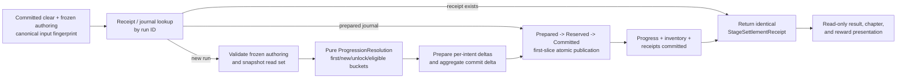

# Stage Progression and Reward Transaction Spec

## Current P1-B closure

- P1-B Station Add and full-exit closure (2026-07-16): `SNAP-P1B-STATION-ADD-AUTHORING-REMEDIATION3-ACCEPTED-11` binds `C:\tmp\DimensionBrawl-P1B-StationAdd-Remediation3-Bundle.md` at SHA-256 `9378bc021b09495c350b331a85755eac7b956a2372d78ecca848a94c2d570c76`; source `128/128` matches digest `4c3dbe952bea5e4f5c57632d70e6fba815d7f6900dc9e1dcbee6af69bae86c89`, artifacts `11/11` match digest `eb5699917083d9be13d571f2a64aa0f69048304552b962df3467b89f3469ce2b`, validator/inventory `8/4/1/1/0`, integrated focused `8/8`, Canonical UI `34/34`, exact Victory-and-Replay full route `1/1`, and graphics aggregate `99/99` all pass with three independent audits at blocker `0`. Revision-1 pose remains relative to `StageDefinitionSceneBinding.transform`; Station `MapRoot` is topology containment only. `ACC-P1B-STATION-ADD-AUTHORING = PASS`; the foreign-evidence row remains PASS through explicit rejection only; `SNAP-P1B-FULL-EXIT-ACCEPTED-12` closes `ACC-P1B-FULL-EXIT-AUDIT = PASS`, so P1-B is **ACCEPTED / VERIFIED-COMPLETE**. This admits no P1-C runtime owner: only the prospective authoring-ledger freeze may start, and runtime work remains gated by `ACC-OPS-AUTHORING-LEDGER-CONTRACT-FROZEN`.

## Status

- P1-B result/progression Remediation3 acceptance: `SNAP-P1B-RESULT-PROGRESSION-JOINS-REV3B-REMEDIATION3-ACCEPTED-08` binds `C:\tmp\DimensionBrawl-P1B-ResultProgression-Remediation3-Bundle.md` at SHA-256 `94fa969979bdb2a2b91dfbdf8a5395aed0a69ddd8907831bb7c99da06b139a5b`; source `116/116` matches digest `271793a22e2afc24779a3aeeace7cb9768aae77b7bbbf18a075fa15ea409efb2`, artifacts `14/14` match list digest `c3642305e13c085f710e8db62df807463aea58d8a57331cd7526460eb7a404fc`, validator/inventory `8/4/1/1/0`, focused `7/7`, Canonical UI `33/33`, exact Victory-and-Replay full route `1/1`, and graphics aggregate `98/98` all pass. Independent source, artifact/test, and semantic-contract audits find blocker `0`: route/sidecar-owned canonical catalog identity is independent of the result definition, public Corridor admission and the editor validator require exact object identity, and catalog-only plus coherent catalog/profile/localization clones reject before run creation. Frozen route/policy/join/lifetime digests remain unchanged. `ACC-P1B-RESULT-PROGRESSION-JOINS = PASS / VERIFIED PARTIAL`; Candidate-07 remains immutable historical FAIL. Station count-one Add authoring is now unheld as the next separate P1-B gate, while live PGR/HI3 disposition, P1-B full exit, and P1-C execution remain OPEN and no P1-D/P2-C owner is admitted.
- P1-B result/progression Remediation2 candidate audit: `SNAP-P1B-RESULT-PROGRESSION-JOINS-REV3B-REMEDIATION2-CANDIDATE-07` binds `C:\tmp\DimensionBrawl-P1B-ResultProgression-Remediation2-Bundle.md` at SHA-256 `a4e2e2873ec4f53ba81a6c6a3269949b4b2f19255f566d333fcb058e3eeb6de8`; its submitted source manifest matches `116/116` with digest `f4c6f0a6065a2f304acd1a56f7d126b4b2be49582f752f707757d87f37c35583`, all `14/14` artifacts match list digest `96176b861dc7ce0a9aaccd86fe035aa59433513383713132248e51f974b6228a`, validator/inventory is `8/4/1/1/0`, focused `7/7`, Canonical UI `33/33`, exact full route `1/1`, and graphics aggregate `98/98` pass. Independent source/contract/test audits verify that Candidate-06's three blocker groups, locale/graph rows, and exact durable-decision byte preservation are closed, but `ACC-P1B-RESULT-PROGRESSION-JOINS = FAIL / VERIFIED-FAILED-CANDIDATE-PARTIAL` on one remaining admission defect: the result definition self-selects its catalog, so a catalog-only clone or coherent catalog/profile/localization clone can evade the intended exact-identity gate. The post-bundle route-owned catalog-anchor WIP changes five submitted files and cannot retroactively amend this cutoff. Station Add and P1-B full exit remain held until a new sealed-source candidate passes.
- P1-B result/progression joint-freeze: `P1B-RESULT-PROGRESSION-JOINS-01` Rev3B proposal artifacts match SHA-256 `b6e63b11e3e270302dc33f95b7b69740565e4e27a13ffe017a17f2899256c88f` / `eb65cf30eb961a271f135bc38a9874cccae49e47d8a9d0af5a6dd5f0d7211199` / `933c13943e5397f5fa7a1be531ae34bd28f595e09feee14f18429daa81a8e603`. Fresh PowerShell, independent Node, and a third row reconstruction preserve the seven `15/35/15/17/8/9/38` blocks, sidecar/join snapshot digest `a2ae9df451bd6f2ff48b83098db3bfbdaf2120e23dfaf3612a31f18a022c41fa`, all predecessor digests, and the separate 11-row lifetime-contract digest `3b6cf33325a0a83db74ee2253da9799e589b5664f4fb677b2b021389b0714c0e`. Exact `(ID, revision)` edge resolution and the no-token `Stage Select A -> pre-admission mutation B -> fresh Corridor B` boundary pass. Verdict is **ACCEPT / JOINT-FROZEN / IMPLEMENTATION-ADMITTED**. This authorizes implementation only: `ACC-P1B-RESULT-PROGRESSION-JOINS`, Station Add, foreign evidence, and P1-B full exit remain **OPEN**, and no P1-C/P1-D/P2-C owner or P1-A digest change is admitted.
- P1-B result/progression Rev3B implementation candidate audit: `C:\tmp\DimensionBrawl-P1B-ResultProgression-Implementation-Bundle.md` matches SHA-256 `35b1b1a5523bc457ad1936190d1d41143dd1bc8a3489624cdb600631c3a6daa1`; submitted source manifest `116/116` matches digest `1b3dba021b40a4be9d728c6fd4f2039864abb399bbff6d2907e4af274bec24ec`, all `14/14` declared artifacts match list digest `249da60824d3ef617937e648e1257b1fde9b50dc28082a904b78513ca7c76023`, both contract verifiers pass, validator/inventory is `8/4/1/1/0`, focused `2/2`, Canonical UI `28/28`, exact Victory-and-Replay full route `1/1`, and graphics aggregate `93/93` pass. These green artifacts are verified, but `ACC-P1B-RESULT-PROGRESSION-JOINS = FAIL / SOURCE-CONTRACT-FAILED-CANDIDATE`: canonical profile/localization object identity is not enforced at admission, the `Presented -> terminal action` path omits the exact pinned join/presentation/audit authority gate and audit self-integrity, and representative deep snapshot damage can throw instead of returning a typed rejection. Direct clone/damage/dispatch, recovery/process-loss, locale, and production graph acceptance rows remain open. The Rev3B joint freeze and every accepted predecessor cutoff/digest remain unchanged; Station Add and P1-B full exit stay held pending remediation and a new sealed-source bundle.
- Drafted: 2026-07-14
- Status: provisional P2-C review contract; analysis only
- Roadmap source: [Subculture Dataset Gap Roadmap](SUBCULTURE_DATASET_GAP_ROADMAP.md), P2-C
- Result-truth predecessor: [Stage Run and Result Contract Spec](STAGE_RUN_RESULT_CONTRACT_SPEC.md), P1-A/P1-D
- Identity/progression predecessor: [Playable Stage Reference Spine Spec](PLAYABLE_STAGE_REFERENCE_SPINE_SPEC.md), P1-B
- Mastery/progress predecessor: [Typed Mastery and Progress Application Spec](TYPED_MASTERY_PROGRESS_APPLICATION_SPEC.md), P1-D
- Variability provenance predecessor: [Stage Rule, Modifier, and Enemy Variant Spec](STAGE_RULE_MODIFIER_ENEMY_VARIANT_SPEC.md), P2-A
- Progress-state ownership: P1-D establishes the minimal persistent `StageProgressState`, durable result-to-writer intent, per-run applied delta, and application record; P2-C reuses and transactionally extends that store rather than creating a second owner
- Historical vocabulary source: `STAGE_REWARD_GROWTH_REFERENCE_RESEARCH.md`; this contract supersedes its parallel first-clear/repeat-plan suggestion with one revisioned plan and conditional buckets
- Implementation gate: every authoritative predecessor through P2-B, starting with the two independent P0 executable Retry-to-Corridor and Lobby-to-`UI_Lobby` scenarios, must close before production work begins
- P1-A predecessor update: the final 11-source unchanged cutoff passes Combat 21/21, StageRun 23/23, canonical UI 15/15, aggregate 79/79, full route 1/1, and validator checks. It preserves the earlier non-additive cutoffs and closes exact duplicate request identity, direct replacement cancellation/provenance, exact diagnostic provenance, and final-snapshot exception closure; P1-A current-schema full exit is **CLOSED**. None of this creates progress/reward authority, and every P1-D/P2-C durable ownership gate remains open.
- P1-B predecessor boundary: three accepted immutable local cutoffs verify direct presentation identity, static port/current-binding cleanup, and exact anchor/profile stage-context hygiene at 80/80. `SNAP-P1B-CATALOG-SELECTION-CANDIDATE-04` remains the historical 19-source/84-test source-contract failure because its submitted product has no authored hidden reward row and blank selection can retain an old projection/latch. The separate unchanged-source `SNAP-P1B-CATALOG-SELECTION-CANDIDATE-05` remediation verifies the authored empty/inactive reward-row binding and four-row invalid-selection zero-side-effect matrix and passes focused 8/8, canonical UI 21/21, exact full route 1/1, aggregate 86/86, and validator checks; `ACC-P1B-CANONICAL-SELECTION` is therefore **VERIFIED PARTIAL** for Candidate-05. Its empty hidden row remains presentation-only, and the spine still has no explicit result-definition/progression-node settlement join. These artifacts create no progress state, reward plan, eligibility, payout, receipt, or transaction authority and do not advance P1-D or P2-C.
- P1-B truthful-join rev2A boundary: rev2A remains contract-frozen and implementation-admitted at 71 template / 27 reference / 80 briefing rows after adding the typed active-run-restart absence, while the first proposal and 71/27/78 rev2 remain historical AMEND records.
- P1-B truthful-join implementation cutoff: the independently audited bundle `C:\tmp\DimensionBrawl-P1B-TruthfulJoins-Implementation-Bundle.md` matches SHA-256 `8ef3a8e234f53ef561dfdd5d805d0f69c8ddbb55d2a2534ca427f2da821a9d0a`; all 51 ordered sources match manifest digest `1d2fc6a142fa7582e76095c8a928ca1f61f4453ac7061f5d50525673d1480324`, all 13 declared artifacts match, PowerShell and Node reconstruct `71/27/80`, and the validator passes `8/4/1/1/0`. Focused 7/7, canonical UI 26/26, exact full route 1/1, and graphics aggregate 91/91 pass with 91 unique full names and class counts `26/21/3/2/16/23`; frozen route/policy/projection/template/reference/briefing digests match. `ACC-P1B-TRUTHFUL-JOINS` is **PASS / VERIFIED PARTIAL**, while P1-B full exit remains **OPEN**. At its later historical cutoff, Candidate-06 fails `ACC-P1B-RESULT-PROGRESSION-JOINS` on three blocker groups. Remediation2 Candidate-07 subsequently closes those groups but still fails one independent canonical-catalog identity anchor; a new sealed-source candidate is next, then Station Add, live PGR/HI3 foreign evidence, and full exit. This cutoff still carries typed absence for reward/progression and adds no P1-C execution owner, result/progression/reward join or owner, eligibility, payout, receipt, transaction authority, or pre-result active-run restart.

This document defines the smallest durable extension of P1-D's clear/mastery progress contract into deterministic reward delivery and a replayable settlement receipt. For P2-C-capable new runs, the combined settlement replaces the standalone P1-D writer while retaining the same result-to-durable-intent acknowledgment boundary; progress must not be applied first and rewarded afterward. It does not authorize a second progress owner or a broad inventory, equipment, stamina, shop, gacha, random-drop, daily, or live-operations system.

## Current Runtime Audit

The current project has presentation and authoring hints, but no production owner for durable progression or payout.

| Surface | Current behavior | Boundary |
|---|---|---|
| encounter/result path | canonical Station seals scene-reference-free epoch closure, current-schema finalization authority/fixed owner coverage, the revision-1 tutorial/combat/outcome/time/proof payload, and one schema-2 durable summary/receipt in an atomic run-ID slot before opening the shared Clear/Fail shell | historical 45/49/54/59/68/75 cutoffs remain distinct, and final 79/79 closes P1-A current-schema exit. The `NotRequired` preparation arm grants no durable stage progress, payout, reward receipt, or settlement ownership |
| `BossBarrageEncounterController.RouteResultRecord` | records one encounter-local result and reward-hook/next-state strings until the controller resets | volatile review evidence only; its fallback explicitly says no payout or progression grant |
| `UIStageCatalog.StageEntry.mockRewardPreview` | historical Candidate-04 authors it empty but leaves `rewardPreviewText` null; accepted Candidate-05 binds one authored empty/inactive `CurrentChapterRewardText` row and verifies that invalid selections leave it hidden with zero start side effects | Candidate-05 closes canonical selection presentation only; the row is not an authored reward plan, eligibility rule, payout, receipt, or grant authority |
| `ChapterMapPrototypeStageNode` | serializes reward text plus lock/clear booleans on scene objects | prototype display state; not derived from persisted progress |
| `StageDefinitionProfile` and `PveStageContext` | store authored stage/previous/next/clear-condition strings and the current in-process selection | route/selection authoring and scene memory only; no clear/save state |
| `LinearStageTemplateProfile` | stores mastery/reward-hook prose and explicitly excludes payout | design intent only; no transaction behavior |
| `STAGE_REWARD_GROWTH_REFERENCE_RESEARCH.md` | proposes progression, reward, and growth vocabulary | research proposal; no matching runtime state or persistence owner was found |
| project-local save/economy surface | P1-A's only durable persistence surface remains the schema-2 result-decision slot with exact current-schema finalization-coverage reference and `NotRequired` preparation; its verified fact payload is part of that result summary, not a progress or economy store. No `StageProgressState`, `ProgressionResolution`, `RunRewardPlan`, durable reward receipt, wallet, gameplay inventory mutation, or gameplay save/load owner was found | progress/reward storage, migration, application, and atomic settlement remain open design decisions separate from the accepted result store |
| battle energy | scene-local combat energy changes after structures/dodges | combat-loop resource only; not inventory, currency payout, or persistence evidence |

Consequences:

- serialized `locked` or `cleared` UI flags cannot be promoted into player progress;
- reward preview text cannot become a payout source;
- `BossBarrageEncounterController.RouteResultRecord` remains encounter-local and cannot replace either the canonical fact-bearing stage-wide summary or the still-open diagnostic/admitted-owner closure lifecycle beyond the verified current-schema finalization subgate;
- a scene-local combat resource cannot be relabelled as a persistent economy balance;
- a result or reward animation must remain an observer of durable state, not the component that creates it.

## Decision

Use one settlement coordinator after a truthful committed clear:



The first slice auto-settles from the application flow. It has no claim button. A later manual-claim surface, if ever justified, must call the same idempotent transaction and return the same receipt; UI still never grants rewards.

## Ownership

| Owner | May own | Must not own |
|---|---|---|
| `RunResultSummary` | immutable run identity, committed outcome, facts, and evaluated mastery results after P1-D | mutable progress, reward eligibility, inventory, receipts |
| `StageProgressionNode` | authored prerequisite/next links, separate battle/playable-stage reference, story hooks, and reward-plan reference | player clear flags, balance, payout application state |
| `StageProgressState` | P1-D durable clear count, first-clear run, mastery history, best result, state revision | authored route, UI copy, reward quantities, a second P2-C state owner |
| `StageProgressApplicationRecord` | P1-D/P2-C durable proof that one run changed one progression node once | reward payload, mutable state, authoring inference |
| `ProgressionResolver` | pure comparison of committed result, prior state, and frozen authoring | persistence, clock, randomness, UI, inventory mutation |
| `RunRewardPlan` | one revisioned ordered set of condition-labelled reward buckets | prior player state, application/receipt state, runtime mutation |
| reward payload resolver | converts eligible authored payloads into one normalized, validated delta | progress eligibility or direct persistence |
| settlement repository/coordinator | idempotency lookup, optimistic concurrency, atomic commit or recovery journal | combat truth, mastery invention, presentation |
| `RewardReceipt` / `StageSettlementReceipt` | durable proof of exactly what was committed for which key | mutable plan pointers or display-only estimates |
| result/chapter/stage-select UI | renders committed receipt, derived progress, and preview read models | payout, clear inference, settlement authority, save mutation |

## Authoring Contracts

Names are review vocabulary, not final C# API names.

### `StageProgressionNode`

- `schemaVersion`
- `progressionNodeId`
- `progressionRevision`
- `playableStageId`
- optional separate `battleStageId`
- typed `RequiredStageState[] prerequisites`
- ordered `recommendedNextProgressionNodeIds`
- optional `preBattleStoryRef`
- optional `postBattleStoryRef`
- optional `afterClearScriptRef`
- optional `RunRewardPlanRef rewardPlan`, required only when the node is P2-C settlement-enabled

Rules:

- `progressionNodeId`, `playableStageId`, `battleStageId`, scene ID, and UI catalog ID are separate identity domains.
- Prerequisite and recommended-next edges are independently directed. They are validated but are not forced to be reciprocal.
- Post-battle story and after-clear hooks can observe only a committed clear. Failure, abort, retry, stale completion, and duplicate callback paths cannot dispatch them.
- A valid authored reference must reach its runtime consumer; foreign-key validity alone is insufficient.

### `StageSettlementAuthoringSnapshot`

- `snapshotSchemaVersion`
- `runId`
- `settlementRunSchemaVersion + cutoverEpoch`
- `playableStageId + routeRevision + routeContentDigest`
- for a P2-A-schema run, `stageVariabilitySemanticDigest` plus stable rule/modifier/binding-set/binding/variant cohort IDs or typed absence
- `progressionNodeId + progressionRevision + progressionNodeContentDigest`
- `progressionGraphRevision + relevantGraphContentDigest`
- `StageResultDefinition` ID, evaluation-content digest, objective-set ID/semantic-content digest, and P1-D `evaluationSnapshotDigest`
- result/objective presentation revisions/digests and global objective-manifest revision/digest for audit only
- `rewardPlanId + planRevision + planContentDigest`
- canonical semantic `authoringSnapshotDigest`
- optional full-envelope checksum

This serializable snapshot is captured once at logical stage entry after the P1-B references and every admitted P1-C/P2-A semantic snapshot resolve. Its canonical semantic digest covers the ordered resolved route, progression node, every prerequisite/next dependency relevant to resolution, P1-D evaluation identity, reward-plan semantics, and P2-A variability provenance when that schema is present. Objective localization/visibility/order, P2-A and P1-D presentation digests/revisions, and unrelated global-manifest churn remain in the audit envelope but are excluded from settlement identity and eligibility. Authoring validation rejects any in-place semantic-content edit without the corresponding revision/identity change. The snapshot crosses scene boundaries with the run and is referenced or embedded by the P2-C-capable `RunResultSummary`; it contains no scene objects, player state, reward eligibility, or mutable balances. P1-A-only summaries do not have this field and cannot be silently settled later as if they had used the newest plan.

P2-C uses the P2-A digest and cohort IDs only to identify which immutable content cohort produced the committed result. Rule names, recommendation status, modifier application, and variant purpose never imply reward eligibility, quantity, first-clear status, or progression; any relationship must be explicit in the revisioned P2-C plan.

`settlementInputFingerprint` is a canonical digest of the committed result schema, run/stage identity, authoritative outcome and `outcomeFactsSealedAtSequence`, immutable facts/evaluated mastery payload, P1-D `evaluationSnapshotDigest`, and semantic `authoringSnapshotDigest`. The exact `RunResultCommitReceipt` ID/digest is required admission/audit evidence but its later `summaryCommittedAtSequence` is outside this semantic fingerprint and `resultSummaryDigest`. Presentation/global-manifest audit churn is excluded. The fingerprint detects same-run conflicting input; it is not an anti-cheat signature or network-authentication mechanism.

### `RunRewardPlan`

- `schemaVersion`
- `rewardPlanId`
- monotonically increasing immutable `planRevision`
- canonical `planContentDigest`
- ordered `RewardBucketDefinition[] buckets`
- `previewPolicy`
- optional presentation-only `rewardRevealCueId`

The selected `rewardPlanId + planRevision + planContentDigest` is frozen for a run. A later content edit never reinterprets an already started or committed run. Authoring validation rejects an in-place content change without a new revision. An old revision required by a new unsettled request remains resolvable; a self-contained prepared journal or committed receipt remains replayable even after the authoring asset ages out.

Use one plan, not separate first-clear and repeat-clear plan objects. Each bucket states its actual condition.

### `RewardBucketDefinition`

- `bucketId`, stable and unique inside the plan revision
- `eligibilityKind`: initially `EveryClear`, `FirstClear`, or `FirstMastery`
- optional typed `masteryObjectiveIds`
- optional `masteryMatchKind`: `AnyFirstAchievement` or `AllAchievedFirstTime`
- `rewardPayloadRef`
- `displayOrder`
- `previewVisibility`

Initial semantics:

- `EveryClear` is eligible on every newly applied clear, including the first clear.
- `FirstClear` is eligible only when prior state has no first-clear run.
- `FirstMastery` requires a non-empty `masteryObjectiveIds` list and one explicit match kind. Other eligibility kinds forbid both fields.
- `AnyFirstAchievement` pays once only when none of its listed IDs was achieved before the run and at least one becomes newly achieved now.
- `AllAchievedFirstTime` pays once when the run makes all listed IDs achieved and the complete set was not achieved before the run.
- A `FirstMastery` bucket pays its payload at most once for the run and lifetime condition, and records every newly contributing ID. If each objective should pay independently, author separate single-objective buckets.
- Multiple eligible buckets are additive unless an explicit future exclusivity rule is authored. Naming a reference `base`, `default`, or `preview` does not imply repeat eligibility.
- One bucket produces at most one receipt for one run. If it covers several newly achieved mastery IDs, the receipt records the ordered contributing IDs.

## Runtime Contracts

### `StageProgressApplicationIntent` (P1-D durable handoff)

[Typed Mastery and Progress Application Spec](TYPED_MASTERY_PROGRESS_APPLICATION_SPEC.md) prepares one self-contained, checksummed Clear intent before a P1-D result is acknowledged as committed. It contains the exact run/node/result/objective fingerprint plus the clear/mastery/best-time projection required for recovery, but no reward eligibility or payload. The standalone P1-D writer atomically consumes it into state plus record.

For a P2-C-schema **Clear** run only, the old standalone writer remains disabled. At the same pre-`Committed` result boundary, the result owner prepares one schema-extended `StageSettlementSourceIntent` instead of the narrow P1-D intent. It is self-contained and includes the complete final `RunResultSummary` candidate/final digest, the exact summary-external `TerminalFinalizationOwnerCoverageRecord` ID/canonical digest, the frozen `StageSettlementAuthoringSnapshot`, the P1-D clear/mastery/best-time projection, the canonical `settlementInputFingerprint`, and the exact `resultCommitPreparationGeneration` expected by P1-A's idempotent result-commit operation. The semantic fingerprint excludes the coverage ref, but exact durable source-intent identity compares it separately. Acknowledgment of that Prepared source generation proves only the durable pre-commit handoff and closes the crash window; it is not a committed outcome. Only afterward may the live or recovery path invoke P1-A's commit operation and obtain the receipt that makes the immutable value `Committed`. A P2-C-schema Fail creates no settlement source, progress intent, application, or reward work; it uses P1-A `commitPreparation=NotRequired` and commits the Fail result directly.

For Clear, the combined settlement coordinator recovers from and consumes only this exact source intent in the atomic progress/reward/receipt settlement. The source constructs the complete preparation arm `P2CSettlementSourcePrepared(runId, progressionNodeId, resultSummaryDigest, terminalFinalizationOwnerCoverageRecordId, terminalFinalizationOwnerCoverageDigest, resultCommitPreparationGeneration, settlementInputFingerprint, authoringSnapshotDigest)`. Before settlement, live and recovery address P1-A's single durable run-ID decision slot and use `(resultSummaryDigest, exact terminal-finalization coverage ID/digest, complete commitPreparation arm)` as its full compare value. The coverage ref in the source, arm, separate comparison value, and returned receipt must be byte-identical. An empty slot seals `Committed` plus one `RunResultCommitReceipt`; an exact stored value returns the byte-identical receipt; any mismatch preserves the stored success and quarantines the conflicting source without allocating another slot. If the process dies before the live transition/event, recovery first proves the exact source Prepared record, then performs that compare-and-set from the self-contained durable preparation and obtains the exact receipt before any progress or reward write. It never depends on a later in-memory callback to reconstruct the result, finalization coverage, or authoring snapshot. An exact Prepared source intent is recovery state, not a legacy applied record, a committed summary, or permission to grant against different/current authoring. Cutover cannot publish while a legacy intent remains unrecovered or ambiguous. This source generation is immutable and is never incremented by later settlement re-resolution. The Fail branch never enters this coordinator.

### `StageProgressApplicationRecord` (P1-D baseline)

- `recordSchemaVersion`
- deterministic `progressApplicationRecordId`
- `runId`
- `progressionNodeId`
- canonical `resultSummaryDigest`
- exact `commitReceiptCoverage = Current(exact P1-A RunResultCommitReceipt ID/canonical digest) | LegacyWithoutCommitReceipt(allowed only for explicitly older recordSchemaVersion)`
- canonical input fingerprint, objective-set ID/semantic-content digest, and P1-D `evaluationSnapshotDigest`
- prior and committed `stateRevision`
- immutable applied delta: prior/committed clear count, first-clear flag, newly achieved mastery IDs, and best-total-time before/after
- stable commit sequence/timestamp for audit only
- `status`: publicly visible records are `Committed` only
- optional `settlementReceiptId`, present only for new P2-C-schema settlements

`runId` is globally unique in the progress-application ledger and maps to exactly one stored application identity. For current schema, an exact duplicate must match `progressionNodeId + resultSummaryDigest + evaluationSnapshotDigest + canonical input fingerprint + objectiveSetId/semanticContentDigest + RunResultCommitReceipt ID/digest`; the receipt remains audit/lifecycle evidence outside the semantic fingerprint. An explicitly older schema compares its complete legacy arm and cannot be upgraded by supplying a later receipt. Presentation/global-manifest audit digests are excluded. Exact duplicates return the stored record and delta without incrementing progress. The same run ID with any semantic, schema-arm, or receipt mismatch is rejected and audited while the healthy record remains unchanged. Retention must cover the supported replay/save lifetime and cannot be replaced by one `lastAppliedRunId`.

The P1-D writer compare-and-swaps the expected `StageProgressState.stateRevision` and commits the next state plus its application record in one atomic local transaction. If the chosen backend cannot do that, P1-D itself needs a recovery journal before persistence is considered complete; P2-C cannot repair a state-only or record-only predecessor write. Distinct-run conflicts re-snapshot and re-resolve before either record becomes visible.

Legacy P1-D records remain standalone progress truth and duplicate evidence. They are never upgraded into ordinary `StageSettlementReceipt` values because they lack the frozen P2-C authoring snapshot. A retroactive migration may create only its separately typed migration receipt. After cutover, every new P2-C settlement writes the application record and its linked settlement receipt atomically from the start.

### `StageProgressState` (P1-D baseline consumed by P2-C)

- `schemaVersion`
- `progressionNodeId`
- monotonically increasing `stateRevision`
- `clearCount`
- exact `firstClear = None | Present(runId)`
- canonical ordinal-sorted unique `achievedMastery[]`, each row containing `objectiveId` and its write-once `firstAchievementRunId`
- exact `bestTotalActive = None | Present(nonnegative totalActiveElapsedMilliseconds, winningRunId)`

Rules:

- `clearCount` increments once per distinct committed clear run.
- `firstClear` changes from `None` to `Present(applied runId)` exactly once and is never replaced.
- best total-active elapsed time uses the canonical P1-D integer-millisecond fact and changes only on a valid clear with a strictly smaller value; an equal value retains existing provenance.
- `clearCount = 0` if and only if `firstClear=None`, `bestTotalActive=None`, and `achievedMastery[]` is empty; `clearCount > 0` requires both provenance arms to be `Present`.
- P1-D persists the durable per-run application record above. P2-C preserves legacy records unchanged and atomically creates a linked application record plus `StageSettlementReceipt` only for new P2-C-schema runs.
- Once P2-C is enabled for a run schema, the settlement coordinator is the sole writer for that run's progress and rewards. The old standalone P1-D writer is bypassed through an explicit migration cutover, not invoked before settlement.
- receipt/application history, not a single `lastAppliedRunId`, is the durable duplicate boundary. A last-only field cannot protect an older replayed request.
- persistent state is keyed by `progressionNodeId`, not scene, battle, catalog, or lexical stage order.

### `SettlementReadSet`

- ordered `progressionNodeId -> expected stateRevision` entries for the current node and every prerequisite/unlock dependency read by resolution
- expected wallet/inventory revision
- global progress-application-ledger condition: this `runId` is absent for a new application, or resolves to the exact already-applied record handled before new settlement
- frozen authoring snapshot digest

The complete read set participates in compare-and-swap validation. Checking only the current node permits write-skew when another node satisfies a prerequisite, and updating a shared balance without a revision permits lost rewards. The first slice requires a versioned balance store; a revisionless atomic-add backend and its distinct receipt proof are deferred.

### `ProgressionResolution`

- `runId`
- `playableStageId`
- `progressionNodeId`
- complete expected progress-revision read set
- `isFirstClear`
- resulting clear count and best total-active elapsed time
- ordered `newlyAchievedMasteryIds`
- ordered `newlyUnlockedNodeIds`
- frozen `rewardPlanId + planRevision + planContentDigest`
- ordered `eligibleRewardBucketIds`
- complete proposed next `StageProgressState`

The resolver is pure. Its only inputs are:

1. one immutable `RunResultSummary` whose authoritative outcome is committed clear;
2. evaluated mastery results from P1-D; `NotEvaluated` legacy summaries are not ordinary P2-C settlement input, and a bundle-level `InvalidDefinition` makes every mastery bucket ineligible while leaving Clear/EveryClear/FirstClear eligible;
3. a versioned snapshot of every prior progression state needed by the node, mastery, and its prerequisites/unlock dependents;
4. the frozen progression-node/graph and reward-plan revisions.

It does not read live scene objects, the current UI, the wall clock, random state, mutable inventory, or the latest authoring revision. `NotEvaluated` or `InvalidDefinition` mastery is never converted into failed/unmet mastery and never unlocks a `FirstMastery` reward. Under the P1-D first-slice bundle-atomic policy, `InvalidDefinition` excludes all mastery mutation and mastery buckets for that run while recording a diagnostic; it does not cancel the committed clear, clear count, `EveryClear`, or `FirstClear`. A structurally invalid reward plan or payload remains a pre-mutation authoring error.

### `RewardGrantIntent`

- `runId`
- `progressionNodeId`
- `rewardPlanId + planRevision`
- `bucketId`
- `RewardTransactionKey transactionKey`
- ordered contributing mastery IDs, if any
- resolved `rewardPayloadRef`

`RewardTransactionKey` is derived from the immutable tuple `runId + rewardPlanId + planRevision + bucketId`. It is not a random UI request ID. A later transport/request correlation ID may be recorded separately and has no grant semantics.

### `RewardIntentDelta` and `InventoryCommitDelta`

Each eligible bucket first produces one `RewardIntentDelta`:

- one `RewardTransactionKey`
- ordered item/balance changes attributable to that bucket
- contributing mastery IDs, if any
- deterministic intent checksum

The settlement then derives one `InventoryCommitDelta`:

- normalized aggregate changes grouped by item/balance key
- ordered contributing transaction keys per aggregate change
- prior-value/capacity preconditions where required
- expected inventory/wallet revision
- deterministic aggregate checksum

Keeping intent deltas separate preserves bucket-receipt provenance when several buckets add the same balance; the aggregate delta is the only write shape. The full set is resolved and validated before progress/application/inventory mutation begins. The first slice uses deterministic non-random changes only. Unknown payload IDs, invalid quantities, overflow/capacity failures, or checksum disagreement reject preparation without visible mutation.

### `RewardReceipt`

- `receiptSchemaVersion`
- `RewardTransactionKey transactionKey`
- `runId`
- `rewardPlanId + planRevision`
- `bucketId`
- `settlementInputFingerprint`
- ordered contributing mastery IDs
- exact bucket-attributable intent changes
- payload checksum
- committed state revision
- stable commit sequence/timestamp for audit display only

A duplicate request for the same key returns the same serialized reward result. It does not report a generic already-claimed failure and does not construct a new receipt with a new timestamp.

### `StageSettlementReceipt`

- `settlementReceiptId`, deterministically associated with the run application
- `runId`
- `progressionNodeId`
- linked `StageProgressApplicationRecord` ID
- exact P1-A `RunResultCommitReceipt` ID/canonical digest
- exact source `resultCommitPreparationGeneration`, equal to the generation in that receipt's complete preparation arm
- canonical `resultSummaryDigest`
- canonical `authoringSnapshotDigest`
- canonical `settlementInputFingerprint`
- complete prior/read-set and committed progress revisions
- exact committed `ProgressionResolution` summary
- ordered `RewardReceipt[]`
- aggregate inventory commit-delta checksum and committed wallet/inventory revision
- committed `settlementPreparationGeneration`
- transaction status: `Committed` only in the public receipt

The settlement receipt is the batch response. Bucket receipts remain individually idempotent, while progression and all bucket deltas commit as one logical unit. A repeated settlement request returns the same batch receipt.

### `SettlementJournalEnvelope`

- `runId`
- immutable source `resultCommitPreparationGeneration`
- monotonically increasing `settlementPreparationGeneration`
- canonical `settlementInputFingerprint`
- durable `fencingToken`
- `state`: `Prepared`, `Superseded`, `Reserved`, `Applying`, `Committed`, or `Quarantined`
- optional `replacementSettlementPreparationGeneration` when superseded
- optional self-contained `reservationReceipt` with owner token and reserved read-set revisions
- self-contained prepared payload and completed keyed-domain-step set

One durable active-generation pointer per run is changed only by compare-and-swap and owns only `settlementPreparationGeneration`; it never rewrites the source `resultCommitPreparationGeneration`. Only that active settlement generation and fencing token may reserve state or enter `Applying`; every domain adapter rejects stale tokens. Reservation acquisition and `Prepared -> Reserved` are one atomic coordinator transition, or the idempotent reservation receipt is queryable/reacquirable by the same run, settlement generation, and token after a crash. Progress application, aggregate economy mutation, bucket receipt writes, and batch receipt write each have a stable operation key derived from run ID, settlement generation, domain, and payload checksum. Recovery follows the active pointer, never an older superseded settlement generation.

The first bounded slice requires one transactional local store for progress, the application ledger, one versioned balance, journals, and receipts. It atomically publishes one committed-settlement-generation pointer last; every gameplay/UI reader resolves only that published snapshot. A future split-store design is not authorized until all physical writes use settlement-generation/fence-keyed shadow records and one publish-last pointer makes the complete settlement generation visible together. `Applying` or quarantined partial shadow data is never spendable, unlock-authoritative, or renderable as granted.

## Settlement Protocol

1. Accept only the exact pre-commit `StageSettlementSourceIntent`, verify its Prepared acknowledgment as durable pre-commit handoff evidence, construct the exact complete `P2CSettlementSourcePrepared` arm, and address P1-A's single durable run-ID decision slot using `(resultSummaryDigest, exact terminal-finalization coverage ID/digest, complete commitPreparation arm)` as the compare value. Recover or return the stored byte-identical `RunResultCommitReceipt`; verify that its coverage ref and preparation arm are byte-identical to the source; then materialize the self-contained immutable committed result and frozen `StageSettlementAuthoringSnapshot`, perform envelope/canonicalization checks, and verify its stored `settlementInputFingerprint`. Settlement cannot proceed without that receipt. A missing or conflicting source intent for a genuinely new P2-C run is corruption, not permission to settle from current authoring or an in-memory callback.
2. Look up a committed settlement by run ID before loading current or archived authoring. If its fingerprint matches, return the identical receipt. If it differs, reject and audit only the incoming request; the healthy stored receipt remains committed and replayable.
3. Follow the active-settlement-generation pointer to any prepared/reserved/applying recovery journal. If its fingerprint matches, resume its self-contained state. If it differs, reject and audit only the incoming request while recovery continues from the journal's original fingerprint. Never poison or replace a healthy transaction with conflicting input.
4. Look up the global `StageProgressApplicationRecord` by run ID. A current-schema standalone P1-D record requires progression node, semantic result digest, `evaluationSnapshotDigest`, input fingerprint, `objectiveSetId/semanticContentDigest`, and exact `RunResultCommitReceipt` ID/digest to match. An older explicitly versioned record may carry typed `LegacyWithoutCommitReceipt`; it remains truthful progress but is never upgraded or ordinarily settled. Either standalone arm returns typed `AlreadyAppliedLegacy` with no ordinary reward. Presentation/global-manifest audit digests are excluded. A linked P2-C record follows its receipt/journal; any semantic or commit-receipt identity mismatch is rejected and audited; a missing receipt/journal link is stored-data corruption, not permission to settle again.
5. For a genuinely new run only, verify the exact `RunResultCommitReceipt` as the authoritative durable committed-Clear decision, verify that the source intent equals its complete `P2CSettlementSourcePrepared` arm, and confirm playable-stage, progression-node, graph, route, result, objective, plan revisions, and every frozen content digest agree.
6. Snapshot the complete `SettlementReadSet`, including every progression dependency, the shared wallet/inventory revision, and the globally absent application-ledger slot for this run ID.
7. Purely resolve first-clear, first-mastery, best-time, unlock, and eligible-bucket decisions.
8. Resolve every eligible payload into per-bucket `RewardIntentDelta` values, derive one aggregate `InventoryCommitDelta`, and validate the full set.
9. Allocate a new `settlementPreparationGeneration` and persist a self-contained `Prepared` settlement journal containing or immutably referencing the exact self-contained source-intent bytes/checksum and its unchanged `resultCommitPreparationGeneration`, result and authoring digests, resolution, read set, reward-intent deltas, aggregate delta, keys, and proposed records/receipts; compare-and-swap it into the run's active settlement-generation pointer.
10. Before `Applying` or any domain write, atomically validate/reserve the entire progress/economy/application-ledger read set and atomically transition `Prepared -> Reserved` with a queryable reservation receipt and fencing token. On a conflict from another distinct run, mark the still-unwritten settlement generation `Superseded`, allocate and activate a higher `settlementPreparationGeneration`, re-snapshot, and recompute resolution plus every delta. Re-resolution increments only the settlement generation; it cannot alter the source `resultCommitPreparationGeneration`. A same-run settlement retry follows the active settlement generation instead.
11. In the required first-slice single store, atomically write progress, application record, versioned balance, bucket receipts, batch receipt, journal `Committed`, consume the `StageSettlementSourceIntent`, and advance the committed-settlement-generation publish pointer from `Reserved`; no reader can observe an intermediate state.
12. A future approved split-store adapter transitions `Reserved -> Applying`, writes only fence-keyed shadow/domain steps, and rolls forward without re-resolution. It publishes the complete committed-settlement-generation pointer last, then consumes/releases reservations. `Quarantined` retains the fence and hides all shadow data until explicit repair; it never publishes a partial settlement generation.
13. Publish the stored receipt to read-only presentation only after the committed-settlement-generation pointer advances. Reward reveal, post-result navigation, or app shutdown must not be required to make the grant durable.

Rollback is valid only inside the first-slice atomic backend transaction or before any visible publication. A future split-store `Applying` journal always recovers by idempotent roll-forward behind the unpublished fence. Prepared/reserved/applying journals and committed receipts remain self-contained; authoring retention is required for new resolution, not for replaying a known transaction.

## Crash and Retry Invariants

For a split-store implementation, journal state is monotonic:

```text
Prepared -> Reserved -> Applying -> Committed
    |          |            \-> Quarantined only when stored transaction data is corrupt or internally inconsistent
    |          \-> Committed atomically in the required first-slice single store
    \-> Superseded only on a pre-reservation read-set conflict
```

`Prepared` is immutable for one `settlementPreparationGeneration` and retains the unchanged source `resultCommitPreparationGeneration`. `Superseded` is allowed only before reservation/domain write and points to the replacement settlement generation. `Reserved` durably owns the complete read-set reservation and can be reacquired by the same token after a crash. `Applying` records each keyed future split-store step already completed. `Committed` contains the public receipt and published settlement generation. `Quarantined` is reserved for corruption or contradiction inside stored transaction data; it retains the fence and never guesses from current authoring or exposes rewards as granted. A conflicting incoming request is rejected/audited separately and cannot change a healthy stored transaction's state.

| Interruption point | Required recovery behavior |
|---|---|
| before validation or preparation | no persistent change; request may be retried normally |
| after pure resolution but before durable prepare | no persistent change; recompute from a fresh state snapshot |
| after durable prepare but before reservation | recover the same prepared payload and keys; a read-set conflict triggers a new explicit `settlementPreparationGeneration` while retaining the source `resultCommitPreparationGeneration`, never reinterpretation with current authoring |
| after reservation but before atomic commit/applying | reacquire/query the same reservation receipt and fencing token, then continue; never reserve twice or release on an unrelated request |
| during future multi-domain applying | replay incomplete shadow/keyed steps and roll forward until every domain agrees, then publish once |
| after commit but before response/presentation | lookup returns the identical committed settlement and bucket receipts |
| duplicate callback while first request is active | join/resume the same settlement; never run a second grant path |
| frozen plan asset removed after prepare/commit | resume from the self-contained journal or receipt without loading the removed asset |
| incoming request fingerprint differs from stored healthy transaction | reject/audit that request only; continue original recovery or receipt replay without changing stored state |
| corrupt/incomplete stored journal or internal checksum contradiction | quarantine the stored transaction, retain its fence, hide every partial shadow write, emit a diagnostic, and block persistence-dependent navigation; do not guess or substitute current authoring |
| app restart with prepared/reserved journal | recovery follows the active `settlementPreparationGeneration` before a conflicting settlement or state-dependent stage unlock is accepted |

The forbidden shape is `mark claimed -> persist claim -> call a fallible inventory mutation`. A claim flag can be a derived read model, but it is not a substitute for a recoverable transaction and receipt.

## Outcome, Retry, and Presentation Rules

- The acknowledged Prepared `StageSettlementSourceIntent` is durable pre-commit handoff evidence, not Clear proof. The exact P1-A compare-and-set plus `RunResultCommitReceipt` is the durable Clear outcome commit, and the live summary's `Committed` event projects that receipt. A caller-supplied stage ID, presentation completion, route action, or Prepared intent alone is never clear proof.
- Failed, aborted, stale, or uncommitted runs produce no progress mutation and no reward receipt.
- A duplicate outcome callback starts no second settlement. A duplicate settlement request with the same fingerprint returns the existing receipt or resumes its journal; the same run ID with a conflicting fingerprint is a hard error.
- Failed-run Retry starts a new run ID. Replay after clear also starts a new run, but uses its separately typed route action/policy rather than pretending to be failure retry.
- Replaying settlement for the same run and fingerprint is idempotent and returns the same receipt.
- Post-battle story may begin only from a committed clear, but reward reveal waits for a committed receipt. Story skip/cancel cannot cancel or duplicate settlement.
- Chapter unlock and persistent next-stage availability read committed `StageProgressState`; they do not infer success from arriving at a result or story scene.
- If settlement is recoverably pending, UI may show a non-authoritative pending state. It cannot display estimated rewards as granted or enable a persistence-dependent route from stale serialized flags.

## Preview and UI Projection

Preview/readback has three explicit contexts:

- `StageSelectionPreview` uses the current validated plan, current committed progress, and validated `StageResultDefinition`/objective metadata.
- `ActiveRunPreview` uses that run's frozen authoring snapshot and may show possible/pending buckets, never granted state.
- `ResultRewardReadModel` uses only the committed settlement receipt; it never re-resolves from the current plan.

The selection/active preview is derived from:

- the selected frozen/current plan revision;
- current committed `StageProgressState`;
- save-cohort `settlementRunSchemaVersion`, cutover epoch, and migration policy;
- ordinary settlement and separately typed migration-receipt state;
- bucket display policy;
- validated typed mastery-objective state;
- resolved reward payload display metadata.

Reward status is separate from progress achievement: `Available`, `Granted`, `LegacyIneligible`, or `Migrated`. Under `NoRetroactiveReward`, a prior clear/mastery may be achieved while its first-only bucket is `LegacyIneligible`; it is never shown as granted. `Migrated` requires the distinct migration receipt, and `Granted` requires the ordinary committed receipt. The preview never predicts that the current run has succeeded and never grants. During UI migration:

- `UIStageCatalog.mockRewardPreview` becomes fallback copy or is removed after a derived binding exists;
- `ChapterMapPrototypeStageNode.rewardText`, `locked`, and `cleared` become migration-only authoring flags, then derived read-model fields;
- `StageClearScreenPresenter` receives an immutable result plus optional committed settlement receipt and remains read-only;
- encounter-local `RewardHook` and `NextStateHookId` remain coaching/presentation facts unless explicitly mapped by a validated authoring reference.

## Acceptance Matrix

| Scenario | Required result |
|---|---|
| first committed clear | clear count becomes 1; first-clear run is set; `EveryClear` and `FirstClear` buckets each grant once |
| repeat committed clear | clear count increments; `EveryClear` grants once; `FirstClear` does not grant again |
| first newly achieved mastery | mastery is persisted and its eligible `FirstMastery` bucket grants once |
| already achieved mastery | no new mastery and no first-mastery grant |
| mastery `NotEvaluated` | reject as ordinary P2-C input; only a separately approved legacy migration may handle it, and UI never shows unmet |
| mastery `InvalidDefinition` | clear progress plus valid `EveryClear`/`FirstClear` buckets commit; all mastery mutation and `FirstMastery` buckets are excluded with a diagnostic |
| failed or aborted run | no progress, inventory, unlock, receipt, post-clear hook, or reward reveal |
| stale/duplicate outcome callback | no second settlement or side effect |
| same settlement request after commit | byte-for-byte/stably equivalent receipt content and no second delta |
| same run ID with conflicting result/authoring fingerprint | reject/audit only the conflicting request; preserve and continue the healthy stored transaction; no new mutation |
| duplicate request while prepared | resumes/joins the same journal and keys |
| crash after source intent is Prepared but before the live summary emits `Committed` | recovery submits the identical complete `P2CSettlementSourcePrepared` arm to P1-A's compare-and-set, obtains/verifies the exact `RunResultCommitReceipt`, and only then materializes the committed summary and settles that source once |
| app crash after prepare | restart reuses the self-contained preparation; no application-only state or current-authoring reinterpretation |
| app crash after reservation before first-slice commit | restart reacquires the same reservation by generation/token and either commits the original immutable payload once or reports a typed recoverable pending state; it never re-resolves against current authoring |
| app crash while applying | recovery rolls forward only the incomplete idempotent domain steps |
| future split-store is still `Applying` | progress, application record, balances, receipts, unlocks, and reward UI read only the last published committed generation; shadow writes remain invisible and unspendable |
| app crash after commit before UI | restart lookup returns the committed receipt and balances |
| eligible bucket set is empty | progress and an empty committed `StageSettlementReceipt` still commit exactly once |
| two distinct first clears racing | exactly one resolves first-clear; the other re-resolves as repeat clear |
| two distinct runs race for the same first mastery | exactly one receives the first-mastery bucket; the other re-resolves against the updated mastery state |
| another node satisfies a prerequisite concurrently | complete progress read-set conflict forces unlock re-resolution; no write-skew or missed unlock |
| two runs grant the same shared balance | both keyed intent deltas survive; versioned wallet CAS and re-preparation prevent a lost increment |
| reward plan changes mid-run | run uses its frozen revision; latest revision does not reinterpret eligibility or quantity |
| frozen plan revision unavailable for a new settlement | hard error before mutation; never substitute the latest plan |
| frozen plan revision removed after prepare/commit | self-contained journal resumes or stored receipt replays without the asset |
| invalid/capacity-failing payload | preparation fails with no progress, application record, inventory, or receipt mutation |
| one of several payloads fails validation | no bucket or progress partially commits; invalid-mastery exclusion remains the narrow exception above |
| corrupt or incomplete journal | quarantine and diagnostic; no partial grant, guessed recovery, or persistence-dependent navigation |
| result UI reopened | reads the same receipt; opening/closing never grants |
| stage-select projection reopened | clear/mastery state derives from committed progress, not catalog or scene serialization |
| replay after clear | separately typed replay action creates a new run ID and `EveryClear` key; old first-clear receipt remains unchanged |
| exact legacy P1-D application record found at settlement | return typed `AlreadyAppliedLegacy`; keep its truthful progress; create no ordinary settlement receipt or reward delta |
| linked P2-C application record has no matching receipt or active journal | classify stored-data corruption, quarantine the affected settlement identity, and create no replacement settlement or reward |
| cutover requested while a legacy `StageRunContext` is active | refuse publication of the new schema/epoch until that run finishes under the old writer or is explicitly aborted |
| imported P1-D store cutover crashes before publication | keep the old P1-D writer and source state authoritative; expose no staged import and accept no P2-C entry |
| `NoRetroactiveReward` save previews a previously achieved first clear/mastery | show progress as achieved and the corresponding first-only reward status as `LegacyIneligible`, never `Granted` or `Available` |
| committed Clear with one exact post-battle story reference | after durable settlement, issue the exact P2-B presentation request once; story skip/cancel cannot undo or duplicate settlement, and next navigation waits for terminal presentation quiescence |
| Fail, diagnostic abort, Retry, stale, duplicate, or wrong-digest post-story attempt | issue zero post-battle presentation request and preserve the existing settlement/result/action truth |

The final two rows are the required `ACC-P2C-POST-CLEAR-STORY-HANDOFF` positive/negative pair. A fail-path zero-hook assertion alone is insufficient: one non-null authored story reference must execute exactly once from committed Clear, while presentation completion remains downstream of settlement and never becomes its owner.

## P1-D Progress Migration Boundary

P1-D intentionally persists clear/mastery before rewards exist. Enabling P2-C therefore requires one explicit policy per save cohort:

- `NoRetroactiveReward`: prior clear/mastery remains truthful and ordinary first-only buckets stay ineligible;
- `RetroactiveMigration`: a separately authored, idempotent migration with its own stable migration ID and receipts grants an approved payload without inventing a new clear run;
- `ResetDevelopmentSave`: allowed only for explicitly disposable pre-release developer/test saves, never as a shipped-player migration.

The next repeat run never receives `FirstClear` merely because the older P1-D application has no reward receipt. A retroactive migration never reuses ordinary `RewardTransactionKey` semantics or silently evaluates historical facts against a newer objective/plan. Its storage, payload revision, eligibility cohort, and receipt retention require separate review before P2-C is enabled.

Cutover occurs only at a session-start boundary with no active legacy `StageRunContext` and no unrecovered/ambiguous P1-D Prepared intent. New P1-D-schema entry is closed first; any active legacy run must finish under the old writer or abort, and every exact Prepared intent must be recovered to a committed record, before the save atomically publishes `settlementRunSchemaVersion`, `cutoverEpoch`, and the cohort migration policy. A late legacy completion after that publication is rejected/audited rather than racing a P2-C run. Both writers use the same `StageProgressState.stateRevision` CAS, but they are never enabled concurrently for new entries.

If P1-D state and its application ledger are not already in the selected P2-C transactional store, cutover first stages a complete validated import that preserves run IDs, node IDs, state revisions, records, and a source digest. One transaction then publishes the imported committed root together with the P2-C schema/epoch. A crash before publication leaves the P1-D writer authoritative; after publication the old backend is immutable audit material and the combined writer is authoritative. Dual-write migration is forbidden.

## First Bounded Slice

After all predecessors close, implement only one local path:

1. Reuse the P1-D `StageProgressState` and progress-application history, cut new P2-C-capable runs over from the standalone P1-D writer to the combined settlement writer, bind the P1-B logical Olympus stage to one explicit progression node, and add one immutable reward-plan revision plus entry-time authoring snapshot.
2. Add one deterministic project-owned, revisioned growth balance and one summon-role growth action; no random payloads or capacity-bearing equipment.
3. Author three buckets using that same balance: one small `EveryClear`, one `FirstClear`, and at most one `FirstMastery` bucket tied to a P1-D objective.
4. Auto-settle immediately after the authoritative committed clear; no claim button, inbox, shop, or network API.
5. Transactionally update the existing `StageProgressState`, application record, one balance, prepared/reserved journal, receipts, and committed-generation pointer through one reviewed local store.
6. Bind the result shell and corrected canonical stage-select entry as read-only consumers. Bind a chapter-map node only after a real typed fixture exists; serialized prototype lock/clear flags never become truth.
7. Prove same-run fingerprint conflict, duplicate replay, crash after prepare, crash after reservation/before commit, all-or-nothing interruption during atomic commit, commit-before-response replay, removed-plan recovery, empty-bucket clear, first-clear/mastery/prerequisite races, and shared-balance concurrency with deterministic tests before adding another stage or reward type.

The balance and growth action names/amounts remain product decisions. The transaction contract does not copy any reference game's currencies, formulas, quantities, or progression tuning.

## Explicitly Deferred

- entry/stamina/claim cost and refund timing
- random drops, loot tables, equipment capacity, mail, overflow inbox, and pity systems
- shops, gacha, passive/base income, subscriptions, battle passes, and live operations
- network/server authority, account merge, cloud conflict, anti-cheat, and telemetry upload
- revisionless atomic-add economy backends and their distinct durable operation-proof schema
- manual claim UX, fast clear/sweep, multi-run batch settlement, and unbounded receipt history
- general prerequisite graph editor and multi-currency economy framework
- reward animation polish beyond rendering a committed receipt

## Evidence Basis and Boundaries

- PGR, HI3, Blue Archive, and related static masters support separating stage objectives, first/repeat/mastery-facing reward authoring, and presentation. They do not supply DimensionBrawl's transaction semantics.
- Last Origin strongly supports independent prerequisite/next links and distinct base/first/all-objective reward references, but no grant runtime or exactly-once behavior was present in the inspected archive.
- Reverse: 1999 supports prior-state/result/progress/bonus ordering at a client boundary, not server atomicity or a durable receipt.
- NIKKE/EpinelPS and Neural Cloud community material remain negative or ownership-separation evidence, not implementation templates.
- Limbus Company supports keeping battle-stage and progression-node identities plus pre/post/after-clear hooks explicit; runtime settlement order remains unproven.
- Stella Sora community emulator code exposes why an ID-only settle and claim-before-inventory order are insufficiently protected: the inspected path has no outcome proof, transaction, rollback, outbox, same-receipt replay, or actual failure trace. It is ordering-risk/negative evidence, not official runtime behavior.
- The Stella Sora static level/floor join also reinforces runtime projection coverage: valid authoring references are not enough when the consumer omits them.

Do not copy external source code, IDs, text, currencies, quantities, formulas, protocols, or economy tuning. Only the independently derived boundaries, ordering constraints, and failure tests are retained.

## Open Review Decisions

1. Which project-local persistence backend can atomically write progression, the first balance, and receipts, and what fault-injection seam will prove it?
2. A backend without a real multi-record transaction is ineligible for the first bounded slice. A write-ahead journal/outbox across split stores is a future proposal only and must independently satisfy the deferred fencing, shadow-write visibility, publish-last, and recovery gates before authorization.
3. Accept automatic settlement for the first slice, or provide a concrete product reason for manual claim without moving grant authority into UI.
4. Choose the one project-owned balance and summon-role growth action, including deterministic amounts, only after the stage loop earns replay.
5. Freeze reward-plan and progression revisions at stage entry, and define how long superseded revisions remain available for recovery.
6. Decide receipt retention/compaction without weakening duplicate protection for old replayed requests.
7. Keep every Clear terminal action blocked while settlement is recoverably pending. Review only the pending/retry diagnostic presentation; it must never be represented as committed, granted, or navigable.
8. Choose and document the P1-D save-cohort migration policy before first-only reward buckets are enabled.

## Review Exit Criteria

This contract is ready for a production slice only when:

1. The independent P0 Retry-to-Corridor and Lobby-to-`UI_Lobby` scenarios are both passing against unchanged relevant files.
2. P1-0, P1-A, P1-B, P1-C, P1-D, P1-E, P2-A, and P2-B ownership/revision decisions needed by this slice are stable in the authoritative sequence.
3. the entry-time `StageSettlementAuthoringSnapshot`, canonical result/input fingerprints, and same-run conflict policy are schema-locked;
4. one storage mechanism demonstrates atomic `Prepared -> Reserved -> Committed` publication under injected interruption; any later split-store proposal must separately prove `Reserved -> Applying -> Committed` shadow-write visibility and roll-forward recovery;
5. one frozen plan revision, one progression node, one single-balance growth path, and one P1-D save migration policy are accepted;
6. every acceptance-matrix row has an identified automated test owner;
7. UI bindings are demonstrably read-only and old serialized flags/previews are migration-only;
8. no production code or scene change is mixed into the analysis/review commit.
