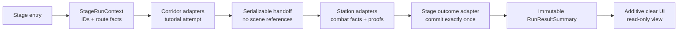

# Stage Run and Result Contract Spec

## Status

- Drafted: 2026-07-13
- Status: provisional review contract; analysis only
- Implementation gate: the full cross-scene probe passed at 2026-07-14 11:10 after the 10:47 tutorial-director write and 10:59 Station save, but Station was saved again at 11:15:21; the Corridor scene was later saved at 14:21 and its tutorial PlayMode test source at 13:33. The full and 10:38 natural reports are therefore both stale, while actual retry-to-Corridor and lobby execution remain missing. P1-A stays closed until P0 refreshes both probes, retains one current product terminal surface, and executes both buttons; P0 need not implement the future committed-outcome coordinator or typed executor
- Roadmap source: `SUBCULTURE_DATASET_GAP_ROADMAP.md`, P1-A
- Route/identity companion: `PLAYABLE_STAGE_REFERENCE_SPINE_SPEC.md`, P1-B
- Later encounter-lifecycle companion: [Ordered Encounter Execution Bridge Spec](ORDERED_ENCOUNTER_EXECUTION_BRIDGE_SPEC.md), P1-C; its new snapshot/gate/quiescence fields apply only when that later schema is admitted
- Later mastery/progress companion: [Typed Mastery and Progress Application Spec](TYPED_MASTERY_PROGRESS_APPLICATION_SPEC.md), P1-D; it adds entry-time objective/progression identity, pre-commit evaluation, and the clear-only durable intent/application barrier for its new run-schema cohort
- Later tutorial companion: [Tutorial Lesson, Attempt, and Gameplay Reset Spec](TUTORIAL_LESSON_ATTEMPT_RESET_SPEC.md), P1-E; it adds ordered immutable lesson-attempt facts only for its new schema cohort while preserving the P1-A whole-tutorial summary and pre-load seal
- Later variability companion: [Stage Rule, Modifier, and Enemy Variant Spec](STAGE_RULE_MODIFIER_ENEMY_VARIANT_SPEC.md), P2-A; its new snapshot/provenance/quiescence fields apply only when that later schema is admitted
- Later course-chain companion: [Tutorial Course Lesson Chain Spec](TUTORIAL_COURSE_LESSON_CHAIN_SPEC.md), P2-B; its run-scoped snapshot, traversal coverage, and quiescence fields apply only to that later schema cohort
- Product decision companion: [P1 Product Decision Packet](P1_PRODUCT_DECISION_PACKET.md); it recommends identity values, `Clear -> Replay + Lobby`, `Fail -> Retry + Lobby`, an outcome-aware shared result shell, and same-terminal-epoch Clear-wins arbitration. Planning approval may occur during P0, but implementation freeze and P1-A entry remain behind the P0 gate
- Shared preflight: P1-0 must explicitly approve the proposed `playableStageId`, `routeRevision`, Corridor/Station segment IDs, typed Replay/Retry/Lobby actions, their clear/fail availability, and the terminal resolution policy, then create the final `PlayableStageDefinition` in a minimal route-shell phase with resolvable Corridor and Station definitions before P1-A code. These are not current production fields, and P1-A may not substitute constants or scene strings while waiting for P1-B-only joins
- Canonical route snapshot: `OlympusCorridorInvasionStage -> OlympusStationCombatStage -> UI_StageClear`

This document defines the smallest truthful stage-wide run/result boundary. It does not authorize progression, reward payout, ranking, analytics upload, or tutorial refactoring.

## Problem

The current logical stage spans two single-load combat scenes:

1. Corridor owns intro and the event-validated combat tutorial.
2. Corridor releases movement and virtual-joystick ownership, then loads Station.
3. Station owns a gated replica/summon guide, player and boss combatants, the canonical encounter, and boss HUD.
4. Boss death marks `CombatEncounterController` won; `OlympusStationCombatResultPresenter` observes `Won` and opens `UI_StageClear` additively.
5. The additive clear UI is configured to retry Corridor, while the enabled Station review HUD currently reloads Station; the desired canonical retry is Corridor but executable parity is not yet proven.

The current components can prove local behavior, but no production contract preserves one run ID, stage identity, elapsed time, tutorial attempt, combat facts, and outcome across the single-load boundary. UI must not become that owner.

## Decision

Add one run-lifetime context and scene-local adapters:



The context is a one-run handoff object. It is not a permanent `GameManager`, service locator, save system, reward ledger, or scene router.

## Ownership

| Owner | May own | Must not own |
|---|---|---|
| P1-0 `PlayableStageDefinition` route shell | stage ID/revision, ordered Corridor/Station definition refs, route conditions/policies, typed actions and allowed outcomes | live scene objects, counters, reward state, copied scene strings, P1-B-only content joins |
| `StageRunContext` | run identity, current segment, elapsed accumulators, immutable fact builder, lifecycle state | transforms, cameras, input controllers, combat execution, persistent progression |
| Scene-local fact adapter | subscriptions to authoritative components in its loaded scene | cross-scene singleton state, UI copy, mastery decisions |
| Later P1-C encounter adapter | one run-admission static-plan identity, scene-local execution generation, required local-gate command, and quiescence registration | run ID creation, terminal outcome, result commit, progression, reward, navigation |
| Station terminal-resolution coordinator and outcome adapter | pre-mutation root admission and causal sequencing, active-token allocation, exclusive queued terminal-state mutation for bound Player/Boss subjects, synchronous coordinator/finalization lifecycle, approved clear/fail arbitration, exactly-once result commit request | reward grant, scene navigation, optional proof invention, rendered-frame/timer/health-callback/subscriber-order policy |
| Run lifecycle/abort recorder | one immutable diagnostic abort record for failed handoff, abandon, or unexpected exit | product `RunResultSummary`, clear/fail presentation, progression, reward |
| Mastery evaluator (P1-D) | pure evaluation of immutable facts against typed objectives | event subscriptions, UI mutation, reward grant |
| Product result presenter | formatted display of a committed summary and its offered route actions | counters, combat subscriptions, result mutation, persistence, payout |

## Provisional Data Contracts

Names are review vocabulary, not final C# API names.

### `StageRunIdentity`

- `schemaVersion`
- `runId`
- `playableStageId`
- `routeRevision`
- `routeSnapshotDigest`
- `entrySegmentId`
- optional `stageTemplateId`, unresolved in the P1-A-first schema

Rules:

- `runId` is generated once at logical stage entry.
- `playableStageId` is not a scene name and does not change at the Corridor-to-Station handoff.
- scene name/path is resolved from an ordered route contract, not inferred from stage-ID ordering.
- Replay and Retry create a new `runId`; neither reopens the old mutable context.
- `routeSnapshotDigest` identifies the full immutable `StageRunRouteSnapshot` captured at entry. The run owner validates the loaded Station scene and resolves Replay/Retry from that snapshot rather than strings or the latest asset. The P1-A-first schema leaves only P1-B content joins such as the template explicitly unresolved. P1-B fills the same asset for new-schema runs and fails any differing identity, order, scene, action, or outcome policy; it never mutates or backfills an active or committed run snapshot.

P1-0 currently recommends `playableStageId = OLYMPUS-INVASION-01`, `routeRevision = 1`, and the ordered segment IDs `corridor_intro_tutorial`, `station_entry_combat`. These are new contract proposals and remain review values until explicit product approval; production code must not substitute UI row IDs or scene names. P1-0 also authors the missing Station definition and explicit action outcome policy: `olympus-invasion.replay` is Clear-only `Replay` to Corridor, `olympus-invasion.retry` is Fail-only `Retry` to Corridor, and `olympus-invasion.to-lobby` is a Clear/Fail `UIRoute` to Lobby. Re-entry cannot be parity-frozen while the enabled Station review HUD still reloads Station.

### `StageRunRouteSnapshot`

- `schemaVersion`
- `playableStageId`
- `routeRevision`
- ordered immutable segment records: `segmentId`, sequence index, `stageDefinitionId`, resolved stable scene identity, entry/exit condition IDs, and handoff policy
- immutable action records: `actionId`, kind, target playable-stage ID or typed UI route, `allowedOutcomes`, and resolved Replay/Retry entry segment/definition/scene identity when applicable
- immutable terminal resolution policy: arbitration window, coordinator and canonical root-admission kind, pre-mutation root-order source, active root boundary, terminal-subject roles, exclusive terminal-state coverage, work rule `SynchronousNonYieldingResolution`, nested/independent-root rules, epoch stamp, coordinator/token lifecycle, finalization handshake, close barrier, simultaneous outcome, and candidate/final-state requirements
- `coreRouteSemanticDigest` over only the P1-0/P1-B route core above, excluding every P1-C encounter plan, P2-A variability snapshot, P2-B course snapshot, and final digest
- optional in the later P1-C schema: the fixed spine-order `EncounterStaticPlanSnapshot` collection and encounter/gate digests
- optional in the later P2-A schema: one complete `StageVariabilityPlanSnapshot` and its semantic digest/cohort identities; the sole `ResolvedActiveRunRestartPolicy` and entry target live only inside that nested snapshot
- optional in the later P2-B schema: one complete `TutorialCoursePlanSnapshot`, its semantic digest, and exact three-entry cohort identities
- `canonicalDigest`

The run owner deep-copies this snapshot from the P1-0 route shell at logical entry; no Unity object, mutable asset reference, or copied UI string survives. Digest construction follows one strict DAG: (1) `coreRouteSemanticDigest`; (2) fixed-order P1-C encounter-plan/gate digests, each binding only the core; (3) optional P2-A semantic digest binding the core plus exact P1-C identities/digests; (4) optional P2-B course semantic digest binding the core plus exact P1-C and P2-A identities/digests; and (5) final `canonicalDigest` over the core and every present layer in that order, with typed absence for a missing layer. A later layer may reference earlier-layer digests, never the final digest or a later-layer digest. Handoff validation, terminal arbitration, offered actions, result re-entry resolution, active-run restart, course transitions, and stale-UI checks use only this snapshot. Editing the source asset later cannot reinterpret an active or committed run.

For a new-schema cohort, snapshot acceptance and admitted-owner registration are one atomic pre-active transaction. It creates every required barrier context, the P2-B course session, fixed P1-C binding reservations/latches, P2-A acquire-or-close latch, and presentation adapter genesis generation before `Created` may enter an externally active state. A partial failure rolls all of them back while the context is still unexposed; it cannot create a run that needs closure yet lacks a session-bearing success/fault arm. Once exposed, every admitted owner must close through the fixed coverage table.

### Later P1-C snapshot, gate, and quiescence extension

The P1-A-first schema does not invent encounter execution. When P1-C is later admitted, a new route-snapshot schema first computes `coreRouteSemanticDigest`, then deep-copies each production `EncounterExecutionBinding`, sequence/payload-mapping revision, required local-gate ID, ordered group/spawn static plan, and canonical encounter digest at the same logical Corridor entry. Every encounter plan binds only that core digest plus its own P1-C semantics and stable host IDs/revisions; it includes no P2-A or P2-B semantic digest and never the final route digest. The P1-C layer is then available to the later P2-A/P2-B layers and final digest in the fixed DAG above. Admission creates fixed-order binding-scoped canonical reservations before local scene scripts start; sequential bindings may share a scene/domain but can never overlap active leases. Station may bind live anchors/factories only after their current IDs/revisions/digests match that entry snapshot; it cannot read newer authoring into the active run.

The P1-C adapter owns execution, but `StageRunContext` keeps each snapshotted required encounter gate in `Pending` or `Satisfied` state. One current-run/current-execution-generation `EncounterGateSatisfied` command may compare-and-set it once. The CAS precedes sequence acknowledgement and local-phase activation; callbacks raised synchronously while opening that phase are queued until the transaction returns and therefore observe `Satisfied`. A stale/duplicate/foreign gate command has no side effect, and a local-phase-open failure after CAS enters the common abort-closing path before queued terminal work can commit. A Clear commit request while any required gate remains pending is rejected as invalid evidence and enters the same path; the final abort record is sealed only after admitted closure results are known. The gate command itself never creates Clear/Fail or result facts. Fail/abort may cancel an unfinished encounter without satisfying the gate.

P1-C also registers one idempotent `EncounterExecutionQuiescenceBarrier`. When the terminal arm wins the shared latch, P1-A first seals `TerminalFinalizationAuthority`, requests P1-C `RunFinalization`, and requires that receipt before `OutcomeFactsSealed`; this freezes/cleans the execution only after the terminal coordinator has captured both subject snapshots and the remaining fact collectors have received immutable source records. Every terminal action and active-run restart likewise seals its immutable authority/dispatch-selection record first, requests encounter cancellation/disposal, and waits until pending work, owned full/partial objects, subscriptions, reservations, and the scene ownership lease are all zero/released. Every admitted non-`Disposed` state participates; validation/ready/completing and cancelling/faulting drains cannot report quiescent early. A terminal action revalidates the already sealed terminal-path receipt when no higher P1-C generation exists. Only successful action/restart closure may dispose and dispatch. A barrier timeout/fault before result publication enters `ClosureFaulted`; after a committed result/action it leaves the context presented with dispatch blocked by the separate closure-fault diagnostic.

### Later P2-A snapshot and quiescence extension

For a newly admitted P2-A schema, logical entry deep-copies the complete `StageVariabilityPlanSnapshot`: rule dispositions and typed params, canonical zero-or-one modifier array, canonical `None` or one versioned binding-set with scoped-key variant identities/composition, sole `ResolvedActiveRunRestartPolicy`, configuration/adapter capability-manifest revision, and separate semantic/presentation digests. That snapshot binds `coreRouteSemanticDigest` plus the exact fixed-order P1-C plan/gate identities and digests or typed absence; it contains no P2-B course or final route digest. The final canonical route digest later includes `stageVariabilitySemanticDigest`. Presentation-only churn remains outside route/result semantics. `RunResultSummary` may preserve the semantic digest and stable cohort IDs as provenance, but P1-A never infers compliance, mastery, or outcome from their names.

P2-A registers one idempotent `StageVariabilityQuiescenceBarrier`. For Clear/Fail, P1-A first seals `OutcomeFactsSealed`; after any P1-D evaluation it enters `VariabilityClosing`, awaits P2-A release/configuration receipts, and reaches `VariabilitySealed` before `CommitRequested`. A closure fault instead enters `AbortClosing`, seals one evidence-complete diagnostic abort after closure results are known, enters `ClosureFaulted`, and publishes no product result or disposal claim.

Active restart wins the shared terminal-or-restart latch and seals its immutable dispatch record first, enters `RestartClosing`, awaits every admitted P1-E/course, P1-C, P2-A, and P2-B presentation barrier, and only then seals the one abort record with success receipts or fault evidence. Success disposes and performs the actual dispatch; failure enters `ClosureFaulted` without either. Post-commit terminal actions revalidate the already sealed P2-A/course barriers while awaiting their other admitted barriers; a newly detected integrity fault preserves the result, creates a separate dispatch-fault record, blocks navigation, and never reopens action/restart selection.

### Later P2-B course snapshot and quiescence extension

For a newly admitted P2-B course schema, logical entry deep-copies exactly one active, strict-linear `TutorialCoursePlanSnapshot` with Basic, Practice, and Challenge bindings plus their P1-E/P1-C/P1-D/P2-A/P2-B identities, revisions, capabilities, and semantic digests. The course semantic digest binds `coreRouteSemanticDigest`, the exact fixed-order P1-C layer, and the exact P2-A semantic digest or typed absence; the final route digest then includes the course digest. The course never enters an earlier-layer or final digest. No mutable progress, runtime generation, reward, or Unity reference enters the snapshot.

P2-B registers a distinct `TutorialCourseQuiescenceBarrier`, while the presentation adapter registers one run-level `StagePresentationQuiescenceBarrier`. The course barrier covers only course/entry generations, transition selections, continuation reservations, traversal coverage, and course-owned tokens. It never claims P1-C objects, P2-A configuration work, P1-E gameplay ledger work, or presentation resources. The presentation barrier returns one `StagePresentationQuiescenceReceipt` aggregating every per-request `StagePresentationResult` in request-admission order, including an explicit successful no-request arm; it never treats a single request result as run-level closure. On Challenge terminal, the latch-winning `TerminalFinalizationAuthority` authorizes course traversal/continuation quiescence and the current-generation presentation aggregate before `OutcomeFactsSealed`; P1-A still owns outcome and P1-D still owns mastery. Active restart and pre-commit abort await every admitted barrier independently. Post-commit actions revalidate the current presentation receipt-chain head; if a selected action authorizes a later Exit presentation, P1-A opens one higher adapter generation from that head and awaits its newly chained receipt before dispatch. A newly detected fault preserves the result and blocks dispatch through `StageDispatchClosureFaultRecord`.

### `StageSceneSegmentState`

- `segmentId`
- `segmentSequenceIndex`
- `entered`
- `completed`
- `exitReason`
- `activeElapsedSeconds`

Initial segment vocabulary:

- `corridor_intro_tutorial`
- `station_entry_combat`
- the clear UI is not a combat segment

### `TutorialAttemptFact`

Common fields:

- runtime-issued `tutorialFactId`
- `factScope`: `TutorialRouteSummary` or `LessonAttempt`
- `attemptState`: completed, failed, skipped, cancelled, or interrupted
- closed `terminationReason`
- exact `proofDisposition = Proved(proofId, typed value, qualified attribution) | NoProof(reason, typed absence of proof/value/attribution)`; lesson rows copy the exact P1-E outcome arm
- exact `observationElapsed = None | Milliseconds(nonnegative integer)`
- `segmentId`
- canonical `tutorialAttemptFactDigest`

The first P1-A slice may emit one `TutorialRouteSummary` fact only. P1-E adds, for its new schema cohort, `lessonPlanId` and semantic digest, stable `lessonId`/revision, `attemptId`/ordinal/generation, `tutorialEvaluationSnapshotDigest`, collector-coverage digest, and the gameplay-disposition digest from an immutable closed attempt result. `tutorialAttemptFactDigest` covers the fact ID/scope/state/reason, complete proof and elapsed arms, segment, and all P1-E provenance when present; it excludes presentation metadata and envelope checksums. Lesson facts are ordered by snapshotted plan ordinal plus attempt ordinal, not callback order.

The route summary carries canonical `TutorialFactCoverage[]` in plan ordinal. Each row is `LegacyOpaque(planOrdinal, lessonId, NoResultExpected)` or `Instrumented(planOrdinal, lessonId, ResultAdapter | TypedEvaluator, nonempty ordered AttemptCoverage[])`. Each attempt row contains exact attempt ID/ordinal/generation, `TutorialAttemptResult` ID/canonical digest, and `TutorialAttemptFact` ID/canonical digest; rows order by attempt ordinal and must exhaust every admitted attempt including retries. Duplicate/missing attempt ordinals or mismatched result/fact provenance fault the Corridor seal. Typed empty attempt coverage is legal only for `LegacyOpaque`; it is not learner failure or observed zero. The route summary stores canonical `tutorialFactCoverageDigest` over every arm/ref/typed absence, and its own fact digest includes that coverage digest.

Lesson-level facts must not be fabricated from prompt text, enum names, `LastCompletionRecord`, or scene state after unload. Already committed P1-A/P1-D summaries are never backfilled. A route-summary row and its ordered lesson rows are separate scopes and must not be double-counted.

### `CombatRunFacts`

- resolved hostile `playerDamageTaken`
- `playerDownCount`
- `perfectDodgeCount`
- normalized summon-use records: monotonic run-local `summonAdmissionSequence`, slot/role ID, spent tier, and segment timestamp; canonical order is ascending admission sequence
- semantic encounter proofs
- optional `forwardRiskSeconds`
- optional literal `structureBreakCount`

Do not equate summon use with correct summon answer. Do not equate boss-pressure suppression with a literal structure break.

### `SemanticProofFact`

- `proofId`
- `sourceKind`
- `count`
- `actualValue`
- canonical nonnegative integer `firstObservedSegmentMilliseconds`
- `qualified`

The first-observed value is converted once from the same stable segment-clock tick domain with the run's overflow-safe integer millisecond rule before `OutcomeFactsSealed`; P1-D never converts a float-seconds field or rounds it again.

Initial candidate proof IDs:

- `summon.pressure_block`
- `summon.followup_hit`
- `summon.counter_recovery`
- `survival.no_player_down`
- `movement.forward_risk_time`

Proof IDs are stable data vocabulary. Player-facing result copy is resolved later and is never parsed to recover proof.

### `StageOutcomeFact`

- exact `outcomeDisposition = Clear(BossTerminal | ApprovedSimultaneousTerminal, typed absence of failureReason) | Fail(PlayerTerminal, required typed failureReason)`
- `outcomeSegmentId`
- `rootAdmissionSequence`
- `terminalEpochSequence`
- canonical nonnegative integer `totalActiveElapsedMilliseconds`
- canonical nonnegative integer `combatActiveElapsedMilliseconds`
- `outcomeFactsSealedAtSequence`
- canonical `stageOutcomeFactDigest`

`stageOutcomeFactDigest` covers the complete outcome-disposition arm including typed failure absence/presence, segment/root/epoch provenance, both elapsed values, and `outcomeFactsSealedAtSequence`; it excludes presentation metadata and every envelope checksum. A system/integrity/closure failure is diagnostic abort, not an invented Fail arm. The fact freezes at `OutcomeFactsSealed`, before mastery, variability closure, or summary commit. For the current route, canonical clear originates from Station encounter win/boss death before the stage-clear overlay opens. `BossBarrageEncounterController.RouteResultRecord` is an optional proof adapter only when it actually commits; it is not the stage outcome.

### `StageRunAbortCloseAuthority`

- runtime-issued `abortCloseAuthorityId`
- run/stage/route revision and route-snapshot digest
- `origin = DiagnosticAbort | TerminalFinalizationFailure`
- abort reason and lifecycle state that entered `AbortClosing`
- optional upstream `TerminalFinalizationAuthority` ID/canonical digest, required only for `TerminalFinalizationFailure`
- terminal-coordinator invalidation disposition and sequence
- issued sequence, canonical `abortCloseAuthorityDigest`, and envelope checksum

P1-A alone seals this authority after `AbortClosing` wins and before asking any still-open owner to close. It carries no owner receipt, result, progression, reward, or dispatch field, so the later `StageRunAbortRecord` may reference it without a digest cycle. Its canonical digest covers the exact fields above and typed absence while excluding the envelope checksum. Active restart uses its already sealed `ResolvedActiveRunRestartDispatch` instead; post-result action disposal uses `ResolvedTerminalActionSelection` and never this pre-commit authority.

### `StageRunAbortRecord`

- `schemaVersion`
- `runId`
- `playableStageId`
- `routeRevision`
- `lastLifecycleState`
- optional terminal-coordinator state, root-admission sequence, and epoch
- `abortReason`
- optional accepted active-restart `restartDispatchId` and canonical `restartDispatchDigest`; both are present together only when the abort closes a previously sealed `ResolvedActiveRunRestartDispatch`
- optional P1-A `abortCloseAuthorityId` and canonical `abortCloseAuthorityDigest`; both are present together exactly when a `StageRunAbortCloseAuthority` was issued, and remain typed absent for the active-restart arm
- required `routeHandoffCoverage = NotIssued | Succeeded(StageSegmentHandoffTerminalReceipt ID/canonical digest) | Failed(StageSegmentHandoffClosureFaultEvidence ID/canonical digest)`; `NotIssued` is legal only when no transition token/loader generation was ever issued
- required `outcomeFactCoverage = NotSealedBeforeAbort | SealedDiagnosticOnly(stageOutcomeFactDigest, outcomeFactsSealedAtSequence)`; the sealed arm is legal only when terminal finalization had already reached `OutcomeFactsSealed` before a later mastery/P2-A/pre-commit fault, and it never authorizes a product summary
- required canonical `closureBarrierCoverage[]` in fixed owner order: P1-E lesson, P2-B course, P1-C execution, P2-A variability, P2-B presentation. Each row contains owner kind, `Succeeded | Failed | NotAdmitted | NotApplicable`, and exactly one matching success receipt type/ID/canonical digest, failure-evidence type/runtime ID/canonical digest, or typed absence
- canonical `aggregateClosureDigest`
- optional P1-E `tutorialLessonQuiescenceFaultEvidence`: exact runtime evidence ID/digest, scene-reference-free run/plan close identity, exact lesson-close authority or fault-only `AuthorityUnavailable`, failed P1-E boundary, course-lease/work state, fixed typed partial receipt refs, and optional exact nested `TutorialAttemptClosureFaultEvidence` ID/digest when an attempt existed
- optional P1-C `encounterExecutionClosureFaultEvidence`: exact runtime evidence ID/digest, host/run, `Issued | NotIssuedBeforeClose` execution provenance, fixed binding/reservation/latch coverage, optional typed course-close context, exact close authority, failed boundary, canonically ordered pending identities, terminal/retained reservation facts, and fixed typed partial receipt refs
- optional P2-A `stageVariabilityClosureFaultEvidence`: exact runtime evidence ID/digest, scene-reference-free run and `Issued | NotIssuedBeforeFault` execution identity, exact close-command/authority/latch/course-context provenance, failed boundary, fixed source/domain rows plus configuration-result rows with exact typed receipt refs or pending states, and canonically ordered residual validation/token/callback/timer evidence
- optional P2-B `tutorialCourseClosureFaultEvidence`: exact runtime evidence ID/digest, frozen course/session plus exact three-arm close context, close authority, last sealed selection/transition or typed absence, failed boundary/watchdog, ordered pending IDs, and fixed typed latest-transition owner-evidence slots rather than independent run-level barrier receipts
- optional P2-B `stagePresentationQuiescenceFaultEvidence`: exact runtime aggregate-evidence ID/digest, run/route adapter-generation snapshot/purpose/prior-head and close-authority provenance, fixed expected-slot coverage plus admission-ordered request result/fault/pending coverage, exact nested per-request presentation closure-fault IDs/digests, and canonically ordered residual request/work/domain/token identities
- optional P1-A `stageSegmentHandoffClosureFaultEvidence`: exact runtime evidence ID/digest, run/route/token/loader generation and close authority, failed boundary, registration-ordered pending callback IDs, observed load state, and fault sequence; required iff `routeHandoffCoverage = Failed` and otherwise typed absent
- `abortedAtSequence`
- canonical `abortRecordDigest`
- abort-record envelope checksum

`aggregateClosureDigest` covers the run, optional restart-dispatch identity, optional abort-close authority, the route-handoff row, and all five owner rows in that fixed order, including typed absence and exact canonical evidence refs; it excludes every constituent envelope checksum. A failed handoff row must match the attached full handoff fault evidence digest. No row may be omitted, reordered, or inferred from an absent attachment. `NotAdmitted` is legal only when the immutable entry snapshot lacks that owner contract. `NotApplicable` is legal only when an admitted contract explicitly permits no runtime instance for this closure and validation proves that it acquired no work/token; P1-E before attempt creation instead returns its typed `NoAttemptStarted` success receipt. `abortRecordDigest` covers the record identity/reason/lifecycle, optional dispatch/abort-close authority, exact outcome-fact coverage arm, aggregate digest, exact failure-attachment canonical digests, and abort sequence; it excludes the abort-record and constituent envelope checksums.

The fixed success receipt types are P1-E `TutorialLessonQuiescenceReceipt`, P2-B course `TutorialCourseQuiescenceReceipt`, P1-C `EncounterExecutionQuiescenceReceipt(closureScope=RunFinalization)` including its explicit no-execution arm, P2-A `StageVariabilityQuiescenceReceipt` including its closed-without-acquisition arm, and P2-B presentation `StagePresentationQuiescenceReceipt` including its no-request arm. A prior P1-C `EntryTransition` receipt cannot satisfy the run-level row. Presentation failure references `presentationQuiescenceFaultDigest`; a per-request `presentationClosureFaultDigest` may appear only nested inside that aggregate evidence. A raw `StagePresentationResult` never satisfies the run-level row.

Abort is a lifecycle diagnostic, not a product outcome. Failed handoff, abandon, unexpected route exit, invalid route source, or active restart first invalidates old terminal authority and enters `AbortClosing`/`RestartClosing` when admitted owners must close. The run seals at most one immutable abort record only after the route-handoff and owner closure receipts/fault evidence are known. If route handoff is `NotIssued`/`Succeeded`, every admitted owner row is `Succeeded`, `NotAdmitted`, or valid `NotApplicable`, and no row is `Failed`, it follows `Aborted -> Disposed`; a failed handoff or any admitted timeout/fault instead follows `Aborted -> ClosureFaulted`. `ClosureFaulted` is terminal, non-dispatchable quarantine: it admits no gameplay, outcome, result action, navigation, or new run, is never reported as disposed, and retains only the ownership/evidence needed for explicit recovery without guessing a global reset. Revision 1 defines no automatic recovery or dispatch from this state. Neither branch creates or commits a product `RunResultSummary`, result presentation, progression, or reward input. An abort before `OutcomeFactsSealed` records `NotSealedBeforeAbort`; a mastery/P2-A/pre-commit fault afterward preserves the already immutable `StageOutcomeFact` only through `SealedDiagnosticOnly` in the aborted context and cannot publish it as a product result. A P1-E closure fault after its outcome CAS likewise retains that immutable learner outcome only inside the optional diagnostic attachment; it does not publish a closed `TutorialAttemptFact`, rewrite the outcome to Interrupted, or become product input.

### `StageDispatchClosureFaultRecord`

This summary-external diagnostic is allowed only after a product result is immutable. It contains runtime-issued record ID, run/result-summary digest, sealed terminal-action selection ID/digest, failed barrier/domain, the same fixed owner-ordered `closureBarrierCoverage[]` shape with exact success receipt or failure-evidence refs/typed absence, frozen route/variability/course digests, fault sequence, canonical `dispatchClosureFaultDigest`, and envelope checksum. The canonical digest covers those exact fields including every row and typed absence while excluding constituent/full-envelope checksums. It cannot change `RunResultSummary`, create `StageRunAbortRecord`, clear the selected action, authorize an alternate action, mutate progression/reward, or dispatch navigation. Pre-result active restart cannot create this record; its closure evidence belongs to the one later-sealed `StageRunAbortRecord`.

### P1-D companion: `MasteryObjectiveResult`

- permanent `objectiveId`
- objective kind and semantic digest
- `evaluationState`: achieved, not-achieved, or invalid-definition
- typed actual/target values with Boolean, Count, Milliseconds, or SemanticProofCount value kind
- contributing qualified semantic `proofIds`

[Typed Mastery and Progress Application Spec](TYPED_MASTERY_PROGRESS_APPLICATION_SPEC.md) owns the complete P1-D contract. A P1-D-capable run deep-snapshots the result definition, progression-node binding, objective semantics, required fact capabilities, and digests at entry. Evaluation is pure and occurs after the authoritative outcome/fact candidate and complete collector coverage are sealed, but before the final result digest and `CommitRequested`. The first typed objective kinds remain:

- `ClearStage`
- `ClearUnderTime`
- `NoPlayerDown`
- `PerfectDodgeCount`
- `UseSummonForNeed`

P1-A does not run this evaluator. Its committed summary records `masteryEvaluationState = NotEvaluated` and an empty mastery-result list forever; it cannot be reopened or backfilled from newer authoring. A successfully admitted P1-D run must finish `Evaluated` or bundle-level `InvalidDefinition` and cannot silently downgrade to `NotEvaluated`. First-slice objectives are `ClearOnly`: Fail produces evaluated not-achieved rows but no persistent application. An invalid bundle never changes Clear to Fail, but persists no mastery IDs. Wrong-run/digest input, missing required collector coverage, malformed facts, or evaluator exceptions are pre-publication integrity faults rather than not-achieved objectives.

### `RunResultSummary`

- `StageRunIdentity identity`
- immutable `StageRunRouteSnapshot routeSnapshot`
- `StageOutcomeFact outcome`
- immutable segment results
- immutable tutorial attempt facts
- immutable combat facts
- immutable semantic proof facts
- for P1-D-schema runs, immutable semantic `evaluationSnapshotDigest` plus a separate presentation snapshot/digest captured at entry
- for P2-A-schema runs, immutable `stageVariabilitySemanticDigest` plus stable rule/modifier/binding-set/binding/variant cohort IDs or typed absence as provenance
- for P2-B course-schema runs, immutable course ID/revision/semantic digest plus ordered `TutorialCourseTraversalFact` coverage as provenance
- `masteryEvaluationState`: `NotEvaluated`, `Evaluated`, or `InvalidDefinition`
- optional immutable mastery results; empty while P1-A is the latest implemented slice
- resolved offered terminal action IDs allowed for the committed outcome

The summary contains facts and, only after P1-D exists, evaluated objectives. It never contains granted rewards, mutable progression state, or a course-complete flag. The semantic `resultSummaryDigest` covers `evaluationSnapshotDigest`, aggregate mastery state, canonical ordinal objective rows, values, proof IDs, other authoritative run facts, and the later P2-A variability and P2-B course/traversal semantic provenance when present. That provenance does not prove that a recommendation was followed, a modifier/variant caused success, or the exact course mastery objective was achieved. The digest excludes localization/visibility/display order, presentation snapshot digests, audit-only definition/set revisions, and unrelated global-manifest churn; a separate envelope checksum may protect the complete UI payload. Offered route action IDs are immutable outcome-filtered snapshots from the P1-0 `PlayableStageDefinition` route shell; P1-B later fills content joins on that same asset rather than replacing its route source.

### `RunResultCommitReceipt`

The immutable summary candidate and its semantic `resultSummaryDigest` are complete before `CommitRequested`; an actual commit sequence is therefore not a field of `StageOutcomeFact` and cannot be patched into that digest afterward. The one P1-A commit compare-and-set atomically enters `Committed` and seals a scene-reference-free receipt containing runtime-issued `resultCommitReceiptId`, run/stage/route identity and route digest, exact final `resultSummaryDigest`, prior/final lifecycle states `CommitRequested -> Committed`, `progressIntentDisposition = NotRequired | Prepared(exact run/node/result digest, preparation generation, input fingerprint)`, `summaryCommittedAtSequence`, canonical `resultCommitReceiptDigest`, and envelope checksum. Its canonical digest covers those exact fields and typed absence while excluding the envelope checksum. `summaryCommittedAtSequence` is audit/lifecycle evidence outside `resultSummaryDigest`; an exact duplicate returns the first receipt, while a mismatched duplicate is an integrity fault and cannot alter the summary.

P1-A does not freeze progression or reward authoring. Before P2-C can settle a new run, a later result-schema revision must reference or embed the serializable `StageSettlementAuthoringSnapshot` defined by [Stage Progression and Reward Transaction Spec](STAGE_PROGRESSION_REWARD_TRANSACTION_SPEC.md): progression node/graph, semantic P1-D evaluation identity, and reward-plan identity/digests captured at logical stage entry, with presentation/audit metadata kept outside settlement eligibility. That snapshot is immutable authoring identity, not eligibility or a grant. A P1-A-only summary without it cannot be reinterpreted against the newest plan; any historical/backfill handling requires the explicit P2-C migration policy.

### `ResultActionPresentation`

- committed `outcome`
- `actionId`
- localized `labelKey`
- `role`: primary or secondary
- `displayOrder`

This is view metadata keyed to an already offered action, not route semantics and not part of `RunResultSummary`. It cannot create or enable an action. P1-A's shared result view consumes one profile containing the first Clear/Fail mappings; P1-B's result-definition join later references that same profile and validates every offered action/outcome pair without copying action targets. Missing, duplicate, or unknown mappings disable the affected control and report a diagnostic. Label, role, or order changes do not bump route revision; action ID, target, kind, or `allowedOutcomes` changes do.

### `ResolvedTerminalActionSelection`

- runtime-issued `terminalActionSelectionId`
- `runId`
- `routeRevision`
- `routeSnapshotDigest`
- `actionId`
- `kind`
- optional `targetPlayableStageId`
- optional resolved Replay/Retry `entrySegmentId`, `stageDefinitionId`, and stable scene identity
- optional typed `uiRouteId`
- `selectedAtSequence`
- canonical `terminalActionSelectionDigest`
- selection-envelope checksum

This immutable selection is also the complete dispatch payload and lives outside `RunResultSummary`; selecting an action is lifecycle state, not a mutation of committed facts. One compare-and-set operation resolves exactly one offered/allowed action from the run's immutable route snapshot and seals its kind and target before quiescence/disposal. `terminalActionSelectionDigest` canonically covers the selection ID, run/route identity, action ID/kind, resolved target, and selection sequence; the checksum protects the full envelope. It never looks up the current `PlayableStageDefinition` by action ID. Double-clicks, competing Replay/Retry/Lobby inputs, stale UI, and mismatched revision/digest are rejected. An unresolvable action is rejected before selection; P1-C/P2-A/P2-B quiescence, dispatch, or scene-load failure after selection is diagnostic and does not clear the latch or permit another action. Replay or Retry creates a new run only after successful Corridor entry.

### `RootResolutionToken`

- runtime-issued `rootResolutionTokenId`
- run/stage/route revision and route-snapshot digest
- root-admission sequence and positive terminal-epoch sequence
- token generation and opened sequence
- canonical `rootResolutionTokenDigest`
- envelope checksum

The canonical digest covers those exact fields and excludes the checksum. Only the active coordinator row may validate it; invalidation is monotonic and no token may be reused by another root, epoch, run, deferred callback, or later frame.

### `TerminalSubjectFinalSnapshot`

- runtime-issued `terminalSubjectFinalSnapshotId`
- run/stage/route, root-admission sequence, terminal epoch, and exact `RootResolutionToken` ID/canonical digest
- fixed subject role `Player | Boss`, stable subject-binding ID, and binding generation
- canonical current/max health values plus `Alive | Down | Dead` state
- closed terminal-candidate state `None | PlayerTerminal | BossTerminal` and exact accepted candidate sequence or typed absence
- synchronous snapshot sequence, canonical `terminalSubjectFinalSnapshotDigest`, and envelope checksum

Each bound adapter returns exactly one snapshot synchronously during `Finalizing`, including an untouched subject. The canonical digest covers those exact semantic fields and typed absence while excluding Unity references, presentation metadata, and the checksum. Coverage order is always Player then Boss; duplicate roles/bindings or mismatched token/epoch fault.

### `TerminalEpochClosureRecord`

- runtime-issued `terminalEpochClosureRecordId`
- run/stage/route revision and route-snapshot digest
- root-admission sequence, terminal epoch, and exact active `RootResolutionToken` ID/canonical digest
- fixed Player-then-Boss `TerminalSubjectFinalSnapshot` IDs/canonical digests
- canonical terminal-candidate coverage in active-queue order; each row carries intra-root queue sequence, producer/cause identity, subject role, typed candidate kind, exact token ID/digest, observed canonical current/max health plus `Alive | Down | Dead` state and observation sequence, and candidate/final-snapshot agreement disposition
- applied arbitration-policy identity/digest and resolved `ClearCandidate | FailCandidate`
- invalidated active-token ID/digest plus discarded higher pending-admission coverage ordered by ascending root-admission sequence; each row carries root-admission sequence, producer/cause identity, typed `NoTokenIssued`, and discard disposition
- `TerminalClosed` sequence
- canonical `terminalEpochClosureDigest`
- envelope checksum

Only `QueueDrainedAndSubjectsFinalized` may seal this record. Candidate rows use authoritative intra-root queue sequence and pending-admission rows use ascending root-admission sequence, never callback/container arrival; duplicate or missing sequences fault. The canonical digest covers the run/route/root/epoch/token provenance, fixed subject snapshots, ordered typed candidate/agreement coverage, arbitration result, active-token invalidation, complete pending-admission discard coverage, and terminal-close sequence while excluding the envelope checksum and presentation metadata. It is immutable terminal-coordinator evidence, not a product `StageOutcomeFact` or committed result.

### `TerminalFinalizationAuthority`

- runtime-issued `terminalFinalizationAuthorityId`
- `runId`, `playableStageId`, `routeRevision`, and `routeSnapshotDigest`
- terminal root-admission sequence and epoch
- exact `TerminalEpochClosureRecord` ID/canonical digest
- shared `terminalOrRestartLatch` winner `TerminalWon`
- sealed sequence
- canonical `terminalFinalizationAuthorityDigest`
- envelope checksum

Only the terminal epoch that has reached `TerminalClosed` may contend for the shared latch. If it wins, P1-A atomically seals this record and enters `TerminalFinalizing`; that state rejects every later active-restart request. The canonical digest covers the authority ID, run/route provenance, exact terminal-epoch closure digest, latch winner, and sealed sequence, excluding the envelope checksum. This authority permits deterministic final fact collection, P2-B course traversal/quiescence, current-generation P2-B presentation aggregation, and P1-C `RunFinalization` cleanup while `TerminalFinalizing`; after `OutcomeFactsSealed` and any P1-D evaluation it also authorizes the one P2-A `VariabilityClosing` request. It is not `StageOutcomeFact`, `RunResultSummary`, mastery, progression, reward, or navigation authority. P1-A seals `OutcomeFactsSealed` only after all required collectors/course/presentation coverage and the P1-C run-finalization result succeed; any required failure enters abort closing and publishes no product result.

### P2-A/P2-B extension: `ResolvedActiveRunRestartDispatch`

- runtime-issued `restartDispatchId`
- `runId`
- `routeRevision`
- `routeSnapshotDigest`
- `restartReason`
- resolved entry `segmentId`, `stageDefinitionId`, and stable scene identity
- `stageVariabilitySemanticDigest`
- optional P2-B course ID/revision/semantic digest and `restartCourseEntryId = Basic`
- `sealedAtSequence`
- canonical `restartDispatchDigest`
- dispatch checksum

This is a pre-outcome active-run command, not a `RunResultSummary` action. A UI/course/presentation source submits a pure request before cleanup. The route/run owner accepts it exactly once only while the context is in a snapshotted allowed active phase and its nested P2-A snapshot permits restart-from-entry. The restart request and a `TerminalClosed` contender share one P1-A `terminalOrRestartLatch`: restart wins only by atomically selecting `RestartClosing` before the terminal arm selects `TerminalWon`, seals `TerminalFinalizationAuthority`, and enters `TerminalFinalizing`. A terminal winner permanently rejects active restart even while traversal, fact collection, P1-C finalization, mastery, or variability closure has not yet reached `CommitRequested`. A restart winner cancels/inerts the old terminal coordinator, invalidates course/result/terminal selection authority, and derives/seals this complete dispatch record from the same entry snapshot before requesting cleanup; it does not seal the abort record yet. `restartDispatchDigest` canonically covers the dispatch ID, run/route identity, reason, resolved entry target, variability/course provenance, and sealed sequence; the checksum protects the full envelope. After every admitted P1-E/course, P1-C execution, P2-A variability, and P2-B presentation barrier reports, P1-A seals exactly one immutable `StageRunAbortRecord` containing the same dispatch ID/digest plus normal closure receipts or fault evidence. Only a successful closure follows `Aborted -> Disposed` and performs actual dispatch of the already sealed target; failure follows `Aborted -> ClosureFaulted`, does not dispatch, and never fabricates disposal. It never creates a clear/fail summary or reads the latest asset. After the terminal arm wins, any re-entry must come from the later committed summary's outcome-filtered Replay or Retry action. Successful target entry alone creates the new run/course generations at Basic.

## Timing Policy

Record two labelled measures rather than one ambiguous timer:

- `totalActiveElapsedMilliseconds`: active run time across Corridor and Station, converted once from stable run-clock ticks.
- `combatActiveElapsedMilliseconds`: Station time after the entry guide releases gameplay while the encounter is running, converted once from the same stable-frequency rule.

Both use monotonic real/unscaled elapsed time during an explicitly active phase so combat slow motion cannot create a false time-mastery advantage. A route-owned activity gate accrues only while the lifecycle is `CorridorActive` or `StationActive`, the application is focused, and explicit player/system pause is false. `HandoffPending`, loading wait, application suspension, `TerminalFinalizing`, `OutcomeFactsSealed`, mastery/variability closing, `CommitRequested`, result presentation, and disposal do not accrue. Tutorial confirmations, cinematic beats, movement locks, and joystick locks do not imply pause and remain part of total active time. Combat time additionally requires Station guide state `Released` and encounter state `Running`. Do not infer activity from `Time.timeScale`, `IsGuidePlaying == false`, or input-enabled state alone.

The P1-D result-schema revision additionally accumulates integer monotonic ticks under one stable per-run frequency and seals canonical nonnegative integer `totalActiveElapsedMilliseconds` and `combatActiveElapsedMilliseconds` once using overflow-safe integer ceiling conversion. It does not round individual active intervals or reconvert float seconds. Frequency change, negative delta, or overflow faults before result publication. Mastery and persistent best time consume only those integers; UI seconds are derived.

The first UI slice should display `Combat Time`. Total route time may remain diagnostic until its player-facing meaning is reviewed.

## Lifecycle

```text
Created
  -> CorridorActive
  -> HandoffPending
  -> StationActive
  -> TerminalFinalizing
  -> OutcomeFactsSealed
  -> [when P1-D is admitted: MasteryEvaluating -> MasterySealed]
  -> [when P2-A is admitted: VariabilityClosing -> VariabilitySealed]
  -> CommitRequested
  -> [P1-D Clear: exact durable ProgressIntentPrepared]
  -> Committed
  -> [P1-D Clear only: ProgressApplying -> ProgressCommitted]
  -> Presented
  -> Disposed (only after selected-action quiescence succeeds; otherwise remain Presented with dispatch blocked)

Any state before CommitRequested may fault/abort
  -> AbortClosing
Any policy-allowed active state before terminalOrRestartLatch resolves
  -> RestartClosing
  -> Aborted
  -> Disposed (all admitted closure barriers succeeded)
  or ClosureFaulted (any closure timeout/fault; no dispatch)
```

Required invariants:

1. There is at most one mutable context for one `runId`.
2. Corridor writes its final facts before requesting the Station load.
3. Handoff transfers only serializable IDs, enums, numbers, and immutable facts.
4. Station adapters bind only to Station-owned objects and unsubscribe on scene exit.
5. Clear/fail commits at most once. Abort/restart closing instead seals at most one evidence-complete diagnostic record after admitted closure results are known and never enters `CommitRequested`; successful closure alone reaches `Disposed`, while failure reaches `ClosureFaulted` and cannot dispatch.
6. A terminal epoch first wins the shared latch, seals `TerminalFinalizationAuthority`, and enters `TerminalFinalizing`. P1-A then closes deterministic collector/course traversal and course-quiescence coverage, requires P1-C `RunFinalization`, and seals the current-generation `StagePresentationQuiescenceReceipt`; only after those succeed does it freeze authoritative facts at `OutcomeFactsSealed`. For a P1-D-schema run, `MasteryEvaluating -> MasterySealed` finalizes objective rows; for a P2-A-schema run, `VariabilityClosing -> VariabilitySealed` releases gameplay variability. Only afterward may commit freeze the final summary and detach remaining scene-local adapters.
7. The committed context remains as an immutable handoff owner through result presentation. Exactly one summary-external `ResolvedTerminalActionSelection` is derived from its route snapshot and sealed. Successful selected-action quiescence then follows `Presented -> Disposed`, and navigation dispatch consumes only that sealed payload; a barrier fault keeps the context `Presented`, preserves the selection, and blocks dispatch with `StageDispatchClosureFaultRecord`.
8. A product result surface opens only after the corresponding committed summary is available. For a P1-D Clear, normal result acknowledgment and terminal actions additionally wait for the exact durable progress application to reach `ProgressCommitted`; a Prepared/recovering intent may show only a nonauthoritative saving diagnostic. The existing clear overlay remains clear-only unless product review explicitly upgrades it to an outcome-aware shared shell; a missing summary permits only an error-safe fallback with actions disabled.
9. A successfully closed Replay or Retry disposes the old context and creates a new `runId` only at Corridor entry; barrier or dispatch failure creates no new run.
10. Failed, aborted, duplicate, or stale runs cannot mutate progression or rewards.
11. UI never owns counters, evaluation, persistence, or payout.
12. Post-battle story and after-clear hooks may observe only a committed clear summary; fail, retry, abort, duplicate, and stale paths cannot dispatch them.
13. A stage ID, route action, presentation completion, or caller-supplied settle request is never outcome proof; only the authoritative stage outcome adapter can commit clear/fail. The abort recorder can only seal the separate diagnostic record.
14. Active restart and a `TerminalClosed` contender use one P1-A `terminalOrRestartLatch`. A restart winner moves directly to `RestartClosing` and makes later terminal candidates inert; a terminal winner seals `TerminalFinalizationAuthority`, moves to `TerminalFinalizing`, and makes every later active-restart request reject-only. No state from `TerminalFinalizing` through `CommitRequested` may discard that winner or reopen active restart.

The terminal coordinator has a nested synchronous lifecycle only while `StageRunContext` is `StationActive`: `Idle -> Open -> Draining -> Finalizing -> EpochClosed`. A nonterminal epoch follows `EpochClosed -> Idle -> Open(next)` when pending work exists, or remains `Idle`; a terminal epoch reaches `EpochClosed -> TerminalClosed`, then contends for the shared latch. Its winner seals `TerminalFinalizationAuthority` and the run follows `TerminalFinalizing -> OutcomeFactsSealed` only after required collector/course, P1-C run-finalization, and current-generation presentation-aggregate coverage succeeds. A P1-D-schema run then follows `MasteryEvaluating -> MasterySealed`. A P2-A-schema run next follows `VariabilityClosing -> VariabilitySealed`; only then may P1-A enter `CommitRequested`. Schemas without those later slices omit only their named substates, never the ordering of admitted barriers. `Faulted` or `Cancelled` may exit any active coordinator/finalization/pre-commit closure substate, invalidate authority, and map through `AbortClosing -> Aborted` only before `CommitRequested`; successful closure then reaches `Disposed`, while a barrier timeout/fault reaches `ClosureFaulted`. Authority arriving in `ClosureFaulted`, or after `CommitRequested`, `Committed`, `Presented`, or `Disposed`, is reject/log-only and cannot create another abort or alter immutable truth; a post-commit dispatch-integrity fault uses the separate diagnostic record.

## Deterministic Handoff and Commit Boundaries

Corridor completion and scene load are one ordered boundary owned by the route/run adapter:

1. `OlympusCorridorTutorialDirector.Completed` may request advancement but does not itself transfer the run. For a P1-E cohort, the final attempt outcome, gameplay disposition, and current presentation-owner boundary must already be closed, and the route summary plus ordered lesson facts must be serializable before this request can succeed.
2. Immediately before `LoadSceneMode.Single`, the flow calls one synchronous `SealCorridorAndRequestHandoff(expectedRunId, expectedRouteRevision, expectedSegmentId, requestedDestination)` seam.
3. The run owner finalizes Corridor facts, verifies the transition token and current loader's requested Station destination against the immutable route snapshot, moves to `HandoffPending`, and returns a serializable handoff. Only after success may the existing flow request Station. P1-B later replaces the hard-coded forward loader with the same route source; P1-A owns pre-load validation, not that later migration.
4. Load failure, a different scene, duplicate request, unload without the expected token, or an accepted HandoffPending restart first seals the matching P1-A abort/restart authority, invalidates the route-loader generation, and awaits the route-handoff terminal result before owner closure may claim disposal. The abort record seals only after that result and all admitted owner evidence are known. It reaches `Aborted -> Disposed` only when handoff and owner closure succeed; otherwise it reaches `Aborted -> ClosureFaulted` and never guesses from surviving scene objects.
5. The probe's `DontDestroyOnLoad` host is useful test precedent but is not the production owner and must not carry scene-object references.

The successful pre-load seam issues one runtime `StageSegmentTransitionToken` containing `segmentTransitionTokenId`, run/stage/route revision and final route digest, exact source/destination segment indices/IDs, stage-definition IDs and stable scene identities, transition-condition and handoff-policy IDs, one-time request sequence, canonical `segmentTransitionTokenDigest`, and envelope checksum. The P1-A route/run owner is the sole issuer. Its digest covers those semantic fields and excludes presentation metadata and the checksum. The token grants no gameplay, course-selection, or scene-load authority by itself; the existing route adapter may consume it exactly once for the snapshotted destination, and a stale/foreign/duplicate consume faults before destination activation.

Successful destination binding seals one immutable `StageSegmentEntryReceipt`:

- runtime-issued `segmentEntryReceiptId`;
- run ID, playable-stage ID, route revision, and final route digest;
- exact source/destination segment indices and IDs, stage-definition IDs, and snapshotted stable scene identities;
- exact `segmentTransitionTokenId` and `segmentTransitionTokenDigest` returned by `SealCorridorAndRequestHandoff`;
- requested destination identity, actually loaded stable scene identity, and validated destination scene-binding digest;
- prior `HandoffPending` and final destination-active lifecycle states;
- handoff-request and destination-bind sequences;
- canonical `segmentEntryReceiptDigest` and envelope checksum.

`segmentEntryReceiptDigest` covers the receipt/run/route identity, source/destination semantics, transition-token identity/digest, requested/actual/binding identities, lifecycle states, and sequences; it excludes presentation metadata and the envelope checksum. The receipt exists only after the destination scene binds successfully and the run owner atomically enters its destination-active state. Load failure, wrong scene/binding, duplicate token, or stale run produces no success receipt and follows the abort path above. A later P2-B cross-segment course transition may observe this receipt but cannot create it, select the route destination, or make its successor entry Available before it exists.

Every issued transition token also opens one route-owned loader generation and must seal one `StageSegmentHandoffTerminalReceipt`:

- runtime-issued `segmentHandoffTerminalReceiptId`;
- run/stage/route and exact transition-token ID/canonical digest;
- runtime-issued loader generation and requested destination;
- closed disposition `DestinationBound(segmentEntryReceiptId, segmentEntryReceiptDigest) | ClosedBeforeDestination`;
- for `ClosedBeforeDestination`, exact close-authority arm/ID/canonical digest `ResolvedActiveRunRestartDispatch | StageRunAbortCloseAuthority` plus close reason;
- loader-generation invalidation, cancellation/stop disposition, zero pending load/bind/unload callback counts, and late-bind rejection marker;
- terminal sequence, canonical `segmentHandoffTerminalDigest`, and envelope checksum.

The canonical digest covers those exact fields, union arm, typed absences, zero-work facts, and terminal sequence while excluding the envelope checksum and presentation metadata. `DestinationBound` seals immediately after the exact entry receipt and carries no abort/restart authority. `ClosedBeforeDestination` first invalidates the loader generation, requests cancellation where supported, and drains or generation-gates every completion before it may report zero callbacks. A late completion from that generation is reject/log-only and cannot bind a destination, revive `HandoffPending`, or affect a new run.

If cancellation, drain, or generation invalidation cannot complete, P1-A seals `StageSegmentHandoffClosureFaultEvidence` with runtime-issued `segmentHandoffClosureFaultEvidenceId`, the exact run/route/token/loader generation, close authority, failed boundary, pending callback IDs ordered by registration sequence, observed load state, fault sequence, canonical `segmentHandoffClosureFaultDigest`, and envelope checksum. Its digest covers the runtime evidence ID and those exact ordered fields and excludes the checksum. This evidence never satisfies handoff closure. Abort/restart cannot claim `Disposed` or dispatch a new target until the handoff row succeeds; failure enters `ClosureFaulted` and keeps all later load/bind completions inert.

Terminal commit is a second single-owner boundary:

1. Before the current encounter controller can suppress the opposite terminal after its first `Won/Failed`, a canonical combat producer requests `CanonicalCombatRootAdmission`. The Station `EncounterTerminalResolutionCoordinator` assigns a unique monotonic `RootAdmissionSequence` before any bound-subject terminal-state mutation or `Damaged`/`Died`/terminal callback. Those callbacks, presenters, and fact collectors cannot admit roots.
2. Lower root-admission sequence is the approved causal order for independent roots. Only the lowest pending admission becomes `Open` and receives a `RootResolutionToken` plus `EncounterTerminalEpoch`; later admissions have no mutation authority and wait for a later epoch. With fixed root order, callback permutation cannot change the result. Reversing the authoritative root order may change Clear versus Fail intentionally because independent roots are not the same-epoch tie.
3. Every canonical operation capable of changing bound `{ Player, Boss }` current/max health, alive/down/dead state, or terminal candidate must enter the active synchronous queue. Same-root nested mutation/reaction work receives an intra-root sequence and stays in the epoch. Root producers and handlers are non-yielding, may enqueue only through the active context before returning, and cannot retain authority for a coroutine, task, later frame, or unrelated callback.
4. After the root producer returns, the coordinator moves `Open -> Draining`. When no handler is executing and the queue is empty, enqueue is structurally sealed and it enters `Finalizing`; there is no asynchronous producer lease to await.
5. `Finalizing` synchronously requests exactly one token/epoch-matching final snapshot from each typed subject adapter, including an untouched subject. `QueueDrainedAndSubjectsFinalized` is reached only after both snapshots arrive in that call. Missing, disabled, rebound, duplicate, throwing, or asynchronous adapters fault instead of waiting.
6. At the barrier, the arbiter validates candidate/final-state agreement, applies the approved tie policy, and seals the per-root record as `EpochClosed`. A nonterminal close invalidates the active token and follows `EpochClosed -> Idle -> Open(next)` if pending work exists. Terminal resolution invalidates all pending admissions and reaches `TerminalClosed`; that contender must win `terminalOrRestartLatch`, seal `TerminalFinalizationAuthority`, and enter `TerminalFinalizing`. P1-A then finalizes deterministic collector/course traversal and course-quiescence coverage from immutable records, requires P1-C `RunFinalization`, and seals the current-generation presentation aggregate; only their success permits `OutcomeFactsSealed`. P1-D then seals/evaluates its immutable fact candidate when admitted. P2-A then closes its gameplay variability and must reach `VariabilitySealed` when admitted. Only after all applicable substates may P1-A enter `CommitRequested`.
7. Direct mutation bypass, malformed current-run root/epoch/order authority, a closed-same-run token, work exception, adapter loss, snapshot failure, or pre-commit variability closure fault enters `Faulted`. Scene unload, explicit run abort, or coordinator disposal enters `Cancelled`. Either path atomically invalidates active and pending current-run authority, discards queued work, enters `AbortClosing` for admitted owners, seals at most one evidence-complete active-run diagnostic abort after closure results are known, and publishes no product summary.
8. Wrong-run authority is rejected/logged without mutating or aborting an unrelated active run. Authority arriving after `CommitRequested`, `Committed`, `Presented`, `Disposed`, `Faulted`, or `Cancelled` is reject/log-only; it cannot reopen commit, change the summary, or create a second abort.
9. If P1-0 cannot inventory every canonical Station terminal-state mutation path and prove `ExclusiveQueuedTerminalStateMutationForBoundSubjects` plus synchronous closure are feasible, implementation freeze fails and double-terminal support cannot be claimed.
10. One outcome coordinator is the only P1-A adapter allowed to translate a valid resolved request toward `CommitRequested`. Under the latch-winning `TerminalFinalizationAuthority`, it asks each bound fact collector for its final value and coverage snapshot in deterministic order, derives lethal player-down state from authoritative health state, includes all prior resolved damage, and deep-copies only immutable values before P1-C-owned objects are released. It then awaits course traversal/quiescence, P1-C run-finalization, and current-generation presentation-aggregate coverage and seals the complete candidate at `OutcomeFactsSealed`. P1-D, when admitted, evaluates that candidate and seals its final digest. P2-A, when admitted, then reaches `VariabilitySealed`; neither cleanup state nor receipt is reinterpreted as a run fact.
11. It publishes `Committed` exactly once. P1-A presentation may then observe the summary; P1-D Clear presentation/navigation also waits for the companion spec's Prepared-intent application barrier. `OlympusStationCombatResultPresenter` must stop subscribing directly to raw `Won`; result surfaces consume only the committed summary.

### Terminal authority state table

| Authority state | Contract result |
|---|---|
| `ActiveCurrent` and matching run/root/epoch | queue through the synchronous active context; malformed current-run authority faults and aborts the active run |
| `IdleCurrent` canonical root admission | assign the next sequence and open it immediately when no lower pending admission exists |
| `DeferredCurrent` admission | ordered pending record only; it has no token and cannot mutate until promoted |
| `ClosedSameRun` while `StageRunContext` remains active | reject before mutation, fault the coordinator, enter abort closing, and seal one current-run abort after admitted closure results |
| `WrongRun` or foreign generation | reject/log without mutation; do not abort the unrelated current run |
| run `ClosureFaulted` | reject/log only; retain the first abort and closure evidence, and allow no mutation, result, action, dispatch, new run, or disposal claim |
| `PostTerminal` after `CommitRequested`, `Committed`, `Presented`, or `Disposed` | reject/log only; immutable result and lifecycle remain unchanged |
| coordinator `Faulted` or `Cancelled` | reject/log only; no second abort, queued work, or product summary |

## Terminal and Edge Policies

- The tutorial-enabled Corridor-to-Station path is the only canonical route for this logical stage. The existing Corridor-only fallback is noncanonical and cannot commit the same `playableStageId`; it requires a different stage contract or remains test-only.
- A direct Station load with no active canonical context is diagnostic-only. It may support isolated scene tests, but it cannot create a run, commit a stage result, progression, or reward.
- Station guide state must distinguish `NotStarted`, `Playing`, `Released`, and `Interrupted`, or expose an equivalent one-shot release event. `IsGuidePlaying == false` is insufficient because it represents both before start and after release.
- Both canonical scenes use `PlayerActionController.PerfectDodgeTriggered`; legacy `PlayerController.OnJustDodgeRewarded` is not a source for this route.
- One typed terminal-action executor compare-and-set derives and seals a summary-external `ResolvedTerminalActionSelection` from the same run/revision/digest, verifies the action was offered and allowed, awaits or revalidates every later-registered P1-E/course, P1-C execution, P2-A variability, and P2-B presentation quiescence barrier, moves the old context through `Presented -> Disposed`, then dispatches only the sealed target. UI never calls scene loading directly after P1-A migration, the executor never re-reads the current route asset, and quiescence/dispatch/load failure never reopens action choice.
- Pre-result presentation/course restart is outside that executor. Its source submits a pure request before cleanup; P1-A alone may win the shared pre-outcome latch and seal `ResolvedActiveRunRestartDispatch` under the nested `ResolvedActiveRunRestartPolicy`, then closes admitted P1-E/course, P1-C, P2-A, and presentation barriers and seals its one evidence-complete abort. It cannot consume a clear/fail action or coexist with a sealed outcome or committed result.
- `CombatSessionOverlayPresenter` is the sole in-combat pause, settings, and failure surface; the legacy Review overlay is retired.
- If a result surface has no valid committed summary or action resolution, it shows a diagnostic-safe fallback with terminal actions disabled. It never synthesizes facts from encounter state or copied strings.
- Same-terminal-resolution-epoch player/boss precedence, lower root-admission sequence as independent-root causal order, the player-facing Fail surface, and the Clear/Fail action sets remain pending explicit product approval through the decision packet. Canonical pre-mutation admission, the synchronous active-token queue, and `QueueDrainedAndSubjectsFinalized`, not a frame/timer or the already-collapsed `Won/Failed` callback order, must resolve the outcome before commit.

## Current Adapter Map

| Fact | Current authoritative source | Adapter requirement |
|---|---|---|
| Whole tutorial completion | `OlympusCorridorTutorialDirector.Completed` | request advancement; the route/run owner synchronously seals the route summary and, for a P1-E cohort, ordered immutable lesson facts before load rather than relying on subscriber order |
| Corridor-to-Station handoff | `OlympusCorridorCombatFlowController.LoadTutorialCombatScene` | validate transition token, advance segment, and seal Corridor facts immediately before load |
| Station entry-guide release | current `ICombatEntryGuideGate` boolean is ambiguous | add explicit lifecycle/release seam and start combat timer only from `Released` |
| Player damage/down | Station player `CombatHealth.Damaged` / `Died` | accumulate resolved hostile damage and down state; consume the active root/epoch context once the exclusive terminal-state queue is introduced, without minting a root from either callback |
| Perfect dodge | `PlayerActionController.PerfectDodgeTriggered` in both canonical scenes | use this one source; do not also count the legacy controller event |
| Summon use/tier | Slot 1 and support-slot use events | normalize slot/role/tier records |
| Forward-risk time | `SummonEnergyLadder.CurrentRiskBand` | accumulate only while authoritative band is `ForwardRisk` |
| Summon answer proof | boss-pressure/follow-up/counter events | record semantic proof; never infer from use count |
| Terminal-subject mutation coverage | current canonical damage callers invoke `CombatHealth.TryApplyDamage` directly; `DamageInfo` carries no root/epoch token and `Died` is synchronous | P1-0 inventories every Station path capable of changing bound Player/Boss terminal state; P1-A admits the combat root before mutation and migrates/guards each path so no active bound subject can mutate outside the synchronous token queue |
| Canonical clear/fail | Station currently exposes already-collapsed `CombatEncounterController.Won/Failed` events and state | add canonical pre-mutation admission/order and the authoritative active-token coordinator before collapse, synchronously drain/finalize both subjects, resolve the approved policy, then finalize collectors and publish an immutable summary before any presenter opens |
| Optional route detail | committed `RouteResultRecord` | attach only when committed; never block canonical clear |
| Result presentation | additive `OlympusStageClearOverlay`/`StageClearScreenPresenter`; enabled review HUD is a conflicting second surface | inject immutable summary and typed actions; remove raw-event and direct-scene-load ownership, and disable or delegate review-only result controls |

## Acceptance Matrix

| Scenario | Required evidence |
|---|---|
| Normal Corridor tutorial to Station | one run ID survives; Corridor scene references do not |
| Corridor tutorial completion | completion fact is sealed before single-load |
| Station entry guide | movement/joystick remain locked during guide; combat timer starts after release |
| guide not started versus released | distinct states/events prevent the initial `false` boolean from starting combat time |
| Station player ownership | adapters bind to Station-owned player and controls |
| Damage and perfect dodge | one authoritative event increments each fact exactly once |
| Summon use without correct answer | use record exists; semantic answer proof does not |
| Correct summon answer | exact proof ID/value is recorded from the answer event |
| Boss death | raw boss-terminal candidate resolves to clear, facts/mastery seal, an admitted P2-A barrier reaches `VariabilitySealed`, summary commits once, then the result presenter opens the allowed clear surface |
| Post-clear presentation request | dispatched only from the committed clear summary; never from encounter/UI timing alone |
| ID-only or presentation-only settle signal | cannot commit an outcome even when the stage ID resolves; authoritative encounter proof is still required |
| Missing optional `RouteResultRecord` | clear still commits; route detail remains absent |
| Player death | raw player-terminal candidate resolves to fail, facts and an admitted P2-A barrier seal before the fail summary commits once, only the approved fail surface/actions are offered, and no clear/mastery/progression success is invented |
| lethal player fact ordering | final resolved damage and down state are present regardless of `Died` subscriber order |
| Additive clear UI | Station remains loaded; presenter reads the committed summary |
| raw encounter event before summary commit | no product result surface opens and no route action becomes available |
| missing committed summary | diagnostic-safe fallback only; Replay/Retry/Lobby actions remain disabled and no facts are invented |
| review HUD during canonical result | it exposes no independent Station retry/result, or delegates the same summary and typed action executor |
| Clear Replay | compare-and-set seals the offered Replay kind plus entry segment/definition/scene from the run snapshot; successful registered quiescence disposes the old context and dispatches that payload to Corridor, and successful Corridor entry creates a new run ID with zeroed counters |
| Failed-run Retry | compare-and-set seals the offered Retry kind plus entry segment/definition/scene from the run snapshot; successful registered quiescence disposes the old context and dispatches that payload to Corridor, and successful Corridor entry creates a new run ID with zeroed counters |
| Lobby exit | compare-and-set seals the offered typed lobby route from the run snapshot; successful registered quiescence disposes the old context and dispatches only that payload, while failure remains `Presented` with dispatch blocked; no stage result or encounter owner survives successful disposal |
| double-click or Replay/Retry/Lobby race | exactly one offered action wins; every later input is rejected and no second load dispatches |
| stale UI or wrong route revision/digest | selection is rejected before disposal or routing |
| action cannot resolve from run snapshot | selection is rejected; context remains presented with actions disabled and a diagnostic |
| P1-C required local gate still pending | a Clear commit request is rejected as invalid evidence and enters abort closing; one diagnostic abort seals after admitted closure results, and no result or action is offered |
| P2-A closure fault before commit | `VariabilitySealed` is not reached; one abort with frozen closure evidence is sealed, the run enters `ClosureFaulted` rather than `Disposed`, and no summary/action/progression/reward is published |
| P1-C quiescence timeout/fault after action seal | no load dispatch occurs, the sealed action does not reopen, and owned encounter work is not misreported as disposed |
| P2-A integrity fault after result/action seal | immutable result and action remain; one summary-external `StageDispatchClosureFaultRecord` blocks navigation and no abort/alternate action is created |
| dispatch/load failure after selection | failure is diagnostic; the sealed payload is not cleared, no alternate action dispatches, and no new run is fabricated |
| P2-B course traversal | closed Basic and Practice transition receipts plus Challenge selection seal one ordered traversal fact; presentation completion, Practice exit, and traversal alone create no outcome/mastery/progress |
| course Clear without exact mastery row | committed Clear remains truthful; no derived course-mastery claim is made |
| P2-B pre-result presentation/course restart | the pure request reaches P1-A before cleanup; the sole resolved policy is nested in the variability snapshot; P1-A wins the shared pre-outcome latch, seals the full dispatch record, closes admitted P1-E lesson, course, P1-C, P2-A, and presentation barriers, then seals one evidence-complete abort record; successful closure disposes/performs actual dispatch and successful Corridor entry creates the new Basic run, while failure enters `ClosureFaulted` with no result summary/action or new run |
| Direct Station load without context | no run/result is manufactured; adapter remains diagnostic-only |
| Corridor-only fallback | cannot commit the canonical two-scene playable-stage identity |
| same-root nested mutation/reaction | nested work carries the active `RootResolutionToken`, receives an authoritative intra-root queue sequence, remains synchronous in the same epoch, and drains before close; replaying the same accepted sequence produces the same facts |
| independent root during active resolution | it is admitted before its own mutation, receives a higher `RootAdmissionSequence`, has no token while deferred, and is discarded if the lower epoch commits/aborts or promoted only after a nonterminal close |
| fixed root order with callback permutation | preserving root sequence while reversing Player/Boss terminal callback delivery produces the same outcome and summary |
| reversed independent-root order | deliberately reversing authoritative root-admission sequence may change Clear versus Fail according to the documented lower-sequence causal rule; it is not misreported as simultaneous terminal |
| callback attempts root admission | damage, `Died`, terminal-observer, presenter, or collector callback cannot mint a root and faults the active current run before mutation |
| same-epoch player and boss terminal | both raw candidates derive from the same active root token/epoch and both subjects publish matching final terminal state; approved Clear-wins is stable under reversed candidate arrival order |
| direct mutation or token bypass | a bound Player/Boss terminal-state mutation, synchronous `Died`, or terminal candidate outside valid active current authority follows the state table; an active-current/closed-same-run breach enters abort closing, then seals one abort after admitted closure results and no product summary |
| candidate/final-state mismatch | wrong/missing epoch, candidate with live final state, terminal final state without matching candidate, or premature queue close enters abort closing, seals one diagnostic abort after admitted closure results, and publishes no product summary |
| synchronous finalization and cycle | root and nested handlers return, queue drains, both touched/untouched adapters snapshot synchronously, and `EpochClosed` requires no coroutine/task/frame/timer/leaked scope; a nonterminal epoch returns through `Idle` and opens the next pending admission, while a terminal epoch becomes `TerminalClosed` |
| work exception or adapter loss | coordinator faults, active/pending current-run authority is invalidated atomically, admitted owners close, one diagnostic abort is sealed from the resulting evidence, and no summary publishes |
| scene unload or explicit abort during resolution | coordinator cancels before subject loss, discards queued/pending work, and maps to the same single run abort |
| wrong-run or post-terminal token | request is rejected/logged before mutation; unrelated active run or immutable committed summary is unchanged and no second abort appears |
| Duplicate outcome signal | commit count remains one |
| Unexpected scene exit | authority invalidates and admitted owners enter abort closing; one diagnostic abort record seals after closure results with `NotSealedBeforeAbort` or the exact already sealed diagnostic-only outcome-fact coverage, no `RunResultSummary` commits, and successful closure disposes while timeout/fault enters `ClosureFaulted`; neither path mutates presentation/progression/reward |

The existing cross-scene PlayMode probe remains the P0 route gate. Its 2026-07-14 11:10 report followed the 10:47 tutorial-director write and 10:59 Station save and passed the forced-intro full route for that snapshot, but the later 11:15:21 Station save, 14:21 Corridor scene save, and 13:33 tutorial-test write make it stale for the current workspace. It proved only the additive clear UI's configured Corridor retry target, not executed retry/lobby navigation, and did not detect the enabled review HUD's Station retry. The natural 10:38 report is also stale. Fresh full and natural reruns plus current-surface terminal clicks must extend authoritative component-state coverage rather than replace it with pixel/OCR automation.

## Implementation Slices After P0

1. P1-0 inventories every canonical Station Player/Boss terminal-state mutation path and fails freeze unless pre-mutation admission, exclusive synchronous token-queue coverage, two-subject finalization, and coordinator cancellation are feasible; contract-only unit tests cover the approved route shell, both physical segment refs, outcome-filtered actions, the full terminal-resolution policy, lifecycle transitions, abort/result separation, deep immutability, exactly-once commit/action selection, tie/independent-root policy, direct-Station fail-closed behavior, and `masteryEvaluationState = NotEvaluated`.
2. A narrow route/context owner that deep-snapshots segment/scene/action semantics and canonical digest, plus the synchronous seal-before-single-load boundary that validates the current Corridor-to-Station request without yet replacing its loader.
3. Corridor tutorial and Station combat fact adapters, including explicit guide release, typed terminal-subject binding, and deterministic finalization.
4. An authoritative pre-collapse Station `EncounterTerminalResolutionCoordinator` that admits/sequences roots before mutation, grants tokens only to the active admission, exclusively queues bound Player/Boss terminal-state mutation, keeps same-root nested work synchronous in one epoch, defers higher independent admissions without authority, implements `Idle/Open/Draining/Finalizing/EpochClosed/TerminalClosed/Faulted/Cancelled` plus the nonterminal cycle, and closes only after the two-subject handshake; one outcome coordinator consumes its resolved request, and raw encounter subscribers cannot open product result UI.
5. Read-only result binding for combat time and two semantic proofs, plus one compare-and-set typed terminal-action executor shared by every active route surface.
6. Actual Replay-new-run, Retry-new-run, Lobby disposal, duplicate/competing/stale action input, resolver/load failure, unexpected-exit diagnostic abort, no-context, same-root nested enqueue, fixed-root callback permutation, intentional independent-root reversal, callback-admission rejection, synchronous close, exception/adapter-loss/unload cancellation, full token-state matrix, direct-mutation bypass, and missing-summary tests.
7. P1-D mastery evaluation, persistence, and reward work remain separate later milestones.

## Explicitly Deferred

- aggregate rank or generic score
- currency or item payout
- first/repeat/mastery reward eligibility
- typed mastery evaluation and persistent mastery state until P1-D
- save migration and account state
- online analytics or score submission
- broad tutorial rule migration
- pre-result presentation restart dispatch until the P2-A policy and P2-B lifecycle adapter exist
- general scene router or permanent game manager
- parsing result strings or HUD copy as data

## Evidence Basis

DimensionBrawl:

- `_Game/Scripts/LevelDesign/OlympusCorridorCombatFlowController.cs`
- `_Game/Scripts/LevelDesign/OlympusCorridorCombatFlowPlayModeProbe.cs`
- `_Game/UI/Transitions/OlympusStationCombatIntroTutorialBridge.cs`
- `_Game/Scripts/LevelDesign/OlympusStationCombatResultPresenter.cs`
- `_Game/Scripts/LevelDesign/OlympusStageClearOverlay.cs`
- `_Game/Scripts/UI/StageClear/StageClearScreenPresenter.cs`
- `_Game/Scripts/Combat/BossBarrageEncounterController.cs`
- `_Game/Scripts/Combat/CombatEncounterController.cs`

Dataset patterns:

- PGR: separate course/lesson/loadout/practice/result identities; no inferred hidden evaluator.
- HI3: typed challenge condition plus parameters and stage/result references.
- Aether Gazer and ZZZ: ordered stage/group/member boundaries and explicit lifecycle cleanup.
- Wuthering Waves: presentation, attempt success/failure, and reset cleanup as separate tutorial concerns.
- Blue Archive: immutable mastery result and conditional reward-bucket separation.
- Arknights: typed prerequisite state and metadata-to-level/wave execution separation.
- Limbus Company: role-labelled pre/post-battle story references and a distinct battle-stage/progression-node identity boundary; runtime result order remains unproven.
- NIKKE/EpinelPS: indirect negative evidence for separating result, progression resolution, and idempotent reward receipt.
- Stella Sora community emulator: direct negative evidence that an ID-only settle path can mark progress without run/outcome proof; useful as a rejection test, not official behavior.

## Decision Ledger

Resolved technical direction:

1. P1-0 authors route identity/revision, both physical segment refs, typed actions, and outcome availability once on the final `PlayableStageDefinition` route shell; P1-A snapshots it. P1-B fills the same asset's content joins for new runs only; Build Settings, every active route surface, run/result identity, and Replay/Retry resolution validate against it.
2. Both canonical scenes use `PlayerActionController.PerfectDodgeTriggered` as the authoritative perfect-dodge source.
3. Active timing uses the explicit route activity gate defined above, not `Time.timeScale`, input lock, or the current guide boolean.
4. The tutorial-enabled Corridor-to-Station route is canonical; Corridor-only and direct-Station paths cannot invent the same run.
5. Guide release requires an explicit state/event, and result presentation requires a committed summary plus typed terminal executor.

Blocking product decisions before production implementation:

1. Approve or revise [P1 Product Decision Packet](P1_PRODUCT_DECISION_PACKET.md)'s recommended `OLYMPUS-INVASION-01`, revision `1`, and two segment IDs; do not reuse a UI catalog ID, scene name, or scene-segment definition ID.
2. Approve or revise canonical Replay/Retry to Corridor and `Clear -> Replay + Lobby`, `Fail -> Retry + Lobby`, then retire/delegate the Station review-HUD re-entry owner. Stage Select and Next remain deferred in the recommendation.
3. Approve or revise the recommended outcome-aware shared result shell. Its Fail projection commits first, shows distinct failure treatment, offers Retry primary/Lobby secondary, and dispatches no clear-only side effect.
4. Approve or revise the recommended pre-mutation root admission, lower-sequence independent-root causal order, synchronous coordinator/token lifecycle, and same-terminal-epoch Clear-wins rule. Render frames, timers, health-callback order, and the current implicit first-observed-terminal policy are not sufficient product specification, and already-collapsed `Won/Failed` events cannot implement the choice alone.
