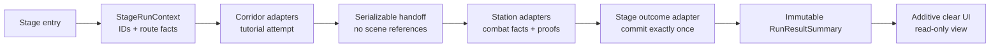

# Stage Run and Result Contract Spec

## Current P1-B closure

- P1-B Station Add and full-exit closure (2026-07-16): `SNAP-P1B-STATION-ADD-AUTHORING-REMEDIATION3-ACCEPTED-11` binds `C:\tmp\DimensionBrawl-P1B-StationAdd-Remediation3-Bundle.md` at SHA-256 `9378bc021b09495c350b331a85755eac7b956a2372d78ecca848a94c2d570c76`; source `128/128` matches digest `4c3dbe952bea5e4f5c57632d70e6fba815d7f6900dc9e1dcbee6af69bae86c89`, artifacts `11/11` match digest `eb5699917083d9be13d571f2a64aa0f69048304552b962df3467b89f3469ce2b`, validator/inventory `8/4/1/1/0`, integrated focused `8/8`, Canonical UI `34/34`, exact Victory-and-Replay full route `1/1`, and graphics aggregate `99/99` all pass with three independent audits at blocker `0`. Revision-1 pose remains relative to `StageDefinitionSceneBinding.transform`; Station `MapRoot` is topology containment only. `ACC-P1B-STATION-ADD-AUTHORING = PASS`; the foreign-evidence row remains PASS through explicit rejection only; `SNAP-P1B-FULL-EXIT-ACCEPTED-12` closes `ACC-P1B-FULL-EXIT-AUDIT = PASS`, so P1-B is **ACCEPTED / VERIFIED-COMPLETE**. This admits no P1-C runtime owner: only the prospective authoring-ledger freeze may start, and runtime work remains gated by `ACC-OPS-AUTHORING-LEDGER-CONTRACT-FROZEN`.

## Status

- P1-B result/progression Remediation3 acceptance: `SNAP-P1B-RESULT-PROGRESSION-JOINS-REV3B-REMEDIATION3-ACCEPTED-08` binds `C:\tmp\DimensionBrawl-P1B-ResultProgression-Remediation3-Bundle.md` at SHA-256 `94fa969979bdb2a2b91dfbdf8a5395aed0a69ddd8907831bb7c99da06b139a5b`; source `116/116` matches digest `271793a22e2afc24779a3aeeace7cb9768aae77b7bbbf18a075fa15ea409efb2`, artifacts `14/14` match list digest `c3642305e13c085f710e8db62df807463aea58d8a57331cd7526460eb7a404fc`, validator/inventory `8/4/1/1/0`, focused `7/7`, Canonical UI `33/33`, exact Victory-and-Replay full route `1/1`, and graphics aggregate `98/98` all pass. Independent source, artifact/test, and semantic-contract audits find blocker `0`: route/sidecar-owned canonical catalog identity is independent of the result definition, public Corridor admission and the editor validator require exact object identity, and catalog-only plus coherent catalog/profile/localization clones reject before run creation. Frozen route/policy/join/lifetime digests remain unchanged. `ACC-P1B-RESULT-PROGRESSION-JOINS = PASS / VERIFIED PARTIAL`; Candidate-07 remains immutable historical FAIL. Station count-one Add authoring is now unheld as the next separate P1-B gate, while live PGR/HI3 disposition, P1-B full exit, and P1-C execution remain OPEN and no P1-D/P2-C owner is admitted.
- P1-B result/progression Remediation2 candidate audit: `SNAP-P1B-RESULT-PROGRESSION-JOINS-REV3B-REMEDIATION2-CANDIDATE-07` binds `C:\tmp\DimensionBrawl-P1B-ResultProgression-Remediation2-Bundle.md` at SHA-256 `a4e2e2873ec4f53ba81a6c6a3269949b4b2f19255f566d333fcb058e3eeb6de8`; its submitted source manifest matches `116/116` with digest `f4c6f0a6065a2f304acd1a56f7d126b4b2be49582f752f707757d87f37c35583`, all `14/14` artifacts match list digest `96176b861dc7ce0a9aaccd86fe035aa59433513383713132248e51f974b6228a`, validator/inventory is `8/4/1/1/0`, focused `7/7`, Canonical UI `33/33`, exact full route `1/1`, and graphics aggregate `98/98` pass. Independent source/contract/test audits verify that Candidate-06's three blocker groups, locale/graph rows, and exact durable-decision byte preservation are closed, but `ACC-P1B-RESULT-PROGRESSION-JOINS = FAIL / VERIFIED-FAILED-CANDIDATE-PARTIAL` on one remaining admission defect: the result definition self-selects its catalog, so a catalog-only clone or coherent catalog/profile/localization clone can evade the intended exact-identity gate. The post-bundle route-owned catalog-anchor WIP changes five submitted files and cannot retroactively amend this cutoff. Station Add and P1-B full exit remain held until a new sealed-source candidate passes.
- P1-B result/progression joint-freeze: `P1B-RESULT-PROGRESSION-JOINS-01` Rev3B proposal artifacts match SHA-256 `b6e63b11e3e270302dc33f95b7b69740565e4e27a13ffe017a17f2899256c88f` / `eb65cf30eb961a271f135bc38a9874cccae49e47d8a9d0af5a6dd5f0d7211199` / `933c13943e5397f5fa7a1be531ae34bd28f595e09feee14f18429daa81a8e603`. Fresh PowerShell, independent Node, and a third row reconstruction preserve the seven `15/35/15/17/8/9/38` blocks, sidecar/join snapshot digest `a2ae9df451bd6f2ff48b83098db3bfbdaf2120e23dfaf3612a31f18a022c41fa`, all predecessor digests, and the separate 11-row lifetime-contract digest `3b6cf33325a0a83db74ee2253da9799e589b5664f4fb677b2b021389b0714c0e`. Exact `(ID, revision)` edge resolution and the no-token `Stage Select A -> pre-admission mutation B -> fresh Corridor B` boundary pass. Verdict is **ACCEPT / JOINT-FROZEN / IMPLEMENTATION-ADMITTED**. This authorizes implementation only: `ACC-P1B-RESULT-PROGRESSION-JOINS`, Station Add, foreign evidence, and P1-B full exit remain **OPEN**, and no P1-C/P1-D/P2-C owner or P1-A digest change is admitted.
- P1-B result/progression Rev3B implementation candidate audit: `C:\tmp\DimensionBrawl-P1B-ResultProgression-Implementation-Bundle.md` matches SHA-256 `35b1b1a5523bc457ad1936190d1d41143dd1bc8a3489624cdb600631c3a6daa1`; submitted source manifest `116/116` matches digest `1b3dba021b40a4be9d728c6fd4f2039864abb399bbff6d2907e4af274bec24ec`, all `14/14` declared artifacts match list digest `249da60824d3ef617937e648e1257b1fde9b50dc28082a904b78513ca7c76023`, both contract verifiers pass, validator/inventory is `8/4/1/1/0`, focused `2/2`, Canonical UI `28/28`, exact Victory-and-Replay full route `1/1`, and graphics aggregate `93/93` pass. These green artifacts are verified, but `ACC-P1B-RESULT-PROGRESSION-JOINS = FAIL / SOURCE-CONTRACT-FAILED-CANDIDATE`: canonical profile/localization object identity is not enforced at admission, the `Presented -> terminal action` path omits the exact pinned join/presentation/audit authority gate and audit self-integrity, and representative deep snapshot damage can throw instead of returning a typed rejection. Direct clone/damage/dispatch, recovery/process-loss, locale, and production graph acceptance rows remain open. The Rev3B joint freeze and every accepted predecessor cutoff/digest remain unchanged; Station Add and P1-B full exit stay held pending remediation and a new sealed-source bundle.
- Drafted: 2026-07-13
- Status: provisional review contract; analysis only
- Implementation gate: accepted P0 baseline is PASS at 28/28. P1-0 route/Station validation passes with mutation inventory `8/4/1`, authorized core `1`, bypass `0`, route revision `1` digest `2b912058cefb5b9ad14ed9d11336e2344dd12efa9789fc2df676a7ac74e821b9`, and policy revision `1` digest `f18fc51e2b65ae7e11b7e26866adc29f1f994c95be3591f2806bb846cd0bcaf2`; its freeze-point aggregate passes 37/37. P1-A's historical 45/49/54/59/68/75 cutoffs remain separate non-additive evidence. The final unchanged-source 79/79 cutoff closes the current-schema exit.
- Historical durability boundary at the submitted 45/45 fact-slice cutoff: the then-accepted store comparison used `resultSummaryDigest + exact StageRunOwnerCoverageRecord ID/digest + commitPreparation(NotRequired)`. That thin type was a truthful partial-cutoff record, not the complete record below; it is no longer the current production comparison.
- Current finalization/durability boundary: route/run schema 1 accepts only `NonCourseStationTerminal`. It validates the scene-reference-free terminal epoch evidence, seals `TerminalEpochClosureRecord`, wins the shared latch as `TerminalWon`, seals `TerminalFinalizationAuthority`, then seals a complete `TerminalFinalizationOwnerCoverageRecord` with fixed P1-E lesson, P2-B course, P1-C execution, and P2-B presentation rows all truthfully `NotAdmitted` and zero pending before `OutcomeFactsSealed`. The finalization factory rejects reuse by future route schemas. The local atomic-file decision and receipt are schema 2 and compare `resultSummaryDigest + exact TerminalFinalizationOwnerCoverageRecord ID/digest + commitPreparation(NotRequired)`; cache-clear reconciliation uses the committed route-owned closure and does not require a disposed scene-local coordinator. Same-process duplicates, byte-equivalent recovery, conflict/corruption quarantine, direct transient read/write recovery, UI suppression before exact reconciliation, and the current abort/dispatch schema guards are verified. Future admitted-owner rows remain later-schema work, not a current-schema P1-A exit condition.
- Durable receipt/storage boundary: the receipt preserves schema, run/stage identity, route revision/digest, the exact comparison and preparation arm, `summaryCommittedAtSequence`, canonical receipt digest, and envelope checksum. Tests use an isolated temporary storage root; production uses `Application.persistentDataPath/DimensionBrawl/StageRunResultDecisions`.
- Durability evidence: `C:/tmp/DimensionBrawl-P1-A-DurableEndpoints.xml` and `.log` (3/3), `C:/tmp/DimensionBrawl-P1-A-DurableStoreFocused.xml` and `.log` (6/6), `C:/tmp/DimensionBrawl-P1-A-DurableAggregate.xml` and `.log` (44/44), and `C:/tmp/DimensionBrawl-P1-A-Durable-Compile.log` (compile/route validator PASS).
- Fact-slice evidence snapshot: `C:/tmp/DimensionBrawl-P1-A-Facts-RouteValidator.log` (route/scene/semantic validation, inventory `8/4/1`, authorized core `1`, bypass `0`, frozen digests unchanged), `C:/tmp/DimensionBrawl-P1-A-Facts-RouteFocused-Final.xml` and `.log` (7/7), and `C:/tmp/DimensionBrawl-P1-A-Facts-Aggregate-Final.xml` and `.log` (45/45). These artifacts prove the submitted snapshot only; later source/test additions do not close any further acceptance row without a matching rerun.
- Fact-slice boundary: the revision-1 Olympus summary at that historical cutoff carries two segment results, the seven-row pre-load tutorial summary, resolved combat facts, semantic proofs, route-owned clocks, and a closed `StageOutcomeFact`, all covered by `resultSummaryDigest`. Its then-accepted durable comparison bound the thin `StageRunOwnerCoverageRecord`; the later evidence below, not that 45/45 artifact, proves the production replacement.
- Finalization evidence snapshot: `C:/tmp/DimensionBrawl-P1-A-Finalization-Focused-4.xml` and `.log` (29/29), `C:/tmp/DimensionBrawl-P1-A-Finalization-CanonicalUi-3.xml` and `.log` (11/11), `C:/tmp/DimensionBrawl-P1-A-Finalization-Aggregate-1.xml` and `.log` (49/49), and `C:/tmp/DimensionBrawl-P1-A-Finalization-RouteValidator-Final.log` (validator PASS; inventory `8/4/1`, authorized core `1`, bypass `0`; frozen policy and route digests unchanged). The aggregate contains CanonicalUi 11, CombatEncounter 11, CombatSessionOverlay 3, ActualPlayPath 1, CorridorCombatFlow 16, and StageRunRoute 7, with zero failed, skipped, or inconclusive tests.
- Post-49/49 acceptance snapshot: `C:/tmp/DimensionBrawl-P1-A-UncertainIo-RouteFocused-1.xml` and `.log` pass 12/12 in 41.041477s; `C:/tmp/DimensionBrawl-P1-A-Presentation-CanonicalUi-1.xml` and `.log` pass 11/11 in 51.716828s; `C:/tmp/DimensionBrawl-P1-A-Presentation-Aggregate-1.xml` and `.log` pass 54/54 in 195.9799808s with class counts 11/11/3/1/16/12 and the canonical full route in 25.511125s; `C:/tmp/DimensionBrawl-P1-A-Presentation-Compile-2.log` passes compile plus route/scene/presentation validation with inventory `8/4/1`, authorized core `1`, bypass `0`, and both frozen digests unchanged. This snapshot closes direct transient read/write recovery and UI suppression, the three tested current-schema diagnostic-abort paths, the scene-load `StageDispatchClosureFaultRecord` arm, and profile/catalog/localization plus committed-clock/proof rendering. It does not prove future admitted-owner closure because every current closure row is truthfully `NotAdmitted` with zero pending.
- Post-54 adversarial acceptance snapshot: `C:/tmp/DimensionBrawl-P1-A-Adversarial-StageRunRoute-1.xml` and `.log` pass 16/16 in 59.5031558s; `C:/tmp/DimensionBrawl-P1-A-Adversarial-CanonicalUi-1.xml` and `.log` pass 12/12 in 57.4280303s; `C:/tmp/DimensionBrawl-P1-A-Adversarial-Aggregate-1.xml` and `.log` pass 59/59 in 221.9861934s with class counts 12/11/3/1/16/16; `C:/tmp/DimensionBrawl-P1-A-Adversarial-FullRoute-1.xml` and `.log` pass 1/1 in 27.2893104s; and `C:/tmp/DimensionBrawl-P1-A-Adversarial-Compile-3.log` passes compile plus route/scene/presentation validation with inventory `8/4/1`, authorized core `1`, bypass `0`, and both frozen digests unchanged. It closes producer exception, cancellation terminal-stop, typed Station collector/presenter loss, the tested unload safety smoke, and mutated summary-digest rejection before resolver/loader/selection.
- Exit-candidate acceptance snapshot: `C:/tmp/DimensionBrawl-P1-A-ExitAudit-CombatEncounter-2.xml` and `.log` pass 15/15 in 0.1950867s; `C:/tmp/DimensionBrawl-P1-A-ExitAudit-StageRunRoute-1.xml` and `.log` pass 18/18 in 70.9724592s; `C:/tmp/DimensionBrawl-P1-A-ExitAudit-CanonicalUi-3.xml` and `.log` pass 15/15 in 89.5963348s; `C:/tmp/DimensionBrawl-P1-A-ExitAudit-Aggregate-1.xml` and `.log` pass 68/68 in 250.3478436s with class counts CanonicalUi 15, CombatEncounter 15, CombatSessionOverlay 3, ActualPlayPath 1, CorridorCombatFlow 16, and StageRunRoute 18; `C:/tmp/DimensionBrawl-P1-A-ExitAudit-FullRoute-2.xml` and `.log` pass the exact `CanonicalFullRouteCompletesTutorialStationGuideVictoryAndReplay` case 1/1 in 27.5540099s; and `C:/tmp/DimensionBrawl-P1-A-ExitAudit-Compile-3.log` passes compile plus route/scene/semantic validation with inventory `8/4/1`, authorized core `1`, bypass `0`, and both frozen digests unchanged. `FullRoute-1` is excluded because its obsolete test-name filter ran zero tests.
- Exit-remediation acceptance snapshot: manifest `852B9C2F3C9C6E21938D97DE010DBC680DF5B52A3CCA707A8B1F7494424F0D8C` binds 11 exact source rows. `C:/tmp/DimensionBrawl-P1-A-ExitAudit-CombatEncounter-5.xml` and `.log` pass 20/20 in 0.2164679s; `C:/tmp/DimensionBrawl-P1-A-ExitAudit-StageRunRoute-5.xml` and `.log` pass 20/20 in 75.9960529s; `C:/tmp/DimensionBrawl-P1-A-ExitAudit-CorridorLeakSequence-2.xml` and `.log` pass 3/3 in 24.1319277s; `C:/tmp/DimensionBrawl-P1-A-ExitAudit-CanonicalUi-5.xml` and `.log` pass 15/15 in 80.090208s; `C:/tmp/DimensionBrawl-P1-A-ExitAudit-Aggregate-3.xml` and `.log` pass 75/75 in 261.0318621s with class counts CanonicalUi 15, CombatEncounter 20, CombatSessionOverlay 3, ActualPlayPath 1, CorridorCombatFlow 16, and StageRunRoute 20; `C:/tmp/DimensionBrawl-P1-A-ExitAudit-FullRoute-3.xml` and `.log` pass the exact canonical full route 1/1 in 27.8460728s; and `C:/tmp/DimensionBrawl-P1-A-ExitAudit-Compile-6.log` passes compile plus route/scene/semantic validation with inventory `8/4/1`, authorized core `1`, bypass `0`, and both frozen digests unchanged. All 11 hashes matched during the cutoff audit and preceded its execution window. A later 14:01 KST replay is 7/11 after four post-cutoff source/test edits, which are unaccepted WIP and do not rewrite this immutable snapshot. Compile-4, Aggregate-2, CorridorLeakSequence-1, StageRunRoute-3, and FullRoute-1 are excluded intermediate or invalid evidence.
- Current-schema full-exit snapshot: ordered manifest digest `e59884ca0bcbec0506502ccb2638d9227e5f098bfb7f271e3a7adf16a2656427` binds 11/11 exact sources. `C:/tmp/DimensionBrawl-P1-A-ExitAudit-CombatEncounter-8.xml` passes 21/21 in 0.2007977s; `StageRunRoute-8.xml` passes 23/23 in 90.5924556s; `CanonicalUi-7.xml` passes 15/15 in 80.8148816s; `Aggregate-5.xml` passes 79/79 in 278.751148s with class counts 15/21/3/1/16/23 and 79 unique full names; `FullRoute-5.xml` passes the exact canonical route 1/1 in 27.6556836s; and `Compile-10.log` passes compile/route/scene/semantic validation with inventory `8/4/1`, authorized `1`, bypass `0`, and frozen digests unchanged. All submitted artifact hashes match, all relevant source mtimes precede the executions, and `git diff --check` has only the two pre-existing RenderTexture line-ending warnings.
- Current-schema exit verdict: P1-A is **PASS/CLOSED**. `ExplicitAbortRequestReceipt` authenticates run, exact encounter reference, reason, and stored record; direct replacement uses truthful pre-Station `NotBoundBeforeStation,0,0` or cancels the exact registered Station coordinator and preserves root/epoch; diagnostic ingress requires the exact registered Faulted coordinator and stored diagnostic; and final-snapshot/evidence exceptions become one `FinalizationException` fault with no partial resolution/evidence, summary, or result UI. Current fixed owner rows remain truthfully `NotAdmitted`/zero-pending and do not prove future admitted-owner quiescence.
- P1-B post-cutoff boundary: three separate accepted immutable cutoffs verify the direct Corridor presentation identity/authoring join, one-port/39-binding residue cleanup, and exact Corridor 4/4 plus Station 0/0 anchor/profile stage-context hygiene at 80/80. `SNAP-P1B-CATALOG-SELECTION-CANDIDATE-04` remains the historically rejected 19-source/84-test submission because its product prefab lacked the authored hidden reward row and blank public selection retained the old projection bundle/latch; it is not retroactively accepted. Its unchanged-source remediation successor `SNAP-P1B-CATALOG-SELECTION-CANDIDATE-05` passes the validator, focused 8/8, Canonical UI 21/21, exact full route 1/1, and graphics-enabled aggregate 86/86 with 86 unique full names, so `ACC-P1B-CANONICAL-SELECTION` is accepted for the frozen `P1B-CATALOG-SELECTION-01` projection only. At that cutoff the reference/template/briefing joint freeze remained open; rev2A later froze its contract and the separate truthful-join implementation cutoff below now passes, while P1-B full exit remains OPEN. Presentation metadata remains outside `ComputeCanonicalRouteDigest`, both frozen digests and all P1-A consumers are unchanged, and neither catalog selection nor any other P1-B artifact reopens P1-A or adds result/progression ownership.
- P1-B truthful-join rev2A boundary: the separate rev2A contract remains **JOINT-FROZEN / IMPLEMENTATION-ADMITTED** at 71/27/80 rows; the first proposal and historical 71/27/78 rev2 remain AMEND. Its added `activeRunRestartPolicyDisposition=NotAdmittedByCurrentSchema (3)` plus empty digest explicitly separates pre-result restart absence from the existing result-only Replay/Retry/Lobby actions.
- P1-B truthful-join implementation cutoff: the independently audited bundle `C:\tmp\DimensionBrawl-P1B-TruthfulJoins-Implementation-Bundle.md` matches SHA-256 `8ef3a8e234f53ef561dfdd5d805d0f69c8ddbb55d2a2534ca427f2da821a9d0a`; all 51 ordered sources match manifest digest `1d2fc6a142fa7582e76095c8a928ca1f61f4453ac7061f5d50525673d1480324`, all 13 declared artifacts match, PowerShell and Node reconstruct `71/27/80`, and the validator passes `8/4/1/1/0`. Focused 7/7, canonical UI 26/26, exact full route 1/1, and graphics aggregate 91/91 pass with 91 unique full names and class counts `26/21/3/2/16/23`; frozen route/policy/projection/template/reference/briefing digests match. `ACC-P1B-TRUTHFUL-JOINS` is **PASS / VERIFIED PARTIAL**, while P1-B full exit remains **OPEN**. At its later historical cutoff, Candidate-06 fails `ACC-P1B-RESULT-PROGRESSION-JOINS` on three blocker groups. Remediation2 Candidate-07 subsequently closes those groups but still fails one independent canonical-catalog identity anchor; a new sealed-source candidate is next, then Station Add, live PGR/HI3 foreign evidence, and full exit. This cutoff does not alter P1-A request/latch/closure/abort/dispatch authority and adds no P1-C execution owner, result/progression/reward join or owner, or pre-result active-run restart.
- Roadmap source: `SUBCULTURE_DATASET_GAP_ROADMAP.md`, P1-A
- Route/identity companion: `PLAYABLE_STAGE_REFERENCE_SPINE_SPEC.md`, P1-B
- Later encounter-lifecycle companion: [Ordered Encounter Execution Bridge Spec](ORDERED_ENCOUNTER_EXECUTION_BRIDGE_SPEC.md), P1-C; its new snapshot/gate/quiescence fields apply only when that later schema is admitted
- Later mastery/progress companion: [Typed Mastery and Progress Application Spec](TYPED_MASTERY_PROGRESS_APPLICATION_SPEC.md), P1-D; it adds entry-time objective/progression identity, pre-commit evaluation, and the clear-only durable intent/application barrier for its new run-schema cohort
- Later tutorial companion: [Tutorial Lesson, Attempt, and Gameplay Reset Spec](TUTORIAL_LESSON_ATTEMPT_RESET_SPEC.md), P1-E; it adds ordered immutable lesson-attempt facts only for its new schema cohort while preserving the P1-A whole-tutorial summary and pre-load seal
- Later variability companion: [Stage Rule, Modifier, and Enemy Variant Spec](STAGE_RULE_MODIFIER_ENEMY_VARIANT_SPEC.md), P2-A; its new snapshot/provenance/quiescence fields apply only when that later schema is admitted
- Later course-chain companion: [Tutorial Course Lesson Chain Spec](TUTORIAL_COURSE_LESSON_CHAIN_SPEC.md), P2-B; its run-scoped snapshot, traversal coverage, and quiescence fields apply only to that later schema cohort
- Product decision companion: [P1 Product Decision Packet](P1_PRODUCT_DECISION_PACKET.md); D1-D3/D4a approve the identity values, `Clear -> Replay + Lobby`, `Fail -> Retry + Lobby`, outcome-aware shared result shell, and causal-order/same-epoch Clear-wins product semantics. D4b is separately frozen as a revision-1 technical contract
- Shared preflight: P1-0 is complete. The final minimal `PlayableStageDefinition` resolves Corridor and Station definitions, freezes the approved identity/actions/D4a semantics and D4b policy, and passes exact mutation inventory, bypass-zero, semantic, scene, build-route, digest, and freeze-point regression gates. P1-A1 snapshots this contract and validates its handoff; P1-A2 consumes the exact terminal/action rows without changing either digest. Later P1-B/new-schema joins may not substitute constants or scene strings, mutate accepted P1-A snapshots, or reinterpret unresolved fields for already-admitted runs
- Current product flow: two route segments `OlympusCorridorInvasionStage -> OlympusStationCombatStage`, followed by separate additive committed-result presentation `UI_StageClear`

This document defines the smallest truthful stage-wide run/result boundary. It does not authorize progression, reward payout, ranking, analytics upload, or tutorial refactoring.

## Problem

The current logical stage spans two single-load combat scenes:

1. Corridor owns intro and the event-validated combat tutorial.
2. Corridor releases movement and virtual-joystick ownership, then loads Station.
3. Station owns a gated replica/summon guide, player and boss combatants, the canonical encounter, and boss HUD.
4. Canonical Station's coordinated terminal record is received by the P1-A route/run owner; P1-A2 commits one immutable fact-bearing outcome/action summary and only then opens `UI_StageClear` additively.
5. The shared additive UI projects Clear as Replay/Lobby and Fail as Retry/Lobby through one typed executor; current P1-A2 evidence executes all four buttons and the bounded missing/stale/competing/resolver/load-failure set, while the legacy Review result/navigation owner remains retired.

P1-A1/P1-A2 preserve one run ID, route identity, exact terminal outcome, a durable per-run result decision, the current revision-1 Olympus fact payload, typed actions, and complete current-schema NonCourse Station terminal-finalization authority/owner coverage across the single-load boundary. The 68/75 cutoffs remain historical evidence and the final 79/79 cutoff closes exact public-ingress, replacement, diagnostic, and snapshot-exception paths. UI must not become any of those owners.

## Decision

Add one run-lifetime context and scene-local adapters:



The context is a one-run handoff object. It is not a permanent `GameManager`, service locator, save system, reward ledger, or scene router.

## Ownership

| Owner | May own | Must not own |
|---|---|---|
| P1-0 `PlayableStageDefinition` route shell | stage ID/revision, ordered Corridor/Station definition refs, route conditions/policies, typed actions and allowed outcomes | live scene objects, counters, reward state, copied scene strings, P1-B-only content joins |
| `StageRunContext` | run identity, current segment, elapsed accumulators, immutable fact builder, lifecycle state | transforms, cameras, input controllers, combat execution, persistent progression |
| Scene-local fact adapter | subscriptions to authoritative components in its loaded scene | cross-scene singleton state, UI copy, mastery decisions |
| Later P1-C encounter adapter | one run-admission static-plan identity, scene-local execution generation, required local-gate command, and quiescence registration | run ID creation, terminal outcome, result commit, progression, reward, navigation |
| Station terminal-resolution coordinator and outcome adapter | pre-mutation root admission and causal sequencing, active-token allocation, exclusive queued terminal-state mutation for bound Player/Boss subjects, synchronous coordinator/finalization lifecycle, approved clear/fail arbitration, exactly-once result commit request | reward grant, scene navigation, optional proof invention, rendered-frame/timer/health-callback/subscriber-order policy |
| Run lifecycle/abort recorder | one immutable diagnostic abort record for failed handoff, abandon, or unexpected exit | product `RunResultSummary`, clear/fail presentation, progression, reward |
| Mastery evaluator (P1-D) | pure evaluation of immutable facts against typed objectives | event subscriptions, UI mutation, reward grant |
| Product result presenter | formatted display of a committed summary and its offered route actions | counters, combat subscriptions, result mutation, persistence, payout |

## Provisional Data Contracts

Names are review vocabulary, not final C# API names.

### `StageRunIdentity`

- `schemaVersion`
- `runId`
- `playableStageId`
- `routeRevision`
- `routeSnapshotDigest`
- `entrySegmentId`
- optional `stageTemplateId`, unresolved in the P1-A-first schema

Rules:

- `runId` is generated once at logical stage entry.
- `playableStageId` is not a scene name and does not change at the Corridor-to-Station handoff.
- scene name/path is resolved from an ordered route contract, not inferred from stage-ID ordering.
- Replay and Retry create a new `runId`; neither reopens the old mutable context.
- `routeSnapshotDigest` identifies the full immutable `StageRunRouteSnapshot` captured at entry. The run owner validates the loaded Station scene and resolves Replay/Retry from that snapshot rather than strings or the latest asset. The P1-A-first schema leaves only P1-B content joins such as the template explicitly unresolved. P1-B fills the same asset for new-schema runs and fails any differing identity, order, scene, action, or outcome policy; it never mutates or backfills an active or committed run snapshot.

Approved D1/D2 set `playableStageId = OLYMPUS-INVASION-01`, `routeRevision = 1`, ordered segment IDs `corridor_intro_tutorial`, `station_entry_combat`, and the three typed actions. Production code must not substitute UI row IDs or scene names. P1-0 freezes `olympus-invasion.replay` as Clear-only `Replay` to Corridor, `olympus-invasion.retry` as Fail-only `Retry` to Corridor, and `olympus-invasion.to-lobby` as a Clear/Fail `UIRoute` to Lobby. The validated route digest is `2b912058cefb5b9ad14ed9d11336e2344dd12efa9789fc2df676a7ac74e821b9`; the validated D4b policy digest is `f18fc51e2b65ae7e11b7e26866adc29f1f994c95be3591f2806bb846cd0bcaf2`.

Revision 1 fixes the route rows as follows: Corridor is `{ entry = run.entry.admitted / RunEntrySnapshotValidatedAndFirstSegmentActivated, exit = corridor.tutorial.completed / CorridorTutorialFactsAndClosureSealedForSingleLoad, handoff = SingleLoad }`; Station is `{ entry = corridor.tutorial.completed / CorridorTutorialFactsAndClosureSealedForSingleLoad, exit = station.encounter.terminal / StationTerminalQueueDrainedSubjectsFinalizedAndEvidenceMatched, handoff = ReturnToOwner }`. `run.entry.admitted` atomically covers immutable snapshot creation, route validation, owner registration, and first-segment activation. The shared Corridor condition denotes the sealed current-run handoff, not a raw tutorial callback, and Station entry separately validates the active snapshot/current segment/token. Corridor freezes `successor = NextOrderedSegment`, `destination = SuccessorStageDefinitionScene`, `transitionToken = SealedCurrentRunSegmentHandoff`, `loaderGeneration = ActiveRunRouteLoaderGeneration`, `navigationAuthority = P1AStageRunRouteOwner`, and typed `None` Return fields. The Station exit denotes the D4b current-run `TerminalClosed` resolution after queue drain, both-subject finalization, and candidate/final agreement. Final-segment `ReturnToOwner` freezes successor/destination/transition token/loader generation/navigation as typed `None` and performs no load or unload: it delivers the exact terminal record to `P1AStageRunRouteOwner` under `ExactTerminalRecordExactlyOnceToTerminalFinalizingCommittedPresented` while retaining Station, after which the additive result view may open. `UI_StageClear` is not a route segment, and only the later sealed typed action may navigate away. Changing any revision-1 condition meaning requires a new condition ID plus route revision/digest.

### `StageRunRouteSnapshot`

- `schemaVersion`
- `playableStageId`
- `routeRevision`
- ordered immutable segment records: `segmentId`, sequence index, `stageDefinitionId`, resolved stable scene identity, entry/exit condition IDs, and handoff policy
- immutable action records: `actionId`, kind, target playable-stage ID or typed UI route, `allowedOutcomes`, and resolved Replay/Retry entry segment/definition/scene identity when applicable
- immutable terminal resolution policy: `terminalResolutionPolicyId = olympus-invasion.same-terminal-epoch`, `semanticRevision = 1`, its canonical digest, arbitration window, coordinator and canonical root-admission kind, pre-mutation root-order source, active root boundary, terminal-subject roles, exclusive terminal-state coverage, work rule `SynchronousNonYieldingResolution`, nested/independent-root rules, epoch stamp, coordinator/token lifecycle, finalization handshake, close barrier, simultaneous outcome, and candidate/final-state requirements
- `coreRouteSemanticDigest` over only the P1-0/P1-B route core above, excluding every P1-C encounter plan, P2-A variability snapshot, P2-B course snapshot, and final digest
- optional in the later P1-C schema: the fixed spine-order `EncounterStaticPlanSnapshot` collection and canonical encounter/static-plan digests, each of which includes its required gate ID or typed no-gate completion-consumer arm
- optional in the later P2-A schema: one complete `StageVariabilityPlanSnapshot` and its semantic digest/cohort identities; the sole `ResolvedActiveRunRestartPolicy` and entry target live only inside that nested snapshot
- optional in the later P2-B schema: one complete `TutorialCoursePlanSnapshot`, its semantic digest, and exact three-entry cohort identities
- `canonicalDigest`

The run owner deep-copies this snapshot from the P1-0 route shell at logical entry; no Unity object, mutable asset reference, or copied UI string survives. Digest construction follows one strict DAG: (1) `coreRouteSemanticDigest`; (2) fixed-order P1-C canonical encounter/static-plan digests, each binding only the core and carrying its gate ID or no-gate arm rather than an undefined separate gate digest; (3) optional P2-A semantic digest binding the core plus exact P1-C identities/digests; (4) optional P2-B course semantic digest binding the core plus exact P1-C and P2-A identities/digests; and (5) final `canonicalDigest` over the core and every present layer in that order, with typed absence for a missing layer. A later layer may reference earlier-layer digests, never the final digest or a later-layer digest. Handoff validation, terminal arbitration, offered actions, result re-entry resolution, active-run restart, course transitions, and stale-UI checks use only this snapshot. Editing the source asset later cannot reinterpret an active or committed run.

For a new-schema cohort, snapshot acceptance and admitted-owner registration are one atomic pre-active transaction. It creates every required barrier context, the P2-B course session, fixed P1-C binding reservations/latches, P2-A acquire-or-close latch, and presentation adapter genesis generation before `Created` may enter an externally active state. A partial failure rolls all of them back while the context is still unexposed; it cannot create a run that needs closure yet lacks a session-bearing success/fault arm. Once exposed, every admitted owner must close through the fixed coverage table.

### Later P1-C snapshot, gate, and quiescence extension

The P1-A-first schema does not invent encounter execution. When P1-C is later admitted, a new route-snapshot schema first computes `coreRouteSemanticDigest`, then deep-copies each production `EncounterExecutionBinding`, sequence/payload-mapping revision, required local-gate ID, ordered group/spawn static plan, and canonical encounter digest at the same logical Corridor entry. Every encounter plan binds only that core digest plus its own P1-C semantics and stable host IDs/revisions; it includes no P2-A or P2-B semantic digest and never the final route digest. The P1-C layer is then available to the later P2-A/P2-B layers and final digest in the fixed DAG above. Admission creates fixed-order binding-scoped canonical reservations before local scene scripts start; sequential bindings may share a scene/domain but can never overlap active leases. Station may bind live anchors/factories only after their current IDs/revisions/digests match that entry snapshot; it cannot read newer authoring into the active run.

The P1-C adapter owns execution, but `StageRunContext` keeps each snapshotted required encounter gate in `Pending` or `Satisfied` state. One exact current-run/current-execution-generation `EncounterGateSatisfiedCommand` ID/canonical digest—binding its final group proof, route/execution host/binding/sequence/gate/latch provenance—may compare-and-set it once. The CAS precedes sequence acknowledgement and local-phase activation; callbacks raised synchronously while opening that phase are queued until the transaction returns and therefore observe `Satisfied`. A stale/duplicate/foreign command has no side effect, and a local-phase-open failure after CAS enters the common abort-closing path before queued terminal work can commit. Only an `Opened` `EncounterGateAcknowledgementReceipt` may be followed by the exact `EncounterSequenceCompletionProof`; the receipt, not an undefined tuple or callback, is the gate transaction evidence. A Clear commit request while any required gate remains pending is rejected as invalid evidence and enters the same path; the final abort record is sealed only after admitted closure results are known. The gate command/proof never creates Clear/Fail or result facts. Fail/abort may cancel an unfinished encounter without satisfying the gate.

P1-C also registers one idempotent `EncounterExecutionQuiescenceBarrier`. When the terminal arm wins the shared latch, P1-A first seals `TerminalFinalizationAuthority`, requests P1-C `RunFinalization`, and requires that receipt before `OutcomeFactsSealed`; this freezes/cleans the execution only after the terminal coordinator has captured both subject snapshots and the remaining fact collectors have received immutable source records. Every terminal action and active-run restart likewise seals its immutable authority/dispatch-selection record first, requests encounter cancellation/disposal, and waits until pending work, owned full/partial objects, subscriptions, reservations, and the scene ownership lease are all zero/released. Every admitted non-`Disposed` state participates; validation/ready/completing and cancelling/faulting drains cannot report quiescent early. A terminal action revalidates the already sealed terminal-path receipt when no higher P1-C generation exists. Only successful action/restart closure may dispose and dispatch. A barrier timeout/fault before result publication enters `ClosureFaulted`; after a committed result/action it leaves the context presented with dispatch blocked by the separate closure-fault diagnostic.

### Later P2-A snapshot and quiescence extension

For a newly admitted P2-A schema, logical entry deep-copies the complete `StageVariabilityPlanSnapshot`: rule dispositions and typed params, canonical zero-or-one modifier array, canonical `None` or one versioned binding-set with scoped-key variant identities/composition, sole `ResolvedActiveRunRestartPolicy`, configuration/adapter capability-manifest revision, and separate semantic/presentation digests. That snapshot binds `coreRouteSemanticDigest` plus the exact fixed-order P1-C plan/gate identities and digests or typed absence; it contains no P2-B course or final route digest. The final canonical route digest later includes `stageVariabilitySemanticDigest`. Presentation-only churn remains outside route/result semantics. `RunResultSummary` may preserve the semantic digest and stable cohort IDs as provenance, but P1-A never infers compliance, mastery, or outcome from their names.

P2-A registers one idempotent `StageVariabilityQuiescenceBarrier`. For Clear/Fail, P1-A first seals `OutcomeFactsSealed`; after any P1-D evaluation it enters `VariabilityClosing`, awaits P2-A release/configuration receipts, and reaches `VariabilitySealed` before `CommitRequested`. A closure fault instead enters `AbortClosing`, seals one evidence-complete diagnostic abort after closure results are known, enters `ClosureFaulted`, and publishes no product result or disposal claim.

Active restart wins the shared terminal-or-restart latch and seals its immutable dispatch record first, enters `RestartClosing`, awaits every admitted P1-E/course, P1-C, P2-A, and P2-B presentation barrier, and only then seals the one abort record with success receipts or fault evidence. Success disposes and performs the actual dispatch; failure enters `ClosureFaulted` without either. Post-commit terminal actions revalidate the already sealed P2-A/course barriers while awaiting their other admitted barriers; a newly detected integrity fault preserves the result, creates a separate dispatch-fault record, blocks navigation, and never reopens action/restart selection.

### Later P2-B course snapshot and quiescence extension

For a newly admitted P2-B course schema, logical entry deep-copies exactly one active, strict-linear `TutorialCoursePlanSnapshot` with Basic, Practice, and Challenge bindings plus their P1-E/P1-C/P1-D/P2-A/P2-B identities, revisions, capabilities, and semantic digests. The course semantic digest binds `coreRouteSemanticDigest`, the exact fixed-order P1-C layer, and the exact P2-A semantic digest or typed absence; the final route digest then includes the course digest. The course never enters an earlier-layer or final digest. No mutable progress, runtime generation, reward, or Unity reference enters the snapshot.

P2-B registers a distinct `TutorialCourseQuiescenceBarrier`, while the presentation adapter registers one run-level `StagePresentationQuiescenceBarrier`. The course barrier covers only course/entry generations, transition selections, continuation reservations, traversal coverage, and course-owned tokens. It never claims P1-C objects, P2-A configuration work, P1-E gameplay ledger work, or presentation resources. The presentation barrier returns one `StagePresentationQuiescenceReceipt` aggregating every per-request `StagePresentationResult` in request-admission order, including an explicit successful no-request arm; it never treats a single request result as run-level closure. On Challenge terminal, the latch-winning `TerminalFinalizationAuthority` authorizes course traversal/continuation quiescence and the current-generation presentation aggregate before `OutcomeFactsSealed`; P1-A still owns outcome and P1-D still owns mastery. Active restart and pre-commit abort await every admitted barrier independently. Post-commit actions revalidate the current presentation receipt-chain head; if a selected action authorizes a later Exit presentation, P1-A opens one higher adapter generation from that head and awaits its newly chained receipt before dispatch. A newly detected fault preserves the result and blocks dispatch through `StageDispatchClosureFaultRecord`.

### `StageSceneSegmentState`

- `segmentId`
- `segmentSequenceIndex`
- `entered`
- `completed`
- `exitReason`
- `activeElapsedSeconds`

Initial segment vocabulary:

- `corridor_intro_tutorial`
- `station_entry_combat`
- the clear UI is not a combat segment

### `TutorialAttemptFact`

P1-A's current envelope contains runtime-issued `tutorialFactId`, schema version, one exact `factPayload`, canonical `tutorialAttemptFactDigest`, and envelope checksum. `factPayload` is the closed union:

- `TutorialRouteSummary(planId, planSemanticDigest, routeState, closed terminationReason, routeProofDisposition, observationElapsed, segmentId, ordered TutorialFactCoverage[], tutorialFactCoverageDigest, typed absence of lesson/attempt/host/outcome/result/gameplay-disposition fields)`; or
- `LessonAttempt(planId, planSemanticDigest, lessonId, lessonRevision, attemptId, attemptOrdinal, attemptGeneration, exact TutorialAttemptHostScope, attemptState, closed terminationReason, tutorialEvaluationSnapshotDigest, exact proofDisposition, collectorCoverage, collectorCoverageDigest, observationElapsed, segmentId, exact TutorialAttemptResult ID/canonical digest, exact TutorialGameplayDispositionReceipt ID/canonical digest, typed absence of route-summary coverage)`.

Both state fields are closed to completed, failed, skipped, cancelled, or interrupted. Both elapsed fields use `None | Milliseconds(nonnegative integer)`. The route arm's `routeProofDisposition = Proved(stable proof ID, typed value, routeSummarySourceRecordId, canonical source digest) | NoProof(reason, typed absence of proof/value/source provenance)` comes from the whole-tutorial source record; it is never presented as if copied from a P1-E attempt outcome. The lesson arm's `proofDisposition = Proved(proofId, typed value, QualifiedProofAttribution) | NoProof(reason, typed absence of proof/value/attribution)` is copied without reinterpretation from the exact `TutorialAttemptOutcome` embedded by its named result. The result and gameplay receipt refs must match that same attempt/host scope.

`tutorialAttemptFactDigest` covers the fact ID/schema and the complete selected payload arm, including every typed absence, but excludes presentation metadata and every envelope checksum. P1-E lesson facts are ordered by snapshotted plan ordinal plus attempt ordinal, not callback order. A pre-P1-E route-only fact remains its older schema and is never silently reserialized as this current envelope or admitted as complete lesson coverage.

The route summary's canonical `TutorialFactCoverage[]` orders rows in plan ordinal. Each row is `LegacyOpaque(planOrdinal, lessonId, NoResultExpected)` or `Instrumented(planOrdinal, lessonId, ResultAdapter | TypedEvaluator, nonempty ordered AttemptCoverage[])`. Each attempt row contains exact attempt ID/ordinal/generation, `TutorialAttemptResult` ID/canonical digest, and `TutorialAttemptFact` ID/canonical digest; rows order by attempt ordinal and must exhaust every admitted attempt including retries. Duplicate/missing attempt ordinals or mismatched result/fact provenance fault the Corridor seal. Typed empty attempt coverage is legal only for `LegacyOpaque`; it is not learner failure or observed zero. `tutorialFactCoverageDigest` covers every arm/ref/typed absence, and the route-summary fact digest includes that coverage digest without creating a cycle because lesson facts never reference the route summary.

Lesson-level facts must not be fabricated from prompt text, enum names, `LastCompletionRecord`, or scene state after unload. Already committed P1-A/P1-D summaries are never backfilled. A route-summary row and its ordered lesson rows are separate scopes and must not be double-counted.

### `CombatRunFacts`

- resolved hostile `playerDamageTaken`
- `playerDownCount`
- `perfectDodgeCount`
- normalized summon-use records: monotonic run-local `summonAdmissionSequence`, slot/role ID, spent tier, and segment timestamp; canonical order is ascending admission sequence
- semantic encounter proofs
- optional `forwardRiskSeconds`
- optional literal `structureBreakCount`

Do not equate summon use with correct summon answer. Do not equate boss-pressure suppression with a literal structure break.

### `SemanticProofFact`

- `proofId`
- `sourceKind`
- `count`
- `actualValue`
- canonical nonnegative integer `firstObservedSegmentMilliseconds`
- `qualified`

The first-observed value is converted once from the same stable segment-clock tick domain with the run's overflow-safe integer millisecond rule before `OutcomeFactsSealed`; P1-D never converts a float-seconds field or rounds it again.

Initial candidate proof IDs:

- `summon.pressure_block`
- `summon.followup_hit`
- `summon.counter_recovery`
- `survival.no_player_down`
- `movement.forward_risk_time`

Proof IDs are stable data vocabulary. Player-facing result copy is resolved later and is never parsed to recover proof.

### `StageFailureReason`

Revision 1 is the closed union `PlayerDefeated`, canonically encoded as the stable token `player_defeated`. System, integrity, owner-closure, load, and persistence failures are diagnostic abort/quarantine states and may not be encoded as a normal stage Fail reason. Adding timeout, surrender, objective failure, or any other product Fail requires a schema revision, outcome-policy review, and stable token.

### `StageOutcomeFact`

- exact `outcomeDisposition = Clear(BossTerminal | SimultaneousTerminalClear, typed absence of failureReason) | Fail(PlayerTerminal, StageFailureReason)`
- `outcomeSegmentId`
- `rootAdmissionSequence`
- `terminalEpochSequence`
- canonical nonnegative integer `totalActiveElapsedMilliseconds`
- canonical nonnegative integer `combatActiveElapsedMilliseconds`
- `outcomeFactsSealedAtSequence`
- canonical `stageOutcomeFactDigest`

`stageOutcomeFactDigest` covers the complete outcome-disposition arm including typed failure absence/presence, segment/root/epoch provenance, both elapsed values, and `outcomeFactsSealedAtSequence`; it excludes presentation metadata and every envelope checksum. A system/integrity/closure failure is diagnostic abort, not an invented Fail arm. The fact freezes at `OutcomeFactsSealed` only after the summary-external `TerminalFinalizationOwnerCoverageRecord` below seals, and before mastery, variability closure, or summary commit. For the current route, canonical clear originates from Station encounter win/boss death before the stage-clear overlay opens. `BossBarrageEncounterController.RouteResultRecord` is an optional proof adapter only when it actually commits; it is not the stage outcome.

### `TerminalFinalizationOwnerCoverageRecord`

Implementation-state note: the 45/45 fact-slice cutoff used the thin `StageRunOwnerCoverageRecord`; that historical artifact remains evidence only for its submitted payload. The later 49/49 finalization snapshot removes that production type and implements the complete record for route/run schema 1 `NonCourseStationTerminal`: all four fixed future-owner rows are explicit `NotAdmitted`, pending count is zero, the record seals after the exact `TerminalFinalizationAuthority` and before the lifecycle enters `OutcomeFactsSealed`, and its ID/digest is the schema-2 durable comparison. This closes the current-schema authority/owner-coverage subgate, not the diagnostic-abort/aggregate-closure contract or any future schema whose admitted owners require typed success receipts.

Before normal `OutcomeFactsSealed`, P1-A seals one immutable summary-external record containing runtime-issued `terminalFinalizationOwnerCoverageRecordId`; run/stage/route revision and route digest; exact `TerminalFinalizationAuthority` ID/canonical digest; `finalizationContext = NonCourseStationTerminal | CourseChallengeTerminal`; and fixed owner rows in P1-E lesson, P2-B course, P1-C execution, P2-B presentation order. Each row is exactly `Succeeded(exact required receipt ID/canonical digest) | NotAdmitted | NotApplicable`. P1-E `Succeeded` additionally contains `TutorialLessonBarrierUse = RevalidatedPriorNormalClose(StationTerminalFinalization | CourseChallengeTerminalFinalization, exact original authority/latch/frozen host scope/generation, NoHigherLessonBarrierGeneration)` and the byte-identical lesson receipt. P1-C requires `closureScope=RunFinalization`; presentation requires the current adapter-generation aggregate receipt; P2-B course is `NotAdmitted` only for a non-course snapshot. P2-A is not in this record because its variability barrier closes later, after outcome/mastery facts.

The record also contains fixed zero-pending/finalization sequence facts, canonical `terminalFinalizationOwnerCoverageDigest`, and envelope checksum. Its digest covers its runtime ID, run/route/authority/context, all four rows including the complete P1-E use arm and typed absence, zero-pending facts, and sequence while excluding constituent/envelope checksums. It is sealed only when every admitted row succeeds. Failure or timeout creates no success record and enters the evidence-complete abort path. `TerminalFinalizationAuthority` never references this later record, so no digest cycle exists. `StageOutcomeFact` does not absorb runtime receipt IDs into its semantic digest; instead, the exact record ID/digest remains lifecycle evidence in `StageRunContext` and is carried by the later `RunResultCommitReceipt`. Exact duplicate finalization returns the stored record; mismatched coverage faults without replacing it.

### `StageRunAbortCloseAuthority`

- runtime-issued `abortCloseAuthorityId`
- run/stage/route revision and route-snapshot digest
- `origin = DiagnosticAbort | TerminalFinalizationFailure`
- abort reason and lifecycle state that entered `AbortClosing`
- optional upstream `TerminalFinalizationAuthority` ID/canonical digest, required only for `TerminalFinalizationFailure`
- terminal-coordinator invalidation disposition and sequence
- issued sequence, canonical `abortCloseAuthorityDigest`, and envelope checksum

P1-A alone seals this authority after `AbortClosing` wins and before asking any still-open owner to close. It carries no owner receipt, result, progression, reward, or dispatch field, so the later `StageRunAbortRecord` may reference it without a digest cycle. Its canonical digest covers the exact fields above and typed absence while excluding the envelope checksum. Active restart uses its already sealed `ResolvedActiveRunRestartDispatch` instead; post-result action disposal uses `ResolvedTerminalActionSelection` and never this pre-commit authority.

### `StageRunAbortRecord`

- `schemaVersion`
- `runId`
- `playableStageId`
- `routeRevision`
- `lastLifecycleState`
- optional terminal-coordinator state, root-admission sequence, and epoch
- `abortReason`
- optional accepted active-restart `restartDispatchId` and canonical `restartDispatchDigest`; both are present together only when the abort closes a previously sealed `ResolvedActiveRunRestartDispatch`
- optional P1-A `abortCloseAuthorityId` and canonical `abortCloseAuthorityDigest`; both are present together exactly when a `StageRunAbortCloseAuthority` was issued, and remain typed absent for the active-restart arm
- required `routeHandoffCoverage = NotIssued | Succeeded(StageSegmentHandoffTerminalReceipt ID/canonical digest) | Failed(StageSegmentHandoffClosureFaultEvidence ID/canonical digest)`; `NotIssued` is legal only when no transition token/loader generation was ever issued
- required `outcomeFactCoverage = NotSealedBeforeAbort | SealedDiagnosticOnly(stageOutcomeFactDigest, outcomeFactsSealedAtSequence)`; the sealed arm is legal only when terminal finalization had already reached `OutcomeFactsSealed` before a later mastery/P2-A/pre-commit fault, and it never authorizes a product summary
- required canonical `closureBarrierCoverage[]` in fixed owner order: P1-E lesson, P2-B course, P1-C execution, P2-A variability, P2-B presentation. Each row contains owner kind, `Succeeded | Failed | NotAdmitted | NotApplicable`, and exactly one matching success receipt type/ID/canonical digest, failure-evidence type/runtime ID/canonical digest, or typed absence. The P1-E success arm additionally carries exact `TutorialLessonBarrierUse = FirstPublishedDuringThisClose | RevalidatedPriorNormalClose(...)`; later Station/Challenge terminal, restart, or abort closure must use the revalidated arm rather than pretending to publish a second lesson receipt
- canonical `aggregateClosureDigest`
- optional P1-E `tutorialLessonQuiescenceFaultEvidence`: exact runtime evidence ID/digest, scene-reference-free run/plan close identity, exact lesson-close authority or fault-only `AuthorityUnavailable`, failed P1-E boundary, course-lease/work state, fixed typed partial receipt refs, and optional exact nested `TutorialAttemptClosureFaultEvidence` ID/digest when an attempt existed
- optional P1-C `encounterExecutionClosureFaultEvidence`: exact runtime evidence ID/digest, run/route, exact `EncounterBindingHostScope` presence/absence arm, exact `Issued(EncounterExecutionHostScope, instance/generation) | NotIssuedBeforeFault` execution arm, fixed binding/reservation/latch coverage, exact course-close context, scope-compatible `Accepted(exact close command/authority) | RunFinalizationAuthorityUnavailable(expected P1-A kind, local invalidation reason/sequence) | EntryTransitionAuthorityUnavailable(expected PracticeExitSelection, local invalidation reason/sequence)` fault-only authority evidence, failed boundary, canonically ordered pending identities, terminal/retained reservation facts, complete gate partial coverage, and fixed typed partial receipt refs
- optional P2-A `stageVariabilityClosureFaultEvidence`: exact runtime evidence ID/digest, scene-reference-free run and `Issued | NotIssuedBeforeFault` execution identity, exact close-command/authority/latch/course-context provenance, failed boundary, fixed source/domain rows plus configuration-result rows with exact typed receipt refs or pending states, and canonically ordered residual validation/token/callback/timer evidence
- optional P2-B `tutorialCourseClosureFaultEvidence`: exact runtime evidence ID/digest, frozen course/session plus exact three-arm close context, close authority, last sealed selection/transition or typed absence, failed boundary/watchdog, ordered pending IDs, and fixed typed latest-transition owner-evidence slots rather than independent run-level barrier receipts
- optional P2-B `stagePresentationQuiescenceFaultEvidence`: exact runtime aggregate-evidence ID/digest, run/route adapter-generation snapshot/purpose/prior-head and close-authority provenance, fixed expected-slot coverage plus admission-ordered request result/fault/pending coverage, exact nested per-request presentation closure-fault IDs/digests, and canonically ordered residual request/work/domain/token identities
- optional P1-A `stageSegmentHandoffClosureFaultEvidence`: exact runtime evidence ID/digest, run/route/token/loader generation and close authority, failed boundary, registration-ordered pending callback IDs, observed load state, and fault sequence; required iff `routeHandoffCoverage = Failed` and otherwise typed absent
- `abortedAtSequence`
- canonical `abortRecordDigest`
- abort-record envelope checksum

`aggregateClosureDigest` covers the run, optional restart-dispatch identity, optional abort-close authority, the route-handoff row, and all five owner rows in that fixed order, including typed absence and exact canonical evidence refs; it excludes every constituent envelope checksum. A failed handoff row must match the attached full handoff fault evidence digest. No row may be omitted, reordered, or inferred from an absent attachment. `NotAdmitted` is legal only when the immutable entry snapshot lacks that owner contract. `NotApplicable` is legal only when an admitted contract explicitly permits no runtime instance for this closure and validation proves that it acquired no work/token; P1-E before attempt creation instead returns its typed `NoAttemptStarted` success receipt. `abortRecordDigest` covers the record identity/reason/lifecycle, optional dispatch/abort-close authority, exact outcome-fact coverage arm, aggregate digest, exact failure-attachment canonical digests, and abort sequence; it excludes the abort-record and constituent envelope checksums.

Abort idempotence compares the complete canonical request tuple, not `abortReason` alone. An exact replay with the same run/context, reason, lifecycle/disposition, coordinator state, root-admission sequence, epoch, handoff/outcome coverage, and close-authority provenance returns the byte-identical stored record. The same reason with any changed disposition, root, epoch, or other canonical field is a conflicting duplicate: it returns failure, leaves the first record unchanged, and cannot be used to turn wrong-run or post-terminal input into a successful replay.

The fixed success receipt types are P1-E `TutorialLessonQuiescenceReceipt` plus its exact `TutorialLessonBarrierUse`, P2-B course `TutorialCourseQuiescenceReceipt`, P1-C `EncounterExecutionQuiescenceReceipt(closureScope=RunFinalization)` including its explicit no-execution arm, P2-A `StageVariabilityQuiescenceReceipt` including its closed-without-acquisition arm, and P2-B presentation `StagePresentationQuiescenceReceipt` including its no-request arm. The aggregate digest covers the complete P1-E first-publication/revalidation arm, original authority/latch/host/generation provenance, and exact receipt ref. A prior P1-C `EntryTransition` receipt cannot satisfy the run-level row. Presentation failure references `presentationQuiescenceFaultDigest`; a per-request `presentationClosureFaultDigest` may appear only nested inside that aggregate evidence. A raw `StagePresentationResult` never satisfies the run-level row.

Abort is a lifecycle diagnostic, not a product outcome. Failed handoff, abandon, unexpected route exit, invalid route source, or active restart first invalidates old terminal authority and enters `AbortClosing`/`RestartClosing` when admitted owners must close. The run seals at most one immutable abort record only after the route-handoff and owner closure receipts/fault evidence are known. If route handoff is `NotIssued`/`Succeeded`, every admitted owner row is `Succeeded`, `NotAdmitted`, or valid `NotApplicable`, and no row is `Failed`, it follows `Aborted -> Disposed`; a failed handoff or any admitted timeout/fault instead follows `Aborted -> ClosureFaulted`. `ClosureFaulted` is terminal, non-dispatchable quarantine: it admits no gameplay, outcome, result action, navigation, or new run, is never reported as disposed, and retains only the ownership/evidence needed for explicit recovery without guessing a global reset. Revision 1 defines no automatic recovery or dispatch from this state. Neither branch creates or commits a product `RunResultSummary`, result presentation, progression, or reward input. An abort before `OutcomeFactsSealed` records `NotSealedBeforeAbort`; a mastery/P2-A/pre-commit fault afterward preserves the already immutable `StageOutcomeFact` only through `SealedDiagnosticOnly` in the aborted context and cannot publish it as a product result. A P1-E closure fault after its outcome CAS likewise retains that immutable learner outcome only inside the optional diagnostic attachment; it does not publish a closed `TutorialAttemptFact`, rewrite the outcome to Interrupted, or become product input.

### `StageDispatchClosureFaultRecord`

This summary-external diagnostic is allowed only after a product result is immutable. It contains runtime-issued record ID, run/result-summary digest, sealed terminal-action selection ID/digest, failed barrier/domain, the same fixed owner-ordered `closureBarrierCoverage[]` shape with exact success receipt or failure-evidence refs/typed absence, frozen route/variability/course digests, fault sequence, canonical `dispatchClosureFaultDigest`, and envelope checksum. The canonical digest covers those exact fields including every row and typed absence while excluding constituent/full-envelope checksums. It cannot change `RunResultSummary`, create `StageRunAbortRecord`, clear the selected action, authorize an alternate action, mutate progression/reward, or dispatch navigation. Pre-result active restart cannot create this record; its closure evidence belongs to the one later-sealed `StageRunAbortRecord`.

### P1-D companion: `MasteryObjectiveResult`

- permanent `objectiveId`
- objective kind and semantic digest
- `evaluationState`: achieved, not-achieved, or invalid-definition
- typed actual/target values with Boolean, Count, Milliseconds, or SemanticProofCount value kind
- contributing qualified semantic `proofIds`

[Typed Mastery and Progress Application Spec](TYPED_MASTERY_PROGRESS_APPLICATION_SPEC.md) owns the complete P1-D contract. A P1-D-capable run deep-snapshots the result definition, progression-node binding, objective semantics, required fact capabilities, and digests at entry. Evaluation is pure and occurs after the authoritative outcome/fact candidate and complete collector coverage are sealed, but before the final result digest and `CommitRequested`. The first typed objective kinds remain:

- `ClearStage`
- `ClearUnderTime`
- `NoPlayerDown`
- `PerfectDodgeCount`
- `UseSummonForNeed`

P1-A does not run this evaluator. Its committed summary records `masteryEvaluationState = NotEvaluated` and an empty mastery-result list forever; it cannot be reopened or backfilled from newer authoring. A successfully admitted P1-D run must finish `Evaluated` or bundle-level `InvalidDefinition` and cannot silently downgrade to `NotEvaluated`. First-slice objectives are `ClearOnly`: Fail produces evaluated not-achieved rows but no persistent application. An invalid bundle never changes Clear to Fail, but persists no mastery IDs. Wrong-run/digest input, missing required collector coverage, malformed facts, or evaluator exceptions are pre-publication integrity faults rather than not-achieved objectives.

### `RunResultSummary`

- `StageRunIdentity identity`
- immutable `StageRunRouteSnapshot routeSnapshot`
- `StageOutcomeFact outcome`
- immutable segment results
- immutable tutorial attempt facts
- immutable combat facts
- immutable semantic proof facts
- for P1-D-schema runs, immutable semantic `evaluationSnapshotDigest` plus a separate presentation snapshot/digest captured at entry
- for P2-A-schema runs, immutable `stageVariabilitySemanticDigest` plus stable rule/modifier/binding-set/binding/variant cohort IDs or typed absence as provenance
- for P2-B course-schema runs, immutable course ID/revision/semantic digest plus ordered `TutorialCourseTraversalFact` coverage as provenance
- `masteryEvaluationState`: `NotEvaluated`, `Evaluated`, or `InvalidDefinition`
- optional immutable mastery results; empty while P1-A is the latest implemented slice
- resolved offered terminal action IDs allowed for the committed outcome

The summary contains facts and, only after P1-D exists, evaluated objectives. It never contains granted rewards, mutable progression state, or a course-complete flag. The semantic `resultSummaryDigest` covers `evaluationSnapshotDigest`, aggregate mastery state, canonical ordinal objective rows, values, proof IDs, other authoritative run facts, and the later P2-A variability and P2-B course/traversal semantic provenance when present. That provenance does not prove that a recommendation was followed, a modifier/variant caused success, or the exact course mastery objective was achieved. The digest excludes localization/visibility/display order, presentation snapshot digests, audit-only definition/set revisions, and unrelated global-manifest churn; a separate envelope checksum may protect the complete UI payload. Offered route action IDs are immutable outcome-filtered snapshots from the P1-0 `PlayableStageDefinition` route shell; P1-B later fills content joins on that same asset rather than replacing its route source.

### `RunResultCommitReceipt`

The immutable summary candidate and its semantic `resultSummaryDigest` are complete before preparation/`CommitRequested`; an actual commit sequence is therefore not a field of `StageOutcomeFact` and cannot be patched into that digest afterward. The exact `commitPreparation = NotRequired | P1DProgressPrepared(runId, progressionNodeId, resultSummaryDigest, terminalFinalizationOwnerCoverageRecordId, terminalFinalizationOwnerCoverageDigest, resultCommitPreparationGeneration, inputFingerprint) | P2CSettlementSourcePrepared(runId, progressionNodeId, resultSummaryDigest, terminalFinalizationOwnerCoverageRecordId, terminalFinalizationOwnerCoverageDigest, resultCommitPreparationGeneration, settlementInputFingerprint, authoringSnapshotDigest)` closes the preparation kind and fields. The durable store has exactly one addressable `runId -> StoredResultCommitDecision` slot. The compare-and-set uses `(resultSummaryDigest, exact TerminalFinalizationOwnerCoverageRecord ID/canonical digest, complete commitPreparation arm)` as the full comparison value inside that slot: an empty slot atomically records `CommitRequested -> Committed` and seals one scene-reference-free receipt; an exact stored value returns the byte-identical receipt; any differing value leaves the stored success unchanged, rejects/quarantines the conflicting caller/source, and can never allocate a second receipt under the same run ID. For either Prepared arm, the coverage ref inside the arm must equal the separate comparison value. The receipt contains runtime-issued `resultCommitReceiptId`, run/stage/route identity and route digest, exact final `resultSummaryDigest`, exact `TerminalFinalizationOwnerCoverageRecord` ID/canonical digest, the complete preparation arm, `summaryCommittedAtSequence`, canonical `resultCommitReceiptDigest`, and envelope checksum. Its canonical digest covers those exact durable fields and typed absence while excluding the envelope checksum.

Preparation and commit uncertainty are distinct. `PreparationRecoveryPending` is the local projection used only while the required P1-D/P2-C Prepared acknowledgment is unknown; it retries/queries the identical preparation generation and complete payload, including the exact terminal-finalization coverage ref, cannot call the result-commit compare-and-set, and advances only after the exact Prepared record is returned. `CommitRecoveryPending` begins only after preparation is acknowledged (or for `NotRequired`) and only while the caller does not know whether the result-commit compare-and-set committed; it is not the durable receipt's prior state. A live invocation observes local `CommitRequested`; a recovery invocation may observe no run context or local `CommitRecoveryPending`, but both address the one run-ID slot with the identical comparison value. The exact stored receipt reconciles either local projection to `Committed`. `summaryCommittedAtSequence` is audit/lifecycle evidence outside `resultSummaryDigest`; an exact live duplicate or crash-recovery replay returns the byte-identical stored receipt, while a mismatched value is an integrity fault that preserves the stored success and isolates the caller/source. When P1-D/P2-C uses a durable Prepared intent, its self-contained bytes preserve the exact coverage ID/digest so recovery can first prove the preparation and then invoke this same single-slot compare-and-set before application or settlement; absence of an in-memory run context never authorizes a second receipt or a reconstructed sequence.

P1-A does not freeze progression or reward authoring. Before P2-C can settle a new run, a later result-schema revision must reference or embed the serializable `StageSettlementAuthoringSnapshot` defined by [Stage Progression and Reward Transaction Spec](STAGE_PROGRESSION_REWARD_TRANSACTION_SPEC.md): progression node/graph, semantic P1-D evaluation identity, and reward-plan identity/digests captured at logical stage entry, with presentation/audit metadata kept outside settlement eligibility. That snapshot is immutable authoring identity, not eligibility or a grant. A P1-A-only summary without it cannot be reinterpreted against the newest plan; any historical/backfill handling requires the explicit P2-C migration policy.

### `ResultActionPresentation`

- committed `outcome`
- `actionId`
- localized `labelKey`
- `role`: primary or secondary
- `displayOrder`

This is view metadata keyed to an already offered action, not route semantics and not part of `RunResultSummary`. It cannot create or enable an action. P1-A's shared result view consumes one profile containing the first Clear/Fail mappings; P1-B's result-definition join later references that same profile and validates every offered action/outcome pair without copying action targets. Missing, duplicate, or unknown mappings disable the affected control and report a diagnostic. Label, role, or order changes do not bump route revision; action ID, target, kind, or `allowedOutcomes` changes do.

### `ResolvedTerminalActionSelection`

- runtime-issued `terminalActionSelectionId`
- `runId`
- `routeRevision`
- `routeSnapshotDigest`
- `actionId`
- `kind`
- optional `targetPlayableStageId`
- optional resolved Replay/Retry `entrySegmentId`, `stageDefinitionId`, and stable scene identity
- optional typed `uiRouteId`
- `selectedAtSequence`
- canonical `terminalActionSelectionDigest`
- selection-envelope checksum

This immutable selection is also the complete dispatch payload and lives outside `RunResultSummary`; selecting an action is lifecycle state, not a mutation of committed facts. One compare-and-set operation resolves exactly one offered/allowed action from the run's immutable route snapshot and seals its kind and target before quiescence/disposal. `terminalActionSelectionDigest` canonically covers the selection ID, run/route identity, action ID/kind, resolved target, and selection sequence; the checksum protects the full envelope. It never looks up the current `PlayableStageDefinition` by action ID. Double-clicks, competing Replay/Retry/Lobby inputs, stale UI, and mismatched revision/digest are rejected. An unresolvable action is rejected before selection; P1-C/P2-A/P2-B quiescence, dispatch, or scene-load failure after selection is diagnostic and does not clear the latch or permit another action. Replay or Retry creates a new run only after successful Corridor entry.

### `RootResolutionToken`

- runtime-issued `rootResolutionTokenId`
- run/stage/route revision and route-snapshot digest
- root-admission sequence and positive terminal-epoch sequence
- token generation and opened sequence
- canonical `rootResolutionTokenDigest`
- envelope checksum

The canonical digest covers those exact fields and excludes the checksum. Only the active coordinator row may validate it; invalidation is monotonic and no token may be reused by another root, epoch, run, deferred callback, or later frame.

### `TerminalSubjectFinalSnapshot`

- runtime-issued `terminalSubjectFinalSnapshotId`
- run/stage/route, root-admission sequence, terminal epoch, and exact `RootResolutionToken` ID/canonical digest
- fixed subject role `Player | Boss`, stable subject-binding ID, and binding generation
- canonical current/max health values plus `Alive | Down | Dead` state
- closed terminal-candidate state `None | PlayerTerminal | BossTerminal` and exact accepted candidate sequence or typed absence
- synchronous snapshot sequence, canonical `terminalSubjectFinalSnapshotDigest`, and envelope checksum

Each bound adapter returns exactly one snapshot synchronously during `Finalizing`, including an untouched subject. The canonical digest covers those exact semantic fields and typed absence while excluding Unity references, presentation metadata, and the checksum. Coverage order is always Player then Boss; duplicate roles/bindings or mismatched token/epoch fault.

### `TerminalEpochClosureRecord`

- runtime-issued `terminalEpochClosureRecordId`
- run/stage/route revision and route-snapshot digest
- positive coordinator run generation, root-admission sequence, terminal epoch, and exact active `RootResolutionToken` ID/canonical digest
- fixed Player-then-Boss `TerminalSubjectFinalSnapshot` IDs/canonical digests
- canonical terminal-candidate coverage in active-queue order; each row carries intra-root queue sequence, producer/cause identity, subject role, typed candidate kind, exact token ID/digest, observed canonical current/max health plus `Alive | Down | Dead` state and observation sequence, and candidate/final-snapshot agreement disposition
- applied arbitration-policy identity/digest and resolved `ClearCandidate | FailCandidate`
- invalidated active-token ID/digest, explicit `ActiveTokenInvalidated`, and discarded higher pending-admission coverage ordered by ascending root-admission sequence; each row carries root-admission sequence, producer/cause identity, typed `NoTokenIssued`, and discard disposition
- explicit `QueueDrainedAndSubjectsFinalized`
- `TerminalClosed` sequence
- exact source `EncounterTerminalEpochEvidence` ID/canonical digest
- canonical `terminalEpochClosureDigest`
- envelope checksum

Only `QueueDrainedAndSubjectsFinalized` may seal this record. Candidate rows use authoritative intra-root queue sequence and pending-admission rows use ascending root-admission sequence, never callback/container arrival; duplicate or missing sequences fault. The canonical digest covers the run/route/coordinator-generation/root/epoch/token provenance, fixed subject snapshots, ordered typed candidate/agreement coverage, arbitration result, active-token invalidation, the explicit drain/finalization barrier, complete pending-admission discard coverage, terminal-close sequence, and exact source-evidence ID/digest while excluding the closure envelope checksum and presentation metadata. The upstream evidence owns a separate source-envelope checksum; the current factory validates its semantic contents and requires its canonical digest, but preserves only the source ID/digest and does not copy or recompute that upstream checksum into the closure. It is immutable terminal-coordinator evidence, not a product `StageOutcomeFact` or committed result.

### `TerminalFinalizationAuthority`

- runtime-issued `terminalFinalizationAuthorityId`
- `runId`, `playableStageId`, `routeRevision`, and `routeSnapshotDigest`
- terminal root-admission sequence and epoch
- exact `TerminalEpochClosureRecord` ID/canonical digest
- shared `terminalOrRestartLatch` winner `TerminalWon`
- sealed sequence
- canonical `terminalFinalizationAuthorityDigest`
- envelope checksum

Only the terminal epoch that has reached `TerminalClosed` may contend for the shared latch. If it wins, P1-A atomically seals this record and enters `TerminalFinalizing`; that state rejects every later active-restart request. The canonical digest covers the authority ID, run/route provenance, exact terminal-epoch closure digest, latch winner, and sealed sequence, excluding the envelope checksum. This authority permits deterministic final fact collection, P2-B course traversal/quiescence, current-generation P2-B presentation aggregation, and P1-C `RunFinalization` cleanup while `TerminalFinalizing`; after `OutcomeFactsSealed` and any P1-D evaluation it also authorizes the one P2-A `VariabilityClosing` request. It is not `StageOutcomeFact`, `RunResultSummary`, mastery, progression, reward, or navigation authority. P1-A seals `OutcomeFactsSealed` only after all required collectors/course/presentation coverage and the P1-C run-finalization result succeed; any required failure enters abort closing and publishes no product result.

### P2-A/P2-B extension: `ResolvedActiveRunRestartDispatch`

- runtime-issued `restartDispatchId`
- `runId`
- `routeRevision`
- `routeSnapshotDigest`
- `restartReason`
- resolved entry `segmentId`, `stageDefinitionId`, and stable scene identity
- `stageVariabilitySemanticDigest`
- optional P2-B course ID/revision/semantic digest and `restartCourseEntryId = Basic`
- `sealedAtSequence`
- canonical `restartDispatchDigest`
- dispatch checksum

This is a pre-outcome active-run command, not a `RunResultSummary` action. A UI/course/presentation source submits a pure request before cleanup. The route/run owner accepts it exactly once only while the context is in a snapshotted allowed active phase and its nested P2-A snapshot permits restart-from-entry. The restart request and a `TerminalClosed` contender share one P1-A `terminalOrRestartLatch` plus monotonic `restartArbitrationVersion` in the same route-owner serialized aggregate as every admitted P1-E close-publication latch and every published intermediate `AttemptContinuationConsumptionRow`. Restart acceptance is one atomic transaction: compare global `Open/version=v`; select `RestartClosing`; derive/seal the exact dispatch; change every applicable open P1-E latch to `RestartReserved(dispatch ID/digest, v+1)`; and change every published `Unconsumed` continuation row to `SuppressedByActiveRunRestart` with the same dispatch, burning any named Retry reservation and proving typed absence of successor materialization. A latch already `NormalClosed` is recorded as typed reuse; a `Consumed` continuation remains immutable and is closed through its exact instrumented-successor or legacy-successor arm. The transaction returns accepted only after all those rows commit. A P1-E normal-close or intermediate-consumption CAS compares that same global `Open/version=v` and its applicable local row, so neither can win after restart acceptance. The terminal arm similarly wins only from global Open, selects `TerminalWon`, seals `TerminalFinalizationAuthority`, and enters `TerminalFinalizing`. A terminal winner permanently rejects active restart even while traversal, fact collection, P1-C finalization, mastery, variability closure, or durable preparation has not yet reached `CommitRequested`.

A restart winner cancels/inerts the old terminal coordinator, invalidates course/result/terminal selection authority, and requests cleanup only after the complete dispatch/global-local reservation transaction above; it does not seal the abort record yet. `restartDispatchDigest` canonically covers the dispatch ID, run/route identity, reason, resolved entry target, variability/course provenance, and sealed sequence; the checksum protects the full envelope. After every admitted P1-E/course, P1-C execution, P2-A variability, and P2-B presentation barrier reports, P1-A seals exactly one immutable `StageRunAbortRecord` containing the same dispatch ID/digest plus normal closure receipts or fault evidence. Only a successful closure follows `Aborted -> Disposed` and performs actual dispatch of the already sealed target; failure follows `Aborted -> ClosureFaulted`, does not dispatch, and never fabricates disposal. It never creates a clear/fail summary or reads the latest asset. After the terminal arm wins, any re-entry must come from the later committed summary's outcome-filtered Replay or Retry action. Successful target entry alone creates the new run/course generations at Basic.

## Timing Policy

Record two labelled measures rather than one ambiguous timer:

- `totalActiveElapsedMilliseconds`: active run time across Corridor and Station, converted once from stable run-clock ticks.
- `combatActiveElapsedMilliseconds`: Station time after the entry guide releases gameplay while the encounter is running, converted once from the same stable-frequency rule.

Both use monotonic real/unscaled elapsed time during an explicitly active phase so combat slow motion cannot create a false time-mastery advantage. A route-owned activity gate accrues only while the lifecycle is `CorridorActive` or `StationActive`, the application is focused, and explicit player/system pause is false. `HandoffPending`, loading wait, application suspension, `TerminalFinalizing`, `OutcomeFactsSealed`, mastery/variability closing, preparation/recovery, `CommitRequested`/commit recovery, result presentation, and disposal do not accrue. Tutorial confirmations, cinematic beats, movement locks, and joystick locks do not imply pause and remain part of total active time. Combat time additionally requires Station guide state `Released` and encounter state `Running`. Do not infer activity from `Time.timeScale`, `IsGuidePlaying == false`, or input-enabled state alone.

The P1-D result-schema revision additionally accumulates integer monotonic ticks under one stable per-run frequency and seals canonical nonnegative integer `totalActiveElapsedMilliseconds` and `combatActiveElapsedMilliseconds` once using overflow-safe integer ceiling conversion. It does not round individual active intervals or reconvert float seconds. Frequency change, negative delta, or overflow faults before result publication. Mastery and persistent best time consume only those integers; UI seconds are derived.

The first UI slice should display `Combat Time`. Total route time may remain diagnostic until its player-facing meaning is reviewed.

## Lifecycle

```text
Created
  -> CorridorActive
  -> HandoffPending
  -> StationActive
  -> TerminalFinalizing
  -> TerminalFinalizationOwnersSealed
  -> OutcomeFactsSealed
  -> [when P1-D is admitted: MasteryEvaluating -> MasterySealed]
  -> [when P2-A is admitted: VariabilityClosing -> VariabilitySealed]
  -> [when preparation is required: PreparationRequested -> PreparationPrepared]
  -> CommitRequested
  -> Committed
  -> [P1-D Clear only: ProgressApplying -> ProgressCommitted]
  -> Presented
  -> Disposed (only after selected-action quiescence succeeds; otherwise remain Presented with dispatch blocked)

Any state before PreparationRequested, or before CommitRequested when preparation is NotRequired, may fault/abort
  -> AbortClosing
PreparationRequested may remain in PreparationRecoveryPending while the exact durable intent/source response is unknown
  -> PreparationPrepared when the exact generation/payload is recovered
  or PreparationPersistenceFaulted on proven conflicting/corrupt preparation state (terminal quarantine)
CommitRequested may remain in idempotent CommitRecoveryPending only while the result-commit CAS response is unknown
  -> Committed when the exact stored decision/receipt is recovered
  or CommitPersistenceFaulted on proven conflicting/corrupt durable state (terminal quarantine; no result UI/action/progress/reward)
Any policy-allowed active state before terminalOrRestartLatch resolves
  -> RestartClosing
  -> Aborted
  -> Disposed (all admitted closure barriers succeeded)
  or ClosureFaulted (any closure timeout/fault; no dispatch)
```

Required invariants:

1. There is at most one mutable context for one `runId`.
2. Corridor writes its final facts before requesting the Station load.
3. Handoff transfers only serializable IDs, enums, numbers, and immutable facts.
4. Station adapters bind only to Station-owned objects and unsubscribe on scene exit.
5. Clear/fail commits at most once because one run ID owns one durable decision slot; the complete digest/preparation tuple is its comparison value, never a second storage key. Abort/restart closing instead seals at most one evidence-complete diagnostic record after admitted closure results are known and never enters preparation/`CommitRequested`; successful closure alone reaches `Disposed`, while failure reaches `ClosureFaulted` and cannot dispatch. When preparation is required, an unknown prepare response retains the exact candidate only in local `PreparationRecoveryPending`, cannot invoke result commit, and is not treated as Prepared until the exact generation/payload returns. After `CommitRequested`, an unknown/transient CAS response retains the exact candidate in local `CommitRecoveryPending` for idempotent replay and is not treated as success until the exact receipt returns; that receipt may reconcile it to `Committed`. A proven preparation conflict/corruption seals `PreparationPersistenceFaulted`; a proven commit comparison conflict/corrupt durable decision seals `CommitPersistenceFaulted`. Neither quarantine may become gameplay abort, normal Fail, or success without an explicit external repair contract.
6. A terminal epoch first wins the shared latch, seals `TerminalFinalizationAuthority`, and enters `TerminalFinalizing`. P1-A then closes deterministic collector/course traversal and course-quiescence coverage, requires P1-C `RunFinalization`, and seals the current-generation `StagePresentationQuiescenceReceipt`. Only after those succeed does it seal their fixed rows in `TerminalFinalizationOwnerCoverageRecord`, enter `TerminalFinalizationOwnersSealed`, and then freeze authoritative facts at `OutcomeFactsSealed`. For a P1-D-schema run, `MasteryEvaluating -> MasterySealed` finalizes objective rows; for a P2-A-schema run, `VariabilityClosing -> VariabilitySealed` releases gameplay variability. Only afterward may commit freeze the final summary and detach remaining scene-local adapters.
7. The committed context remains as an immutable handoff owner through result presentation. Exactly one summary-external `ResolvedTerminalActionSelection` is derived from its route snapshot and sealed. Successful selected-action quiescence then follows `Presented -> Disposed`, and navigation dispatch consumes only that sealed payload; a barrier fault keeps the context `Presented`, preserves the selection, and blocks dispatch with `StageDispatchClosureFaultRecord`.
8. A product result surface opens only after the corresponding committed summary is available. P1-A2 upgrades the retained additive overlay into one outcome-aware shell and fail-closes without a summary; post-49 renders committed clocks and qualified proof without changing `resultSummaryDigest`, post-54 rejects a mutated summary digest before action lookup/resolver/loader, 68/68 verifies direct committed summary/route/current-schema/coverage/receipt integrity, full-summary callback-order invariance, actual loader semantics, and both terminal-action closure-fault arms, 75/75 adds the cancellation/subject/unload matrix, and 79/79 closes the final public-ingress/replacement/diagnostic/snapshot-exception paths. Clear Replay/Lobby, Fail Retry/Lobby, missing summary, replaced-run stale summary, competing selection, resolver rejection, and scene-load failure pass. For a later P1-D Clear, normal result acknowledgment and terminal actions additionally wait for exact durable progress application.
9. A successfully closed Replay or Retry disposes the old context and creates a new `runId` only at Corridor entry; barrier or dispatch failure creates no new run.
10. Failed, aborted, duplicate, or stale runs cannot mutate progression or rewards.
11. UI never owns counters, evaluation, persistence, or payout.
12. Post-battle story and after-clear hooks may observe only a committed clear summary; fail, retry, abort, duplicate, and stale paths cannot dispatch them.
13. A stage ID, route action, presentation completion, or caller-supplied settle request is never outcome proof; only the authoritative stage outcome adapter can commit clear/fail. The abort recorder can only seal the separate diagnostic record.
14. Active restart and a `TerminalClosed` contender use one P1-A `terminalOrRestartLatch`. A restart winner moves directly to `RestartClosing` and makes later terminal candidates inert; a terminal winner seals `TerminalFinalizationAuthority`, moves to `TerminalFinalizing`, and makes every later active-restart request reject-only. No state from `TerminalFinalizing` through preparation request/recovery/prepared, `CommitRequested`, `CommitRecoveryPending`, or either persistence-fault quarantine may discard that winner or reopen active restart.

The terminal coordinator has a nested synchronous lifecycle only while `StageRunContext` is `StationActive`: `Idle -> Open -> Draining -> Finalizing -> EpochClosed`. A nonterminal epoch follows `EpochClosed -> Idle -> Open(next)` when pending work exists, or remains `Idle`; a terminal epoch reaches `EpochClosed -> TerminalClosed`, then contends for the shared latch. Its winner seals `TerminalFinalizationAuthority`; P1-A then requires deterministic collectors plus successful P1-E revalidation, course, P1-C run-finalization, and current-generation presentation aggregate rows, seals `TerminalFinalizationOwnerCoverageRecord`, and enters `TerminalFinalizationOwnersSealed -> OutcomeFactsSealed`. A P1-D-schema run then follows `MasteryEvaluating -> MasterySealed`. A P2-A-schema run next follows `VariabilityClosing -> VariabilitySealed`. Schemas without those later slices omit only their named substates, never the ordering of admitted barriers. If the complete commit-preparation arm is `NotRequired`, P1-A may then enter `CommitRequested`; otherwise it must reach `PreparationPrepared` first. `Faulted` or `Cancelled` may exit an active coordinator/finalization/preparation-not-started closure substate, invalidate authority, and map through `AbortClosing -> Aborted` only before `PreparationRequested` (or before `CommitRequested` for `NotRequired`); successful closure then reaches `Disposed`, while a barrier timeout/fault reaches `ClosureFaulted`. After preparation begins, an unknown response moves only to `PreparationRecoveryPending`; exact recovery advances to `PreparationPrepared`, while proven conflict/corruption moves to terminal `PreparationPersistenceFaulted`. After `CommitRequested`, an unknown durable response moves only to `CommitRecoveryPending` and retries the same single-slot comparison value; proven conflicting/corrupt persistence moves to terminal `CommitPersistenceFaulted`. Authority arriving in any preparation/commit recovery or persistence-fault state, in `ClosureFaulted`, or after `Committed`, `Presented`, or `Disposed` is reject/log-only and cannot create another abort or alter immutable truth; a post-commit dispatch-integrity fault uses the separate diagnostic record.

## Deterministic Handoff and Commit Boundaries

Corridor completion and scene load are one ordered boundary owned by the route/run adapter:

1. `OlympusCorridorTutorialDirector.Completed` may request advancement but does not itself transfer the run. For a P1-E NonCourse cohort, the final attempt's `TerminateRoute` selection/result, P1-A `NonCourseRouteContinuationAuthority`, and successful `TutorialLessonQuiescenceReceipt` are atomically sealed first; the authority names the expected Corridor-to-Station route semantics but is not load authority. The route summary plus ordered lesson facts must also be serializable before this request can succeed.
2. Immediately before `LoadSceneMode.Single`, the flow calls one synchronous `SealCorridorAndRequestHandoff(expectedRunId, expectedRouteRevision, expectedSegmentId, requestedDestination, tutorialRouteCloseCoverage)` seam. The coverage is `NotAdmitted` for an older schema or `P1ELessonClosed(exact NonCourseRouteContinuationAuthority ID/canonical digest, exact TutorialLessonQuiescenceReceipt ID/canonical digest, exact TutorialLessonBarrierUse = RevalidatedPriorNormalClose(RouteHandoff, original NonCourse authority/latch/host/generation, NoHigherLessonBarrierGeneration))` for a P1-E NonCourse run.
3. The run owner finalizes Corridor facts, verifies the exact tutorial-route-close coverage and its result/selection provenance when admitted, resolves the Station destination from the immutable route snapshot into `StageRunSingleLoadDispatch`, moves to `HandoffPending`, and returns a serializable handoff. A missing/faulted/mismatched P1-E barrier issues no transition token. Only after success may the existing flow load that dispatch. P1-B may complete static joins and cross-validation, but it cannot replace P1-A's destination authority or reintroduce a forward scene constant.
4. Load failure, a different scene, duplicate request, unload without the expected token, or an accepted HandoffPending restart first seals the matching P1-A abort/restart authority, invalidates the route-loader generation, and awaits the route-handoff terminal result before owner closure may claim disposal. The abort record seals only after that result and all admitted owner evidence are known. It reaches `Aborted -> Disposed` only when handoff and owner closure succeed; otherwise it reaches `Aborted -> ClosureFaulted` and never guesses from surviving scene objects.
5. The probe's `DontDestroyOnLoad` host is useful test precedent but is not the production owner and must not carry scene-object references.

The successful pre-load seam issues one runtime `StageSegmentTransitionToken` containing `segmentTransitionTokenId`, run/stage/route revision and final route digest, exact source/destination segment indices/IDs, stage-definition IDs and stable scene identities, transition-condition and handoff-policy IDs, the exact `tutorialRouteCloseCoverage` arm above including the complete RouteHandoff revalidation use arm, one-time request sequence, canonical `segmentTransitionTokenDigest`, and envelope checksum. The P1-A route/run owner is the sole issuer. Its digest covers those semantic fields and exact typed coverage/absence, including original P1-E authority/latch/host/generation and receipt provenance, and excludes presentation metadata and the checksum. The token grants no gameplay, course-selection, or scene-load authority by itself; the existing route adapter may consume it exactly once for the snapshotted destination, and a stale/foreign/duplicate consume faults before destination activation.

Successful destination binding seals one immutable `StageSegmentEntryReceipt`:

- runtime-issued `segmentEntryReceiptId`;
- run ID, playable-stage ID, route revision, and final route digest;
- exact source/destination segment indices and IDs, stage-definition IDs, and snapshotted stable scene identities;
- exact `segmentTransitionTokenId` and `segmentTransitionTokenDigest` returned by `SealCorridorAndRequestHandoff`;
- requested destination identity, actually loaded stable scene identity, and validated destination scene-binding digest;
- prior `HandoffPending` and final destination-active lifecycle states;
- handoff-request and destination-bind sequences;
- canonical `segmentEntryReceiptDigest` and envelope checksum.

`segmentEntryReceiptDigest` covers the receipt/run/route identity, source/destination semantics, transition-token identity/digest, requested/actual/binding identities, lifecycle states, and sequences; it excludes presentation metadata and the envelope checksum. The receipt exists only after the destination scene binds successfully and the run owner atomically enters its destination-active state. Load failure, wrong scene/binding, duplicate token, or stale run produces no success receipt and follows the abort path above. A later P2-B cross-segment course transition may observe this receipt but cannot create it, select the route destination, or make its successor entry Available before it exists.

Every issued transition token also opens one route-owned loader generation and must seal one `StageSegmentHandoffTerminalReceipt`:

- runtime-issued `segmentHandoffTerminalReceiptId`;
- run/stage/route and exact transition-token ID/canonical digest;
- runtime-issued loader generation and requested destination;
- closed disposition `DestinationBound(segmentEntryReceiptId, segmentEntryReceiptDigest) | ClosedBeforeDestination`;
- for `ClosedBeforeDestination`, exact close-authority arm/ID/canonical digest `ResolvedActiveRunRestartDispatch | StageRunAbortCloseAuthority` plus close reason;
- loader-generation invalidation, cancellation/stop disposition, zero pending load/bind/unload callback counts, and late-bind rejection marker;
- terminal sequence, canonical `segmentHandoffTerminalDigest`, and envelope checksum.

The canonical digest covers those exact fields, union arm, typed absences, zero-work facts, and terminal sequence while excluding the envelope checksum and presentation metadata. `DestinationBound` seals immediately after the exact entry receipt and carries no abort/restart authority. `ClosedBeforeDestination` first invalidates the loader generation, requests cancellation where supported, and drains or generation-gates every completion before it may report zero callbacks. A late completion from that generation is reject/log-only and cannot bind a destination, revive `HandoffPending`, or affect a new run.

If cancellation, drain, or generation invalidation cannot complete, P1-A seals `StageSegmentHandoffClosureFaultEvidence` with runtime-issued `segmentHandoffClosureFaultEvidenceId`, the exact run/route/token/loader generation, close authority, failed boundary, pending callback IDs ordered by registration sequence, observed load state, fault sequence, canonical `segmentHandoffClosureFaultDigest`, and envelope checksum. Its digest covers the runtime evidence ID and those exact ordered fields and excludes the checksum. This evidence never satisfies handoff closure. Abort/restart cannot claim `Disposed` or dispatch a new target until the handoff row succeeds; failure enters `ClosureFaulted` and keeps all later load/bind completions inert.

Terminal commit is a second single-owner boundary:

1. Before the current encounter controller can suppress the opposite terminal after its first `Won/Failed`, a canonical combat producer requests `CanonicalCombatRootAdmission`. The Station `EncounterTerminalResolutionCoordinator` assigns a unique monotonic `RootAdmissionSequence` before any bound-subject terminal-state mutation or `Damaged`/`Died`/terminal callback. Those callbacks, presenters, and fact collectors cannot admit roots.
2. Lower root-admission sequence is the approved causal order for independent roots. Only the lowest pending admission becomes `Open` and receives a `RootResolutionToken` plus `EncounterTerminalEpoch`; later admissions have no mutation authority and wait for a later epoch. With fixed root order, callback permutation cannot change the result. Reversing the authoritative root order may change Clear versus Fail intentionally because independent roots are not the same-epoch tie.
3. Every canonical operation capable of changing bound `{ Player, Boss }` current/max health, alive/down/dead state, or terminal candidate must enter the active synchronous queue. Same-root nested mutation/reaction work receives an intra-root sequence and stays in the epoch. Root producers and handlers are non-yielding, may enqueue only through the active context before returning, and cannot retain authority for a coroutine, task, later frame, or unrelated callback.
4. After the root producer returns, the coordinator moves `Open -> Draining`. When no handler is executing and the queue is empty, enqueue is structurally sealed and it enters `Finalizing`; there is no asynchronous producer lease to await.
5. `Finalizing` synchronously requests exactly one token/epoch-matching final snapshot from each typed subject adapter, including an untouched subject. `QueueDrainedAndSubjectsFinalized` is reached only after both snapshots arrive in that call. Missing, disabled, rebound, duplicate, throwing, or asynchronous adapters fault instead of waiting.
6. At the barrier, the arbiter validates candidate/final-state agreement, applies the approved tie policy, and seals the per-root record as `EpochClosed`. A nonterminal close invalidates the active token and follows `EpochClosed -> Idle -> Open(next)` if pending work exists. Terminal resolution invalidates all pending admissions and reaches `TerminalClosed`; that contender must win `terminalOrRestartLatch`, seal `TerminalFinalizationAuthority`, and enter `TerminalFinalizing`. P1-A then finalizes deterministic collector/course traversal and course-quiescence coverage from immutable records, requires P1-C `RunFinalization`, and seals the current-generation presentation aggregate. Their success seals `TerminalFinalizationOwnerCoverageRecord` and enters `TerminalFinalizationOwnersSealed`; only then may P1-A enter `OutcomeFactsSealed`. P1-D then seals/evaluates its immutable fact candidate when admitted. P2-A then closes its gameplay variability and must reach `VariabilitySealed` when admitted. Only after all applicable substates may P1-A enter `CommitRequested`.
7. Direct mutation bypass, malformed current-run root/epoch/order authority, a closed-same-run token, work exception, adapter loss, snapshot failure, or pre-commit variability closure fault enters `Faulted`. Scene unload, explicit run abort, or coordinator disposal enters `Cancelled`. Either path atomically invalidates active and pending current-run authority, discards queued work, enters `AbortClosing` for admitted owners, seals at most one evidence-complete active-run diagnostic abort after closure results are known, and publishes no product summary.
8. Wrong-run authority is rejected/logged without mutating or aborting an unrelated active run. Authority arriving after `PreparationRequested`, during `PreparationRecoveryPending`, in `PreparationPersistenceFaulted`, after `CommitRequested`, during `CommitRecoveryPending`, in `CommitPersistenceFaulted`, or after `Committed`, `Presented`, `Disposed`, `Faulted`, or `Cancelled` is reject/log-only; it cannot reopen preparation/commit, change the summary, or create a second abort. Only exact preparation recovery may advance the preparation states, and only the exact idempotent durable commit operation may advance `CommitRequested`/`CommitRecoveryPending`.
9. If P1-0 cannot inventory every canonical Station terminal-state mutation path and prove `ExclusiveQueuedTerminalStateMutationForBoundSubjects` plus synchronous closure are feasible, implementation freeze fails and double-terminal support cannot be claimed.
10. One outcome coordinator is the only P1-A adapter allowed to translate a valid resolved request toward `CommitRequested`. Under the latch-winning `TerminalFinalizationAuthority`, it asks each bound fact collector for its final value and coverage snapshot in deterministic order, derives lethal player-down state from authoritative health state, includes all prior resolved damage, and deep-copies only immutable values before P1-C-owned objects are released. It then awaits course traversal/quiescence, P1-C run-finalization, and current-generation presentation-aggregate coverage; seals their exact fixed rows in `TerminalFinalizationOwnerCoverageRecord`; enters `TerminalFinalizationOwnersSealed`; and only then seals the complete candidate at `OutcomeFactsSealed`. P1-D, when admitted, evaluates that candidate and seals its final digest. P2-A, when admitted, then reaches `VariabilitySealed`; neither cleanup state nor receipt is reinterpreted as a run fact.
11. The verified durability subgate writes one atomic-file `StoredResultCommitDecision` before publishing `Committed`. An exact same-process duplicate returns the same receipt object; cache-clear recovery reconstructs the byte-equivalent canonical receipt; conflict/corruption preserves the stored bytes and quarantines the candidate; uncertain I/O remains `CommitRecoveryPending`. Only the durably reconciled summary may reach P1-A presentation. The current `OlympusStationCombatResultPresenter` no longer owns raw `Won` navigation, and a later P1-D Clear presentation/navigation also waits for the companion spec's separate Prepared-intent application barrier.

### Terminal authority state table

| Authority state | Contract result |
|---|---|
| `ActiveCurrent` and matching run/root/epoch | queue through the synchronous active context; malformed current-run authority faults and aborts the active run |
| `IdleCurrent` canonical root admission | assign the next sequence and open it immediately when no lower pending admission exists |
| `DeferredCurrent` admission | ordered pending record only; it has no token and cannot mutate until promoted |
| `ClosedSameRun` while `StageRunContext` remains active | reject before mutation, fault the coordinator, enter abort closing, and seal one current-run abort after admitted closure results |
| `WrongRun` or foreign generation | reject/log without mutation; do not abort the unrelated current run |
| run `ClosureFaulted` | reject/log only; retain the first abort and closure evidence, and allow no mutation, result, action, dispatch, new run, or disposal claim |
| `PostTerminal` after `PreparationRequested`, during either recovery/persistence-fault state, after `CommitRequested`, or after `Committed`, `Presented`, or `Disposed` | reject/log only; immutable candidate/result and lifecycle remain unchanged |
| coordinator `Faulted` or `Cancelled` | reject/log only; no second abort, queued work, or product summary |

## Terminal and Edge Policies

- The tutorial-enabled Corridor-to-Station path is the only canonical route for this logical stage. The existing Corridor-only fallback is noncanonical and cannot commit the same `playableStageId`; it requires a different stage contract or remains test-only.
- A direct Station load with no active canonical context is diagnostic-only. It may support isolated scene tests, but it cannot create a run, commit a stage result, progression, or reward.
- Station guide state must distinguish `NotStarted`, `Playing`, `Released`, and `Interrupted`, or expose an equivalent one-shot release event. `IsGuidePlaying == false` is insufficient because it represents both before start and after release.
- Both canonical scenes use `PlayerActionController.PerfectDodgeTriggered`; legacy `PlayerController.OnJustDodgeRewarded` is not a source for this route.
- One typed terminal-action executor compare-and-set derives and seals a summary-external `ResolvedTerminalActionSelection` from the same run/revision/digest, verifies the action was offered and allowed, and awaits or revalidates every later-registered P1-E/course, P1-C execution, P2-A variability, and P2-B presentation quiescence barrier. Its P1-E row uses exact `TutorialLessonBarrierUse = RevalidatedPriorNormalClose(TerminalActionDispatch(selection ID/digest), ...)`, never a terminal-finalization use copied without the selected action. Success moves the old context through `Presented -> Disposed` and dispatches only the sealed target. UI never calls scene loading directly after P1-A migration, the executor never re-reads the current route asset, and quiescence/dispatch/load failure never reopens action choice.
- Pre-result presentation/course restart is outside that executor. Its source submits a pure request before cleanup; P1-A alone may win the shared pre-outcome latch and seal `ResolvedActiveRunRestartDispatch` under the nested `ResolvedActiveRunRestartPolicy`, then closes admitted P1-E/course, P1-C, P2-A, and presentation barriers and seals its one evidence-complete abort. It cannot consume a clear/fail action or coexist with a sealed outcome or committed result.
- `CombatSessionOverlayPresenter` is the sole in-combat pause, settings, and failure surface; the legacy Review overlay is retired.
- If a result surface has no valid committed summary or action resolution, it shows a diagnostic-safe fallback with terminal actions disabled. It never synthesizes facts from encounter state or copied strings.
- D1-D3/D4a approve the player-facing Fail surface, Clear/Fail action sets, causal-order rule, and same-active-root/epoch Clear-wins semantics. D4b's concrete pre-mutation admission, synchronous active-token queue, and `QueueDrainedAndSubjectsFinalized` mechanism are frozen under policy revision `1` and its digest after the complete inventory/bypass-zero and regression gates passed; neither a frame/timer nor already-collapsed `Won/Failed` callback order may substitute for it.

## Current Adapter Map

| Fact | Current authoritative source | Current adapter / remaining boundary |
|---|---|---|
| Whole tutorial completion | `OlympusCorridorTutorialDirector.Completed` | the route/run owner synchronously seals `olympus.corridor.core-tutorial` revision 1 with seven ordered `LegacyOpaque/NoResultExpected` rows before SingleLoad. P1-E typed per-lesson attempt/result coverage remains a later schema |
| Corridor-to-Station handoff | `OlympusCorridorCombatFlowController.LoadTutorialCombatScene` | current flow pulses time, verifies completion, seals the tutorial summary, then seals/loads the snapshot handoff; wrong destination, requested-versus-synchronous destination activation, terminal-action unexpected exit, and closure-integrity paths pass. The remaining unload gap is pre-result live-coordinator cancellation before subject loss across active phases |
| Station entry-guide release | `ICombatEntryGuideGate.State` and `StateChanged` expose `NotStarted`, `Playing`, `Released`, and `Interrupted` | collector records explicit `Released`; combat time is eligible only from `Released` while the encounter is Running. Initial false no longer means released |
| Player damage/down | Station player `CombatHealth.Damaged` / `Died` | the exactly-one Station collector accumulates resolved hostile damage and down state without minting a root; current-schema finalization, callback-origin rejection, producer exception, adapter loss, subject rebind/disable, three-phase cancellation, product abort, unload, and typed final-snapshot exception closure pass. Later-schema admitted-owner coverage is separate |
| Perfect dodge | `PlayerActionController.PerfectDodgeTriggered` in both canonical scenes | current Station collector uses this sole canonical event; it does not double-count the legacy controller event |
| Summon use/tier | Slot 1 and both authored support-slot use events | current collector normalizes monotonic admission sequence, slot/role ID, tier, and segment-relative milliseconds |
| Forward-risk time | `SummonEnergyLadder.CurrentRiskBand` | current collector accumulates optional integer milliseconds only while the combat gate is eligible and the authoritative band is `ForwardRisk`; post-49 result presentation renders the committed value when qualified without owning it |
| Summon answer proof | boss-pressure/follow-up/counter events, plus terminal survival and optional forward-risk sources | source-qualified proof adapters are implemented; the accepted authored fact test directly seals pressure and survival, while broader proof-path/adversarial coverage remains part of the exit audit. Proof is never inferred from use count |
| Terminal-subject mutation coverage | Station binds Player/Boss `CombatHealth` instances to `EncounterTerminalResolutionCoordinator`; ordinary callers still use `TryApplyDamage`, which delegates when bound, and bound reset/reconfigure attempts fail closed. Corridor remains legacy for tutorial resets; `DamageInfo` has no public root/epoch field and `Died` is synchronous inside the authorized mutation | P1-0 validator freezes the exact inventory (`8` damage producers, `4` reset callers, `1` configure caller, `1` authorized core caller, bypass `0`); P1-A snapshots and consumes that contract |
| Canonical clear/fail | coordinated Station mode consumes `EncounterTerminalResolutionCoordinator.Resolved` before publishing `Won/Failed`; legacy mode still collapses the first `Died` callback | P1-A2 consumes the exact Station record once, seals schema-1 NonCourse Station finalization/facts, then durably decides schema-2 summary/receipt. Historical 68/75 cutoffs close their bounded lists and final 79/79 closes exact duplicate, replacement, diagnostic, and snapshot-exception handling; current-schema exit is complete |
| Optional route detail | committed `RouteResultRecord` | attach only when committed; never block canonical clear |
| Result presentation | P1-A2 retains one shared Clear/Fail summary consumer; all four buttons and missing/stale/competing/resolver/load-failure paths pass. Post-49 validates exact profile/localization and committed clocks/proof; post-54 rejects mutated summary digest before resolver/loader/selection; 68/68 validates direct route/result/receipt integrity, full-summary invariance, loader completion, and both terminal-action closure-fault arms | preserve the accepted read-only shell; no remaining P1-A result-presentation branch requires a second surface or owner |

## Acceptance Matrix

| Scenario | Required evidence |
|---|---|
| Normal Corridor tutorial to Station | one run ID survives; Corridor scene references do not |
| Corridor tutorial completion | completion fact is sealed before single-load |
| Station entry guide | movement/joystick remain locked during guide; combat timer starts after release |
| guide not started versus released | distinct states/events prevent the initial `false` boolean from starting combat time |
| Station player ownership | adapters bind to Station-owned player and controls |
| Damage and perfect dodge | one authoritative event increments each fact exactly once |
| Summon use without correct answer | use record exists; semantic answer proof does not |
| Correct summon answer | exact proof ID/value is recorded from the answer event |
| Boss death | raw boss-terminal candidate resolves to clear, facts/mastery seal, an admitted P2-A barrier reaches `VariabilitySealed`, summary commits once, then the result presenter opens the allowed clear surface |
| Post-clear presentation request | dispatched only from the committed clear summary; never from encounter/UI timing alone |
| ID-only or presentation-only settle signal | cannot commit an outcome even when the stage ID resolves; authoritative encounter proof is still required |
| Missing optional `RouteResultRecord` | clear still commits; route detail remains absent |
| Player death | raw player-terminal candidate resolves to fail, facts and an admitted P2-A barrier seal before the fail summary commits once, only the approved fail surface/actions are offered, and no clear/mastery/progression success is invented |
| lethal player fact ordering | final resolved damage and down state are present regardless of `Died` subscriber order |
| Additive clear UI | Station remains loaded; presenter reads the committed summary |
| raw encounter event before summary commit | no product result surface opens and no route action becomes available |
| missing committed summary | diagnostic-safe fallback only; Replay/Retry/Lobby actions remain disabled and no facts are invented |
| review HUD during canonical result | it exposes no independent Station retry/result, or delegates the same summary and typed action executor |
| Clear Replay | compare-and-set seals the offered Replay kind plus entry segment/definition/scene from the run snapshot; successful registered quiescence disposes the old context and dispatches that payload to Corridor, and successful Corridor entry creates a new run ID with zeroed counters |
| Failed-run Retry | compare-and-set seals the offered Retry kind plus entry segment/definition/scene from the run snapshot; successful registered quiescence disposes the old context and dispatches that payload to Corridor, and successful Corridor entry creates a new run ID with zeroed counters |
| Lobby exit | compare-and-set seals the offered typed lobby route from the run snapshot; successful registered quiescence disposes the old context and dispatches only that payload, while failure remains `Presented` with dispatch blocked; no stage result or encounter owner survives successful disposal |
| double-click or Replay/Retry/Lobby race | exactly one offered action wins; every later input is rejected and no second load dispatches |
| stale UI or wrong route revision/digest | selection is rejected before disposal or routing |
| action cannot resolve from run snapshot | selection is rejected; context remains presented with actions disabled and a diagnostic |
| P1-C required local gate still pending | a Clear commit request is rejected as invalid evidence and enters abort closing; one diagnostic abort seals after admitted closure results, and no result or action is offered |
| P2-A closure fault before commit | `VariabilitySealed` is not reached; one abort with frozen closure evidence is sealed, the run enters `ClosureFaulted` rather than `Disposed`, and no summary/action/progression/reward is published |
| P1-C quiescence timeout/fault after action seal | no load dispatch occurs, the sealed action does not reopen, and owned encounter work is not misreported as disposed |
| P2-A integrity fault after result/action seal | immutable result and action remain; one summary-external `StageDispatchClosureFaultRecord` blocks navigation and no abort/alternate action is created |
| dispatch/load failure after selection | failure is diagnostic; the sealed payload is not cleared, no alternate action dispatches, and no new run is fabricated |
| P2-B course traversal | closed Basic and Practice transition receipts plus Challenge selection seal one ordered traversal fact; presentation completion, Practice exit, and traversal alone create no outcome/mastery/progress |
| course Clear without exact mastery row | committed Clear remains truthful; no derived course-mastery claim is made |
| P2-B pre-result presentation/course restart | the pure request reaches P1-A before cleanup; the sole resolved policy is nested in the variability snapshot; P1-A wins the shared pre-outcome latch, seals the full dispatch record, closes admitted P1-E lesson, course, P1-C, P2-A, and presentation barriers, then seals one evidence-complete abort record; successful closure disposes/performs actual dispatch and successful Corridor entry creates the new Basic run, while failure enters `ClosureFaulted` with no result summary/action or new run |
| Direct Station load without context | no run/result is manufactured; adapter remains diagnostic-only |
| Corridor-only fallback | cannot commit the canonical two-scene playable-stage identity |
| same-root nested mutation/reaction | nested work carries the active `RootResolutionToken`, receives an authoritative intra-root queue sequence, remains synchronous in the same epoch, and drains before close; replaying the same accepted sequence produces the same facts |
| independent root during active resolution | it is admitted before its own mutation, receives a higher `RootAdmissionSequence`, has no token while deferred, and is discarded if the lower epoch commits/aborts or promoted only after a nonterminal close |
| fixed root order with callback permutation | preserving root sequence while reversing Player/Boss terminal callback delivery produces the same outcome and summary |
| reversed independent-root order | deliberately reversing authoritative root-admission sequence may change Clear versus Fail according to the documented lower-sequence causal rule; it is not misreported as simultaneous terminal |
| callback attempts root admission | damage, `Died`, terminal-observer, presenter, or collector callback cannot mint a root and faults the active current run before mutation |
| same-epoch player and boss terminal | both raw candidates derive from the same active root token/epoch and both subjects publish matching final terminal state; approved Clear-wins is stable under reversed candidate arrival order |
| direct mutation or token bypass | a bound Player/Boss terminal-state mutation, synchronous `Died`, or terminal candidate outside valid active current authority follows the state table; an active-current/closed-same-run breach enters abort closing, then seals one abort after admitted closure results and no product summary |
| candidate/final-state mismatch | wrong/missing epoch, candidate with live final state, terminal final state without matching candidate, or premature queue close enters abort closing, seals one diagnostic abort after admitted closure results, and publishes no product summary |
| synchronous finalization and cycle | root and nested handlers return, queue drains, both touched/untouched adapters snapshot synchronously, and `EpochClosed` requires no coroutine/task/frame/timer/leaked scope; a nonterminal epoch returns through `Idle` and opens the next pending admission, while a terminal epoch becomes `TerminalClosed` |
| work exception or adapter loss | coordinator faults, active/pending current-run authority is invalidated atomically, admitted owners close, one diagnostic abort is sealed from the resulting evidence, and no summary publishes |
| scene unload or explicit abort during resolution | coordinator cancels before subject loss, discards queued/pending work, and maps to the same single run abort |
| wrong-run or post-terminal token | request is rejected/logged before mutation; unrelated active run or immutable committed summary is unchanged and no second abort appears |
| Duplicate outcome signal | commit count remains one |
| Unexpected scene exit | authority invalidates and admitted owners enter abort closing; one diagnostic abort record seals after closure results with `NotSealedBeforeAbort` or the exact already sealed diagnostic-only outcome-fact coverage, no `RunResultSummary` commits, and successful closure disposes while timeout/fault enters `ClosureFaulted`; neither path mutates presentation/progression/reward |

The prior monolithic cross-scene probe remains historical, but accepted P0 no longer depends on it. The pre-D4b canonical full-route test passed in 27.85s and the accepted aggregate passed 28/28. After the candidate initially exposed three initialization/test-reset conflicts, the repaired D4b full route passes 1/1 in 28.03s and actual Retry/Lobby buttons pass 2/2 in 11.46s. The final route-frozen graphics-enabled class-filter aggregate passes 37/37 in 125.8367175s while preserving bound Station reset rejection and unbound Corridor tutorial reset. `DimensionBrawl-P1-0-RouteValidator-Final.log` separately proves route/Station/digest validation and inventory `8/4/1`, authorized core `1`, bypass `0`. The earlier `-nographics` 31/37 run is excluded because all six failures were `RenderTexture.Create` environment errors. Pixel/OCR automation remains unnecessary because the accepted tests assert authoritative component state.

## Implementation Slices After P0

1. Completed P1-0 preflight: exact Station Player/Boss mutation inventory, bypass-zero proof, pre-mutation admission, exclusive synchronous token-queue coverage, two-subject finalization, coordinator fault/cancel behavior, both physical segment refs, outcome-filtered actions, full terminal policy, semantic validators, and frozen digests.
2. **P1-A1 verified:** a narrow route/context owner deep-snapshots segment/scene/action semantics and canonical digest, seals before single-load, and supplies the actual Station destination dispatch instead of a forward scene constant.
3. **P1-A2 verified partial:** consume the exact Station terminal record through the route/run owner, reject a different record, remove raw result-navigation ownership, and expose the shared shell plus one typed action CAS. The earlier focused route/endpoints and natural full-route evidence remain the happy-path basis.
4. **Durable result-decision subgate verified:** replace the process-memory dictionary with one local atomic-file run-ID slot, recover a byte-equivalent receipt after cache clear, preserve/quarantine valid conflict and corrupt storage, and keep result UI closed before reconciliation. Durable endpoints 3/3, focused store/conflict/corruption 6/6, compile/route validation, and aggregate 44/44 pass. The later post-49/49 direct transient read/write injection passes focused 12/12 and the exact retained candidate/recovered receipt is required before UI presentation.
5. **P1-A fact payload and current-schema finalization verified partial:** the revision-1 Olympus route has an explicit four-state guide, route-owned clocks, pre-load seven-row tutorial seal, two segment results, combat facts/proofs, closed `StageOutcomeFact`, exactly-one Station collector, DTO checks, and full summary-digest coverage. The historical fact snapshot passes 45/45. The later snapshot validates scene-reference-free epoch closure, `TerminalFinalizationAuthority`, schema-1 `NonCourseStationTerminal` fixed owner coverage with zero pending, schema-2 durable comparison, all four result buttons, and bounded canonical-UI fail-closed paths at focused 29/29, UI 11/11, aggregate 49/49, and validator PASS.
6. **Post-49/49 verified current-schema sub-slices:** three zero-admission diagnostic abort paths, direct uncertain-I/O retry/reconciliation, the selected-action scene-load `StageDispatchClosureFaultRecord` arm, and profile/catalog/localization plus committed-clock/proof rendering pass the focused suites, 54/54 aggregate, and validator snapshot above.
7. **Post-54 adversarial sub-slice verified:** producer exception, cancellation terminal-stop, typed Station collector/presenter loss, unload safety smoke, and mutated summary-digest rejection pass focused 16/16 and 12/12, aggregate 59/59, full route 1/1, and validator checks.
8. **68/68 exit candidate verified partial:** focused 15/15 Combat, 18/18 StageRun, 15/15 UI, aggregate 68/68, full route 1/1, and validator PASS close the former aggregate/schema/callback/authority/digest/nonterminal/destination/dispatch/loader/re-enable list. The obsolete zero-test full-route filter is not evidence.
9. **75/75 exit remediation verified partial:** the 11-source manifest, focused 20/20 Combat, 20/20 StageRun, 15/15 UI, exact leak sequence 3/3, aggregate 75/75, validator, full route 1/1, and diff check close the named phase/subject/product-abort/Finalizing-unload/lifecycle-order/fresh-rerun rows. Compile-4, Aggregate-2, CorridorLeakSequence-1, StageRunRoute-3, and FullRoute-1 remain excluded.
10. **P1-A current-schema full exit verified:** the unchanged 11-source manifest, focused 21/23/15 suites, 79/79 graphics aggregate, validator, exact full route, artifact hashes, and source audit close exact duplicate identity, direct replacement, diagnostic provenance, and synchronous snapshot/evidence exception handling. Future admitted-owner receipts remain later-schema proof and cannot be inferred from current `NotAdmitted` rows.
11. P1-D mastery evaluation, persistence, and reward work remain separate later milestones.

## Explicitly Deferred

- aggregate rank or generic score
- currency or item payout
- first/repeat/mastery reward eligibility
- typed mastery evaluation and persistent mastery state until P1-D
- save migration and account state
- online analytics or score submission
- broad tutorial rule migration
- pre-result presentation restart dispatch until the P2-A policy and P2-B lifecycle adapter exist
- general scene router or permanent game manager
- parsing result strings or HUD copy as data

## Evidence Basis

DimensionBrawl:

- `_Game/Scripts/LevelDesign/OlympusCorridorCombatFlowController.cs`
- `_Game/Scripts/LevelDesign/OlympusCorridorCombatFlowPlayModeProbe.cs`
- `_Game/UI/Transitions/OlympusStationCombatIntroTutorialBridge.cs`
- `_Game/Scripts/LevelDesign/OlympusStationCombatResultPresenter.cs`
- `_Game/Scripts/LevelDesign/OlympusStageClearOverlay.cs`
- `_Game/Scripts/UI/StageClear/StageClearScreenPresenter.cs`
- `_Game/Scripts/Combat/BossBarrageEncounterController.cs`
- `_Game/Scripts/Combat/CombatEncounterController.cs`

Dataset patterns:

- PGR: separate course/lesson/loadout/practice/result identities; no inferred hidden evaluator.
- HI3: typed challenge condition plus parameters and stage/result references.
- Aether Gazer and ZZZ: ordered stage/group/member boundaries and explicit lifecycle cleanup.
- Wuthering Waves: presentation, attempt success/failure, and reset cleanup as separate tutorial concerns.
- Blue Archive: immutable mastery result and conditional reward-bucket separation.
- Arknights: typed prerequisite state and metadata-to-level/wave execution separation.
- Limbus Company: role-labelled pre/post-battle story references and a distinct battle-stage/progression-node identity boundary; runtime result order remains unproven.
- NIKKE/EpinelPS: indirect negative evidence for separating result, progression resolution, and idempotent reward receipt.
- Stella Sora community emulator: direct negative evidence that an ID-only settle path can mark progress without run/outcome proof; useful as a rejection test, not official behavior.

## Decision Ledger

Resolved technical direction:

1. P1-0 authors route identity/revision, both physical segment refs, typed actions, and outcome availability once on the final `PlayableStageDefinition` route shell; P1-A snapshots it. P1-B fills the same asset's content joins for new runs only; Build Settings, every active route surface, run/result identity, and Replay/Retry resolution validate against it.
2. Both canonical scenes use `PlayerActionController.PerfectDodgeTriggered` as the authoritative perfect-dodge source.
3. Active timing uses the explicit route activity gate and four-state guide lifecycle defined above, not `Time.timeScale`, input lock, or a derived `IsGuidePlaying == false` boolean.
4. The tutorial-enabled Corridor-to-Station route is canonical; Corridor-only and direct-Station paths cannot invent the same run.
5. Guide release requires an explicit state/event, and result presentation requires a committed summary plus typed terminal executor.

Recorded product decisions and completed P1-0 engineering gate:

1. D1 approved `OLYMPUS-INVASION-01`, revision `1`, and the two segment IDs; implementation must not reuse a UI catalog ID, scene name, or scene-segment definition ID.
2. D2 approved canonical Replay/Retry to Corridor and `Clear -> Replay + Lobby`, `Fail -> Retry + Lobby`; Stage Select and Next remain deferred, and the legacy review result owner remains retired.
3. D3 approved the outcome-aware shared result shell. Its Fail projection commits first, shows distinct failure treatment, offers Retry primary/Lobby secondary, and dispatches no clear-only side effect.
4. D4a approved lower-sequence independent-root causal order and same-active-root/epoch Clear-wins. D4b revision `1` is technically frozen after the complete mutation-path inventory, bypass-zero validator, bounded/scoped/full-route/button evidence, exact policy/route digests, and route-frozen 37/37 aggregate passed. Render frames, timers, health-callback order, and the current implicit first-observed-terminal policy cannot implement or prove it.
